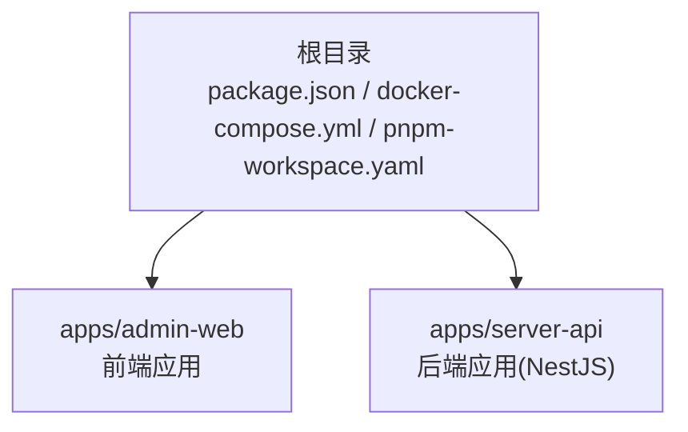
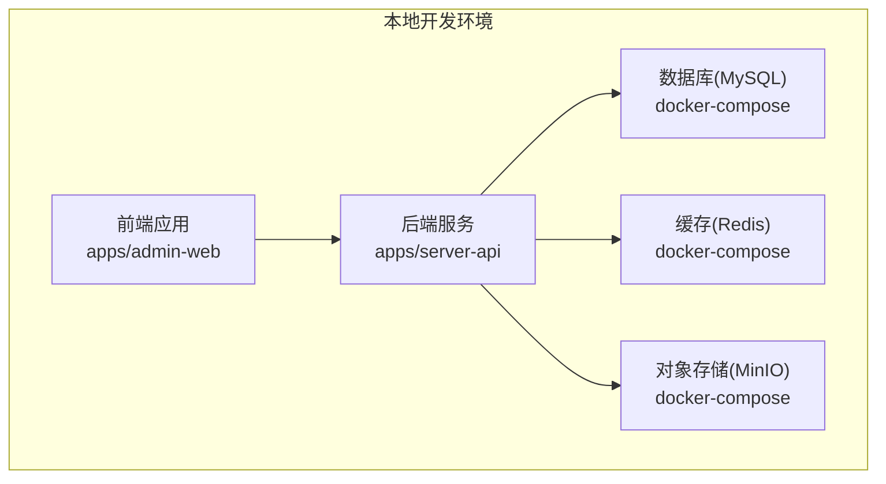
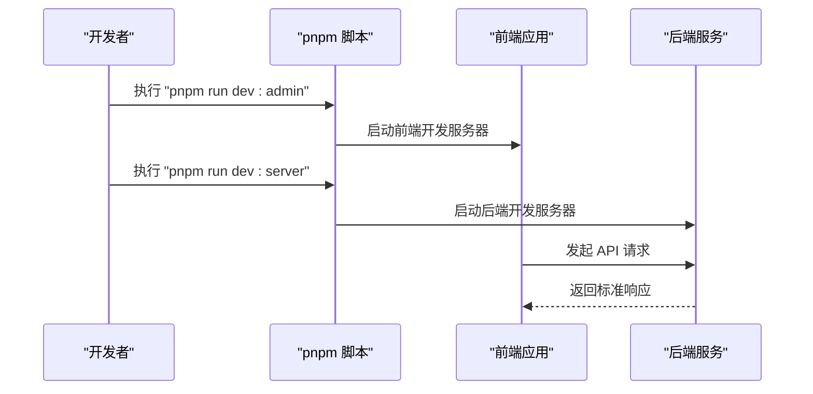
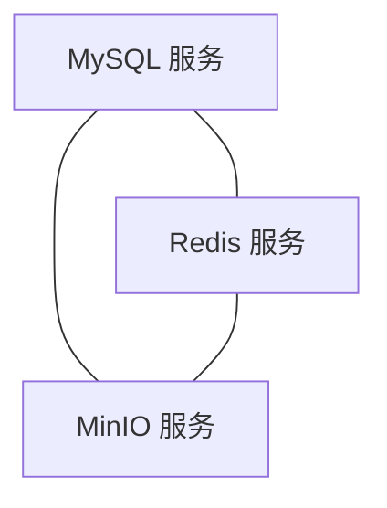
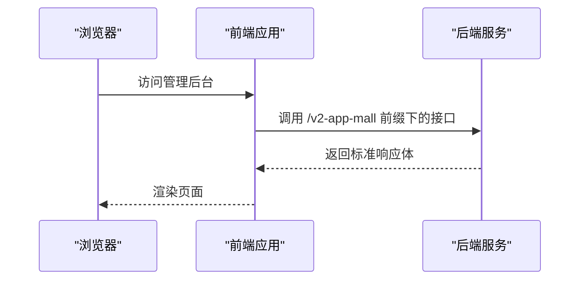
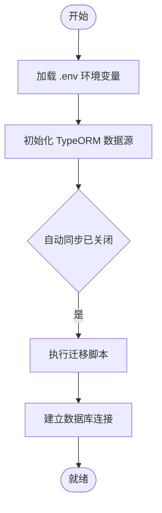
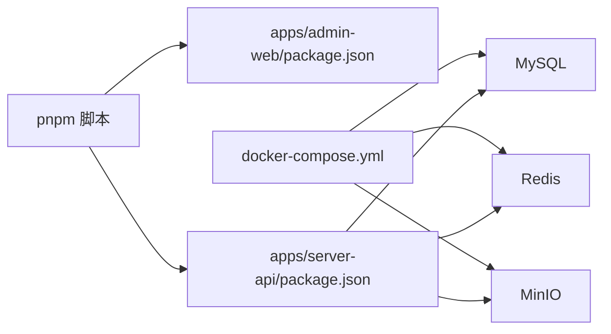

# CI/CD流水线

<cite>
**本文引用的文件**
- [package.json](file://package.json)
- [docker-compose.yml](file://docker-compose.yml)
- [pnpm-workspace.yaml](file://pnpm-workspace.yaml)
- [apps/admin-web/package.json](file://apps/admin-web/package.json)
- [apps/server-api/package.json](file://apps/server-api/package.json)
- [apps/server-api/src/main.ts](file://apps/server-api/src/main.ts)
- [apps/server-api/src/config/typeorm.datasource.ts](file://apps/server-api/src/config/typeorm.datasource.ts)
- [apps/admin-web/src/app.tsx](file://apps/admin-web/src/app.tsx)
</cite>

## 目录
1. [简介](#简介)
2. [项目结构](#项目结构)
3. [核心组件](#核心组件)
4. [架构总览](#架构总览)
5. [详细组件分析](#详细组件分析)
6. [依赖分析](#依赖分析)
7. [性能考虑](#性能考虑)
8. [故障排查指南](#故障排查指南)
9. [结论](#结论)
10. [附录](#附录)

## 简介
本文件系统性地文档化本仓库的CI/CD与部署流程，重点围绕以下方面：
- 通过 pnpm 脚本命令（如 dev:server、dev:admin、openapi:gen）支撑开发与联调。
- 通过 docker-compose 定义数据库、缓存与对象存储等基础设施服务，形成可复用的本地开发与预生产环境。
- 说明如何在本地快速搭建开发环境，并给出生产部署的建议路径（以现有脚本与容器编排为基础扩展）。

## 项目结构
本仓库采用 monorepo 架构，根目录提供统一的脚本与容器编排，子应用分别位于 apps/admin-web 与 apps/server-api。工作区由 pnpm-workspace.yaml 管理。

图表来源
- [package.json](file://package.json#L1-L15)
- [pnpm-workspace.yaml](file://pnpm-workspace.yaml#L1-L3)

章节来源
- [package.json](file://package.json#L1-L15)
- [pnpm-workspace.yaml](file://pnpm-workspace.yaml#L1-L3)

## 核心组件
- 根级脚本命令：通过 pnpm --filter 指向具体子应用，实现一键启动开发与生成 OpenAPI 文档。
- Docker Compose：定义 MySQL、Redis、MinIO 三大基础服务，提供持久化卷与端口映射，便于本地与预生产环境复用。
- 前后端交互：前端在运行时配置中指向后端服务地址；后端在开发环境启用 Swagger 文档，便于联调。

章节来源
- [package.json](file://package.json#L1-L15)
- [docker-compose.yml](file://docker-compose.yml#L1-L43)
- [apps/admin-web/src/app.tsx](file://apps/admin-web/src/app.tsx#L1-L174)
- [apps/server-api/src/main.ts](file://apps/server-api/src/main.ts#L1-L73)

## 架构总览
下图展示本地开发与部署的关键节点：前端应用、后端服务、数据库、缓存与对象存储之间的关系。

图表来源
- [docker-compose.yml](file://docker-compose.yml#L1-L43)
- [apps/admin-web/src/app.tsx](file://apps/admin-web/src/app.tsx#L1-L174)
- [apps/server-api/src/main.ts](file://apps/server-api/src/main.ts#L1-L73)

## 详细组件分析

### 1) 根级脚本命令与开发流程
- dev:server：启动后端开发模式，监听源码变更并自动重启。
- dev:admin：启动前端开发模式，提供热更新与代理能力。
- openapi:gen：在前端侧生成 OpenAPI 文档，便于前后端协同。

图表来源
- [package.json](file://package.json#L1-L15)
- [apps/admin-web/package.json](file://apps/admin-web/package.json#L1-L95)
- [apps/server-api/package.json](file://apps/server-api/package.json#L1-L110)

章节来源
- [package.json](file://package.json#L1-L15)
- [apps/admin-web/package.json](file://apps/admin-web/package.json#L1-L95)
- [apps/server-api/package.json](file://apps/server-api/package.json#L1-L110)

### 2) docker-compose 服务编排与依赖关系
- MySQL：提供主数据库，持久化至本地目录，包含初始化账号与库名。
- Redis：提供缓存与会话存储，持久化至本地目录。
- MinIO：提供对象存储服务，包含 API 与控制台端口映射，持久化至本地目录。

图表来源
- [docker-compose.yml](file://docker-compose.yml#L1-L43)

章节来源
- [docker-compose.yml](file://docker-compose.yml#L1-L43)

### 3) 前后端交互与配置要点
- 前端在运行时配置中固定后端地址，确保开发阶段请求指向本地后端。
- 后端设置全局前缀、跨域、全局拦截器与异常过滤器，并在非生产环境启用 Swagger 文档。

图表来源
- [apps/admin-web/src/app.tsx](file://apps/admin-web/src/app.tsx#L1-L174)
- [apps/server-api/src/main.ts](file://apps/server-api/src/main.ts#L1-L73)

章节来源
- [apps/admin-web/src/app.tsx](file://apps/admin-web/src/app.tsx#L1-L174)
- [apps/server-api/src/main.ts](file://apps/server-api/src/main.ts#L1-L73)

### 4) 数据库连接与迁移
- 后端通过 TypeORM 连接数据库，使用环境变量驱动配置，关闭自动同步，使用迁移文件管理结构演进。
- 迁移脚本在 package.json 中提供生成与执行命令，配合 docker-compose 提供的数据库实例使用。

图表来源
- [apps/server-api/src/config/typeorm.datasource.ts](file://apps/server-api/src/config/typeorm.datasource.ts#L1-L24)
- [apps/server-api/package.json](file://apps/server-api/package.json#L1-L110)

章节来源
- [apps/server-api/src/config/typeorm.datasource.ts](file://apps/server-api/src/config/typeorm.datasource.ts#L1-L24)
- [apps/server-api/package.json](file://apps/server-api/package.json#L1-L110)

## 依赖分析
- 工作区管理：pnpm-workspace.yaml 统一管理 apps/* 与 packages/*，保证 monorepo 内部依赖解析一致。
- 脚本耦合：根级脚本通过 pnpm --filter 间接依赖各子应用的 package.json 脚本。
- 容器耦合：后端服务依赖数据库、缓存与对象存储，三者通过 docker-compose 统一编排。

图表来源
- [pnpm-workspace.yaml](file://pnpm-workspace.yaml#L1-L3)
- [package.json](file://package.json#L1-L15)
- [apps/admin-web/package.json](file://apps/admin-web/package.json#L1-L95)
- [apps/server-api/package.json](file://apps/server-api/package.json#L1-L110)
- [docker-compose.yml](file://docker-compose.yml#L1-L43)

章节来源
- [pnpm-workspace.yaml](file://pnpm-workspace.yaml#L1-L3)
- [package.json](file://package.json#L1-L15)
- [apps/admin-web/package.json](file://apps/admin-web/package.json#L1-L95)
- [apps/server-api/package.json](file://apps/server-api/package.json#L1-L110)
- [docker-compose.yml](file://docker-compose.yml#L1-L43)

## 性能考虑
- 前端开发：使用热更新与按需构建，减少等待时间；合理拆分依赖，避免不必要的打包体积。
- 后端开发：启用全局验证管道与拦截器，减少无效请求；在开发环境开启 Swagger 文档，提升联调效率。
- 数据库：关闭自动同步，使用迁移文件管理结构演进，避免生产风险；合理设置索引与查询优化。
- 缓存：利用 Redis 提升热点数据访问速度；结合缓存装饰器与拦截器，降低数据库压力。
- 对象存储：MinIO 提供稳定的对象存储能力，结合持久化卷保障数据安全。

## 故障排查指南
- 前端无法访问后端接口
  - 检查前端运行时配置中的后端地址是否正确指向本地后端。
  - 确认后端服务已启动且监听端口可用。
  - 参考：[apps/admin-web/src/app.tsx](file://apps/admin-web/src/app.tsx#L1-L174)，[apps/server-api/src/main.ts](file://apps/server-api/src/main.ts#L1-L73)

- 数据库连接失败
  - 确认 docker-compose 中的数据库服务已启动且端口映射正常。
  - 检查环境变量配置与数据库凭据是否匹配。
  - 参考：[docker-compose.yml](file://docker-compose.yml#L1-L43)，[apps/server-api/src/config/typeorm.datasource.ts](file://apps/server-api/src/config/typeorm.datasource.ts#L1-L24)

- 缓存或对象存储不可用
  - 检查 Redis 与 MinIO 的端口映射与持久化卷挂载。
  - 参考：[docker-compose.yml](file://docker-compose.yml#L1-L43)

- 开发脚本无法执行
  - 确认 pnpm 是否安装，工作区配置是否正确。
  - 参考：[package.json](file://package.json#L1-L15)，[pnpm-workspace.yaml](file://pnpm-workspace.yaml#L1-L3)

章节来源
- [apps/admin-web/src/app.tsx](file://apps/admin-web/src/app.tsx#L1-L174)
- [apps/server-api/src/main.ts](file://apps/server-api/src/main.ts#L1-L73)
- [apps/server-api/src/config/typeorm.datasource.ts](file://apps/server-api/src/config/typeorm.datasource.ts#L1-L24)
- [docker-compose.yml](file://docker-compose.yml#L1-L43)
- [package.json](file://package.json#L1-L15)
- [pnpm-workspace.yaml](file://pnpm-workspace.yaml#L1-L3)

## 结论
本仓库通过 pnpm 脚本与 docker-compose 形成了清晰的开发与部署基线：
- 使用根级脚本统一入口，结合子应用脚本完成前后端一体化开发。
- 使用 docker-compose 提供数据库、缓存与对象存储的标准化基础设施，便于本地与预生产环境复用。
- 建议在现有基础上补充生产镜像构建与部署策略（例如基于现有脚本与容器编排进行扩展），以完善 CI/CD 流水线闭环。

## 附录
- 本地环境搭建步骤（建议）
  - 启动基础设施：使用 docker-compose 启动 MySQL、Redis、MinIO。
  - 启动后端：执行后端开发脚本，等待服务就绪。
  - 启动前端：执行前端开发脚本，打开浏览器访问管理后台。
  - 生成 OpenAPI：在前端侧执行 OpenAPI 生成脚本，便于前后端协同。
- 生产部署建议（基于现有脚本与容器编排）
  - 基于现有脚本与容器编排，扩展镜像构建与发布流程，结合 CI 平台实现自动化构建与部署。
  - 在生产环境中，确保数据库、缓存与对象存储的连接参数通过环境变量注入，避免硬编码。