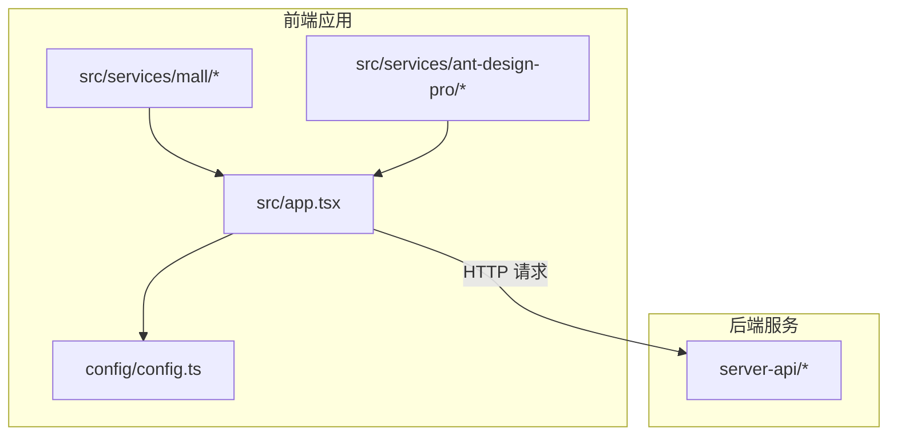
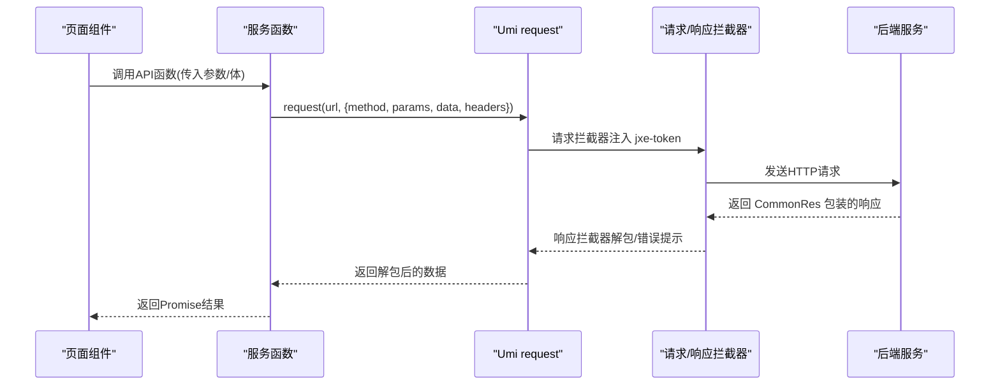
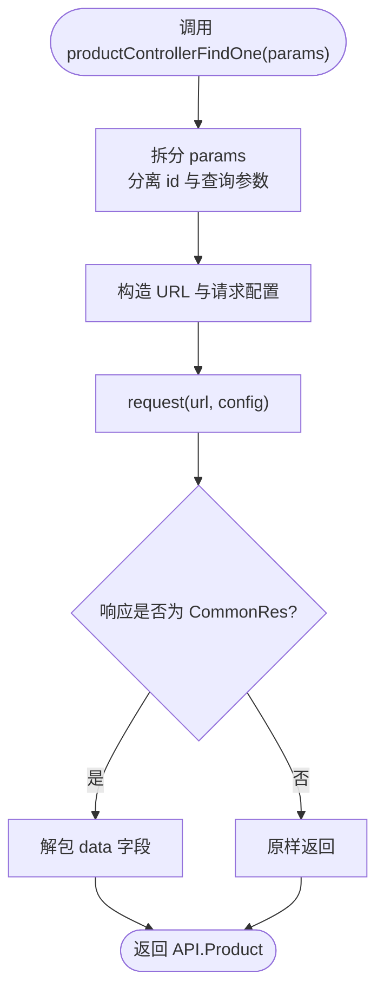
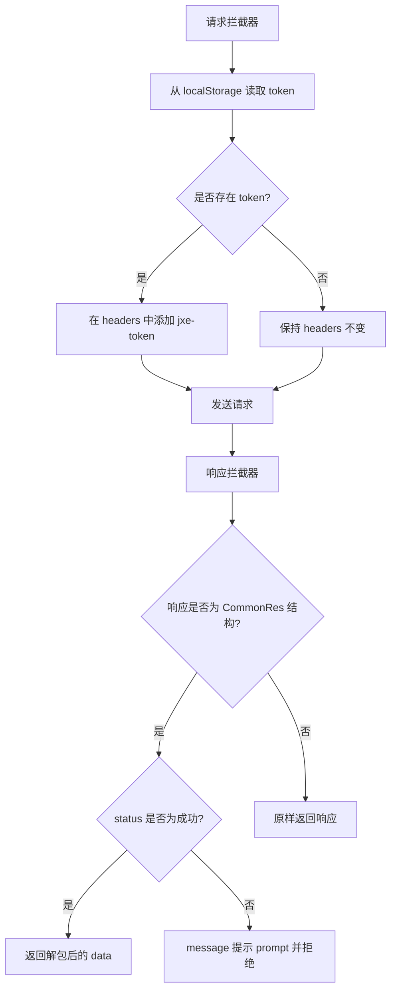
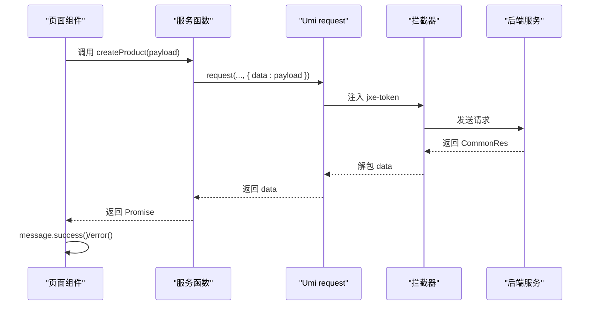
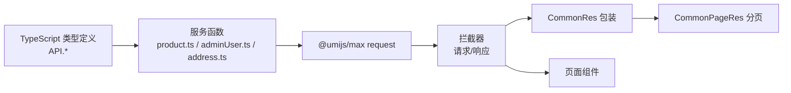

# API服务层封装

<cite>
**本文引用的文件**
- [apps/admin-web/src/services/mall/index.ts](file://apps/admin-web/src/services/mall/index.ts)
- [apps/admin-web/src/services/mall/product.ts](file://apps/admin-web/src/services/mall/product.ts)
- [apps/admin-web/src/services/mall/address.ts](file://apps/admin-web/src/services/mall/address.ts)
- [apps/admin-web/src/services/mall/adminUser.ts](file://apps/admin-web/src/services/mall/adminUser.ts)
- [apps/admin-web/src/services/mall/typings.d.ts](file://apps/admin-web/src/services/mall/typings.d.ts)
- [apps/admin-web/src/services/ant-design-pro/api.ts](file://apps/admin-web/src/services/ant-design-pro/api.ts)
- [apps/admin-web/src/services/ant-design-pro/index.ts](file://apps/admin-web/src/services/ant-design-pro/index.ts)
- [apps/admin-web/src/app.tsx](file://apps/admin-web/src/app.tsx)
- [apps/admin-web/config/config.ts](file://apps/admin-web/config/config.ts)
- [apps/admin-web/src/pages/Product/Create/index.tsx](file://apps/admin-web/src/pages/Product/Create/index.tsx)
- [apps/admin-web/src/pages/list/table-list/service.ts](file://apps/admin-web/src/pages/list/table-list/service.ts)
- [apps/server-api/src/common/dto/common-res.dto.ts](file://apps/server-api/src/common/dto/common-res.dto.ts)
- [apps/server-api/src/common/dto/common-page.dto.ts](file://apps/server-api/src/common/dto/common-page.dto.ts)
- [apps/server-api/src/common/interceptors/transform.interceptor.ts](file://apps/server-api/src/common/interceptors/transform.interceptor.ts)
- [apps/server-api/src/common/decorators/api-res-wrapper.decorator.ts](file://apps/server-api/src/common/decorators/api-res-wrapper.decorator.ts)
</cite>

## 目录
1. [简介](#简介)
2. [项目结构](#项目结构)
3. [核心组件](#核心组件)
4. [架构总览](#架构总览)
5. [详细组件分析](#详细组件分析)
6. [依赖关系分析](#依赖关系分析)
7. [性能考量](#性能考量)
8. [故障排查指南](#故障排查指南)
9. [结论](#结论)
10. [附录](#附录)

## 简介
本文件面向前端开发者，系统性阐述 apps/admin-web/src/services/ 目录下的API服务层封装，重点覆盖以下方面：
- 如何以模块化方式封装对后端RESTful API的调用（以 product、address、adminUser 为例）
- TypeScript接口定义（如 API.Product、API.CreateProductDto 等）的组织与使用
- 请求函数的封装模式、参数类型与返回类型
- 与Umi的request工具集成，包括请求拦截器注入token、响应解包、错误处理
- 服务层与页面组件的数据交互模式与调用示例

## 项目结构
服务层采用“按功能域分模块”的组织方式，每个领域（如 mall、ant-design-pro）独立导出一组API函数，便于在页面组件中按需导入与复用。

图表来源
- [apps/admin-web/src/services/mall/index.ts](file://apps/admin-web/src/services/mall/index.ts#L1-L45)
- [apps/admin-web/src/services/ant-design-pro/index.ts](file://apps/admin-web/src/services/ant-design-pro/index.ts#L1-L11)
- [apps/admin-web/config/config.ts](file://apps/admin-web/config/config.ts#L120-L130)
- [apps/admin-web/src/app.tsx](file://apps/admin-web/src/app.tsx#L99-L171)
- [apps/server-api/src/common/dto/common-res.dto.ts](file://apps/server-api/src/common/dto/common-res.dto.ts#L1-L49)

章节来源
- [apps/admin-web/src/services/mall/index.ts](file://apps/admin-web/src/services/mall/index.ts#L1-L45)
- [apps/admin-web/src/services/ant-design-pro/index.ts](file://apps/admin-web/src/services/ant-design-pro/index.ts#L1-L11)
- [apps/admin-web/config/config.ts](file://apps/admin-web/config/config.ts#L120-L130)
- [apps/admin-web/src/app.tsx](file://apps/admin-web/src/app.tsx#L99-L171)

## 核心组件
- mall 服务集合：集中管理商城相关API，如商品、地址、管理员用户等。
- ant-design-pro 服务集合：提供登录、登出、通知、规则等通用API。
- Umi request 配置：统一的请求/响应拦截器、错误处理、数据字段映射。

章节来源
- [apps/admin-web/src/services/mall/index.ts](file://apps/admin-web/src/services/mall/index.ts#L1-L45)
- [apps/admin-web/src/services/ant-design-pro/index.ts](file://apps/admin-web/src/services/ant-design-pro/index.ts#L1-L11)
- [apps/admin-web/src/app.tsx](file://apps/admin-web/src/app.tsx#L99-L171)
- [apps/admin-web/config/config.ts](file://apps/admin-web/config/config.ts#L120-L130)

## 架构总览
服务层与Umi request的协作流程如下：
- 页面组件通过 import 服务函数发起请求
- Umi request 在请求拦截器中注入 jxe-token
- 后端统一响应包装 CommonRes
- Umi响应拦截器根据业务状态解包或提示错误
- 页面组件消费解包后的 data 字段

图表来源
- [apps/admin-web/src/services/mall/product.ts](file://apps/admin-web/src/services/mall/product.ts#L1-L38)
- [apps/admin-web/src/services/mall/adminUser.ts](file://apps/admin-web/src/services/mall/adminUser.ts#L1-L122)
- [apps/admin-web/src/app.tsx](file://apps/admin-web/src/app.tsx#L99-L171)
- [apps/server-api/src/common/dto/common-res.dto.ts](file://apps/server-api/src/common/dto/common-res.dto.ts#L1-L49)

## 详细组件分析

### mall 服务集合概览
- mall/index.ts 将各领域API函数聚合导出，便于统一管理与按需导入。
- mall/typings.d.ts 定义了所有API相关的TypeScript类型，包括请求参数、响应体、分页、VO等，确保类型安全。

章节来源
- [apps/admin-web/src/services/mall/index.ts](file://apps/admin-web/src/services/mall/index.ts#L1-L45)
- [apps/admin-web/src/services/mall/typings.d.ts](file://apps/admin-web/src/services/mall/typings.d.ts#L1-L120)

### 商品服务（product）
- 请求函数命名遵循“控制器方法名”的风格，如 productControllerFindAll、productControllerCreate、productControllerFindOne。
- 参数类型来自 API.ProductControllerFindOneParams 等，返回类型通过泛型指定为 API.Product[] 或 API.Product。
- 通过 request(url, { method, params, data, headers }) 组织请求，支持透传 options。

图表来源
- [apps/admin-web/src/services/mall/product.ts](file://apps/admin-web/src/services/mall/product.ts#L1-L38)
- [apps/admin-web/src/services/mall/typings.d.ts](file://apps/admin-web/src/services/mall/typings.d.ts#L509-L521)

章节来源
- [apps/admin-web/src/services/mall/product.ts](file://apps/admin-web/src/services/mall/product.ts#L1-L38)
- [apps/admin-web/src/services/mall/typings.d.ts](file://apps/admin-web/src/services/mall/typings.d.ts#L509-L521)

### 地址服务（address）
- 提供地址列表状态分组查询，参数类型为 API.AddressControllerListStatusGroupParams。
- 返回类型为 API.CommonRes 与 API.AddressGroupVO 的组合，响应拦截器会解包 data 字段。

章节来源
- [apps/admin-web/src/services/mall/address.ts](file://apps/admin-web/src/services/mall/address.ts#L1-L19)
- [apps/admin-web/src/services/mall/typings.d.ts](file://apps/admin-web/src/services/mall/typings.d.ts#L1-L20)

### 管理员用户服务（adminUser）
- 提供批量查询、创建、批量删除、按ID查询、更新、删除、登录、获取当前用户资料、注册等完整CRUD能力。
- 参数与返回类型均通过 API.* 类型约束，如 API.findAllAdminUserParams、API.CreateAdminUserDto、API.CommonRes & { data?: API.AdminUserVo } 等。
- 登录接口会返回令牌，后续请求通过请求拦截器注入 jxe-token。

章节来源
- [apps/admin-web/src/services/mall/adminUser.ts](file://apps/admin-web/src/services/mall/adminUser.ts#L1-L122)
- [apps/admin-web/src/services/mall/typings.d.ts](file://apps/admin-web/src/services/mall/typings.d.ts#L496-L542)

### ant-design-pro 服务集合
- 提供登录、登出、获取当前用户、获取通知、规则列表的增删改查等常用API。
- 与 mall 服务类似，使用 request 进行HTTP调用，参数与返回类型同样通过类型声明约束。

章节来源
- [apps/admin-web/src/services/ant-design-pro/api.ts](file://apps/admin-web/src/services/ant-design-pro/api.ts#L1-L95)
- [apps/admin-web/src/services/ant-design-pro/index.ts](file://apps/admin-web/src/services/ant-design-pro/index.ts#L1-L11)

### Umi request 配置与拦截器
- baseURL、timeout、errorHandler：统一错误处理，401自动清理token并跳转登录。
- requestInterceptors：从 localStorage 读取 token 并注入到请求头 jxe-token。
- responseInterceptors：识别后端统一响应结构 CommonRes，业务成功时解包 data，业务失败时提示 prompt 并拒绝Promise；非JSON响应（如文件流）原样返回。

图表来源
- [apps/admin-web/src/app.tsx](file://apps/admin-web/src/app.tsx#L99-L171)
- [apps/admin-web/config/config.ts](file://apps/admin-web/config/config.ts#L120-L130)
- [apps/server-api/src/common/dto/common-res.dto.ts](file://apps/server-api/src/common/dto/common-res.dto.ts#L1-L49)

章节来源
- [apps/admin-web/src/app.tsx](file://apps/admin-web/src/app.tsx#L99-L171)
- [apps/admin-web/config/config.ts](file://apps/admin-web/config/config.ts#L120-L130)

### 服务层与页面组件的数据交互模式
- 页面组件通过 import 服务函数发起请求，如 import { createProduct } from '@/services/product'。
- 在 onFinish 等生命周期中调用服务函数，捕获异常并提示用户。
- 服务函数内部负责参数清洗、请求封装与返回类型约束，页面组件仅关心最终数据。

图表来源
- [apps/admin-web/src/pages/Product/Create/index.tsx](file://apps/admin-web/src/pages/Product/Create/index.tsx#L1-L160)
- [apps/admin-web/src/services/mall/product.ts](file://apps/admin-web/src/services/mall/product.ts#L1-L38)
- [apps/admin-web/src/app.tsx](file://apps/admin-web/src/app.tsx#L99-L171)

章节来源
- [apps/admin-web/src/pages/Product/Create/index.tsx](file://apps/admin-web/src/pages/Product/Create/index.tsx#L1-L160)
- [apps/admin-web/src/services/mall/product.ts](file://apps/admin-web/src/services/mall/product.ts#L1-L38)

### 实际调用示例
- 商品创建：页面组件在表单提交时，将表单数据清洗为 CreateProductDto，调用 createProduct 并处理成功/失败提示。
- 规则列表：页面组件调用 rule(params) 获取分页数据，使用 dataField: 'data' 配置后，useRequest等工具可直接消费 data 字段。

章节来源
- [apps/admin-web/src/pages/Product/Create/index.tsx](file://apps/admin-web/src/pages/Product/Create/index.tsx#L1-L160)
- [apps/admin-web/src/pages/list/table-list/service.ts](file://apps/admin-web/src/pages/list/table-list/service.ts#L1-L64)
- [apps/admin-web/config/config.ts](file://apps/admin-web/config/config.ts#L120-L130)

## 依赖关系分析
- 服务函数依赖 Umi 的 request 工具，通过拦截器完成统一认证与响应解包。
- 后端通过统一响应包装 CommonRes 与分页 CommonPageRes，前端拦截器据此判断业务状态并解包。
- OpenAPI 插件基于 swagger 生成服务函数与类型定义，保证前后端契约一致。

图表来源
- [apps/admin-web/src/services/mall/typings.d.ts](file://apps/admin-web/src/services/mall/typings.d.ts#L1-L120)
- [apps/admin-web/src/services/mall/product.ts](file://apps/admin-web/src/services/mall/product.ts#L1-L38)
- [apps/admin-web/src/services/mall/adminUser.ts](file://apps/admin-web/src/services/mall/adminUser.ts#L1-L122)
- [apps/admin-web/src/services/mall/address.ts](file://apps/admin-web/src/services/mall/address.ts#L1-L19)
- [apps/admin-web/src/app.tsx](file://apps/admin-web/src/app.tsx#L99-L171)
- [apps/server-api/src/common/dto/common-res.dto.ts](file://apps/server-api/src/common/dto/common-res.dto.ts#L1-L49)
- [apps/server-api/src/common/dto/common-page.dto.ts](file://apps/server-api/src/common/dto/common-page.dto.ts#L1-L67)

章节来源
- [apps/admin-web/src/services/mall/typings.d.ts](file://apps/admin-web/src/services/mall/typings.d.ts#L1-L120)
- [apps/admin-web/src/services/mall/product.ts](file://apps/admin-web/src/services/mall/product.ts#L1-L38)
- [apps/admin-web/src/services/mall/adminUser.ts](file://apps/admin-web/src/services/mall/adminUser.ts#L1-L122)
- [apps/admin-web/src/services/mall/address.ts](file://apps/admin-web/src/services/mall/address.ts#L1-L19)
- [apps/admin-web/src/app.tsx](file://apps/admin-web/src/app.tsx#L99-L171)
- [apps/server-api/src/common/dto/common-res.dto.ts](file://apps/server-api/src/common/dto/common-res.dto.ts#L1-L49)
- [apps/server-api/src/common/dto/common-page.dto.ts](file://apps/server-api/src/common/dto/common-page.dto.ts#L1-L67)

## 性能考量
- 请求超时与错误处理：统一的超时与错误处理可避免页面无响应，建议结合 loading 与重试策略优化用户体验。
- 响应解包：拦截器解包 CommonRes 减少页面重复逻辑，提升一致性与可维护性。
- 分页数据：后端分页 DTO 与前端分页消费配合，避免一次性拉取过多数据。
- OpenAPI 生成：通过 OpenAPI 自动生成服务与类型，降低手写成本与不一致风险。

[本节为通用指导，无需列出具体文件来源]

## 故障排查指南
- 401 未授权：拦截器检测到401会清除本地token并跳转登录，检查登录接口是否正确返回token并持久化。
- 业务失败：当后端返回非成功状态时，拦截器会提示 prompt 并拒绝Promise，页面组件应捕获并提示用户。
- 文件上传：页面组件上传文件时需与后端字段名一致，确保上传接口正常返回URL。
- OpenAPI 生成：若类型缺失或不一致，检查 config.ts 中 openAPI 配置与后端Swagger JSON地址。

章节来源
- [apps/admin-web/src/app.tsx](file://apps/admin-web/src/app.tsx#L99-L171)
- [apps/admin-web/config/config.ts](file://apps/admin-web/config/config.ts#L120-L130)
- [apps/admin-web/src/pages/Product/Create/index.tsx](file://apps/admin-web/src/pages/Product/Create/index.tsx#L1-L160)

## 结论
该服务层通过模块化组织、强类型约束与Umi拦截器的统一处理，实现了清晰、可维护且易扩展的API调用体系。页面组件只需关注业务数据，无需关心认证与响应解包细节，显著提升了开发效率与一致性。

[本节为总结性内容，无需列出具体文件来源]

## 附录

### 后端统一响应与分页
- CommonRes：统一响应结构，包含 status、message、prompt、data、error、trace、system。
- CommonPageRes：分页结构，包含 total、size、current、totalPages、offset、empty、first、last、records。
- TransformInterceptor：默认包装逻辑，将Controller返回数据包装为 CommonRes。
- ApiResWrapper 装饰器：在Swagger中声明统一响应结构，支持分页与单条数据两种形态。

章节来源
- [apps/server-api/src/common/dto/common-res.dto.ts](file://apps/server-api/src/common/dto/common-res.dto.ts#L1-L49)
- [apps/server-api/src/common/dto/common-page.dto.ts](file://apps/server-api/src/common/dto/common-page.dto.ts#L1-L67)
- [apps/server-api/src/common/interceptors/transform.interceptor.ts](file://apps/server-api/src/common/interceptors/transform.interceptor.ts#L1-L42)
- [apps/server-api/src/common/decorators/api-res-wrapper.decorator.ts](file://apps/server-api/src/common/decorators/api-res-wrapper.decorator.ts#L1-L49)