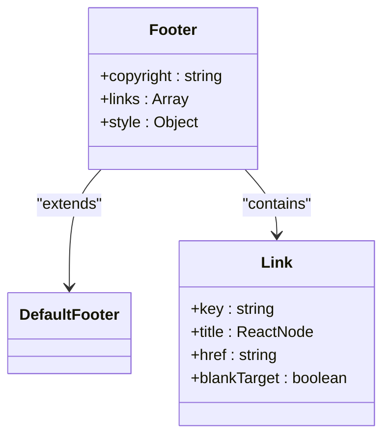
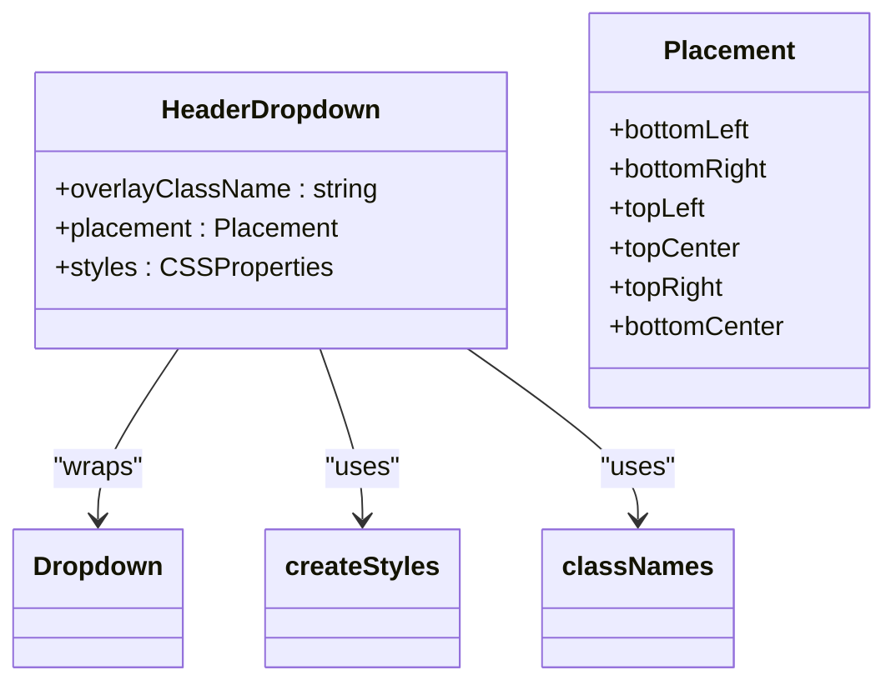
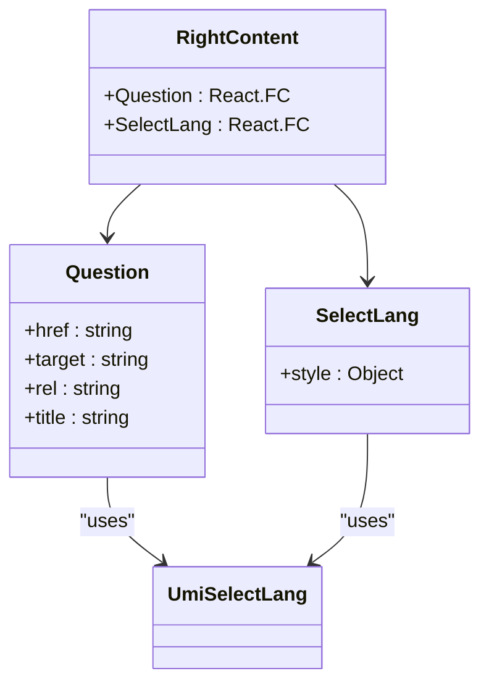
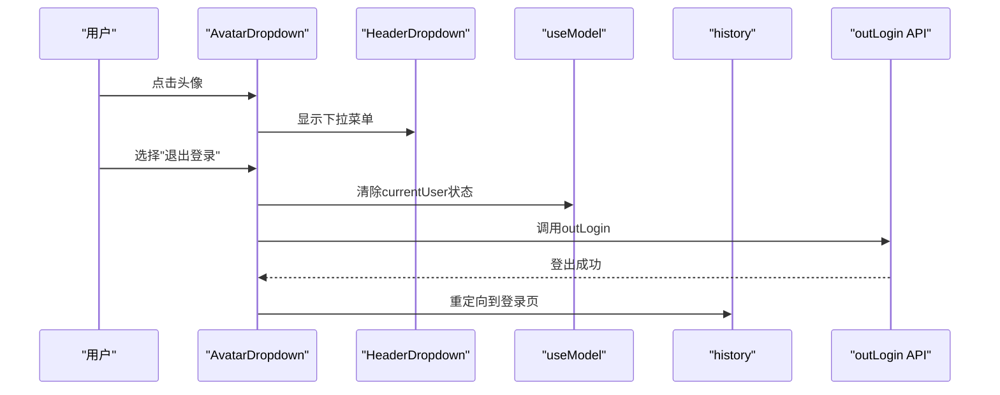
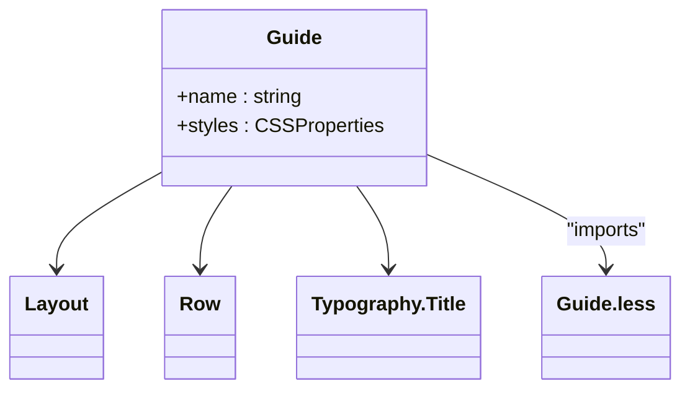
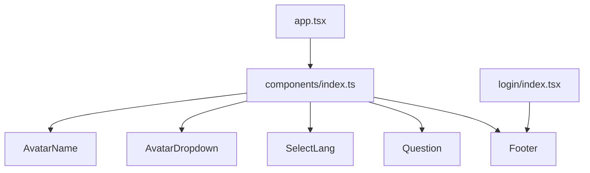

# UI组件设计

<cite>
**本文档引用的文件**  
- [Footer/index.tsx](file://apps/admin-web/src/components/Footer/index.tsx)
- [HeaderDropdown/index.tsx](file://apps/admin-web/src/components/HeaderDropdown/index.tsx)
- [RightContent/index.tsx](file://apps/admin-web/src/components/RightContent/index.tsx)
- [RightContent/AvatarDropdown.tsx](file://apps/admin-web/src/components/RightContent/AvatarDropdown.tsx)
- [Guide/Guide.tsx](file://apps/admin-web/src/components/Guide/Guide.tsx)
- [Guide/Guide.less](file://apps/admin-web/src/components/Guide/Guide.less)
- [Guide/index.ts](file://apps/admin-web/src/components/Guide/index.ts)
- [components/index.ts](file://apps/admin-web/src/components/index.ts)
- [app.tsx](file://apps/admin-web/src/app.tsx)
- [user/login/index.tsx](file://apps/admin-web/src/pages/user/login/index.tsx)
</cite>

## 目录
1. [简介](#简介)
2. [核心UI组件分析](#核心ui组件分析)
3. [组件复用与集成](#组件复用与集成)
4. [Props接口定义](#props接口定义)
5. [样式组织方式](#样式组织方式)
6. [Ant Design Pro封装与定制](#ant-design-pro封装与定制)
7. [使用示例与最佳实践](#使用示例与最佳实践)
8. [扩展与自定义](#扩展与自定义)

## 简介
本文档详细描述了admin-web项目中的核心UI组件，包括Footer、HeaderDropdown、RightContent、AvatarDropdown和Guide等组件的设计与实现。这些组件构成了系统全局布局的基础，通过Ant Design Pro框架进行封装和定制，实现了统一的视觉风格和交互体验。

**Section sources**
- [app.tsx](file://apps/admin-web/src/app.tsx#L1-L174)

## 核心UI组件分析

### Footer组件
Footer组件基于Ant Design Pro的DefaultFooter组件构建，提供了标准化的页脚布局。该组件包含版权信息和外部链接，如Ant Design Pro官网、GitHub仓库和Ant Design官网。



**Diagram sources**
- [Footer/index.tsx](file://apps/admin-web/src/components/Footer/index.tsx#L1-L37)

**Section sources**
- [Footer/index.tsx](file://apps/admin-web/src/components/Footer/index.tsx#L1-L37)

### HeaderDropdown组件
HeaderDropdown组件是对Ant Design Dropdown组件的封装，提供了响应式设计支持。该组件使用antd-style创建样式，并通过classNames库进行样式合并，确保在不同屏幕尺寸下的良好显示效果。



**Diagram sources**
- [HeaderDropdown/index.tsx](file://apps/admin-web/src/components/HeaderDropdown/index.tsx#L1-L42)

**Section sources**
- [HeaderDropdown/index.tsx](file://apps/admin-web/src/components/HeaderDropdown/index.tsx#L1-L42)

### RightContent组件
RightContent组件包含多个子组件，用于构建页面右上角的内容区域。主要包括Question（帮助文档链接）和SelectLang（语言选择器）两个功能组件。



**Diagram sources**
- [RightContent/index.tsx](file://apps/admin-web/src/components/RightContent/index.tsx#L1-L34)

**Section sources**
- [RightContent/index.tsx](file://apps/admin-web/src/components/RightContent/index.tsx#L1-L34)

### AvatarDropdown组件
AvatarDropdown组件实现了用户头像下拉菜单功能，包含个人中心、个人设置和退出登录等选项。该组件依赖于HeaderDropdown组件，并与全局状态管理集成，处理用户认证和会话管理。



**Diagram sources**
- [RightContent/AvatarDropdown.tsx](file://apps/admin-web/src/components/RightContent/AvatarDropdown.tsx#L1-L143)

**Section sources**
- [RightContent/AvatarDropdown.tsx](file://apps/admin-web/src/components/RightContent/AvatarDropdown.tsx#L1-L143)

### Guide组件
Guide组件是一个简单的引导展示组件，用于欢迎用户并展示应用名称。该组件使用Ant Design的Layout、Row和Typography组件构建，并通过.less文件进行样式定制。



**Diagram sources**
- [Guide/Guide.tsx](file://apps/admin-web/src/components/Guide/Guide.tsx#L1-L24)
- [Guide/Guide.less](file://apps/admin-web/src/components/Guide/Guide.less#L1-L5)

**Section sources**
- [Guide/Guide.tsx](file://apps/admin-web/src/components/Guide/Guide.tsx#L1-L24)
- [Guide/Guide.less](file://apps/admin-web/src/components/Guide/Guide.less#L1-L5)

## 组件复用与集成
这些UI组件通过统一的索引文件进行管理，实现了高效的复用。components/index.ts文件作为组件的统一出口，方便在应用的其他部分导入和使用。



**Diagram sources**
- [components/index.ts](file://apps/admin-web/src/components/index.ts#L1-L13)
- [app.tsx](file://apps/admin-web/src/app.tsx#L8)
- [user/login/index.tsx](file://apps/admin-web/src/pages/user/login/index.tsx#L15)

**Section sources**
- [components/index.ts](file://apps/admin-web/src/components/index.ts#L1-L13)

## Props接口定义
各组件的Props接口定义清晰，类型安全，便于开发和维护。

### Footer组件Props
- 无自定义Props，直接使用DefaultFooter的属性

### HeaderDropdown组件Props
```typescript
export type HeaderDropdownProps = {
  overlayClassName?: string;
  placement?: 'bottomLeft' | 'bottomRight' | 'topLeft' | 'topCenter' | 'topRight' | 'bottomCenter';
} & Omit<DropDownProps, 'overlay'>;
```

### AvatarDropdown组件Props
```typescript
export type GlobalHeaderRightProps = {
  menu?: boolean;
  children?: React.ReactNode;
};
```

### Guide组件Props
```typescript
interface Props {
  name: string;
}
```

**Section sources**
- [HeaderDropdown/index.tsx](file://apps/admin-web/src/components/HeaderDropdown/index.tsx#L17-L26)
- [RightContent/AvatarDropdown.tsx](file://apps/admin-web/src/components/RightContent/AvatarDropdown.tsx#L15-L18)
- [Guide/Guide.tsx](file://apps/admin-web/src/components/Guide/Guide.tsx#L5-L7)

## 样式组织方式
项目采用了多种样式组织方式，包括CSS-in-JS和传统的CSS预处理器。

### CSS-in-JS (antd-style)
HeaderDropdown和AvatarDropdown组件使用antd-style创建动态样式，通过createStyles函数访问设计令牌（token），实现主题一致性。

```typescript
const useStyles = createStyles(({ token }) => {
  return {
    dropdown: {
      [`@media screen and (max-width: ${token.screenXS}px)`]: {
        width: '100%',
      },
    },
  };
});
```

### Less样式表
Guide组件使用传统的.less文件进行样式定义，通过CSS Modules的方式导入，避免样式冲突。

```less
.title {
  margin: 0 auto;
  font-weight: 200;
}
```

### 响应式设计
组件普遍采用响应式设计，通过媒体查询和设计令牌的屏幕尺寸变量（如token.screenXS）来适配不同设备。

**Section sources**
- [HeaderDropdown/index.tsx](file://apps/admin-web/src/components/HeaderDropdown/index.tsx#L7-L15)
- [RightContent/AvatarDropdown.tsx](file://apps/admin-web/src/components/RightContent/AvatarDropdown.tsx#L26-L42)
- [Guide/Guide.less](file://apps/admin-web/src/components/Guide/Guide.less#L1-L5)

## Ant Design Pro封装与定制
这些组件充分利用了Ant Design Pro的高级特性，实现了高效的封装和定制。

### 全局布局集成
在app.tsx中，通过layout配置将这些组件集成到全局布局中：

```typescript
export const layout: RunTimeLayoutConfig = ({ initialState, setInitialState }) => {
  return {
    actionsRender: () => [<Question key="doc" />, <SelectLang key="SelectLang" />],
    avatarProps: {
      src: initialState?.currentUser?.avatar,
      title: <AvatarName />,
      render: (_, avatarChildren) => {
        return <AvatarDropdown>{avatarChildren}</AvatarDropdown>;
      },
    },
    footerRender: () => <Footer />,
    // ...其他配置
  };
};
```

### 状态管理集成
AvatarDropdown组件通过useModel('@@initialState')访问全局状态，获取当前用户信息，并在退出登录时更新状态。

### 路由集成
组件与UmiJS的路由系统深度集成，如history.push和history.replace用于页面导航。

**Section sources**
- [app.tsx](file://apps/admin-web/src/app.tsx#L61-L96)

## 使用示例与最佳实践

### 在登录页面使用Footer
在用户登录页面中，Footer组件被直接导入和使用，提供一致的页脚体验。

```typescript
import { Footer } from '@/components';

// 在JSX中使用
<Footer />
```

### 全局注册组件
通过components/index.ts文件统一导出组件，实现一次定义，多处使用的最佳实践。

```typescript
// components/index.ts
export { AvatarDropdown, AvatarName, Footer, Question, SelectLang };
```

### 条件渲染
AvatarDropdown组件实现了智能的条件渲染，当用户信息加载时显示加载状态，确保用户体验的流畅性。

```typescript
if (!initialState) {
  return loading;
}

if (!currentUser || !currentUser.name) {
  return loading;
}
```

**Section sources**
- [user/login/index.tsx](file://apps/admin-web/src/pages/user/login/index.tsx#L15)
- [components/index.ts](file://apps/admin-web/src/components/index.ts#L1-L13)
- [RightContent/AvatarDropdown.tsx](file://apps/admin-web/src/components/RightContent/AvatarDropdown.tsx#L96-L104)

## 扩展与自定义
这些组件设计具有良好的扩展性，可以通过以下方式进行自定义：

### 样式扩展
通过覆盖CSS类名或使用antd-style的主题定制功能，可以轻松修改组件外观。

### 功能扩展
通过继承或组合现有组件，可以添加新功能。例如，可以在AvatarDropdown中添加新的菜单项。

### 主题定制
利用Ant Design Pro的设计令牌（token），可以实现全局主题的统一调整，确保所有组件的视觉一致性。

### 国际化支持
通过集成UmiJS的国际化功能，可以轻松实现多语言支持。

**Section sources**
- [app.tsx](file://apps/admin-web/src/app.tsx#L9-L10)
- [HeaderDropdown/index.tsx](file://apps/admin-web/src/components/HeaderDropdown/index.tsx#L7-L15)
- [RightContent/AvatarDropdown.tsx](file://apps/admin-web/src/components/RightContent/AvatarDropdown.tsx#L26-L42)