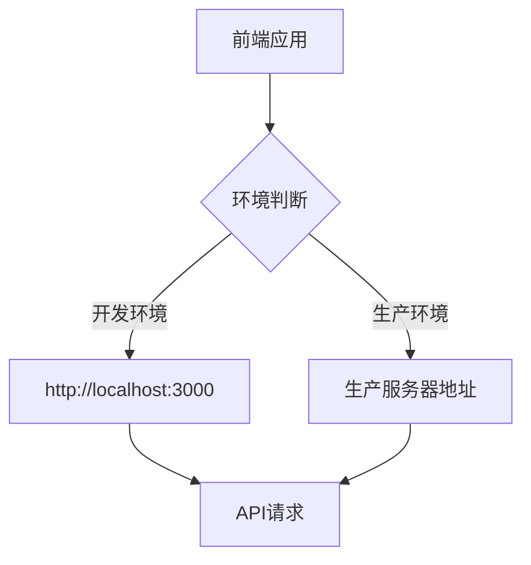
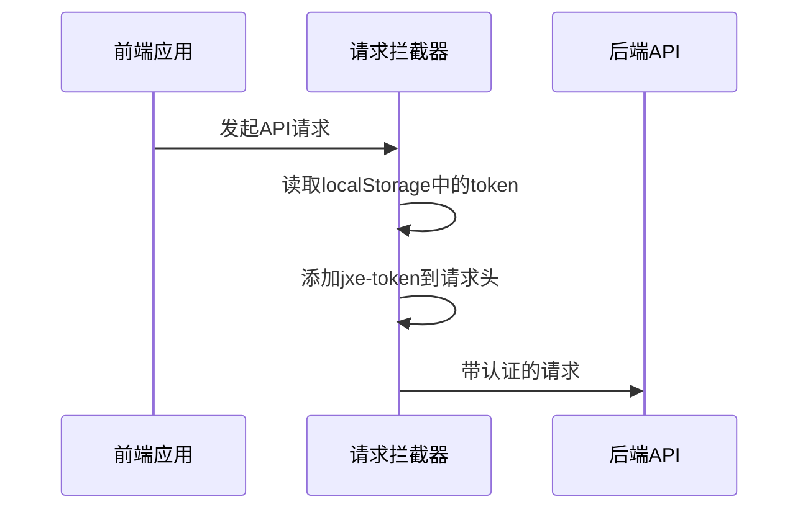
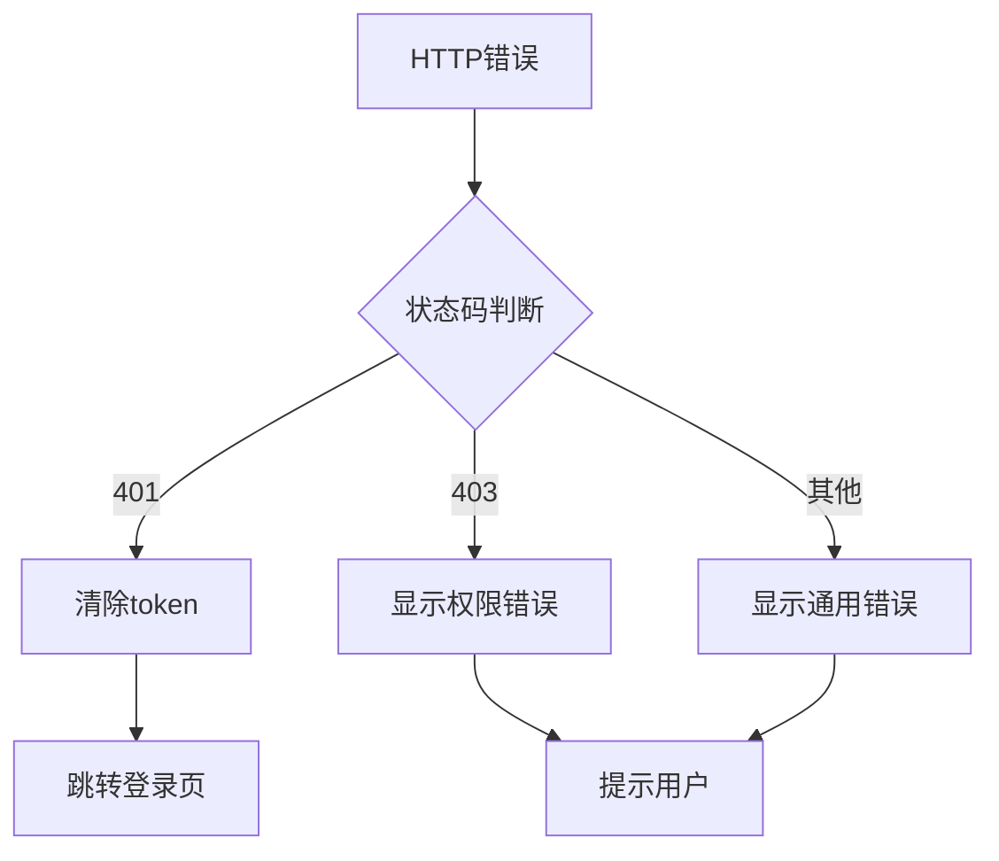
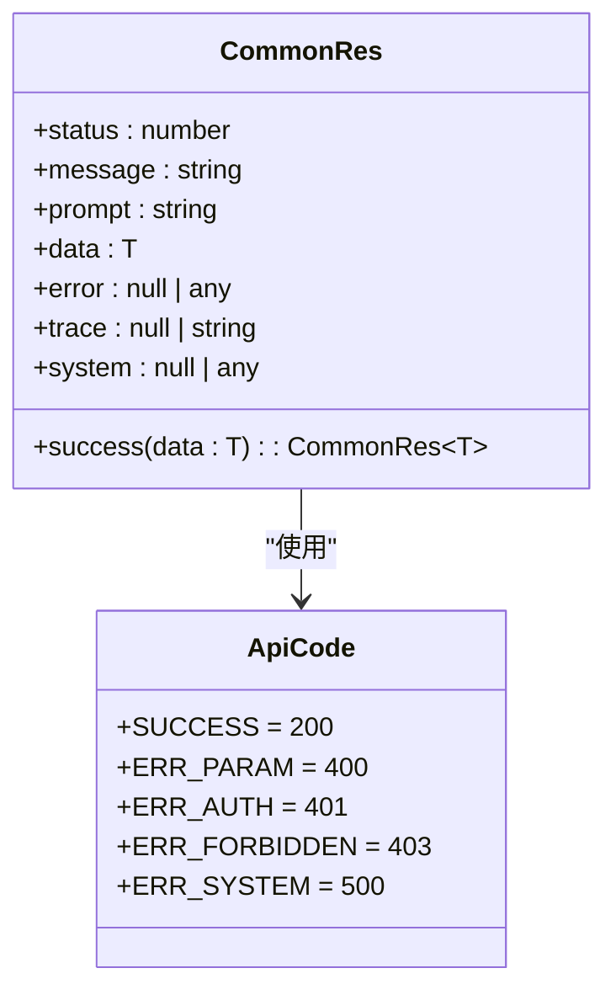
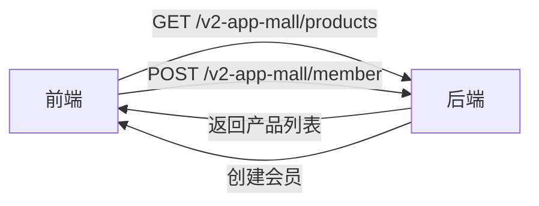

# 前后端通信机制

<cite>
**本文档引用文件**  
- [app.tsx](file://apps/admin-web/src/app.tsx)
- [index.ts](file://apps/admin-web/src/services/mall/index.ts)
- [product.ts](file://apps/admin-web/src/services/mall/product.ts)
- [adminUser.ts](file://apps/admin-web/src/services/mall/adminUser.ts)
- [tokenguanli.ts](file://apps/admin-web/src/services/mall/tokenguanli.ts)
- [gerenxinxijiekou.ts](file://apps/admin-web/src/services/mall/gerenxinxijiekou.ts)
- [types/index.ts](file://apps/admin-web/src/types/index.ts)
- [common-res.dto.ts](file://apps/server-api/src/common/dto/common-res.dto.ts)
- [response.interface.ts](file://apps/server-api/src/common/interfaces/response.interface.ts)
- [jwt.strategy.ts](file://apps/server-api/src/modules/auth/strategies/jwt.strategy.ts)
- [jwt-auth.guard.ts](file://apps/server-api/src/common/guards/jwt-auth.guard.ts)
</cite>

## 目录
1. [通信配置概述](#通信配置概述)
2. [request配置详解](#request配置详解)
3. [错误统一处理机制](#错误统一处理机制)
4. [API接口约定与调用](#api接口约定与调用)
5. [调试技巧与常见问题](#调试技巧与常见问题)

## 通信配置概述

本系统采用Umi Max框架的request配置机制实现前后端通信，通过在`app.tsx`文件中定义全局请求配置，实现了统一的通信标准。通信机制包含三个核心部分：基础URL配置、请求拦截器和响应拦截器，确保所有API请求遵循统一的规范。

**Section sources**
- [app.tsx](file://apps/admin-web/src/app.tsx#L1-L174)

## request配置详解

### baseURL设置

系统在`app.tsx`中通过`request`对象的`baseURL`属性定义了全局基础URL。当前配置指向本地开发服务器`http://localhost:3000`，在生产环境中可通过环境变量进行调整。



**Diagram sources**
- [app.tsx](file://apps/admin-web/src/app.tsx#L15)

### 请求拦截器（自动注入jxe-token）

请求拦截器在每次API调用前自动注入认证令牌`jxe-token`。系统从`localStorage`中读取token值，并将其添加到请求头中。若用户已登录，所有请求都将携带此令牌，实现无缝的身份验证。



**Diagram sources**
- [app.tsx](file://apps/admin-web/src/app.tsx#L134-L145)

### 响应拦截器（业务状态码解包）

响应拦截器负责解包后端返回的标准化JSON结构，根据业务状态码进行相应处理。当`status`为200时表示业务成功，直接返回数据；否则显示错误提示并拒绝Promise。

```mermaid
flowchart TD
A[收到响应] --> B{是否为标准JSON结构?}
B --> |是| C{status是否为200?}
B --> |否| D[原样返回(如文件流)]
C --> |是| E[返回解包数据]
C --> |否| F[显示错误提示]
F --> G[拒绝Promise]
```

**Diagram sources**
- [app.tsx](file://apps/admin-web/src/app.tsx#L148-L169)
- [types/index.ts](file://apps/admin-web/src/types/index.ts#L27-L35)

## 错误统一处理机制

### HTTP状态码处理

通过`errorConfig`配置，系统统一处理各类HTTP错误状态码。401状态码表示认证失效，系统会清除本地token并跳转至登录页；403状态码表示权限不足，显示相应提示。



**Diagram sources**
- [app.tsx](file://apps/admin-web/src/app.tsx#L104-L130)

### 业务异常处理

后端通过`CommonRes` DTO返回标准化的响应结构，包含`status`、`message`、`prompt`和`data`等字段。前端根据`status`字段判断业务执行结果，`prompt`字段用于向用户展示友好的提示信息。



**Diagram sources**
- [common-res.dto.ts](file://apps/server-api/src/common/dto/common-res.dto.ts#L6-L49)
- [response.interface.ts](file://apps/server-api/src/common/interfaces/response.interface.ts#L7-L13)

## API接口约定与调用

### 接口约定

前后端约定使用`/v2-app-mall`作为API前缀，所有管理后台接口均以此开头。后端通过NestJS框架实现RESTful API，前端通过Umi Max的`request`工具发起请求。



**Diagram sources**
- [product.ts](file://apps/admin-web/src/services/mall/product.ts#L7)
- [member.ts](file://apps/admin-web/src/services/mall/member.ts#L7)

### 服务层标准化请求

通过`services/mall`目录下的服务文件，实现了API请求的标准化封装。每个服务文件对应一个业务模块，导出的函数封装了具体的API调用逻辑。

```mermaid
flowchart TD
A[页面组件] --> B[调用服务层函数]
B --> C[productControllerFindAll]
C --> D[request('/v2-app-mall/products')]
D --> E[返回Promise]
E --> F[处理结果]
```

**Diagram sources**
- [index.ts](file://apps/admin-web/src/services/mall/index.ts#L1-L45)
- [product.ts](file://apps/admin-web/src/services/mall/product.ts#L6-L11)

## 调试技巧与常见问题

### 调试技巧

1. **查看网络请求**：通过浏览器开发者工具的Network面板，检查请求头是否包含`jxe-token`
2. **检查响应结构**：确认后端返回的数据符合`CommonRes`格式
3. **日志输出**：响应拦截器中包含`console.log`语句，便于调试时查看原始响应数据

### 常见问题解决方案

| 问题现象 | 可能原因 | 解决方案 |
|---------|--------|---------|
| 401错误频繁出现 | token过期或无效 | 检查JWT策略配置，确认token生成和验证逻辑 |
| 请求无响应 | baseURL配置错误 | 确认`app.tsx`中的API_URL指向正确的后端地址 |
| 业务错误不提示 | 响应结构不符合约定 | 检查后端是否返回标准的`CommonRes`结构 |
| 权限错误 | jxe-token未正确传递 | 检查请求拦截器逻辑，确认token被正确添加到请求头 |

**Section sources**
- [app.tsx](file://apps/admin-web/src/app.tsx#L104-L130)
- [jwt.strategy.ts](file://apps/server-api/src/modules/auth/strategies/jwt.strategy.ts#L1-L27)
- [jwt-auth.guard.ts](file://apps/server-api/src/common/guards/jwt-auth.guard.ts#L1-L31)