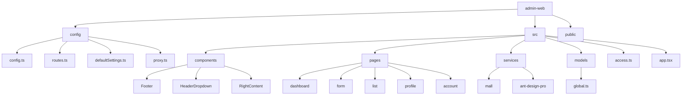
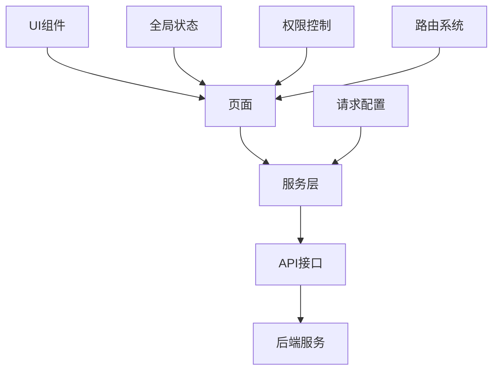
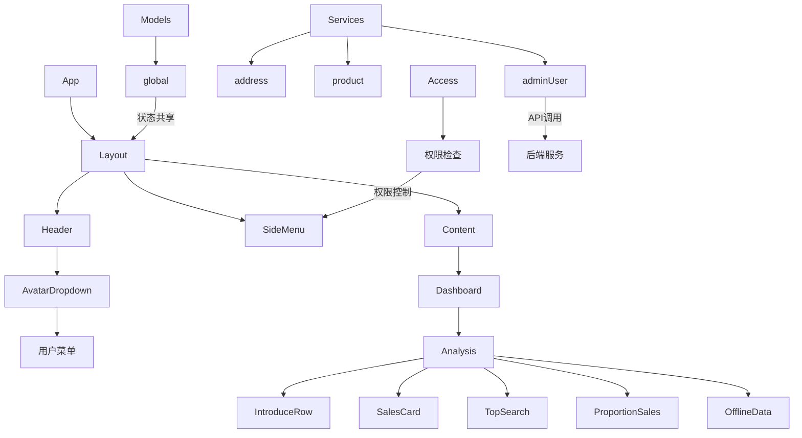

# 前端架构

<cite>
**本文档引用的文件**
- [app.tsx](file://apps/admin-web/src/app.tsx)
- [config.ts](file://apps/admin-web/config/config.ts)
- [routes.ts](file://apps/admin-web/config/routes.ts)
- [access.ts](file://apps/admin-web/src/access.ts)
- [global.ts](file://apps/admin-web/src/models/global.ts)
- [index.ts](file://apps/admin-web/src/components/index.ts)
- [adminUser.ts](file://apps/admin-web/src/services/mall/adminUser.ts)
- [index.ts](file://apps/admin-web/src/services/mall/index.ts)
- [defaultSettings.ts](file://apps/admin-web/config/defaultSettings.ts)
- [package.json](file://apps/admin-web/package.json)
- [analysis/index.tsx](file://apps/admin-web/src/pages/dashboard/analysis/index.tsx)
- [AvatarDropdown.tsx](file://apps/admin-web/src/components/RightContent/AvatarDropdown.tsx)
- [index.ts](file://apps/admin-web/src/constants/index.ts)
- [index.ts](file://apps/admin-web/src/types/index.ts)
</cite>

## 目录

1. [简介](#简介)
2. [项目结构](#项目结构)
3. [核心架构](#核心架构)
4. [应用入口与全局配置](#应用入口与全局配置)
5. [路由系统](#路由系统)
6. [UI组件设计](#ui组件设计)
7. [页面结构](#页面结构)
8. [API服务层](#api服务层)
9. [状态管理](#状态管理)
10. [权限控制机制](#权限控制机制)
11. [数据流分析](#数据流分析)
12. [组件树与数据流图](#组件树与数据流图)

## 简介

本架构文档详细描述了基于UmiJS框架的admin-web前端应用的整体架构设计。该应用采用MVC模式，通过Umi Max提供的强大插件系统实现了路由、布局、请求、权限和状态管理等核心功能。文档将深入分析应用的入口配置、路由定义、组件设计、服务封装和权限控制机制，为开发者提供全面的技术参考。

## 项目结构

admin-web应用遵循UmiJS的标准项目结构，采用功能模块化组织方式。核心目录包括config（配置）、src（源码）、public（静态资源）等。src目录下按功能划分components（通用组件）、pages（页面）、services（API服务）、models（状态管理）等子目录，实现了清晰的关注点分离。

**图源**
- [config.ts](file://apps/admin-web/config/config.ts)
- [app.tsx](file://apps/admin-web/src/app.tsx)
- [project structure](file://apps/admin-web/)

## 核心架构

admin-web应用基于UmiJS Max框架构建，采用现代化的前端架构模式。应用通过插件化方式集成了路由、布局、请求、权限、状态管理等功能，实现了高度的可配置性和可扩展性。整体架构遵循分层设计原则，分为UI层、页面层、服务层和模型层，各层职责分明，耦合度低。

**图源**
- [app.tsx](file://apps/admin-web/src/app.tsx)
- [config.ts](file://apps/admin-web/config/config.ts)
- [services](file://apps/admin-web/src/services/)

## 应用入口与全局配置

app.tsx作为应用的运行时入口文件，定义了全局初始化状态、布局配置和请求配置三大核心功能。通过getInitialState函数实现用户信息的初始化加载，layout配置实现全局布局的定制化，request配置则统一处理所有网络请求的拦截和错误处理。

### 全局状态初始化

getInitialState函数在应用启动时执行，负责获取当前用户信息并初始化全局状态。该函数通过getCurrentAdminUserProfile服务获取用户数据，若用户未登录则重定向到登录页面，确保了应用的安全性。

**节源**
- [app.tsx](file://apps/admin-web/src/app.tsx#L18-L59)

### 布局配置

layout配置基于initialState中的用户信息，定制了应用的整体布局。包括头像下拉菜单、水印、页脚等UI元素的配置，以及页面切换时的权限校验逻辑，实现了个性化的用户体验。

**节源**
- [app.tsx](file://apps/admin-web/src/app.tsx#L60-L96)

### 请求配置

request配置定义了全局的API请求行为，包括基础URL、超时时间、错误处理、请求拦截器和响应拦截器。通过请求拦截器自动注入认证token，通过响应拦截器统一处理业务数据解包和错误提示，大大简化了API调用的复杂性。

**节源**
- [app.tsx](file://apps/admin-web/src/app.tsx#L99-L171)

## 路由系统

路由系统由config/routes.ts文件定义，采用声明式配置方式。路由配置不仅定义了URL路径与页面组件的映射关系，还包含了布局、菜单、图标等元信息，实现了路由与UI的紧密结合。

### 路由配置结构

路由配置采用嵌套结构，支持父子路由关系。每个路由对象包含path（路径）、component（组件）、name（名称）、icon（图标）等属性。特殊路由如/user和/exception通过layout: false配置隐藏默认布局，适用于登录页和错误页等特殊场景。

**节源**
- [routes.ts](file://apps/admin-web/config/routes.ts#L13-L275)

### 路由与菜单集成

路由配置与Ant Design Pro的菜单系统深度集成，通过name属性自动关联国际化菜单项，通过icon属性配置菜单图标。这种设计实现了路由、菜单和权限的统一管理，提高了开发效率。

**节源**
- [routes.ts](file://apps/admin-web/config/routes.ts)
- [config.ts](file://apps/admin-web/config/config.ts#L87-L90)

## UI组件设计

UI组件位于src/components目录，采用模块化设计原则。组件通过index.ts文件统一导出，便于在应用其他部分引用。组件设计遵循单一职责原则，每个组件只负责特定的UI功能。

### 组件组织结构

组件按功能分组，如Footer、HeaderDropdown、RightContent等。这种组织方式提高了组件的可维护性和可复用性。通过createStyles等工具实现样式与组件的分离，保证了样式的可维护性。

**节源**
- [index.ts](file://apps/admin-web/src/components/index.ts#L1-L13)
- [components directory](file://apps/admin-web/src/components/)

### 头像下拉菜单

AvatarDropdown组件实现了用户头像的下拉菜单功能，包含个人中心、个人设置和退出登录等操作。组件通过useModel访问全局状态，实现了状态的响应式更新。

**节源**
- [AvatarDropdown.tsx](file://apps/admin-web/src/components/RightContent/AvatarDropdown.tsx#L1-L143)

## 页面结构

页面位于src/pages目录，按功能模块组织。每个页面通常包含index.tsx主组件文件，以及components、service、data.d.ts等辅助文件，形成了完整的页面单元。

### 仪表盘页面

以dashboard/analysis页面为例，该页面通过组合多个子组件（如IntroduceRow、SalesCard、TopSearch等）构建复杂的仪表盘界面。页面通过useRequest Hook调用服务层获取数据，实现了数据获取与UI渲染的分离。

**节源**
- [analysis/index.tsx](file://apps/admin-web/src/pages/dashboard/analysis/index.tsx#L1-L158)

### 页面与路由关联

页面组件通过相对路径与路由配置关联，如'./dashboard/analysis'指向src/pages/dashboard/analysis/index.tsx。这种约定优于配置的方式简化了路由设置，降低了出错概率。

**节源**
- [routes.ts](file://apps/admin-web/config/routes.ts)
- [pages directory](file://apps/admin-web/src/pages/)

## API服务层

API服务层位于src/services目录，采用分层设计。mall目录下的各个服务文件对应后端的不同业务模块，通过request工具封装了所有API调用。

### 服务封装模式

每个服务文件导出多个API调用函数，如adminUser.ts中的findAllAdminUser、createAdminUser等。这些函数基于UmiJS的request工具，统一处理请求参数、头部信息和响应数据，提供了类型安全的API调用接口。

**节源**
- [adminUser.ts](file://apps/admin-web/src/services/mall/adminUser.ts#L1-L122)

### 服务聚合

src/services/mall/index.ts文件将所有服务模块聚合为一个统一的接口，便于在应用其他部分批量导入和使用。这种设计提高了服务调用的便利性，同时保持了良好的模块化结构。

**节源**
- [index.ts](file://apps/admin-web/src/services/mall/index.ts#L1-L45)

## 状态管理

状态管理通过UmiJS的model插件实现，位于src/models目录。全局状态通过initialState机制在应用启动时初始化，组件通过useModel Hook访问和修改状态。

### 全局状态模式

global.ts文件定义了一个简单的全局状态示例，使用useState Hook管理用户名称。实际应用中，可以通过类似的模式管理更复杂的全局状态，如用户信息、应用配置等。

**节源**
- [global.ts](file://apps/admin-web/src/models/global.ts#L1-L14)

### 状态与组件集成

组件通过useModel('@@initialState')访问全局状态，实现了状态的跨组件共享。当状态更新时，依赖该状态的组件会自动重新渲染，保证了UI的一致性。

**节源**
- [AvatarDropdown.tsx](file://apps/admin-web/src/components/RightContent/AvatarDropdown.tsx#L21-L23)

## 权限控制机制

权限控制通过access插件实现，位于src/access.ts文件。该机制基于全局状态中的用户信息，动态生成用户的权限集合。

### 权限定义

access函数接收initialState作为参数，根据当前用户的角色和权限信息返回一个权限对象。例如，canAdmin权限仅当用户角色为'admin'时才为true。这种声明式的权限定义方式简洁明了，易于维护。

**节源**
- [access.ts](file://apps/admin-web/src/access.ts#L1-L13)

### 权限使用

在路由配置中，可以通过wrappers属性应用权限校验组件，实现路由级别的权限控制。在组件中，可以通过useAccess Hook访问权限对象，实现UI元素级别的权限控制。

**节源**
- [access.ts](file://apps/admin-web/src/access.ts)
- [routes.ts](file://apps/admin-web/config/routes.ts)

## 数据流分析

应用的数据流遵循单向数据流原则，从服务层获取数据，通过状态管理传递给UI组件，用户交互触发状态更新，形成闭环。

### 数据获取流程

1. 页面组件调用服务层API
2. 服务层通过request工具发送HTTP请求
3. 请求拦截器自动注入认证token
4. 后端返回响应数据
5. 响应拦截器解包业务数据
6. 页面组件接收数据并更新UI

**节源**
- [app.tsx](file://apps/admin-web/src/app.tsx#L134-L169)
- [adminUser.ts](file://apps/admin-web/src/services/mall/adminUser.ts)

### 错误处理流程

1. HTTP请求失败或业务处理失败
2. 错误配置(errorConfig)捕获错误
3. 根据错误类型显示相应提示
4. 特殊错误（如401）触发特定操作（如跳转登录页）
5. 用户获得清晰的错误反馈

**节源**
- [app.tsx](file://apps/admin-web/src/app.tsx#L104-L131)

## 组件树与数据流图

以下图表展示了应用的核心组件树结构和主要数据流。

**图源**
- [app.tsx](file://apps/admin-web/src/app.tsx)
- [routes.ts](file://apps/admin-web/config/routes.ts)
- [services](file://apps/admin-web/src/services/)
- [models](file://apps/admin-web/src/models/)