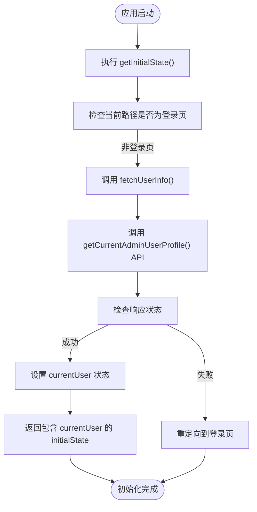
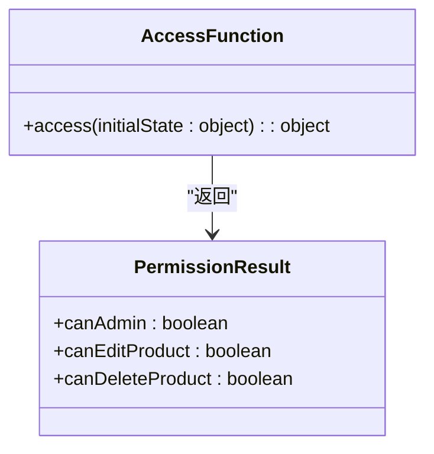
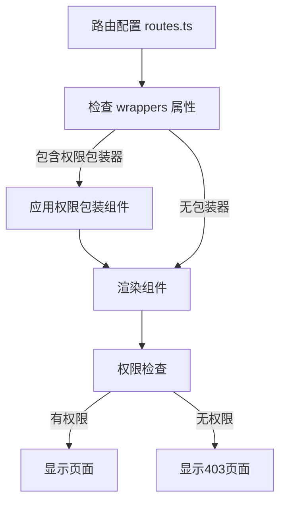
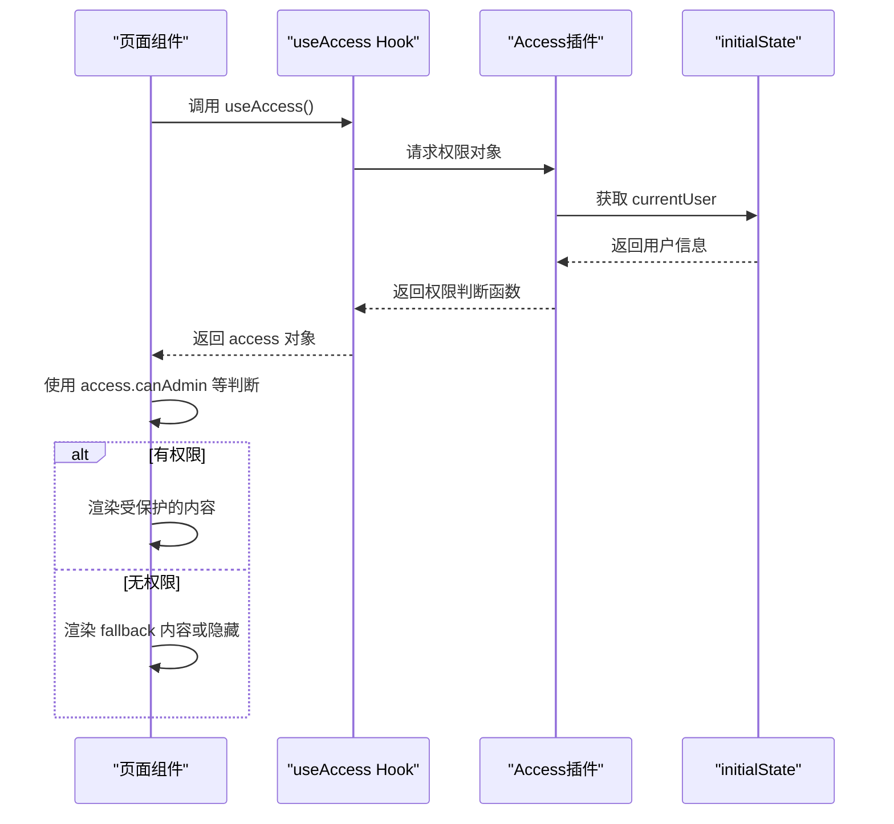
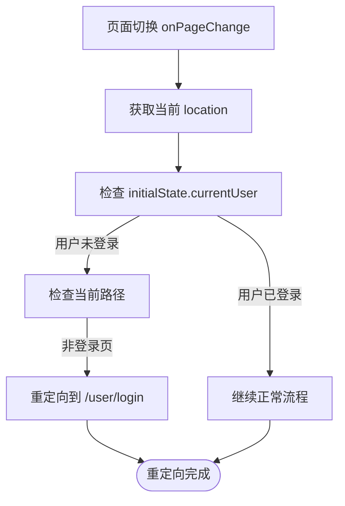
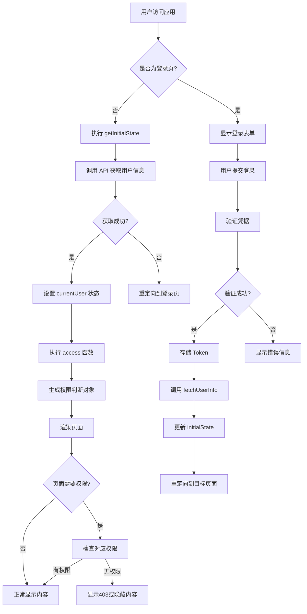

# 权限控制实现

<cite>
**本文档引用的文件**
- [access.ts](file://apps/admin-web/src/access.ts)
- [app.tsx](file://apps/admin-web/src/app.tsx)
- [config.ts](file://apps/admin-web/config/config.ts)
- [routes.ts](file://apps/admin-web/config/routes.ts)
- [Admin.tsx](file://apps/admin-web/src/pages/Admin.tsx)
- [user/manage/index.tsx](file://apps/admin-web/src/pages/user/manage/index.tsx)
- [user/login/index.tsx](file://apps/admin-web/src/pages/user/login/index.tsx)
- [README.md](file://markdown/admin/README.md)
</cite>

## 目录
1. [权限控制概述](#权限控制概述)
2. [权限初始化流程](#权限初始化流程)
3. [权限定义与实现](#权限定义与实现)
4. [路由级权限控制](#路由级权限控制)
5. [组件级权限控制](#组件级权限控制)
6. [未授权访问处理](#未授权访问处理)
7. [权限控制流程图](#权限控制流程图)

## 权限控制概述

本系统基于Umi框架的access插件实现完整的权限控制机制，通过`initialState`获取用户角色信息，并在`access`文件中定义权限判断函数。权限控制分为页面级和元素级两个层次，结合路由配置和组件包装实现细粒度的访问控制。

**Section sources**
- [access.ts](file://apps/admin-web/src/access.ts#L1-L12)
- [config.ts](file://apps/admin-web/config/config.ts#L130-L134)

## 权限初始化流程

系统的权限控制始于`app.tsx`文件中的`getInitialState`函数，该函数在应用启动时执行，负责获取当前用户信息并初始化全局状态。

**Diagram sources**
- [app.tsx](file://apps/admin-web/src/app.tsx#L27-L58)

**Section sources**
- [app.tsx](file://apps/admin-web/src/app.tsx#L27-L58)

## 权限定义与实现

权限逻辑在`src/access.ts`文件中定义，该文件导出一个函数，接收`initialState`作为参数，并返回一个包含各种权限判断结果的对象。

权限判断函数的核心逻辑是检查`initialState`中的`currentUser`对象的属性，如角色（role）或权限列表（permissions）。例如，`canAdmin`权限的判断基于用户角色是否为'admin'。

**Diagram sources**
- [access.ts](file://apps/admin-web/src/access.ts#L1-L12)

**Section sources**
- [access.ts](file://apps/admin-web/src/access.ts#L1-L12)
- [README.md](file://markdown/admin/README.md#L259-L269)

## 路由级权限控制

路由级别的权限控制通过在`config/routes.ts`文件中配置`wrappers`属性实现。系统在`config/config.ts`中启用了access插件，使得可以在路由配置中使用权限控制。

虽然当前路由配置中未显式使用`wrappers`，但Umi的access插件已全局启用，为后续添加路由级权限控制提供了基础。

**Diagram sources**
- [config.ts](file://apps/admin-web/config/config.ts#L134)
- [routes.ts](file://apps/admin-web/config/routes.ts#L1-L275)

**Section sources**
- [config.ts](file://apps/admin-web/config/config.ts#L130-L134)
- [routes.ts](file://apps/admin-web/config/routes.ts#L1-L275)

## 组件级权限控制

组件级别的权限控制通过Umi提供的`useAccess` Hook和`Access`组件实现，允许在页面或组件中根据用户权限条件性地渲染内容。

在实际组件中，可以通过`useAccess`获取权限对象，然后根据`canAdmin`等属性来控制UI元素的显示。例如，在用户管理页面中，只有管理员才能看到删除按钮。

**Diagram sources**
- [user/manage/index.tsx](file://apps/admin-web/src/pages/user/manage/index.tsx#L9-L185)
- [Admin.tsx](file://apps/admin-web/src/pages/Admin.tsx#L1-L42)

**Section sources**
- [user/manage/index.tsx](file://apps/admin-web/src/pages/user/manage/index.tsx#L9-L185)
- [Admin.tsx](file://apps/admin-web/src/pages/Admin.tsx#L1-L42)
- [README.md](file://markdown/admin/README.md#L274-L292)

## 未授权访问处理

系统通过`app.tsx`文件中的`layout`配置的`onPageChange`函数处理未授权访问，实现自动重定向到登录页的逻辑。

此外，系统还通过请求拦截器处理401（未授权）和403（禁止访问）等HTTP状态码，当检测到Token失效时，自动清除本地存储的Token并重定向到登录页。

**Diagram sources**
- [app.tsx](file://apps/admin-web/src/app.tsx#L75-L81)
- [app.tsx](file://apps/admin-web/src/app.tsx#L111-L116)

**Section sources**
- [app.tsx](file://apps/admin-web/src/app.tsx#L75-L81)
- [app.tsx](file://apps/admin-web/src/app.tsx#L111-L116)

## 权限控制流程图

以下是系统权限控制的整体流程图，展示了从用户登录到权限验证的完整过程：

**Diagram sources**
- [app.tsx](file://apps/admin-web/src/app.tsx#L27-L58)
- [app.tsx](file://apps/admin-web/src/app.tsx#L75-L81)
- [access.ts](file://apps/admin-web/src/access.ts#L1-L12)
- [user/login/index.tsx](file://apps/admin-web/src/pages/user/login/index.tsx#L100-L119)