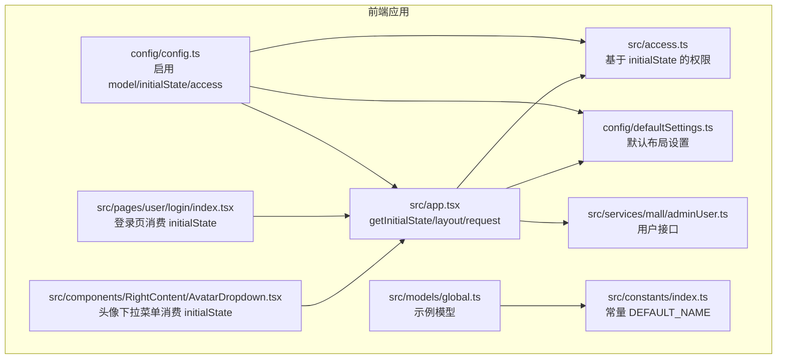
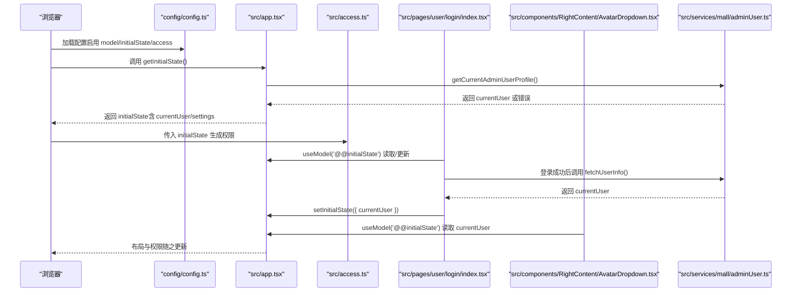
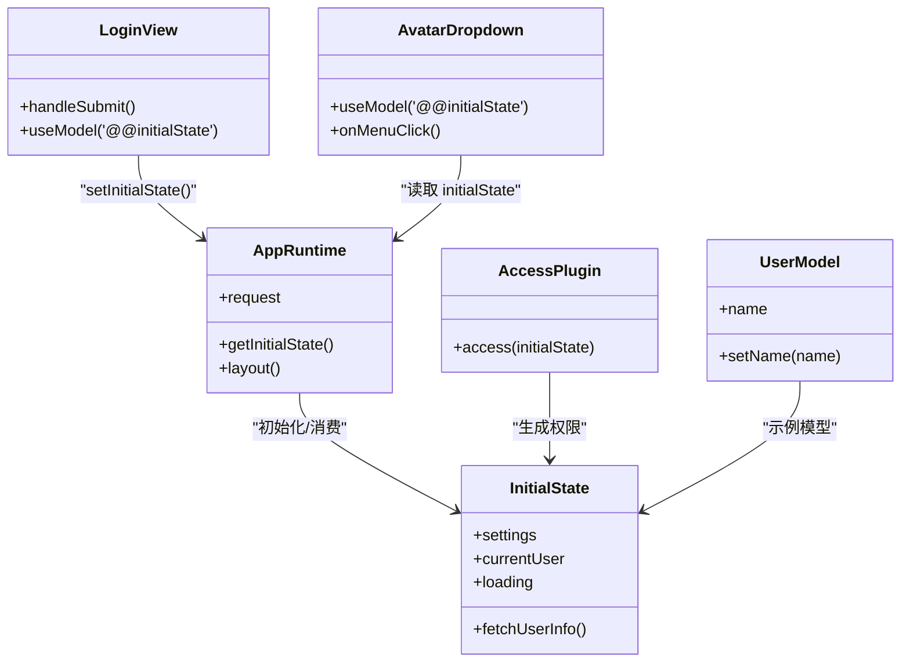
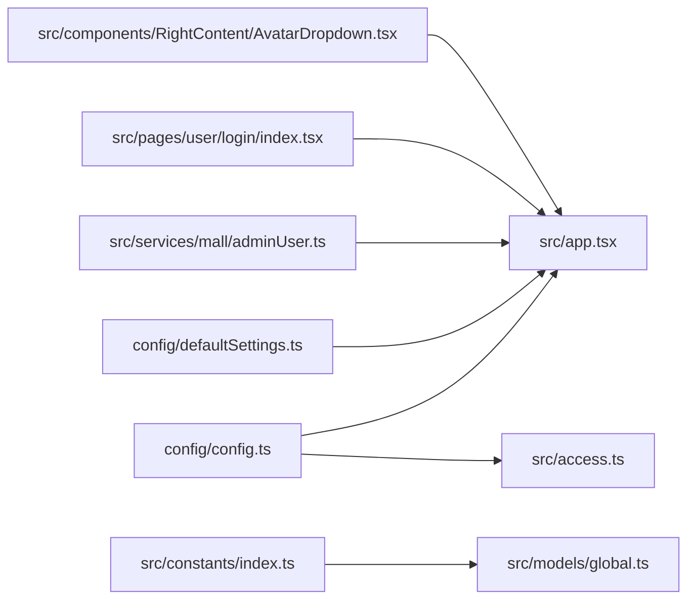
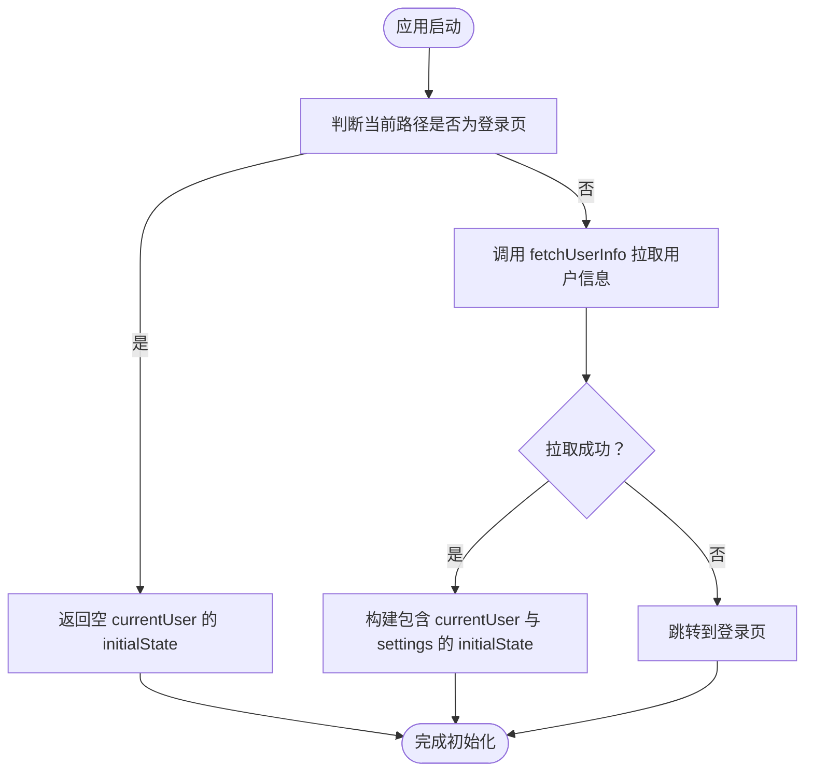

# 状态管理机制

<cite>
**本文引用的文件**
- [apps/admin-web/src/models/global.ts](file://apps/admin-web/src/models/global.ts)
- [apps/admin-web/src/app.tsx](file://apps/admin-web/src/app.tsx)
- [apps/admin-web/src/access.ts](file://apps/admin-web/src/access.ts)
- [apps/admin-web/config/config.ts](file://apps/admin-web/config/config.ts)
- [apps/admin-web/config/defaultSettings.ts](file://apps/admin-web/config/defaultSettings.ts)
- [apps/admin-web/src/constants/index.ts](file://apps/admin-web/src/constants/index.ts)
- [apps/admin-web/src/services/mall/adminUser.ts](file://apps/admin-web/src/services/mall/adminUser.ts)
- [apps/admin-web/src/components/RightContent/AvatarDropdown.tsx](file://apps/admin-web/src/components/RightContent/AvatarDropdown.tsx)
- [apps/admin-web/src/pages/user/login/index.tsx](file://apps/admin-web/src/pages/user/login/index.tsx)
</cite>

## 目录
1. [引言](#引言)
2. [项目结构](#项目结构)
3. [核心组件](#核心组件)
4. [架构总览](#架构总览)
5. [详细组件分析](#详细组件分析)
6. [依赖关系分析](#依赖关系分析)
7. [性能考量](#性能考量)
8. [故障排查指南](#故障排查指南)
9. [结论](#结论)
10. [附录](#附录)

## 引言
本文件围绕 Umi Max 的运行时状态管理展开，系统性解析以下要点：
- 在 src/models/global.ts 中的模型机制与使用方式
- 在 app.tsx 中通过 getInitialState 初始化全局状态（如 currentUser、settings）
- 通过 setInitialState 实现状态更新
- 在 access.ts 中基于全局状态实现路由级权限控制
- 结合 config.ts 的 initialState 配置，说明全局状态的持久化与初始化流程
- 提供状态消费的最佳实践与常见问题排查

## 项目结构
该工程采用 Monorepo 结构，前端应用位于 apps/admin-web。与状态管理密切相关的文件主要分布在：
- 运行时配置与布局：apps/admin-web/src/app.tsx
- 权限插件入口：apps/admin-web/src/access.ts
- 数据流插件与全局初始状态：apps/admin-web/config/config.ts
- 默认布局设置：apps/admin-web/config/defaultSettings.ts
- 示例模型：apps/admin-web/src/models/global.ts
- 常量与默认值：apps/admin-web/src/constants/index.ts
- 用户服务接口：apps/admin-web/src/services/mall/adminUser.ts
- 登录页与头像下拉菜单等消费方：apps/admin-web/src/pages/user/login/index.tsx、apps/admin-web/src/components/RightContent/AvatarDropdown.tsx

图表来源
- [apps/admin-web/config/config.ts](file://apps/admin-web/config/config.ts#L75-L82)
- [apps/admin-web/src/app.tsx](file://apps/admin-web/src/app.tsx#L26-L59)
- [apps/admin-web/src/access.ts](file://apps/admin-web/src/access.ts#L1-L12)
- [apps/admin-web/config/defaultSettings.ts](file://apps/admin-web/config/defaultSettings.ts#L1-L29)
- [apps/admin-web/src/models/global.ts](file://apps/admin-web/src/models/global.ts#L1-L14)
- [apps/admin-web/src/constants/index.ts](file://apps/admin-web/src/constants/index.ts#L1-L2)
- [apps/admin-web/src/services/mall/adminUser.ts](file://apps/admin-web/src/services/mall/adminUser.ts#L103-L109)
- [apps/admin-web/src/pages/user/login/index.tsx](file://apps/admin-web/src/pages/user/login/index.tsx#L76-L121)
- [apps/admin-web/src/components/RightContent/AvatarDropdown.tsx](file://apps/admin-web/src/components/RightContent/AvatarDropdown.tsx#L20-L104)

章节来源
- [apps/admin-web/config/config.ts](file://apps/admin-web/config/config.ts#L75-L82)
- [apps/admin-web/src/app.tsx](file://apps/admin-web/src/app.tsx#L26-L59)

## 核心组件
- 运行时全局状态（InitialState）：在 app.tsx 中定义，包含 currentUser、settings、fetchUserInfo 等字段，用于布局渲染、权限校验与页面跳转。
- 权限插件（Access）：在 access.ts 中根据 initialState.currentUser 生成权限标识，如 canAdmin。
- 数据流插件（Model）：在 config.ts 中启用 model 插件；示例模型 global.ts 展示了如何定义一个简单的 useUser 模型。
- 默认布局设置：defaultSettings.ts 提供默认布局主题与属性，作为 initialState.settings 的来源之一。
- 登录与状态更新：login 页面在登录成功后调用 fetchUserInfo 并通过 setInitialState 更新 currentUser，从而驱动 UI 与权限变化。

章节来源
- [apps/admin-web/src/app.tsx](file://apps/admin-web/src/app.tsx#L18-L59)
- [apps/admin-web/src/access.ts](file://apps/admin-web/src/access.ts#L1-L12)
- [apps/admin-web/config/config.ts](file://apps/admin-web/config/config.ts#L75-L82)
- [apps/admin-web/config/defaultSettings.ts](file://apps/admin-web/config/defaultSettings.ts#L1-L29)
- [apps/admin-web/src/models/global.ts](file://apps/admin-web/src/models/global.ts#L1-L14)
- [apps/admin-web/src/pages/user/login/index.tsx](file://apps/admin-web/src/pages/user/login/index.tsx#L88-L121)

## 架构总览
Umi Max 的运行时状态管理遵循“配置驱动 + 插件协同”的设计：
- config.ts 启用 model、initialState、access 等插件，形成全局状态与权限的基础能力。
- app.tsx 的 getInitialState 负责在应用启动时拉取用户信息并填充 initialState。
- layout 配置消费 initialState，实现水印、头像、语言选择等 UI 行为。
- access.ts 基于 initialState 生成权限，供路由与页面组件使用。
- 登录页与头像下拉菜单等消费方通过 useModel('@@initialState') 读写状态，完成登录态与用户信息的更新。

图表来源
- [apps/admin-web/config/config.ts](file://apps/admin-web/config/config.ts#L75-L82)
- [apps/admin-web/src/app.tsx](file://apps/admin-web/src/app.tsx#L26-L59)
- [apps/admin-web/src/access.ts](file://apps/admin-web/src/access.ts#L1-L12)
- [apps/admin-web/src/pages/user/login/index.tsx](file://apps/admin-web/src/pages/user/login/index.tsx#L88-L121)
- [apps/admin-web/src/components/RightContent/AvatarDropdown.tsx](file://apps/admin-web/src/components/RightContent/AvatarDropdown.tsx#L70-L80)
- [apps/admin-web/src/services/mall/adminUser.ts](file://apps/admin-web/src/services/mall/adminUser.ts#L103-L109)

## 详细组件分析

### 运行时全局状态初始化（app.tsx）
- 初始化类型与职责
  - InitialState 接口包含 settings、currentUser、loading、fetchUserInfo 等字段，用于布局渲染与权限判断。
- 初始化流程
  - getInitialState 在页面刷新时执行，优先判断当前路径是否为登录页；若非登录页，则调用 fetchUserInfo 拉取用户信息并返回包含 currentUser 与 settings 的 initialState。
  - 若拉取失败或抛错，将跳转至登录页。
- 布局与权限联动
  - layout.onPageChange 在每次页面切换时检查是否存在 currentUser，不存在则重定向至登录页。
  - layout 中使用 initialState.currentUser 渲染头像、水印与名称。
- 网络层协作
  - request 配置统一注入 jxe-token，处理 401/403 等错误并清理本地 token，确保状态一致性。

章节来源
- [apps/admin-web/src/app.tsx](file://apps/admin-web/src/app.tsx#L18-L59)
- [apps/admin-web/src/app.tsx](file://apps/admin-web/src/app.tsx#L60-L97)
- [apps/admin-web/src/app.tsx](file://apps/admin-web/src/app.tsx#L99-L171)
- [apps/admin-web/config/defaultSettings.ts](file://apps/admin-web/config/defaultSettings.ts#L1-L29)

### 权限控制（access.ts）
- 权限生成逻辑
  - 基于 initialState.currentUser 生成 canAdmin 权限，当 currentUser 的 role 为 'admin' 时返回 true。
- 使用场景
  - 可用于路由守卫、菜单渲染、按钮显隐等，实现细粒度的访问控制。

章节来源
- [apps/admin-web/src/access.ts](file://apps/admin-web/src/access.ts#L1-L12)

### 数据流插件与模型（config.ts 与 models/global.ts）
- 插件启用
  - config.ts 启用 model 与 initialState 插件，使全局状态与模型机制可用。
- 示例模型
  - models/global.ts 定义了一个 useUser 模型，内部使用 useState 维护 name 字段，并导出 setName 以便外部更新。
- 最佳实践建议
  - 对于简单状态，可直接使用 useModel('@@initialState')；对于复杂业务状态，可按需拆分到独立 model 文件中，保持关注点分离。

章节来源
- [apps/admin-web/config/config.ts](file://apps/admin-web/config/config.ts#L75-L82)
- [apps/admin-web/src/models/global.ts](file://apps/admin-web/src/models/global.ts#L1-L14)
- [apps/admin-web/src/constants/index.ts](file://apps/admin-web/src/constants/index.ts#L1-L2)

### 登录页状态更新（pages/user/login/index.tsx）
- 登录成功后的状态更新
  - 登录成功后将 token 写入 localStorage，并调用 initialState.fetchUserInfo 拉取最新用户信息。
  - 使用 flushSync 与 setInitialState 合并更新 currentUser，随后跳转至 redirect 或首页。
- 与服务层协作
  - 通过 services/mall/adminUser.ts 的 getCurrentAdminUserProfile 接口获取用户资料。

章节来源
- [apps/admin-web/src/pages/user/login/index.tsx](file://apps/admin-web/src/pages/user/login/index.tsx#L88-L121)
- [apps/admin-web/src/services/mall/adminUser.ts](file://apps/admin-web/src/services/mall/adminUser.ts#L103-L109)

### 头像下拉菜单状态消费（components/RightContent/AvatarDropdown.tsx）
- 状态消费
  - 使用 useModel('@@initialState') 读取 currentUser，渲染用户名称与头像。
- 退出登录
  - 点击退出登录时，通过 setInitialState 将 currentUser 设为 undefined，并清理登录态与跳转。

章节来源
- [apps/admin-web/src/components/RightContent/AvatarDropdown.tsx](file://apps/admin-web/src/components/RightContent/AvatarDropdown.tsx#L20-L24)
- [apps/admin-web/src/components/RightContent/AvatarDropdown.tsx](file://apps/admin-web/src/components/RightContent/AvatarDropdown.tsx#L70-L80)

### 类图：运行时状态与消费方关系

图表来源
- [apps/admin-web/src/app.tsx](file://apps/admin-web/src/app.tsx#L26-L59)
- [apps/admin-web/src/access.ts](file://apps/admin-web/src/access.ts#L1-L12)
- [apps/admin-web/src/pages/user/login/index.tsx](file://apps/admin-web/src/pages/user/login/index.tsx#L88-L121)
- [apps/admin-web/src/components/RightContent/AvatarDropdown.tsx](file://apps/admin-web/src/components/RightContent/AvatarDropdown.tsx#L70-L80)
- [apps/admin-web/src/models/global.ts](file://apps/admin-web/src/models/global.ts#L1-L14)

## 依赖关系分析
- 插件耦合
  - config.ts 同时启用 model、initialState、access，三者共同构成状态与权限的基础设施。
- 运行时依赖
  - app.tsx 依赖 defaultSettings.ts 提供默认布局设置；依赖 services/mall/adminUser.ts 拉取用户信息。
- 消费方依赖
  - login 页面与头像下拉菜单均依赖 useModel('@@initialState') 读写状态，形成对 app.tsx 初始化逻辑的间接依赖。
- 模型依赖
  - models/global.ts 依赖 constants/index.ts 提供默认名称。

图表来源
- [apps/admin-web/config/config.ts](file://apps/admin-web/config/config.ts#L75-L82)
- [apps/admin-web/src/app.tsx](file://apps/admin-web/src/app.tsx#L26-L59)
- [apps/admin-web/src/access.ts](file://apps/admin-web/src/access.ts#L1-L12)
- [apps/admin-web/config/defaultSettings.ts](file://apps/admin-web/config/defaultSettings.ts#L1-L29)
- [apps/admin-web/src/services/mall/adminUser.ts](file://apps/admin-web/src/services/mall/adminUser.ts#L103-L109)
- [apps/admin-web/src/pages/user/login/index.tsx](file://apps/admin-web/src/pages/user/login/index.tsx#L88-L121)
- [apps/admin-web/src/components/RightContent/AvatarDropdown.tsx](file://apps/admin-web/src/components/RightContent/AvatarDropdown.tsx#L70-L80)
- [apps/admin-web/src/models/global.ts](file://apps/admin-web/src/models/global.ts#L1-L14)
- [apps/admin-web/src/constants/index.ts](file://apps/admin-web/src/constants/index.ts#L1-L2)

## 性能考量
- 状态更新批量化
  - 在登录流程中使用 flushSync 合并 setInitialState 更新，有助于减少多次重渲染。
- 请求拦截与错误处理
  - request 配置统一处理 401/403 等错误，避免重复请求与无效渲染。
- 按需初始化
  - getInitialState 仅在非登录页时拉取用户信息，避免不必要的网络开销。
- 模型拆分
  - 对于复杂业务状态，建议拆分为多个 model 文件，降低单一模块的复杂度与重渲染范围。

## 故障排查指南
- 登录后未更新 currentUser
  - 检查登录页是否正确调用 initialState.fetchUserInfo 与 setInitialState。
  - 确认 token 是否写入 localStorage，且 request 拦截器已注入 jxe-token。
- 401/403 导致频繁跳转
  - 检查 request.errorHandler 是否正确清理 token 并跳转登录页。
  - 确认服务端返回的 status 与 data 结构符合预期。
- 权限不生效
  - 确认 access.ts 中的权限生成逻辑与 currentUser 的 role 匹配。
  - 检查路由是否正确使用 access 控制。
- 布局未显示用户信息
  - 确认 layout 中读取 initialState.currentUser 的字段名与实际一致。
  - 检查 getInitialState 是否返回了 currentUser。

章节来源
- [apps/admin-web/src/pages/user/login/index.tsx](file://apps/admin-web/src/pages/user/login/index.tsx#L88-L121)
- [apps/admin-web/src/app.tsx](file://apps/admin-web/src/app.tsx#L99-L171)
- [apps/admin-web/src/access.ts](file://apps/admin-web/src/access.ts#L1-L12)
- [apps/admin-web/src/app.tsx](file://apps/admin-web/src/app.tsx#L60-L97)

## 结论
本项目通过 Umi Max 的运行时状态管理实现了“配置驱动 + 插件协同”的全局状态体系：
- config.ts 启用 model/initialState/access，奠定基础能力
- app.tsx 的 getInitialState 负责初始化 currentUser 与 settings
- layout 与 access 基于 initialState 实现 UI 与权限联动
- 登录页与头像下拉菜单通过 setInitialState 实现状态更新
- models/global.ts 提供了最小可用模型示例，便于扩展复杂业务状态

## 附录

### 初始化与更新流程图（概念）

### 状态消费最佳实践清单
- 使用 useModel('@@initialState') 读取 currentUser 与 settings，避免直接依赖全局变量
- 在登录成功后，先调用 fetchUserInfo，再 setInitialState 合并更新 currentUser
- 对于复杂业务状态，拆分为独立 model 文件，保持职责清晰
- 在 layout 中统一处理未登录跳转，避免各页面重复判断
- 在 request 拦截器中注入 token，在错误处理器中清理 token，保证状态一致性