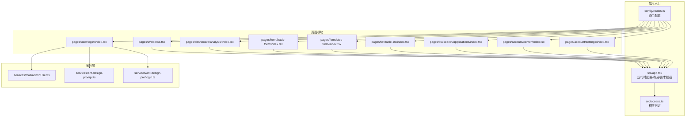
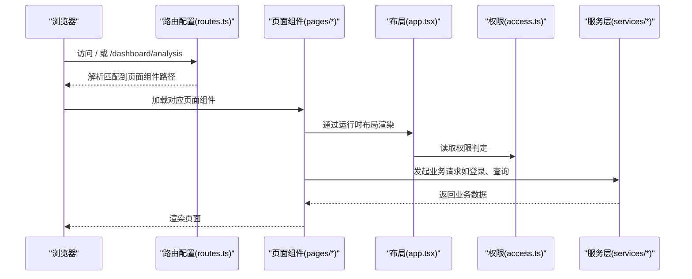
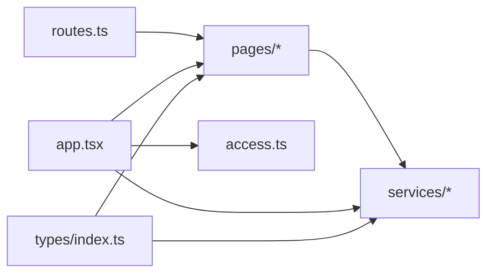

# 页面结构与路由

<cite>
**本文引用的文件**
- [apps/admin-web/config/routes.ts](file://apps/admin-web/config/routes.ts)
- [apps/admin-web/src/app.tsx](file://apps/admin-web/src/app.tsx)
- [apps/admin-web/src/access.ts](file://apps/admin-web/src/access.ts)
- [apps/admin-web/src/pages/Welcome.tsx](file://apps/admin-web/src/pages/Welcome.tsx)
- [apps/admin-web/src/pages/user/login/index.tsx](file://apps/admin-web/src/pages/user/login/index.tsx)
- [apps/admin-web/src/pages/dashboard/analysis/index.tsx](file://apps/admin-web/src/pages/dashboard/analysis/index.tsx)
- [apps/admin-web/src/pages/form/basic-form/index.tsx](file://apps/admin-web/src/pages/form/basic-form/index.tsx)
- [apps/admin-web/src/pages/form/step-form/index.tsx](file://apps/admin-web/src/pages/form/step-form/index.tsx)
- [apps/admin-web/src/pages/list/table-list/index.tsx](file://apps/admin-web/src/pages/list/table-list/index.tsx)
- [apps/admin-web/src/pages/list/search/applications/index.tsx](file://apps/admin-web/src/pages/list/search/applications/index.tsx)
- [apps/admin-web/src/pages/account/center/index.tsx](file://apps/admin-web/src/pages/account/center/index.tsx)
- [apps/admin-web/src/pages/account/settings/index.tsx](file://apps/admin-web/src/pages/account/settings/index.tsx)
- [apps/admin-web/src/services/mall/adminUser.ts](file://apps/admin-web/src/services/mall/adminUser.ts)
- [apps/admin-web/src/models/global.ts](file://apps/admin-web/src/models/global.ts)
- [apps/admin-web/src/types/index.ts](file://apps/admin-web/src/types/index.ts)
</cite>

## 目录
1. [引言](#引言)
2. [项目结构](#项目结构)
3. [核心组件](#核心组件)
4. [架构总览](#架构总览)
5. [详细组件分析](#详细组件分析)
6. [依赖关系分析](#依赖关系分析)
7. [性能考量](#性能考量)
8. [故障排查指南](#故障排查指南)
9. [结论](#结论)
10. [附录](#附录)

## 引言
本文件围绕前端页面结构与路由机制展开，重点解析以下内容：
- routes.ts 中的路由配置如何映射到 src/pages 下的具体页面文件
- 嵌套路由与权限控制路由（如 account/center、account/settings）的组织方式
- 不同页面模块（dashboard、form、list、user）的功能划分与目录结构
- 结合 Welcome、登录、表单、列表等典型页面，展示页面组件结构、数据加载逻辑与服务层交互模式
- 动态路由与菜单生成机制

## 项目结构
前端采用 Umi Max 架构，路由配置集中于 config/routes.ts，页面组件位于 src/pages 下，按功能域分层组织。整体遵循“路由即页面”的约定式路由思想，配合运行时布局与权限配置实现统一入口与权限控制。

图表来源
- [apps/admin-web/config/routes.ts](file://apps/admin-web/config/routes.ts#L1-L275)
- [apps/admin-web/src/app.tsx](file://apps/admin-web/src/app.tsx#L1-L174)
- [apps/admin-web/src/access.ts](file://apps/admin-web/src/access.ts#L1-L13)
- [apps/admin-web/src/services/mall/adminUser.ts](file://apps/admin-web/src/services/mall/adminUser.ts#L1-L122)

章节来源
- [apps/admin-web/config/routes.ts](file://apps/admin-web/config/routes.ts#L1-L275)
- [apps/admin-web/src/app.tsx](file://apps/admin-web/src/app.tsx#L1-L174)

## 核心组件
- 路由配置（routes.ts）
  - 定义顶层路由与嵌套路由，包含用户域、仪表盘、表单、列表、个人中心与设置、结果与异常等模块
  - 使用 component 字段指向 src/pages 下的相对路径，Umi 会自动解析到对应页面组件
  - 使用 redirect 实现默认跳转，简化首次访问体验
- 运行时配置（app.tsx）
  - getInitialState：在页面刷新时拉取当前用户信息，未登录自动跳转登录页
  - layout：统一布局行为，包含水印、头像下拉、语言切换、页脚等
  - request：统一请求拦截器注入 jxe-token，响应拦截器解包业务数据并处理错误
- 权限判定（access.ts）
  - 基于 currentUser.role 返回 canAdmin 权限，供页面或布局使用

章节来源
- [apps/admin-web/config/routes.ts](file://apps/admin-web/config/routes.ts#L1-L275)
- [apps/admin-web/src/app.tsx](file://apps/admin-web/src/app.tsx#L1-L174)
- [apps/admin-web/src/access.ts](file://apps/admin-web/src/access.ts#L1-L13)

## 架构总览
下图展示了从路由到页面再到服务层的整体流程，以及权限与布局的介入点。

图表来源
- [apps/admin-web/config/routes.ts](file://apps/admin-web/config/routes.ts#L1-L275)
- [apps/admin-web/src/app.tsx](file://apps/admin-web/src/app.tsx#L1-L174)
- [apps/admin-web/src/access.ts](file://apps/admin-web/src/access.ts#L1-L13)
- [apps/admin-web/src/services/mall/adminUser.ts](file://apps/admin-web/src/services/mall/adminUser.ts#L1-L122)

## 详细组件分析

### 路由与页面映射
- 顶层路由
  - /user 登录相关：/user/login、/user/register、/user/register-result
  - /dashboard 仪表盘：analysis、monitor、workplace
  - /form 表单：basic-form、step-form、advanced-form
  - /list 列表：table-list、basic-list、card-list；search 下再嵌套 articles、projects、applications
  - /profile 个人资料：basic、advanced
  - /result 结果页：success、fail
  - /exception 异常页：403、404、500
  - /account 个人中心：/account/center、/account/settings
  - 默认重定向至 /dashboard/analysis
- 映射规则
  - component: './module/sub' 将映射到 src/pages/module/sub/index.tsx
  - 嵌套路由通过 routes 字段组织，形成父子关系，便于统一布局与权限控制

章节来源
- [apps/admin-web/config/routes.ts](file://apps/admin-web/config/routes.ts#L1-L275)

### 嵌套路由与权限控制
- 嵌套路由
  - /dashboard、/list/search、/profile、/result、/exception、/account 等均通过 routes 定义子路由
  - 子路由可独立设置 name、icon、component，父路由负责 redirect 与布局
- 权限控制
  - 运行时布局通过 onPageChange 检测是否登录，未登录自动跳转 /user/login
  - 权限判定函数 access 返回 canAdmin 等权限，供页面或布局按需使用

章节来源
- [apps/admin-web/config/routes.ts](file://apps/admin-web/config/routes.ts#L1-L275)
- [apps/admin-web/src/app.tsx](file://apps/admin-web/src/app.tsx#L1-L174)
- [apps/admin-web/src/access.ts](file://apps/admin-web/src/access.ts#L1-L13)

### 页面模块与目录结构
- dashboard
  - analysis：数据看板，使用 useRequest 加载模拟数据，组件化拆分（IntroduceRow、SalesCard、TopSearch 等）
  - monitor、workplace：类似结构，按需引入组件与服务
- form
  - basic-form：基础表单，使用 ProForm 组件，手动触发提交
  - step-form：分步表单，StepsForm 驱动多步骤流转
- list
  - table-list：表格列表，集成 ProTable、ModalForm、Drawer 等，支持增删改查与批量操作
  - search/applications：搜索筛选 + 卡片列表，Form 与 useRequest 驱动查询
- user
  - login：登录/注册切换，本地存储 token，成功后拉取用户信息并跳转
  - manage、register、register-result：用户管理与注册流程
- account
  - center：个人信息中心，Tab 切换文章/应用/项目
  - settings：设置中心，左侧菜单切换基础设置、安全设置、账号绑定、新消息通知

章节来源
- [apps/admin-web/src/pages/dashboard/analysis/index.tsx](file://apps/admin-web/src/pages/dashboard/analysis/index.tsx#L1-L158)
- [apps/admin-web/src/pages/form/basic-form/index.tsx](file://apps/admin-web/src/pages/form/basic-form/index.tsx#L1-L195)
- [apps/admin-web/src/pages/form/step-form/index.tsx](file://apps/admin-web/src/pages/form/step-form/index.tsx#L1-L249)
- [apps/admin-web/src/pages/list/table-list/index.tsx](file://apps/admin-web/src/pages/list/table-list/index.tsx#L1-L339)
- [apps/admin-web/src/pages/list/search/applications/index.tsx](file://apps/admin-web/src/pages/list/search/applications/index.tsx#L1-L240)
- [apps/admin-web/src/pages/account/center/index.tsx](file://apps/admin-web/src/pages/account/center/index.tsx#L1-L279)
- [apps/admin-web/src/pages/account/settings/index.tsx](file://apps/admin-web/src/pages/account/settings/index.tsx#L1-L109)

### 典型页面：Welcome
- 组件结构
  - 使用 PageContainer 包裹卡片，InfoCard 为可复用子组件
  - 通过 useModel('@@initialState') 获取全局布局设置
- 数据加载
  - 该页面未直接发起服务请求，主要展示静态内容与链接
- 交互模式
  - 无外部服务交互，仅渲染与样式

章节来源
- [apps/admin-web/src/pages/Welcome.tsx](file://apps/admin-web/src/pages/Welcome.tsx#L1-L167)

### 典型页面：登录（user/login）
- 组件结构
  - LoginForm 组件承载表单字段与提交逻辑
  - 支持登录/注册模式切换，注册时最小密码长度校验
- 数据加载与交互
  - 登录成功后：localStorage 存储 token，调用 getInitialState 拉取用户信息，history 跳转
  - 注册成功后提示并切回登录模式
- 服务层交互
  - 登录/注册调用 services/mall/adminUser.ts 中的接口
  - 登录页本身不直接依赖 services/ant-design-pro/api.ts（尽管文件存在），实际使用的是 mall/adminUser.ts

章节来源
- [apps/admin-web/src/pages/user/login/index.tsx](file://apps/admin-web/src/pages/user/login/index.tsx#L1-L225)
- [apps/admin-web/src/services/mall/adminUser.ts](file://apps/admin-web/src/services/mall/adminUser.ts#L1-L122)

### 典型页面：仪表盘（dashboard/analysis）
- 组件结构
  - GridContent 容器，内含 IntroduceRow、SalesCard、TopSearch、ProportionSales、OfflineData 等子组件
- 数据加载
  - 使用 useRequest 调用 service 中的 fakeChartData 获取模拟数据
  - 通过 useState 管理时间范围、销售类型、活动 Tab 等状态
- 交互模式
  - 日期选择器联动、Tab 切换、下拉菜单等

章节来源
- [apps/admin-web/src/pages/dashboard/analysis/index.tsx](file://apps/admin-web/src/pages/dashboard/analysis/index.tsx#L1-L158)

### 典型页面：表单（form/basic-form）
- 组件结构
  - PageContainer + Card + ProForm，包含文本、日期、多行文本、数值、单选、下拉等控件
- 数据加载与交互
  - 使用 useRequest(manual: true) 手动触发提交，成功后提示
- 服务层交互
  - 提交调用 service 中的 fakeSubmitForm（模拟）

章节来源
- [apps/admin-web/src/pages/form/basic-form/index.tsx](file://apps/admin-web/src/pages/form/basic-form/index.tsx#L1-L195)

### 典型页面：分步表单（form/step-form）
- 组件结构
  - StepsForm 驱动三步：填写转账信息、确认转账信息、完成
  - 第一步：付款账户、收款账户/卡号、收款人姓名、转账金额
  - 第二步：展示汇总信息与支付密码
  - 第三步：成功结果页
- 数据加载与交互
  - 通过 formRef 与 setStepData 在步骤间传递数据
  - 最终完成时重置表单并回到第一步

章节来源
- [apps/admin-web/src/pages/form/step-form/index.tsx](file://apps/admin-web/src/pages/form/step-form/index.tsx#L1-L249)

### 典型页面：表格列表（list/table-list）
- 组件结构
  - PageContainer + ProTable + ModalForm + Drawer + FooterToolbar
- 数据加载与交互
  - request 属性绑定 service.rule 实现远程数据加载
  - 支持新建、编辑、删除、批量删除、选择统计等
- 服务层交互
  - addRule、updateRule、removeRule、rule 等接口来自 service

章节来源
- [apps/admin-web/src/pages/list/table-list/index.tsx](file://apps/admin-web/src/pages/list/table-list/index.tsx#L1-L339)

### 典型页面：搜索卡片列表（list/search/applications）
- 组件结构
  - Card + Form（分类、作者、好评度等筛选）+ List + Card.Meta + Dropdown
- 数据加载与交互
  - onValuesChange 触发 useRequest.run(values) 重新查询
  - 格式化活跃用户与新增用户数量
- 服务层交互
  - queryFakeList 来自 service

章节来源
- [apps/admin-web/src/pages/list/search/applications/index.tsx](file://apps/admin-web/src/pages/list/search/applications/index.tsx#L1-L240)

### 典型页面：个人中心（account/center）
- 组件结构
  - GridContent + 侧边栏卡片 + Tab 切换（文章/应用/项目）
- 数据加载与交互
  - useRequest(queryCurrent) 拉取当前用户信息
  - TagList 支持动态添加标签
- 服务层交互
  - queryCurrent 来自 service

章节来源
- [apps/admin-web/src/pages/account/center/index.tsx](file://apps/admin-web/src/pages/account/center/index.tsx#L1-L279)

### 典型页面：个人设置（account/settings）
- 组件结构
  - GridContent + 左侧 Menu + 右侧内容区
  - 根据选中项渲染基础设置、安全设置、账号绑定、新消息通知
- 交互模式
  - 响应式菜单模式切换（inline/horizontal）

章节来源
- [apps/admin-web/src/pages/account/settings/index.tsx](file://apps/admin-web/src/pages/account/settings/index.tsx#L1-L109)

### 动态路由与菜单生成机制
- 动态路由
  - routes.ts 中使用 component: './module/sub' 指向页面组件，Umi 约定式路由自动解析
  - 嵌套路由通过 routes 字段组织，父路由 redirect 控制默认子路由
- 菜单生成
  - 菜单项来源于路由配置的 name、icon、path
  - 布局层根据路由树生成菜单，支持折叠与层级
- 权限菜单
  - 可结合 access.ts 返回的权限（如 canAdmin）对菜单项进行条件渲染

章节来源
- [apps/admin-web/config/routes.ts](file://apps/admin-web/config/routes.ts#L1-L275)
- [apps/admin-web/src/access.ts](file://apps/admin-web/src/access.ts#L1-L13)

## 依赖关系分析
- 路由到页面
  - routes.ts 的 component 路径映射到 src/pages 下的页面组件
- 页面到服务
  - 各页面通过 services/mall/adminUser.ts 或各模块 service 文件发起请求
- 布局与权限
  - app.tsx 的 getInitialState 与 layout 注入全局用户信息与水印
  - access.ts 提供权限判定，供页面或布局使用
- 类型系统
  - src/types/index.ts 定义通用接口与业务响应结构，贯穿请求与响应

图表来源
- [apps/admin-web/config/routes.ts](file://apps/admin-web/config/routes.ts#L1-L275)
- [apps/admin-web/src/app.tsx](file://apps/admin-web/src/app.tsx#L1-L174)
- [apps/admin-web/src/access.ts](file://apps/admin-web/src/access.ts#L1-L13)
- [apps/admin-web/src/types/index.ts](file://apps/admin-web/src/types/index.ts#L1-L41)

章节来源
- [apps/admin-web/src/services/mall/adminUser.ts](file://apps/admin-web/src/services/mall/adminUser.ts#L1-L122)
- [apps/admin-web/src/types/index.ts](file://apps/admin-web/src/types/index.ts#L1-L41)

## 性能考量
- 懒加载与 Suspense
  - dashboard/analysis 使用 Suspense 包裹子组件，避免首屏阻塞
- 请求拦截与解包
  - app.tsx 的 request 拦截器统一注入 token，响应拦截器仅解包业务数据，减少重复处理
- 列表性能
  - list/table-list 使用 ProTable 的 request 属性进行远程分页与筛选，避免一次性加载全部数据
- 本地缓存
  - 登录成功后将 token 存入 localStorage，减少重复登录开销

[本节提供一般性建议，无需特定文件分析]

## 故障排查指南
- 登录失败
  - 检查 services/mall/adminUser.ts 中的登录接口是否正确返回 token
  - 确认 app.tsx 的 request 拦截器是否成功注入 jxe-token
- 401 未授权
  - app.tsx 的 errorConfig 会在 401 时清理 token 并跳转登录页
- 403 权限不足
  - 可结合 access.ts 的 canAdmin 权限进行菜单/按钮隐藏
- 页面空白或白屏
  - 检查 routes.ts 的 component 路径是否正确指向 src/pages 下的组件
  - 确认页面组件未抛出未捕获异常

章节来源
- [apps/admin-web/src/app.tsx](file://apps/admin-web/src/app.tsx#L1-L174)
- [apps/admin-web/src/services/mall/adminUser.ts](file://apps/admin-web/src/services/mall/adminUser.ts#L1-L122)
- [apps/admin-web/src/access.ts](file://apps/admin-web/src/access.ts#L1-L13)

## 结论
本项目通过清晰的路由配置与模块化页面结构，实现了良好的可维护性与扩展性。嵌套路由与权限控制相结合，既满足了导航需求，也保障了访问安全。典型页面展示了从数据加载到服务交互的完整链路，为后续新增页面提供了可复用的模式与最佳实践。

[本节为总结性内容，无需特定文件分析]

## 附录
- 全局模型示例
  - src/models/global.ts 提供简单的全局状态示例，可用于演示跨页面共享数据
- 类型与响应结构
  - src/types/index.ts 定义了 IApiResponse 与 ApiCode，统一前后端交互格式

章节来源
- [apps/admin-web/src/models/global.ts](file://apps/admin-web/src/models/global.ts#L1-L14)
- [apps/admin-web/src/types/index.ts](file://apps/admin-web/src/types/index.ts#L1-L41)