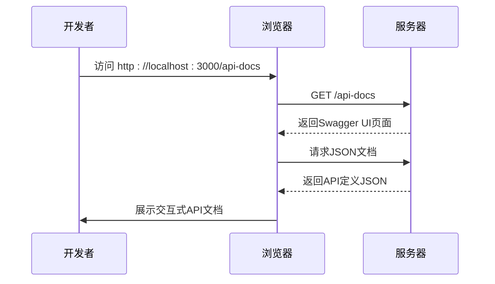
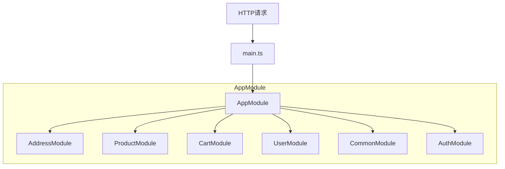
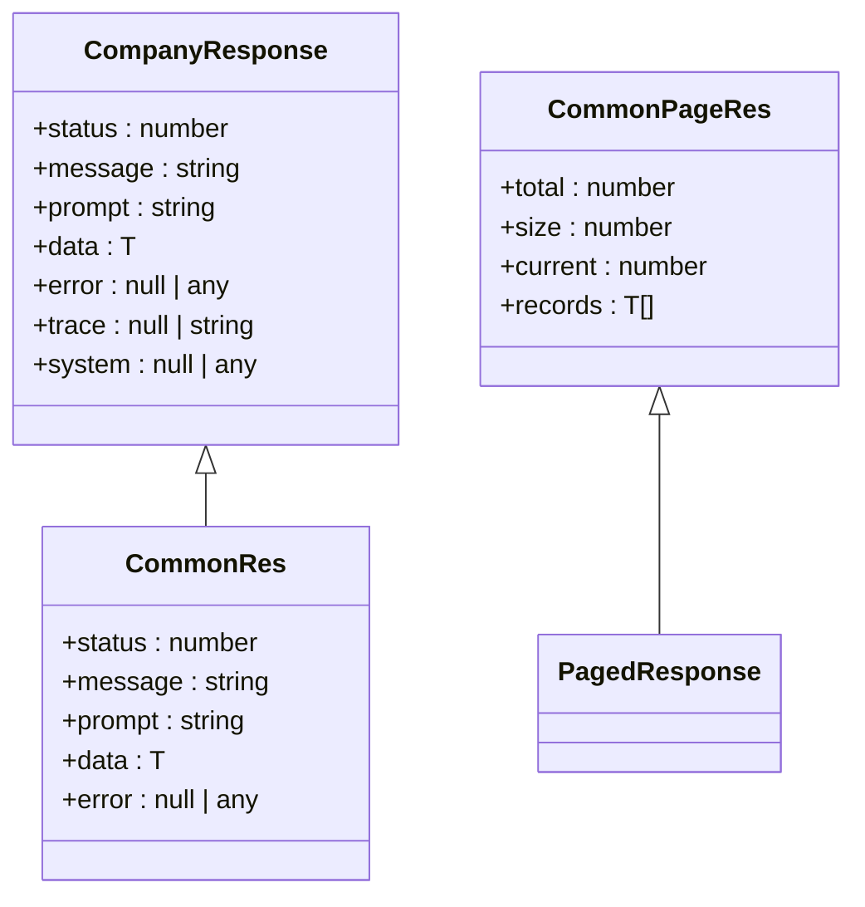
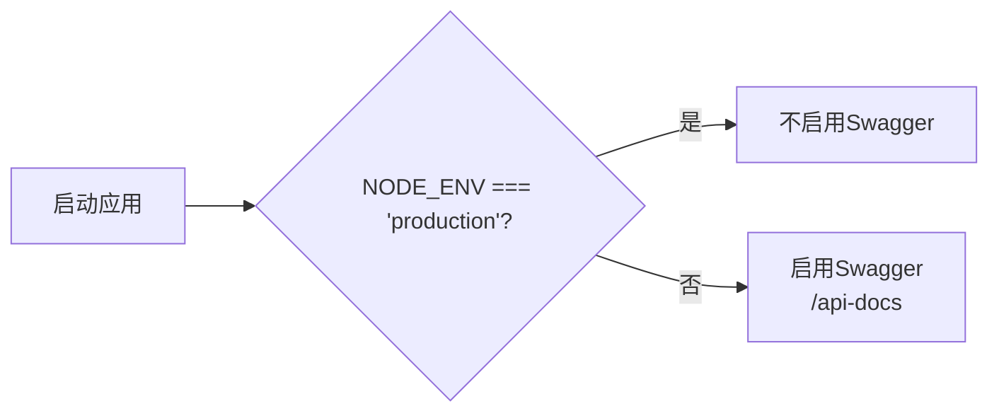

# API端点

<cite>
**本文档引用的文件**  
- [main.ts](file://apps/server-api/src/main.ts)
- [app.module.ts](file://apps/server-api/src/app.module.ts)
- [address.controller.ts](file://apps/server-api/src/modules/address/address.controller.ts)
- [product.controller.ts](file://apps/server-api/src/modules/product/product.controller.ts)
- [mall-headers.decorator.ts](file://apps/server-api/src/common/decorators/mall-headers.decorator.ts)
- [common-headers.decorator.ts](file://apps/server-api/src/common/decorators/common-headers.decorator.ts)
- [public.decorator.ts](file://apps/server-api/src/common/decorators/public.decorator.ts)
- [api-res-wrapper.decorator.ts](file://apps/server-api/src/common/decorators/api-res-wrapper.decorator.ts)
- [transform.interceptor.ts](file://apps/server-api/src/common/interceptors/transform.interceptor.ts)
- [http-exception.filter.ts](file://apps/server-api/src/common/filters/http-exception.filter.ts)
- [jwt-auth.guard.ts](file://apps/server-api/src/common/guards/jwt-auth.guard.ts)
- [create-product.dto.ts](file://apps/server-api/src/modules/product/dto/create-product.dto.ts)
</cite>

## 目录

1. [简介](#简介)
2. [全局路由前缀配置](#全局路由前缀配置)
3. [Swagger API文档配置](#swagger-api文档配置)
4. [模块化路由注册机制](#模块化路由注册机制)
5. [业务模块控制器与API端点](#业务模块控制器与api端点)
6. [API调用示例](#api调用示例)
7. [请求头与认证机制](#请求头与认证机制)
8. [响应结构与数据包装](#响应结构与数据包装)
9. [环境差异处理](#环境差异处理)
10. [错误处理与异常过滤](#错误处理与异常过滤)

## 简介

本文档详细描述了`server-api`服务中的RESTful API端点设计与实现。重点涵盖全局路由前缀、Swagger文档配置、模块化路由注册、各业务控制器的API接口定义、请求响应结构、认证机制及环境差异处理策略。系统基于NestJS框架构建，采用模块化设计，支持统一响应包装、JWT认证、请求限流和缓存等功能。

## 全局路由前缀配置

系统在`main.ts`中通过`setGlobalPrefix`方法设置了全局路由前缀`/v2-app-mall`，所有API端点均以此为根路径。该配置通过`exclude`选项排除了测试接口路径（如`test-api/(.*)`），确保测试接口不受全局前缀影响。

```mermaid
flowchart TD
A[HTTP请求] --> B{路径是否匹配<br/>/v2-app-mall?}
B --> |是| C[进入主路由处理]
B --> |否| D{是否为排除路径<br/>(如test-api/)?}
D --> |是| E[直接处理]
D --> |否| F[返回404]
```

**Diagram sources**
- [main.ts](file://apps/server-api/src/main.ts#L18-L22)

**Section sources**
- [main.ts](file://apps/server-api/src/main.ts#L18-L22)

## Swagger API文档配置

系统集成Swagger（OpenAPI）用于生成和展示API文档。文档配置在`main.ts`中完成，包含标题、描述、版本信息，并通过`addApiKey`定义了`jxe-token`作为认证头。文档仅在非生产环境（`NODE_ENV !== 'production'`）下启用，通过`/api-docs`路径访问。



**Diagram sources**
- [main.ts](file://apps/server-api/src/main.ts#L42-L65)

**Section sources**
- [main.ts](file://apps/server-api/src/main.ts#L42-L65)

## 模块化路由注册机制

系统采用NestJS的模块化架构，所有业务功能被组织为独立模块（如`AddressModule`、`ProductModule`等），并在`app.module.ts`中统一导入。每个模块包含自己的控制器、服务和实体，实现了高内聚低耦合的设计。



**Diagram sources**
- [app.module.ts](file://apps/server-api/src/app.module.ts#L47-L138)

**Section sources**
- [app.module.ts](file://apps/server-api/src/app.module.ts#L47-L138)

## 业务模块控制器与API端点

各业务模块通过控制器（Controller）暴露RESTful API端点。控制器使用`@Controller`装饰器定义路由前缀，并通过`@Get`、`@Post`等装饰器定义具体端点。

### 地址管理模块

`AddressController`提供地址相关API，如`/address/listStatusGroup`用于获取地址状态分组列表。该端点使用`@MallHeadersWithoutSiteId`装饰器声明所需请求头，并通过`@ApiResWrapper`自动包装响应数据。

**Section sources**
- [address.controller.ts](file://apps/server-api/src/modules/address/address.controller.ts#L10-L41)

### 商品管理模块

`ProductController`提供商品管理API，包括创建商品（`POST /products`）、查询商品列表（`GET /products`）和查询单个商品（`GET /products/:id`）。其中查询接口使用`@Public`和`@Cacheable`装饰器，支持无需认证的缓存访问。

**Section sources**
- [product.controller.ts](file://apps/server-api/src/modules/product/product.controller.ts#L7-L32)

## API调用示例

### 创建商品
- **HTTP方法**: POST
- **URL**: `/v2-app-mall/products`
- **请求头**: `jxe-token: your_token_here`
- **请求体**:
```json
{
  "title": "商品名称",
  "mainImage": "image_url",
  "sku": {
    "price": 99.9,
    "stock": 100
  }
}
```
- **响应**:
```json
{
  "status": 200,
  "message": "success",
  "prompt": "操作成功",
  "data": { "id": "1", "title": "商品名称" },
  "error": null,
  "trace": null,
  "system": null
}
```

### 获取商品列表
- **HTTP方法**: GET
- **URL**: `/v2-app-mall/products`
- **请求头**: 无（公开接口）
- **响应**: 返回缓存的商品列表数据

## 请求头与认证机制

系统定义了一组公共请求头，通过`MallHeaders`和`CommonHeaders`装饰器在Swagger文档和代码中统一管理。关键头信息包括：
- `jxe-token`: 用于用户身份认证的令牌
- `siteId`: 站点ID
- `merchantId`: 商家ID
- `timestamp`: 请求时间戳
- `sign`: 签名串

JWT认证通过`JwtAuthGuard`全局守卫实现，除标记为`@Public()`的接口外，所有请求均需提供有效的`jxe-token`。

```mermaid
flowchart TD
A[收到请求] --> B{是否包含jxe-token?}
B --> |否| C{是否为@Public接口?}
B --> |是| D[验证JWT令牌]
D --> E{验证成功?}
E --> |否| F[返回401]
E --> |是| G[继续处理]
C --> |是| G
C --> |否| F
```

**Diagram sources**
- [common-headers.decorator.ts](file://apps/server-api/src/common/decorators/common-headers.decorator.ts#L4-L46)
- [jwt-auth.guard.ts](file://apps/server-api/src/common/guards/jwt-auth.guard.ts#L1-L32)
- [public.decorator.ts](file://apps/server-api/src/common/decorators/public.decorator.ts#L1-L5)

**Section sources**
- [common-headers.decorator.ts](file://apps/server-api/src/common/decorators/common-headers.decorator.ts#L4-L46)
- [jwt-auth.guard.ts](file://apps/server-api/src/common/guards/jwt-auth.guard.ts#L1-L32)
- [public.decorator.ts](file://apps/server-api/src/common/decorators/public.decorator.ts#L1-L5)

## 响应结构与数据包装

系统使用`TransformInterceptor`全局拦截器统一包装成功响应，确保所有API返回一致的结构。响应包含状态码、消息、提示、数据、错误信息等字段。`ApiResWrapper`装饰器用于在Swagger中自动生成对应的响应模型。



**Diagram sources**
- [transform.interceptor.ts](file://apps/server-api/src/common/interceptors/transform.interceptor.ts#L9-L17)
- [api-res-wrapper.decorator.ts](file://apps/server-api/src/common/decorators/api-res-wrapper.decorator.ts#L1-L50)

**Section sources**
- [transform.interceptor.ts](file://apps/server-api/src/common/interceptors/transform.interceptor.ts#L9-L17)
- [api-res-wrapper.decorator.ts](file://apps/server-api/src/common/decorators/api-res-wrapper.decorator.ts#L1-L50)

## 环境差异处理

系统在不同环境下对API文档的暴露采取差异化策略。仅在开发和测试环境启用Swagger文档，生产环境自动关闭，避免敏感接口信息泄露。此逻辑通过`process.env.NODE_ENV`判断实现。



**Diagram sources**
- [main.ts](file://apps/server-api/src/main.ts#L60-L65)

**Section sources**
- [main.ts](file://apps/server-api/src/main.ts#L60-L65)

## 错误处理与异常过滤

系统通过`AllExceptionsFilter`全局异常过滤器统一处理所有未捕获的异常，返回标准化的错误响应。过滤器区分`HttpException`和未知异常，对前者返回对应的HTTP状态码和业务码，对后者记录错误日志并返回500错误。

**Section sources**
- [http-exception.filter.ts](file://apps/server-api/src/common/filters/http-exception.filter.ts#L1-L39)