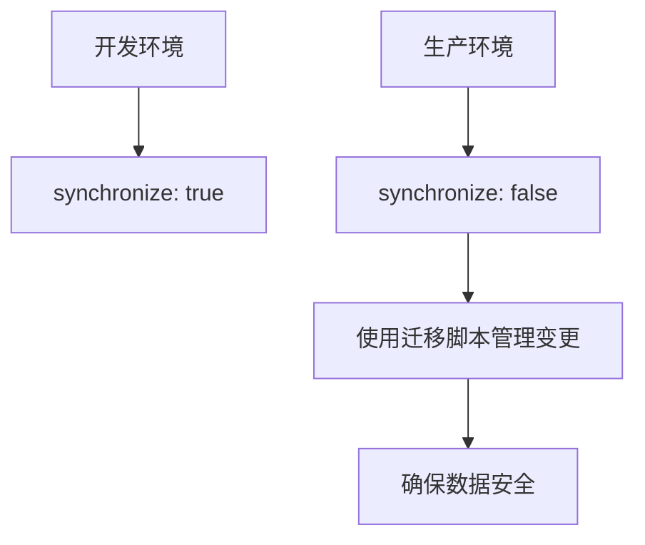
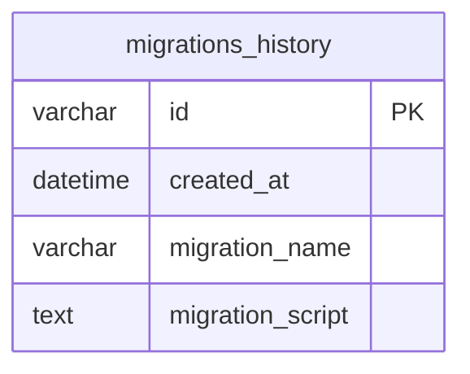
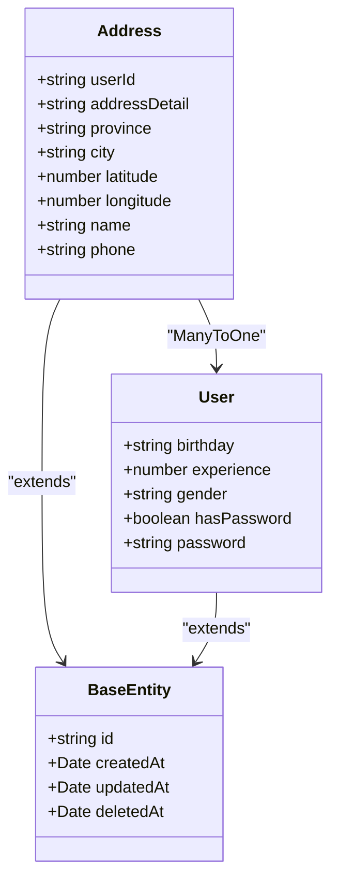
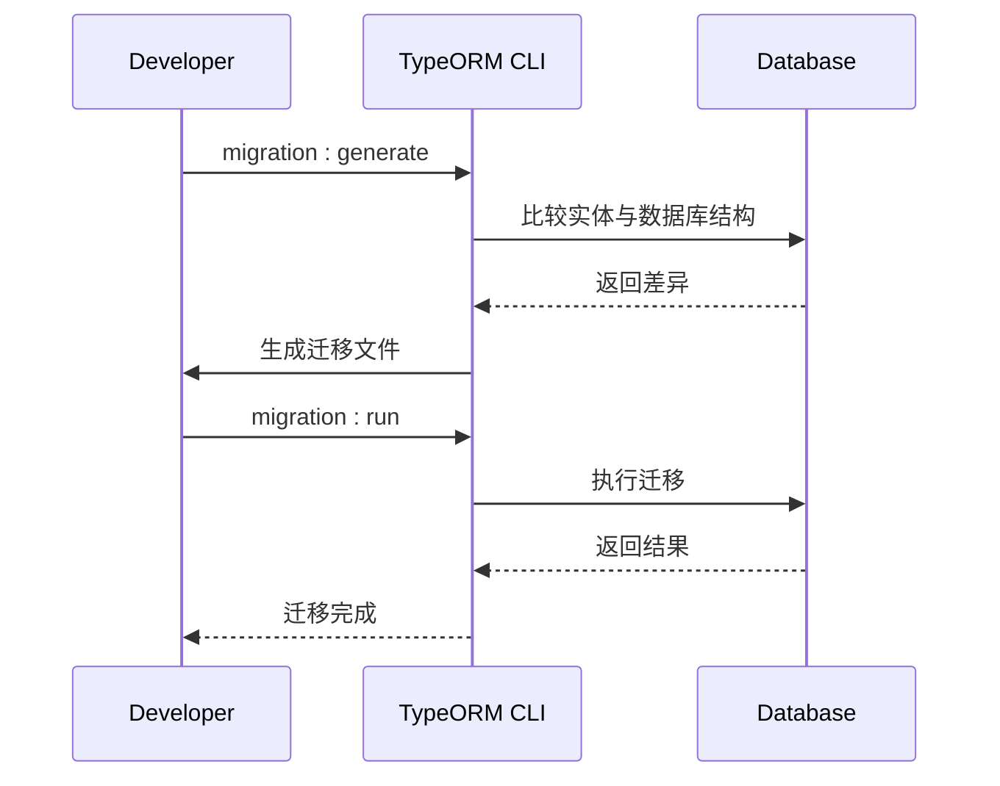

# ORM模型

<cite>
**本文档引用的文件**
- [app.module.ts](file://apps/server-api/src/app.module.ts)
- [typeorm.datasource.ts](file://apps/server-api/src/config/typeorm.datasource.ts)
- [address.entity.ts](file://apps/server-api/src/modules/address/entities/address.entity.ts)
- [product.entity.ts](file://apps/server-api/src/modules/product/entities/product.entity.ts)
- [base.entity.ts](file://apps/server-api/src/common/entities/base.entity.ts)
- [1764829236196-$npm_config_name.ts](file://apps/server-api/src/migrations/1764829236196-$npm_config_name.ts)
- [1764899330600-$npm_config_name.ts](file://apps/server-api/src/migrations/1764899330600-$npm_config_name.ts)
</cite>

## 目录
1. [数据库连接配置](#数据库连接配置)
2. [实体自动加载机制](#实体自动加载机制)
3. [生产环境安全配置](#生产环境安全配置)
4. [数据源配置最佳实践](#数据源配置最佳实践)
5. [实体关系与继承](#实体关系与继承)
6. [迁移管理](#迁移管理)

## 数据库连接配置

在 `app.module.ts` 文件中，通过 `TypeOrmModule.forRootAsync` 方法实现了异步数据库连接配置。该配置利用 `ConfigService` 从环境变量中注入数据库连接参数，确保了配置的安全性和灵活性。

数据库连接配置使用工厂函数模式，通过 `useFactory` 方法接收 `ConfigService` 实例，并从中获取以下环境变量：
- `DB_HOST`: 数据库主机地址
- `DB_PORT`: 数据库端口
- `DB_USERNAME`: 数据库用户名
- `DB_PASSWORD`: 数据库密码
- `DB_DATABASE`: 数据库名称

这种配置方式将敏感信息与代码分离，通过环境变量进行管理，提高了应用的安全性。

**Section sources**
- [app.module.ts](file://apps/server-api/src/app.module.ts#L84-L98)

## 实体自动加载机制

TypeORM 的 `autoLoadEntities: true` 配置项实现了实体的自动加载功能。当此选项启用时，NestJS 会自动扫描 `src/modules` 目录下各模块的实体文件（如 `address.entity.ts`、`product.entity.ts` 等），并将它们注册到 TypeORM 的实体管理器中。

这种机制消除了手动注册实体的需要，简化了模块配置。每个模块只需在自己的 `module.ts` 文件中通过 `TypeOrmModule.forFeature([Entity])` 注册其使用的实体，框架会自动处理其余的加载和关联工作。

例如，`address.module.ts` 文件中通过 `TypeOrmModule.forFeature([Address])` 注册了 `Address` 实体，而 `product.module.ts` 文件中则注册了多个产品相关的实体。

**Section sources**
- [app.module.ts](file://apps/server-api/src/app.module.ts#L94-L95)
- [address.module.ts](file://apps/server-api/src/modules/address/address.module.ts#L11)
- [product.module.ts](file://apps/server-api/src/modules/product/product.module.ts#L25-L42)

## 生产环境安全配置

`synchronize: false` 是生产环境中至关重要的安全配置。当此选项设置为 `false` 时，TypeORM 不会自动根据实体定义修改数据库表结构。

在开发环境中，`synchronize: true` 可以方便地自动同步实体变更到数据库，但在生产环境中这可能导致意外的数据丢失或结构破坏。因此，生产环境必须将此选项设置为 `false`，并通过数据库迁移（Migrations）来安全地管理数据库结构变更。

**Diagram sources**
- [app.module.ts](file://apps/server-api/src/app.module.ts#L96-L97)
- [typeorm.datasource.ts](file://apps/server-api/src/config/typeorm.datasource.ts#L16)

## 数据源配置最佳实践

`typeorm.datasource.ts` 文件提供了数据源配置的最佳实践，包括实体扫描路径、迁移配置和连接池设置。

实体扫描路径使用通配符模式 `../modules/**/entities/*.entity.{ts,js}`，确保所有模块下的实体文件都能被正确加载。迁移文件存放路径配置为 `../migrations/*.{ts,js}`，并在数据库中创建 `migrations_history` 表来记录迁移历史。

**Diagram sources**
- [typeorm.datasource.ts](file://apps/server-api/src/config/typeorm.datasource.ts#L19-L22)

## 实体关系与继承

项目中的实体采用了继承和关系映射的最佳实践。所有实体都继承自 `BaseEntity` 基类，该基类定义了通用的 `id`、`createdAt`、`updatedAt` 和 `deletedAt` 字段，实现了软删除功能。

实体之间的关系通过 TypeORM 的装饰器进行定义，如 `@ManyToOne`、`@OneToMany` 等。例如，`Address` 实体与 `User` 实体之间建立了多对一关系，通过 `@JoinColumn` 指定外键。

**Diagram sources**
- [base.entity.ts](file://apps/server-api/src/common/entities/base.entity.ts#L3-L15)
- [address.entity.ts](file://apps/server-api/src/modules/address/entities/address.entity.ts#L8-L79)
- [user.entity.ts](file://apps/server-api/src/modules/user/entities/user.entity.ts#L38-L68)

## 迁移管理

项目使用 TypeORM 的迁移功能来管理数据库结构变更。迁移文件存放在 `src/migrations` 目录下，通过 `migration:generate` 和 `migration:run` 等脚本进行管理。

迁移脚本包含了 `up` 和 `down` 两个方法，分别用于应用和回滚数据库变更。例如，`1764829236196-$npm_config_name.ts` 迁移文件创建了多个表，而 `1764899330600-$npm_config_name.ts` 文件则修改了现有表结构。

**Diagram sources**
- [1764829236196-$npm_config_name.ts](file://apps/server-api/src/migrations/1764829236196-$npm_config_name.ts#L6-L148)
- [1764899330600-$npm_config_name.ts](file://apps/server-api/src/migrations/1764899330600-$npm_config_name.ts#L6-L12)
- [package.json](file://apps/server-api/package.json#L22-L25)