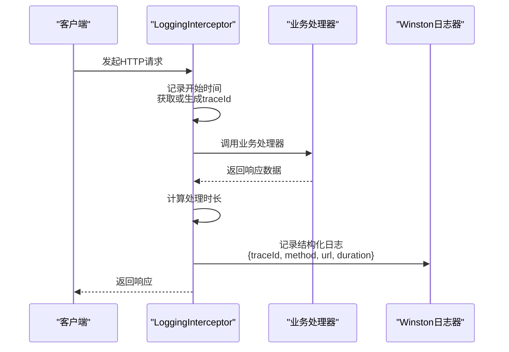
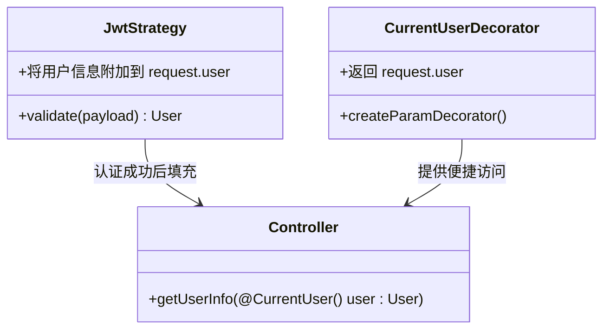
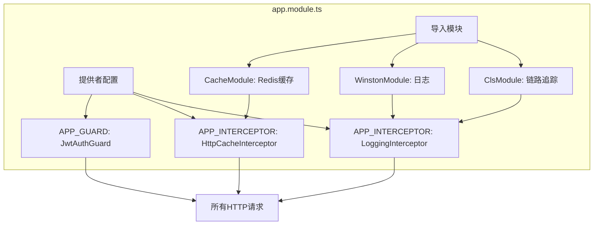

# 公共组件

<cite>
**本文档中引用的文件**   
- [transform.interceptor.ts](file://apps/server-api/src/common/interceptors/transform.interceptor.ts)
- [logging.interceptor.ts](file://apps/server-api/src/common/interceptors/logging.interceptor.ts)
- [cache.interceptor.ts](file://apps/server-api/src/common/interceptors/cache.interceptor.ts)
- [http-exception.filter.ts](file://apps/server-api/src/common/filters/http-exception.filter.ts)
- [user.decorator.ts](file://apps/server-api/src/common/decorators/user.decorator.ts)
- [cacheable.decorator.ts](file://apps/server-api/src/common/decorators/cacheable.decorator.ts)
- [app.module.ts](file://apps/server-api/src/app.module.ts)
- [common-res.dto.ts](file://apps/server-api/src/common/dto/common-res.dto.ts)
- [common-page.dto.ts](file://apps/server-api/src/common/dto/common-page.dto.ts)
- [response.interface.ts](file://apps/server-api/src/common/interfaces/response.interface.ts)
- [api-res-wrapper.decorator.ts](file://apps/server-api/src/common/decorators/api-res-wrapper.decorator.ts)
</cite>

## 目录

1. [简介](#简介)
2. [核心拦截器](#核心拦截器)
   - [TransformInterceptor：统一响应包装](#transforminterceptor统一响应包装)
   - [LoggingInterceptor：请求日志记录](#logginginterceptor请求日志记录)
   - [HttpCacheInterceptor：基于Redis的响应缓存](#httpcacheinterceptor基于redis的响应缓存)
3. [异常处理](#异常处理)
   - [AllExceptionsFilter：全局异常捕获与格式化](#allexceptionsfilter全局异常捕获与格式化)
4. [常用装饰器](#常用装饰器)
   - [@CurrentUser：请求上下文信息提取](#currentuser请求上下文信息提取)
   - [@Cacheable：缓存配置装饰器](#cacheable缓存配置装饰器)
5. [全局配置与集成](#全局配置与集成)
   - [app.module.ts中的全局提供者配置](#appmodulets中的全局提供者配置)

## 简介

本项目在 `src/common` 目录下提供了一套完整的公共基础设施组件，用于构建稳定、可维护的后端服务。这些组件通过NestJS的拦截器（Interceptor）、过滤器（Filter）、装饰器（Decorator）和模块（Module）机制，实现了响应统一包装、日志记录、缓存、异常处理和上下文管理等核心功能。本文档详细说明这些组件的设计与实现，并阐述它们如何通过 `app.module.ts` 的全局配置被应用到整个系统。

## 核心拦截器

### TransformInterceptor：统一响应包装

`TransformInterceptor` 是一个NestJS拦截器，负责统一包装所有成功的HTTP响应，确保返回给客户端的数据结构一致。该拦截器实现了 `NestInterceptor` 接口，并通过 `map` 操作符对响应数据进行转换。

拦截器首先检查控制器返回的数据是否已经包含 `status` 和 `data` 字段，如果是，则认为是手动组装的响应，直接返回。否则，它会将原始数据包装在一个标准化的响应结构中，包含状态码（200表示成功）、消息、提示、数据体、错误信息（为null）、链路ID（trace）和系统扩展信息。

这种设计保证了所有API接口返回的JSON格式统一，便于前端解析和处理，同时也为后续的监控和日志分析提供了便利。

**Section sources**
- [transform.interceptor.ts](file://apps/server-api/src/common/interceptors/transform.interceptor.ts#L1-L43)
- [common-res.dto.ts](file://apps/server-api/src/common/dto/common-res.dto.ts#L1-L49)

### LoggingInterceptor：请求日志记录

`LoggingInterceptor` 用于记录每个HTTP请求的详细信息，包括请求方法、URL、处理时长和分布式链路ID（traceId）。该拦截器利用 `nestjs-cls` 模块实现上下文存储（CLS），确保在异步操作中也能追踪到请求的上下文。

在请求开始时，拦截器会记录开始时间，并尝试从CLS服务中获取或生成一个唯一的 `traceId`。如果CLS服务不可用，则回退到从请求头 `x-trace-id` 或请求对象中获取。在请求处理完成后，通过 `tap` 操作符记录日志，输出包含 `traceId`、`method`、`url` 和 `duration` 的结构化日志。

该拦截器与 `WinstonModule` 集成，使用Winston作为日志记录器，确保日志以JSON格式输出，便于ELK等日志系统采集和分析。



**Diagram sources**
- [logging.interceptor.ts](file://apps/server-api/src/common/interceptors/logging.interceptor.ts#L1-L51)
- [app.module.ts](file://apps/server-api/src/app.module.ts#L59-L70)

**Section sources**
- [logging.interceptor.ts](file://apps/server-api/src/common/interceptors/logging.interceptor.ts#L1-L51)
- [app.module.ts](file://apps/server-api/src/app.module.ts#L59-L70)

### HttpCacheInterceptor：基于Redis的响应缓存

`HttpCacheInterceptor` 实现了基于Redis的HTTP响应缓存功能，旨在减少对数据库的重复查询，提高系统性能。该拦截器通过 `@Cacheable` 装饰器配置缓存策略，包括缓存时间（TTL）和自定义键前缀。

拦截器的工作流程如下：
1. 通过 `Reflector` 获取当前处理器的 `@Cacheable` 装饰器配置。
2. 如果未配置缓存，则直接放行，不进行任何缓存操作。
3. 根据配置生成缓存键，格式为 `前缀:请求URL`。
4. 尝试从Redis缓存中获取数据，如果命中则直接返回缓存结果，跳过控制器逻辑。
5. 如果未命中，则执行控制器逻辑，并在响应后通过 `tap` 操作符将结果存入Redis，设置相应的过期时间。

此机制有效减少了后端服务的负载，特别适用于读多写少的场景，如商品列表、广告信息等接口。

```mermaid
flowchart TD
A[请求进入] --> B{是否有@Cacheable装饰器?}
B --> |否| C[直接调用处理器]
B --> |是| D[生成缓存键<br/>前缀:URL]
D --> E{Redis中存在缓存?}
E --> |是| F[返回缓存数据]
E --> |否| G[调用处理器获取数据]
G --> H[将数据存入Redis<br/>设置TTL]
H --> I[返回新数据]
F --> J[响应客户端]
C --> J
I --> J
```

**Diagram sources**
- [cache.interceptor.ts](file://apps/server-api/src/common/interceptors/cache.interceptor.ts#L1-L46)
- [cacheable.decorator.ts](file://apps/server-api/src/common/decorators/cacheable.decorator.ts#L1-L17)

**Section sources**
- [cache.interceptor.ts](file://apps/server-api/src/common/interceptors/cache.interceptor.ts#L1-L46)
- [cacheable.decorator.ts](file://apps/server-api/src/common/decorators/cacheable.decorator.ts#L1-L17)

## 异常处理

### AllExceptionsFilter：全局异常捕获与格式化

`AllExceptionsFilter` 是一个全局异常过滤器，使用 `@Catch()` 装饰器捕获所有类型的异常，包括预知的 `HttpException` 和未知的系统错误。其主要职责是将异常转换为统一的错误响应结构，确保客户端收到的错误信息格式一致。

对于 `HttpException`，过滤器会提取其HTTP状态码和响应消息，并将其映射为业务状态码和用户提示。对于非HTTP异常（如数据库错误、运行时错误），过滤器会记录详细的错误堆栈以便排查，同时返回一个通用的“内部服务器错误”消息。

最终，过滤器通过 `response.status().json()` 方法发送一个包含 `code`、`data`（为null）和 `msg` 的JSON响应，与成功响应的结构保持一致，简化了前端的错误处理逻辑。

**Section sources**
- [http-exception.filter.ts](file://apps/server-api/src/common/filters/http-exception.filter.ts#L1-L39)
- [response.interface.ts](file://apps/server-api/src/common/interfaces/response.interface.ts#L1-L14)

## 常用装饰器

### @CurrentUser：请求上下文信息提取

`@CurrentUser` 是一个自定义参数装饰器，用于从请求上下文中提取当前登录用户的信息。在JWT认证流程中，`JwtStrategy` 的 `validate` 方法会将用户信息（如 `userId`、`openid`）附加到 `request.user` 对象上。

`@CurrentUser` 装饰器通过 `createParamDecorator` 创建，它直接从 `request.user` 中获取并返回该对象。在控制器方法中，开发者可以使用 `@CurrentUser()` 参数来便捷地访问当前用户的身份信息，而无需手动从请求对象中提取。



**Diagram sources**
- [user.decorator.ts](file://apps/server-api/src/common/decorators/user.decorator.ts#L1-L8)
- [app.module.ts](file://apps/server-api/src/app.module.ts#L10-L11)

**Section sources**
- [user.decorator.ts](file://apps/server-api/src/common/decorators/user.decorator.ts#L1-L8)

### @Cacheable：缓存配置装饰器

`@Cacheable` 是一个元数据装饰器，用于声明某个控制器方法的响应需要被缓存。它接受两个参数：`ttl`（缓存时间，单位为秒）和可选的 `keyPrefix`（自定义缓存键前缀）。

该装饰器内部使用NestJS的 `SetMetadata` 函数，将 `ttl` 和 `keyPrefix` 作为元数据存储在方法的描述符上。`HttpCacheInterceptor` 在执行时，会通过 `Reflector` 读取这些元数据，从而决定是否应用缓存以及如何生成缓存键。

例如，在 `ProductController` 的 `findAll` 方法上使用 `@Cacheable(60, 'product_list')`，表示该接口的响应将被缓存60秒，缓存键以 `product_list` 为前缀。

**Section sources**
- [cacheable.decorator.ts](file://apps/server-api/src/common/decorators/cacheable.decorator.ts#L1-L17)

## 全局配置与集成

### app.module.ts中的全局提供者配置

所有公共基础设施组件通过 `app.module.ts` 文件中的全局提供者（providers）配置被应用到整个应用程序。这种集中式配置确保了组件的一致性和可维护性。

- **拦截器注册**：`LoggingInterceptor` 和 `HttpCacheInterceptor` 通过 `APP_INTERCEPTOR` 令牌注册为全局拦截器。这意味着它们会自动应用于所有控制器和路由，无需在每个模块中单独配置。
- **过滤器注册**：虽然 `AllExceptionsFilter` 未在 `app.module.ts` 中显示注册，但通常它也会通过 `APP_FILTER` 令牌进行全局注册，以确保所有异常都能被捕获。
- **模块集成**：`ClsModule` 和 `WinstonModule` 在 `imports` 数组中被引入。`ClsModule.forRoot()` 配置了CLS服务，启用自动生成ID和中间件挂载；`WinstonModule.forRoot()` 配置了Winston日志器，使用JSON格式输出到控制台。
- **缓存配置**：`CacheModule.register()` 配置了全局的Redis缓存，指定了Redis服务器的主机、端口和默认TTL，使得 `HttpCacheInterceptor` 能够无缝地与Redis进行交互。

这种全局配置模式是NestJS应用的标准实践，它极大地简化了基础设施的集成，使开发者能够专注于业务逻辑的实现。



**Diagram sources**
- [app.module.ts](file://apps/server-api/src/app.module.ts#L47-L161)

**Section sources**
- [app.module.ts](file://apps/server-api/src/app.module.ts#L47-L161)