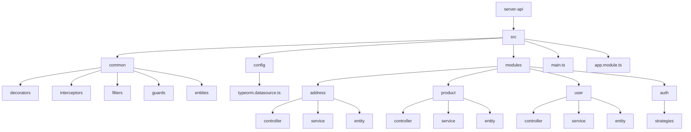
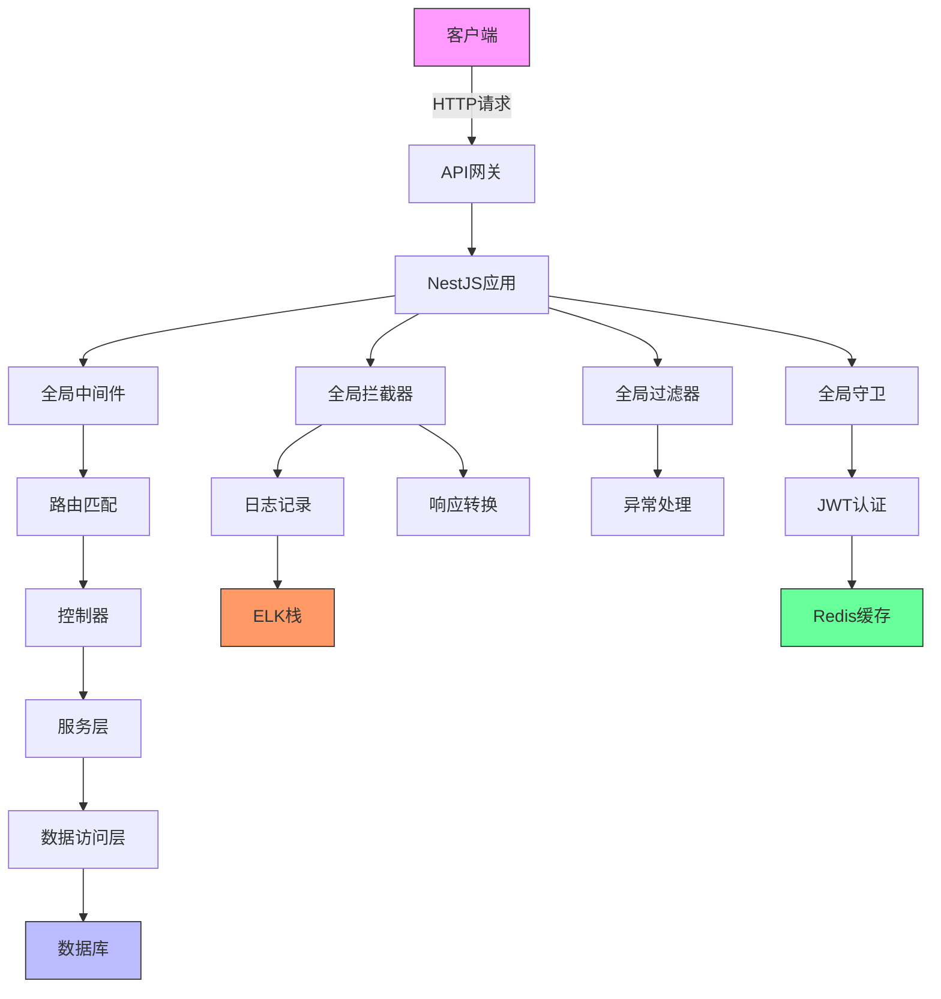
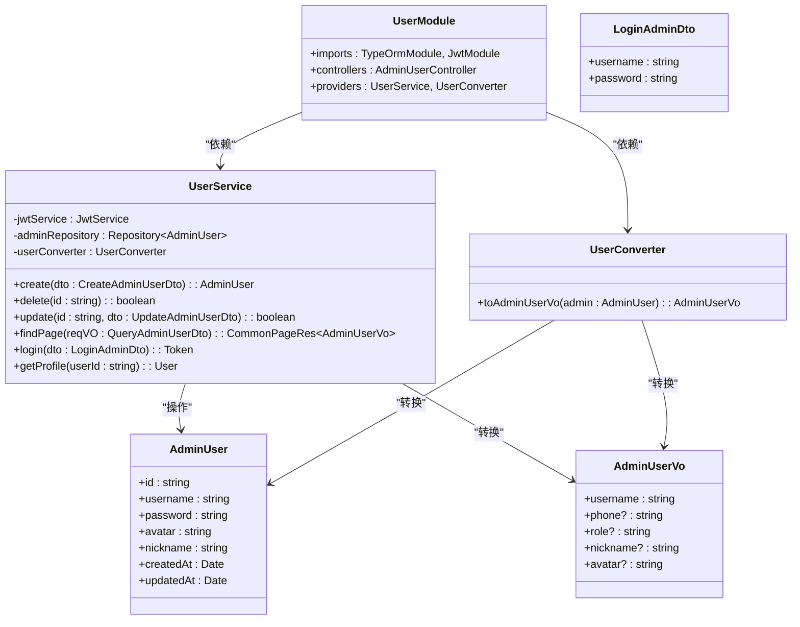
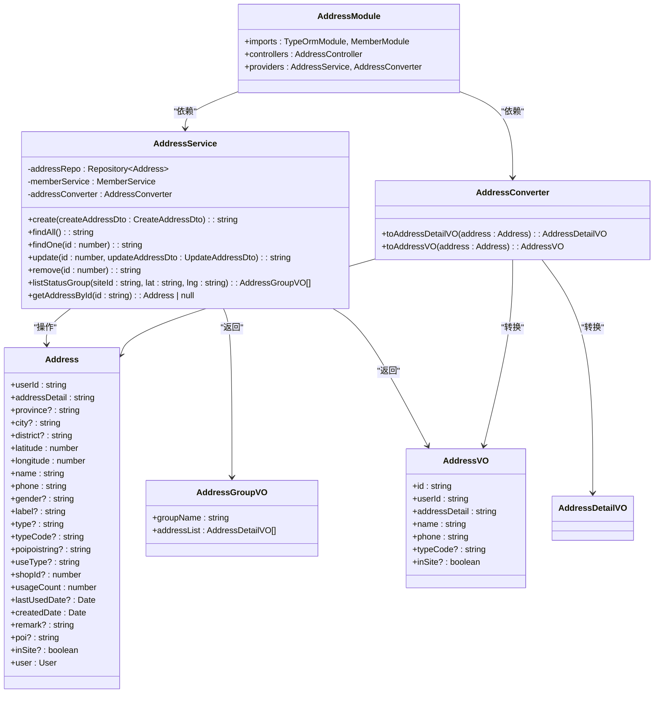
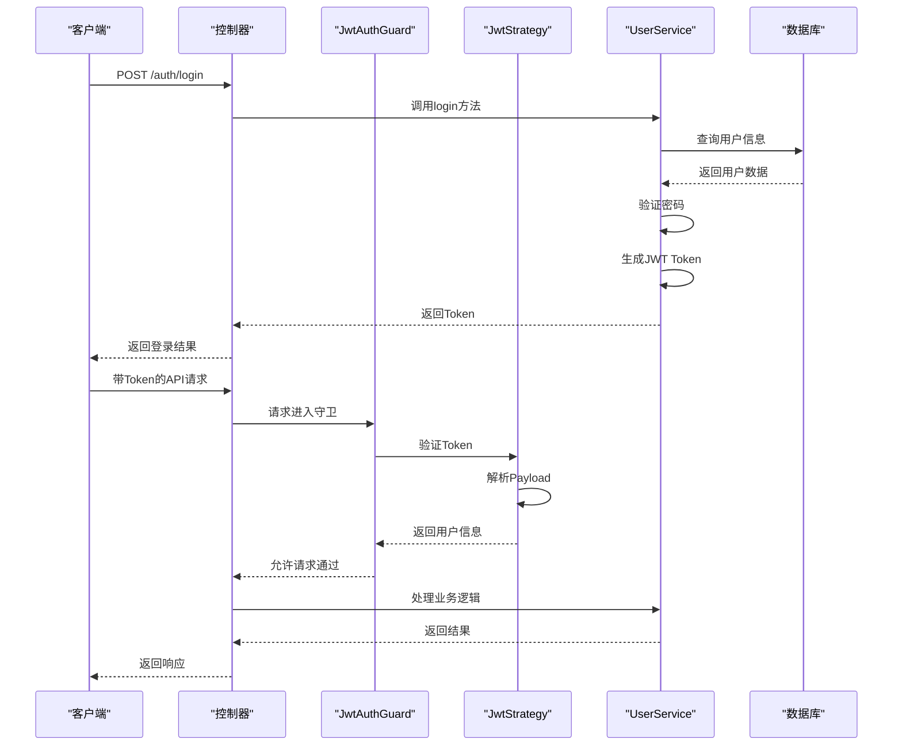
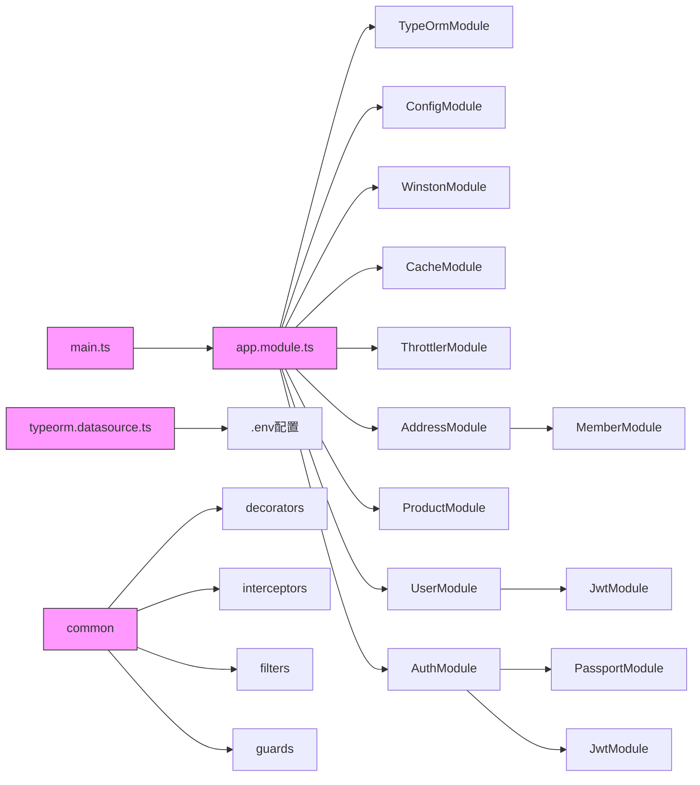

# 后端架构

<cite>
**本文档引用的文件**   
- [main.ts](file://apps/server-api/src/main.ts)
- [app.module.ts](file://apps/server-api/src/app.module.ts)
- [typeorm.datasource.ts](file://apps/server-api/src/config/typeorm.datasource.ts)
- [user.decorator.ts](file://apps/server-api/src/common/decorators/user.decorator.ts)
- [jwt-auth.guard.ts](file://apps/server-api/src/common/guards/jwt-auth.guard.ts)
- [logging.interceptor.ts](file://apps/server-api/src/common/interceptors/logging.interceptor.ts)
- [user.module.ts](file://apps/server-api/src/modules/user/user.module.ts)
- [user.service.ts](file://apps/server-api/src/modules/user/user.service.ts)
- [user.entity.ts](file://apps/server-api/src/modules/user/entities/user.entity.ts)
- [address.module.ts](file://apps/server-api/src/modules/address/address.module.ts)
- [address.service.ts](file://apps/server-api/src/modules/address/address.service.ts)
- [address.entity.ts](file://apps/server-api/src/modules/address/entities/address.entity.ts)
- [login.dto.ts](file://apps/server-api/src/modules/user/dto/login.dto.ts)
- [admin-user.vo.ts](file://apps/server-api/src/modules/user/vo/admin-user.vo.ts)
- [common-res.dto.ts](file://apps/server-api/src/common/dto/common-res.dto.ts)
- [base.entity.ts](file://apps/server-api/src/common/entities/base.entity.ts)
- [auth.module.ts](file://apps/server-api/src/modules/auth/auth.module.ts)
- [jwt.strategy.ts](file://apps/server-api/src/modules/auth/strategies/jwt.strategy.ts)
</cite>

## 目录
1. [简介](#简介)
2. [项目结构](#项目结构)
3. [核心组件](#核心组件)
4. [架构概述](#架构概述)
5. [详细组件分析](#详细组件分析)
6. [依赖分析](#依赖分析)
7. [性能考虑](#性能考虑)
8. [故障排除指南](#故障排除指南)
9. [结论](#结论)

## 简介
本文档详细描述了基于NestJS框架的server-api后端服务架构。该服务采用模块化架构和领域驱动设计（DDD）原则，实现了清晰的关注点分离。系统以main.ts作为应用入口，通过app.module.ts组织模块，并使用typeorm.datasource.ts配置数据库连接。业务逻辑分布在src/modules/下的多个模块中，每个模块遵循MVC模式，包含控制器（Controller）、服务（Service）和实体（Entity）。公共功能如装饰器、拦截器和过滤器位于src/common/目录中。系统实现了RESTful API设计和JWT认证流程，确保了安全性和可扩展性。

## 项目结构

**图表来源**
- [main.ts](file://apps/server-api/src/main.ts#L1-L73)
- [app.module.ts](file://apps/server-api/src/app.module.ts#L1-L162)

**章节来源**
- [main.ts](file://apps/server-api/src/main.ts#L1-L73)
- [app.module.ts](file://apps/server-api/src/app.module.ts#L1-L162)

## 核心组件

本系统的核心组件包括应用入口、模块组织、数据库配置和业务模块。main.ts文件负责应用的引导和全局配置，app.module.ts定义了模块间的依赖关系，typeorm.datasource.ts配置了TypeORM数据源。业务模块如address、product和user等遵循MVC模式，实现了清晰的分层架构。公共模块提供了跨领域的功能，如日志记录、异常处理和认证授权。

**章节来源**
- [main.ts](file://apps/server-api/src/main.ts#L1-L73)
- [app.module.ts](file://apps/server-api/src/app.module.ts#L1-L162)
- [typeorm.datasource.ts](file://apps/server-api/src/config/typeorm.datasource.ts#L1-L24)

## 架构概述

**图表来源**
- [main.ts](file://apps/server-api/src/main.ts#L1-L73)
- [app.module.ts](file://apps/server-api/src/app.module.ts#L1-L162)
- [logging.interceptor.ts](file://apps/server-api/src/common/interceptors/logging.interceptor.ts#L1-L51)
- [jwt-auth.guard.ts](file://apps/server-api/src/common/guards/jwt-auth.guard.ts#L1-L32)

## 详细组件分析

### 用户模块分析

#### 类图

**图表来源**
- [user.module.ts](file://apps/server-api/src/modules/user/user.module.ts#L1-L22)
- [user.service.ts](file://apps/server-api/src/modules/user/user.service.ts#L1-L144)
- [user.entity.ts](file://apps/server-api/src/modules/user/entities/user.entity.ts#L1-L112)
- [admin-user.vo.ts](file://apps/server-api/src/modules/user/vo/admin-user.vo.ts#L1-L22)
- [login.dto.ts](file://apps/server-api/src/modules/user/dto/login.dto.ts#L1-L18)

**章节来源**
- [user.module.ts](file://apps/server-api/src/modules/user/user.module.ts#L1-L22)
- [user.service.ts](file://apps/server-api/src/modules/user/user.service.ts#L1-L144)

### 地址模块分析

#### 类图

**图表来源**
- [address.module.ts](file://apps/server-api/src/modules/address/address.module.ts#L1-L17)
- [address.service.ts](file://apps/server-api/src/modules/address/address.service.ts#L1-L146)
- [address.entity.ts](file://apps/server-api/src/modules/address/entities/address.entity.ts#L1-L80)

**章节来源**
- [address.module.ts](file://apps/server-api/src/modules/address/address.module.ts#L1-L17)
- [address.service.ts](file://apps/server-api/src/modules/address/address.service.ts#L1-L146)

### 认证授权流程

#### 序列图

**图表来源**
- [auth.module.ts](file://apps/server-api/src/modules/auth/auth.module.ts#L1-L28)
- [jwt.strategy.ts](file://apps/server-api/src/modules/auth/strategies/jwt.strategy.ts#L1-L28)
- [jwt-auth.guard.ts](file://apps/server-api/src/common/guards/jwt-auth.guard.ts#L1-L32)
- [user.service.ts](file://apps/server-api/src/modules/user/user.service.ts#L1-L144)

**章节来源**
- [auth.module.ts](file://apps/server-api/src/modules/auth/auth.module.ts#L1-L28)
- [jwt.strategy.ts](file://apps/server-api/src/modules/auth/strategies/jwt.strategy.ts#L1-L28)

## 依赖分析

**图表来源**
- [main.ts](file://apps/server-api/src/main.ts#L1-L73)
- [app.module.ts](file://apps/server-api/src/app.module.ts#L1-L162)
- [typeorm.datasource.ts](file://apps/server-api/src/config/typeorm.datasource.ts#L1-L24)

**章节来源**
- [main.ts](file://apps/server-api/src/main.ts#L1-L73)
- [app.module.ts](file://apps/server-api/src/app.module.ts#L1-L162)
- [typeorm.datasource.ts](file://apps/server-api/src/config/typeorm.datasource.ts#L1-L24)

## 性能考虑

系统在设计时考虑了多项性能优化措施。首先，通过全局缓存拦截器和Redis集成实现了数据缓存，减少了数据库查询压力。其次，使用Winston日志库将日志输出为JSON格式，便于ELK栈进行高效采集和分析。此外，通过全局验证管道实现了请求参数的自动验证和转换，提高了处理效率。限流守卫（ThrottlerGuard）防止了API被过度调用，保护了系统稳定性。数据库连接通过TypeORM的连接池管理，优化了数据库访问性能。

## 故障排除指南

当系统出现异常时，可按照以下步骤进行排查：首先检查日志输出，系统使用Winston记录了详细的请求日志，包括traceId、请求方法、URL和处理时长，便于定位问题。其次，检查JWT认证是否正常，确保请求头中包含正确的jxe-token。对于数据库相关问题，检查数据库连接配置和实体定义是否正确。对于业务逻辑问题，检查服务层的实现和DTO/VO的转换逻辑。最后，利用Swagger文档进行API测试，验证接口的请求和响应格式。

**章节来源**
- [logging.interceptor.ts](file://apps/server-api/src/common/interceptors/logging.interceptor.ts#L1-L51)
- [jwt-auth.guard.ts](file://apps/server-api/src/common/guards/jwt-auth.guard.ts#L1-L32)
- [http-exception.filter.ts](file://apps/server-api/src/common/filters/http-exception.filter.ts)
- [common-res.dto.ts](file://apps/server-api/src/common/dto/common-res.dto.ts#L1-L49)

## 结论

server-api后端服务采用NestJS框架构建，实现了模块化、可扩展的架构设计。通过领域驱动设计原则，将业务逻辑划分为多个独立的模块，每个模块遵循MVC模式，实现了关注点分离。系统集成了TypeORM进行数据库操作，使用JWT实现安全的认证授权，通过Winston和ELK实现结构化日志记录。公共模块提供了跨领域的功能，如日志记录、异常处理和请求验证，提高了代码复用性。整体架构清晰，易于维护和扩展，为电商平台提供了稳定可靠的后端支持。