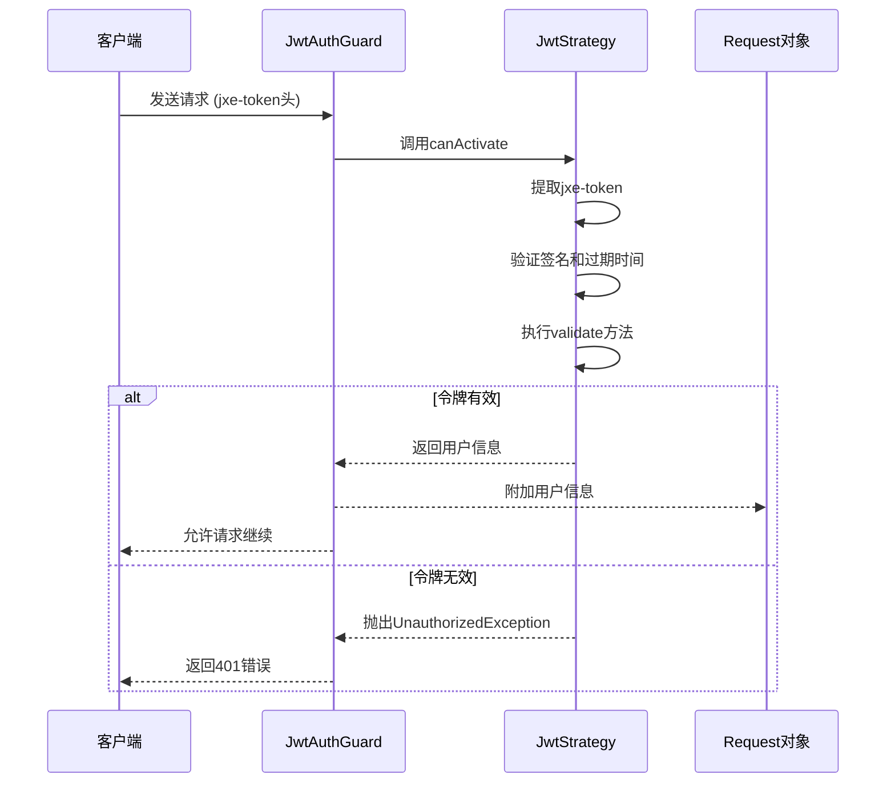
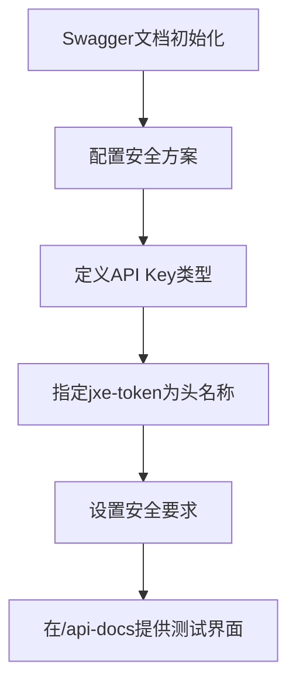
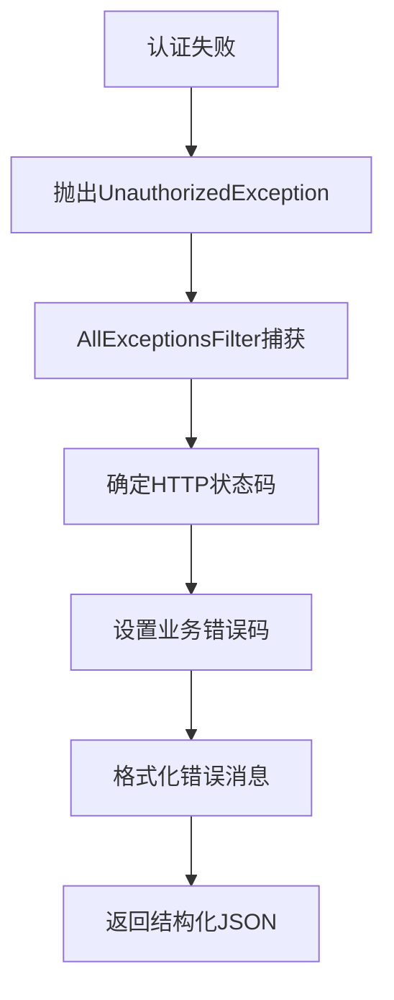
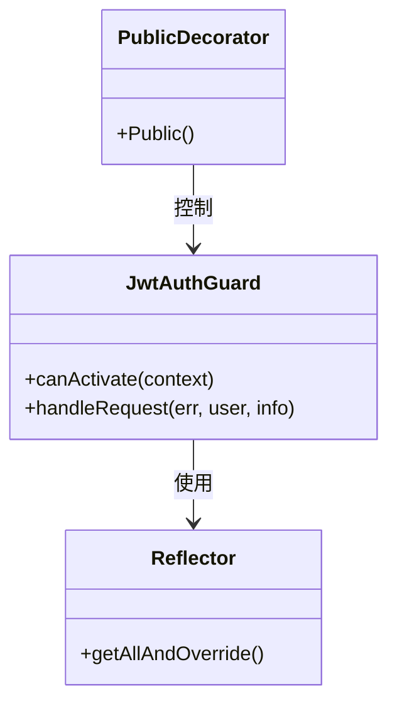

# 认证流程

<cite>
**本文档引用的文件**   
- [app.module.ts](file://apps/server-api/src/app.module.ts)
- [main.ts](file://apps/server-api/src/main.ts)
- [jwt-auth.guard.ts](file://apps/server-api/src/common/guards/jwt-auth.guard.ts)
- [transform.interceptor.ts](file://apps/server-api/src/common/interceptors/transform.interceptor.ts)
- [http-exception.filter.ts](file://apps/server-api/src/common/filters/http-exception.filter.ts)
- [jwt.strategy.ts](file://apps/server-api/src/modules/auth/strategies/jwt.strategy.ts)
- [auth.module.ts](file://apps/server-api/src/modules/auth/auth.module.ts)
- [public.decorator.ts](file://apps/server-api/src/common/decorators/public.decorator.ts)
- [response.interface.ts](file://apps/server-api/src/common/interfaces/response.interface.ts)
- [token.controller.ts](file://apps/server-api/src/modules/token/token.controller.ts)
</cite>

## 目录
1. [全局认证守卫注册](#全局认证守卫注册)
2. [JWT认证流程](#jwt认证流程)
3. [Swagger API文档认证机制](#swagger-api文档认证机制)
4. [认证失败的统一响应处理](#认证失败的统一响应处理)
5. [令牌刷新与过期处理](#令牌刷新与过期处理)
6. [权限分级与公共接口](#权限分级与公共接口)

## 全局认证守卫注册

在NestJS应用的根模块`app.module.ts`中，通过`APP_GUARD`提供者注册了全局的`JwtAuthGuard`认证守卫。该守卫被应用于所有受保护的路由，确保每个请求在进入控制器之前都经过JWT令牌验证。

**Section sources**
- [app.module.ts](file://apps/server-api/src/app.module.ts#L146-L148)

## JWT认证流程

`JwtAuthGuard`继承自NestJS Passport模块的`AuthGuard('jwt')`，其核心验证逻辑由`jwt.strategy.ts`中的`JwtStrategy`实现。认证流程如下：
1. 从请求头中提取名为`jxe-token`的JWT令牌
2. 使用配置的密钥（JWT_SECRET）验证令牌签名
3. 检查令牌是否过期（ignoreExpiration: false）
4. 调用`validate`方法验证载荷有效性
5. 将解析出的用户信息附加到请求对象上

**Diagram sources**
- [jwt-auth.guard.ts](file://apps/server-api/src/common/guards/jwt-auth.guard.ts#L6)
- [jwt.strategy.ts](file://apps/server-api/src/modules/auth/strategies/jwt.strategy.ts#L10-L27)

## Swagger API文档认证机制

在`main.ts`文件中，通过Swagger模块配置了API密钥安全方案，定义了名为`jxe-token-auth`的安全机制。该机制要求在请求头中包含`jxe-token`字段，便于在API文档界面进行认证测试。

**Diagram sources**
- [main.ts](file://apps/server-api/src/main.ts#L42-L57)

## 认证失败的统一响应处理

当认证失败时，系统通过全局异常过滤器和响应拦截器实现结构化错误返回：
- `AllExceptionsFilter`捕获所有异常，包括认证异常
- 统一返回包含`code`、`data`和`msg`字段的JSON响应
- 错误信息根据异常类型进行适当处理和格式化

**Diagram sources**
- [http-exception.filter.ts](file://apps/server-api/src/common/filters/http-exception.filter.ts#L6)
- [transform.interceptor.ts](file://apps/server-api/src/common/interceptors/transform.interceptor.ts#L19)

## 令牌刷新与过期处理

系统通过以下机制处理令牌刷新和过期：
- 令牌有效期由`JWT_EXPIRES_IN`环境变量配置，默认为7天
- `JwtStrategy`中`ignoreExpiration: false`确保自动检查过期时间
- 当令牌即将过期时，客户端应通过特定接口获取新令牌
- 过期的令牌将被拒绝访问，需要重新认证

**Section sources**
- [auth.module.ts](file://apps/server-api/src/modules/auth/auth.module.ts#L18-L21)
- [jwt.strategy.ts](file://apps/server-api/src/modules/auth/strategies/jwt.strategy.ts#L15)

## 权限分级与公共接口

系统实现了基于装饰器的权限控制机制：
- `@Public()`装饰器标记无需认证的公共接口
- `JwtAuthGuard`通过`Reflector`检查此元数据
- 未标记`@Public()`的接口默认需要有效令牌
- 支持细粒度的接口访问控制

**Diagram sources**
- [jwt-auth.guard.ts](file://apps/server-api/src/common/guards/jwt-auth.guard.ts#L11-L17)
- [public.decorator.ts](file://apps/server-api/src/common/decorators/public.decorator.ts#L4)