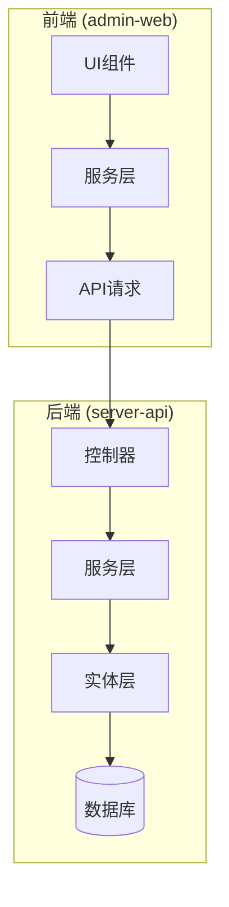
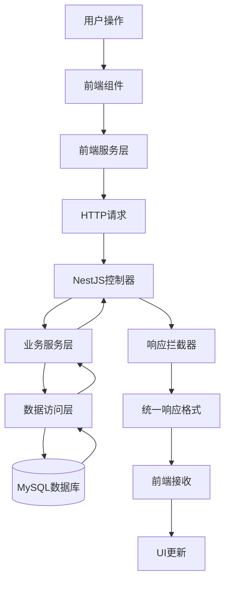
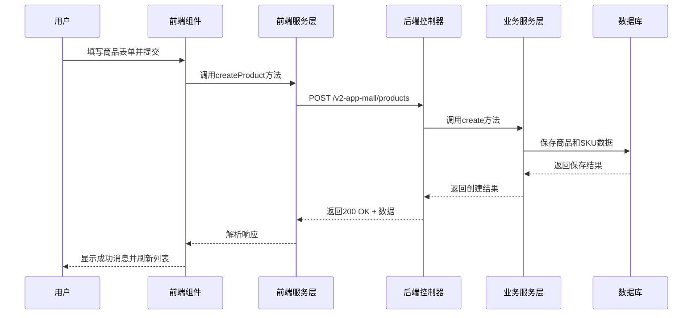
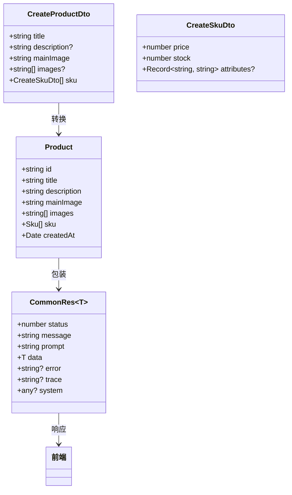
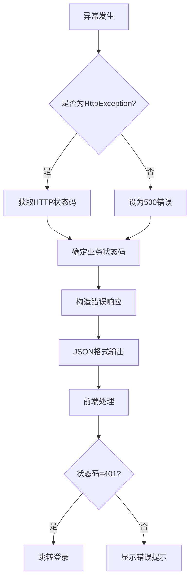
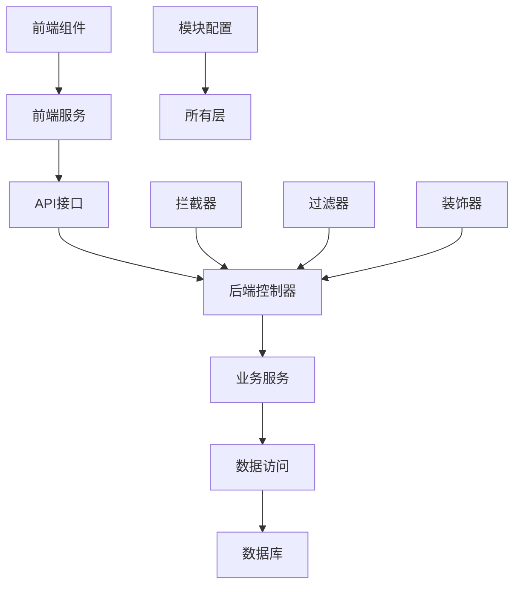

# 层间数据流

<cite>
**本文档引用文件**  
- [product.ts](file://apps/admin-web/src/services/mall/product.ts)
- [table-list/index.tsx](file://apps/admin-web/src/pages/list/table-list/index.tsx)
- [table-list/service.ts](file://apps/admin-web/src/pages/list/table-list/service.ts)
- [product.controller.ts](file://apps/server-api/src/modules/product/product.controller.ts)
- [product.service.ts](file://apps/server-api/src/modules/product/product.service.ts)
- [product.entity.ts](file://apps/server-api/src/modules/product/entities/product.entity.ts)
- [create-product.dto.ts](file://apps/server-api/src/modules/product/dto/create-product.dto.ts)
- [common-res.dto.ts](file://apps/server-api/src/common/dto/common-res.dto.ts)
- [transform.interceptor.ts](file://apps/server-api/src/common/interceptors/transform.interceptor.ts)
- [http-exception.filter.ts](file://apps/server-api/src/common/filters/http-exception.filter.ts)
- [app.module.ts](file://apps/server-api/src/app.module.ts)
- [product.module.ts](file://apps/server-api/src/modules/product/product.module.ts)
- [Create/index.tsx](file://apps/admin-web/src/pages/Product/Create/index.tsx)
- [index.ts](file://apps/admin-web/src/types/index.ts)
</cite>

## 目录
1. [简介](#简介)
2. [项目结构](#项目结构)
3. [核心组件](#核心组件)
4. [架构概览](#架构概览)
5. [详细组件分析](#详细组件分析)
6. [依赖分析](#依赖分析)
7. [性能考虑](#性能考虑)
8. [故障排除指南](#故障排除指南)
9. [结论](#结论)

## 简介
本文档详细描述了前后端之间的数据流动机制，重点分析用户请求从发起至响应的完整生命周期。系统采用典型的分层架构，前端通过服务层调用API，后端通过控制器、服务层和实体层协同处理业务逻辑并访问数据库。整个流程通过统一的DTO格式、标准化的错误处理和状态同步策略确保数据一致性与系统稳定性。

## 项目结构
项目采用Monorepo结构，包含前端管理界面和后端API服务两个主要应用。前端基于React + UmiJS构建，后端采用NestJS框架实现。前后端通过RESTful API进行通信，遵循清晰的分层结构。

**图示来源**  
- [project_structure](file://)

## 核心组件
系统核心组件包括前端服务调用、后端控制器、业务服务和数据库实体。数据流从UI触发开始，经由前端服务层发起HTTP请求，后端控制器接收并路由到对应服务，服务层处理业务逻辑并与数据库交互，最终将结果返回前端更新UI。

**本节来源**  
- [product.ts](file://apps/admin-web/src/services/mall/product.ts#L1-L38)
- [product.controller.ts](file://apps/server-api/src/modules/product/product.controller.ts#L1-L32)
- [product.service.ts](file://apps/server-api/src/modules/product/product.service.ts#L1-L38)

## 架构概览
系统采用分层架构模式，各层职责分明。前端负责用户交互和状态管理，后端实现业务逻辑和数据持久化。通过拦截器和过滤器实现横切关注点的统一处理。

**图示来源**  
- [app.module.ts](file://apps/server-api/src/app.module.ts#L1-L162)
- [transform.interceptor.ts](file://apps/server-api/src/common/interceptors/transform.interceptor.ts#L1-L43)

## 详细组件分析

### 商品创建流程分析
该流程展示了用户在前端创建商品时的完整数据流动路径。

**图示来源**  
- [Create/index.tsx](file://apps/admin-web/src/pages/Product/Create/index.tsx#L1-L160)
- [product.controller.ts](file://apps/server-api/src/modules/product/product.controller.ts#L11-L16)
- [product.service.ts](file://apps/server-api/src/modules/product/product.service.ts#L14-L22)

### 数据格式与转换分析
系统通过DTO（数据传输对象）和VO（视图对象）实现前后端数据格式的标准化。

**图示来源**  
- [create-product.dto.ts](file://apps/server-api/src/modules/product/dto/create-product.dto.ts#L1-L38)
- [product.entity.ts](file://apps/server-api/src/modules/product/entities/product.entity.ts#L1-L30)
- [common-res.dto.ts](file://apps/server-api/src/common/dto/common-res.dto.ts#L1-L49)
- [index.ts](file://apps/admin-web/src/types/index.ts#L1-L41)

### 错误处理机制分析
系统实现了统一的异常处理机制，确保所有错误都以标准化格式返回。

**图示来源**  
- [http-exception.filter.ts](file://apps/server-api/src/common/filters/http-exception.filter.ts#L1-L39)
- [transform.interceptor.ts](file://apps/server-api/src/common/interceptors/transform.interceptor.ts#L1-L43)

## 依赖分析
系统各层之间存在明确的依赖关系，遵循依赖倒置原则。

**图示来源**  
- [product.module.ts](file://apps/server-api/src/modules/product/product.module.ts#L1-L48)
- [app.module.ts](file://apps/server-api/src/app.module.ts#L47-L161)

## 性能考虑
系统在性能方面采取了多项优化措施：
- 使用Redis实现接口缓存，减少数据库压力
- 通过TypeORM的级联保存功能优化数据持久化
- 采用拦截器实现日志记录和性能监控
- 配置请求限流防止系统过载

这些机制在`app.module.ts`中通过CacheModule和ThrottlerModule进行全局配置，确保系统在高并发场景下的稳定性。

## 故障排除指南
当遇到数据流动问题时，可按以下步骤排查：

1. **检查网络请求**：确认前端是否成功发送请求，查看浏览器开发者工具中的Network面板
2. **验证DTO结构**：确保前端传递的数据结构与后端DTO定义一致
3. **查看日志输出**：检查后端控制台日志，特别是异常堆栈信息
4. **确认认证状态**：401错误通常表示token失效，需要重新登录
5. **验证数据库连接**：500错误可能源于数据库连接问题

**本节来源**  
- [http-exception.filter.ts](file://apps/server-api/src/common/filters/http-exception.filter.ts#L1-L39)
- [jwt-auth.guard.ts](file://apps/server-api/src/common/guards/jwt-auth.guard.ts)

## 结论
本系统通过清晰的分层架构和标准化的数据流动机制，实现了前后端的高效协作。统一的响应格式、完善的错误处理和合理的状态管理策略，为开发者提供了良好的维护体验。建议在实际开发中严格遵循现有的DTO定义和异常处理规范，以保持系统的一致性和稳定性。