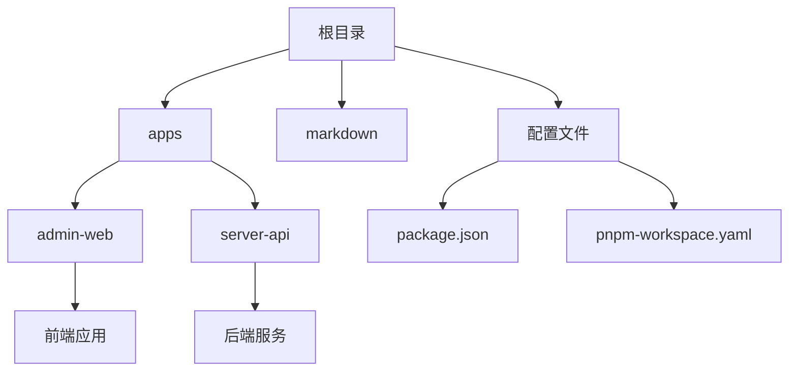
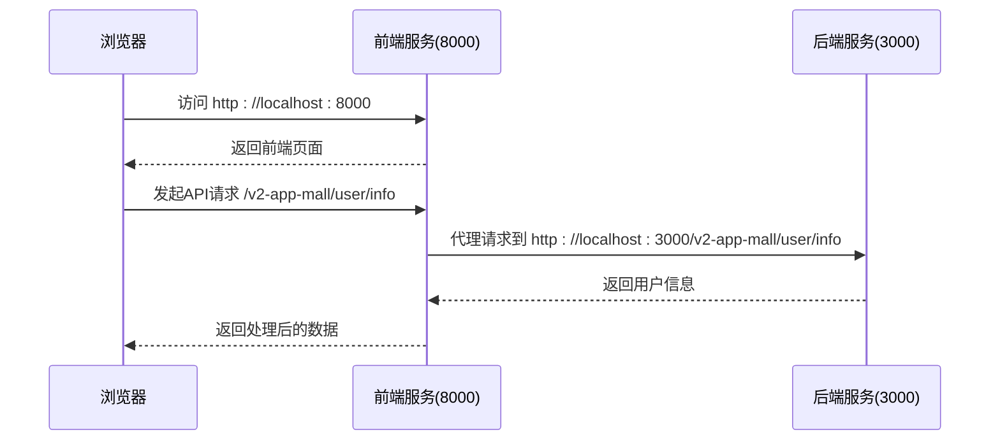

# 开发者入门指南

<cite>
**本文档中引用的文件**  
- [package.json](file://package.json)
- [pnpm-workspace.yaml](file://pnpm-workspace.yaml)
- [apps/admin-web/package.json](file://apps/admin-web/package.json)
- [apps/server-api/package.json](file://apps/server-api/package.json)
- [apps/admin-web/config/config.ts](file://apps/admin-web/config/config.ts)
- [apps/server-api/src/main.ts](file://apps/server-api/src/main.ts)
</cite>

## 目录
1. [简介](#简介)
2. [项目结构](#项目结构)
3. [环境搭建](#环境搭建)
4. [启动前后端服务](#启动前后端服务)
5. [项目约定](#项目约定)
6. [常见问题排查](#常见问题排查)
7. [验证服务状态](#验证服务状态)

## 简介
本指南旨在帮助新加入团队的开发者快速搭建本地开发环境。项目采用 monorepo 架构，包含基于 Umi 的后台管理前端（admin-web）和基于 NestJS 的后端 API 服务（server-api）。通过本指南，您将能够完成环境配置、依赖安装、服务启动等关键步骤。

**Section sources**
- [README.md](file://README.md)

## 项目结构
项目采用 monorepo 结构，使用 pnpm 作为包管理工具，主要分为以下部分：

- `apps/`：存放具体应用
  - `admin-web/`：后台管理前端，基于 Umi 框架
  - `server-api/`：后端服务，基于 NestJS 框架
- `markdown/`：项目文档
- 根目录配置文件：`package.json`、`pnpm-workspace.yaml` 等



**Diagram sources**
- [README.md](file://README.md)

**Section sources**
- [README.md](file://README.md)

## 环境搭建
### 1. 克隆仓库
首先克隆项目仓库到本地：
```bash
git clone <仓库地址>
cd mall-monorepo
```

### 2. 安装依赖
项目使用 pnpm 作为包管理工具，请确保已全局安装 pnpm：
```bash
npm install -g pnpm
```

在项目根目录执行以下命令安装所有依赖：
```bash
pnpm install
```
该命令会根据 `pnpm-workspace.yaml` 文件自动安装 `apps/*` 目录下所有子项目的依赖。

### 3. 环境变量配置
项目使用环境变量进行配置。前端主要通过 `REACT_APP_ENV` 区分环境，后端通过 `NODE_ENV` 区分。

默认情况下无需额外配置即可启动开发环境。如需自定义配置，可参考以下文件：
- 前端环境配置：`apps/admin-web/config/config.ts`
- 后端入口配置：`apps/server-api/src/main.ts`

**Section sources**
- [package.json](file://package.json)
- [pnpm-workspace.yaml](file://pnpm-workspace.yaml)
- [apps/admin-web/package.json](file://apps/admin-web/package.json)
- [apps/server-api/package.json](file://apps/server-api/package.json)

## 启动前后端服务
### 方法一：分别启动
**启动前端服务：**
```bash
pnpm --filter admin-web start
```
或使用简写：
```bash
pnpm dev:admin
```

**启动后端服务：**
```bash
pnpm --filter server-api start:dev
```
或使用简写：
```bash
pnpm dev:server
```

### 方法二：一键启动（推荐）
在根目录的 `package.json` 中已配置组合脚本，可同时启动前后端：
```bash
pnpm run dev:admin
pnpm run dev:server
```
建议在两个终端窗口中分别执行以上两条命令。

**服务默认端口：**
- 前端：`http://localhost:8000`
- 后端：`http://localhost:3000`
- Swagger 文档：`http://localhost:3000/api-docs`

**Section sources**
- [package.json](file://package.json)
- [apps/admin-web/package.json](file://apps/admin-web/package.json)
- [apps/server-api/package.json](file://apps/server-api/package.json)
- [apps/admin-web/config/config.ts](file://apps/admin-web/config/config.ts)
- [apps/server-api/src/main.ts](file://apps/server-api/src/main.ts)

## 项目约定
### 代码风格
- **TypeScript**：项目统一使用 TypeScript
- **Prettier**：代码格式化工具，配置在根目录 `.prettierrc.js`
- **Biome**：代码检查工具，配置在 `@biomejs/biome`

格式化命令：
```bash
pnpm run format
```

### Git 工作流与分支策略
- 主分支：`main`
- 开发分支：`develop`
- 功能分支：`feature/功能名`
- 修复分支：`fix/问题描述`
- 发布分支：`release/版本号`

### 提交信息规范
使用 conventional commits 规范，通过 commitlint 进行校验。

提交类型包括：
- `feat`：新增功能
- `fix`：修复 bug
- `docs`：文档更新
- `style`：代码格式调整（不影响逻辑）
- `refactor`：代码重构
- `test`：测试相关
- `chore`：构建过程或辅助工具变动

示例：
```bash
git commit -m "feat: 添加用户登录功能"
git commit -m "fix: 修复商品列表加载异常"
```

**Section sources**
- [.prettierrc.js](file://.prettierrc.js)
- [apps/admin-web/package.json](file://apps/admin-web/package.json)

## 常见问题排查
### 1. 端口冲突
**问题现象：** 启动服务时报错 `EADDRINUSE`（端口被占用）

**解决方案：**
- 检查端口占用情况：
  ```bash
  # 查看 3000 端口占用
  lsof -i :3000
  # 查看 8000 端口占用
  lsof -i :8000
  ```
- 终止占用进程：
  ```bash
  kill -9 <进程ID>
  ```
- 或修改服务端口（不推荐，需同步修改代理配置）

### 2. 依赖安装失败
**问题现象：** `pnpm install` 报错，无法下载包

**解决方案：**
- 检查网络连接，尝试切换网络环境
- 清除 pnpm 缓存：
  ```bash
  pnpm store prune
  ```
- 重新安装：
  ```bash
  pnpm install
  ```

### 3. 前端代理配置问题
前端通过 proxy 配置代理请求到后端。相关配置位于 `apps/admin-web/config/proxy.ts`。

开发环境下，前端会自动代理 `/v2-app-mall` 开头的请求到 `http://localhost:3000`。

**Section sources**
- [apps/admin-web/config/config.ts](file://apps/admin-web/config/config.ts)

## 验证服务状态
### 1. 验证前端服务
启动前端后，访问：
```
http://localhost:8000
```
应能看到 Ant Design Pro 的登录页面。

### 2. 验证后端服务
启动后端后，可通过以下方式验证：
- 访问 Swagger 文档：
  ```
  http://localhost:3000/api-docs
  ```
  应能看到 API 文档页面
- 直接调用健康检查接口：
  ```bash
  curl http://localhost:3000/v2-app-mall/test-api/ping
  ```
  预期返回：`{"status":"ok"}`

### 3. 前后端联调验证
登录前端后，打开浏览器开发者工具，观察网络请求：
- 请求应能正常发送到 `http://localhost:3000/v2-app-mall/...`
- 返回状态码为 200，数据格式符合预期



**Diagram sources**
- [apps/admin-web/config/config.ts](file://apps/admin-web/config/config.ts)
- [apps/server-api/src/main.ts](file://apps/server-api/src/main.ts)

**Section sources**
- [apps/admin-web/config/config.ts](file://apps/admin-web/config/config.ts)
- [apps/server-api/src/main.ts](file://apps/server-api/src/main.ts)