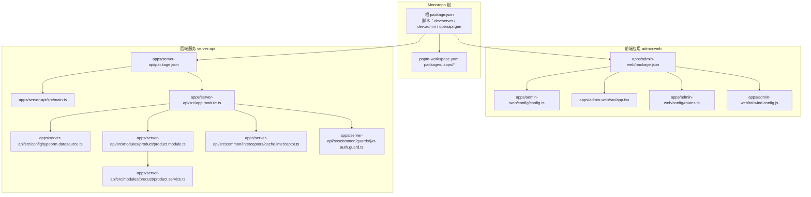
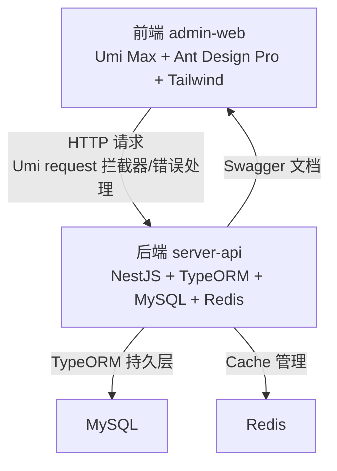
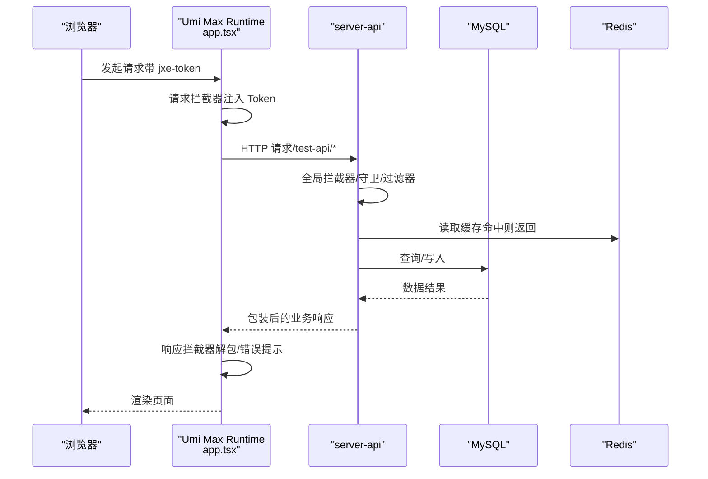
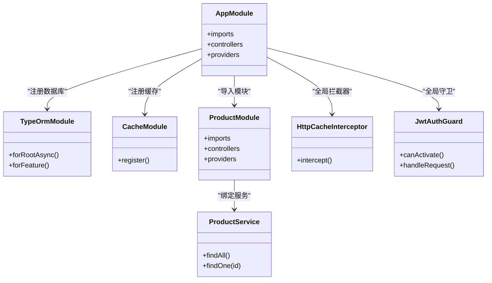
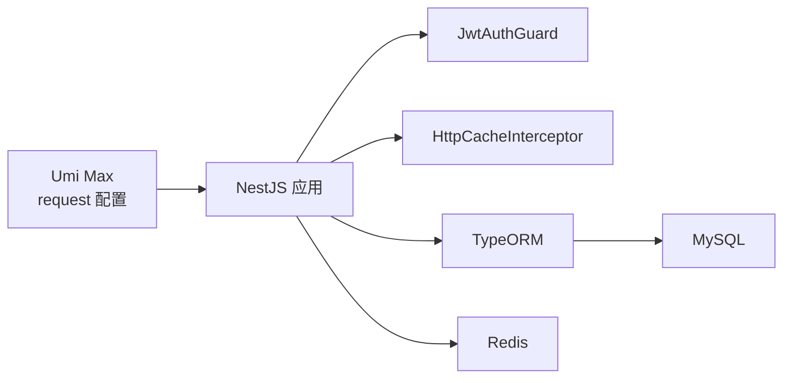

# 技术栈

<cite>
**本文引用的文件**
- [apps/admin-web/package.json](file://apps/admin-web/package.json)
- [apps/admin-web/tsconfig.json](file://apps/admin-web/tsconfig.json)
- [apps/admin-web/tailwind.config.js](file://apps/admin-web/tailwind.config.js)
- [apps/admin-web/src/app.tsx](file://apps/admin-web/src/app.tsx)
- [apps/admin-web/config/config.ts](file://apps/admin-web/config/config.ts)
- [apps/admin-web/config/defaultSettings.ts](file://apps/admin-web/config/defaultSettings.ts)
- [apps/admin-web/config/routes.ts](file://apps/admin-web/config/routes.ts)
- [apps/admin-web/src/services/mall/adminUser.ts](file://apps/admin-web/src/services/mall/adminUser.ts)
- [apps/server-api/package.json](file://apps/server-api/package.json)
- [apps/server-api/src/main.ts](file://apps/server-api/src/main.ts)
- [apps/server-api/src/app.module.ts](file://apps/server-api/src/app.module.ts)
- [apps/server-api/src/config/typeorm.datasource.ts](file://apps/server-api/src/config/typeorm.datasource.ts)
- [apps/server-api/src/modules/product/product.module.ts](file://apps/server-api/src/modules/product/product.module.ts)
- [apps/server-api/src/modules/product/product.service.ts](file://apps/server-api/src/modules/product/product.service.ts)
- [apps/server-api/src/common/interceptors/cache.interceptor.ts](file://apps/server-api/src/common/interceptors/cache.interceptor.ts)
- [apps/server-api/src/common/guards/jwt-auth.guard.ts](file://apps/server-api/src/common/guards/jwt-auth.guard.ts)
- [pnpm-workspace.yaml](file://pnpm-workspace.yaml)
- [package.json](file://package.json)
</cite>

## 目录
1. [引言](#引言)
2. [项目结构](#项目结构)
3. [核心组件](#核心组件)
4. [架构总览](#架构总览)
5. [详细组件分析](#详细组件分析)
6. [依赖关系分析](#依赖关系分析)
7. [性能考量](#性能考量)
8. [故障排查指南](#故障排查指南)
9. [结论](#结论)

## 引言
本文件系统性梳理 mall-monorepo 的技术栈与实现要点，覆盖前端（React、Umi Max、Ant Design Pro、Tailwind CSS）与后端（NestJS、TypeORM、MySQL、Redis），并说明 pnpm 在 Monorepo 中的作用。文档旨在帮助开发者快速理解各技术在项目中的角色、协作方式与最佳实践。

## 项目结构
仓库采用 pnpm 工作区组织，将前端应用与后端服务分别置于 apps/admin-web 与 apps/server-api，顶层通过脚本统一启动与联动。

图表来源
- [pnpm-workspace.yaml](file://pnpm-workspace.yaml#L1-L3)
- [package.json](file://package.json#L1-L15)
- [apps/admin-web/package.json](file://apps/admin-web/package.json#L1-L95)
- [apps/admin-web/config/config.ts](file://apps/admin-web/config/config.ts#L1-L182)
- [apps/admin-web/src/app.tsx](file://apps/admin-web/src/app.tsx#L1-L174)
- [apps/admin-web/config/routes.ts](file://apps/admin-web/config/routes.ts#L1-L275)
- [apps/admin-web/tailwind.config.js](file://apps/admin-web/tailwind.config.js#L1-L8)
- [apps/server-api/package.json](file://apps/server-api/package.json#L1-L110)
- [apps/server-api/src/main.ts](file://apps/server-api/src/main.ts#L1-L73)
- [apps/server-api/src/app.module.ts](file://apps/server-api/src/app.module.ts#L1-L162)
- [apps/server-api/src/config/typeorm.datasource.ts](file://apps/server-api/src/config/typeorm.datasource.ts#L1-L24)
- [apps/server-api/src/modules/product/product.module.ts](file://apps/server-api/src/modules/product/product.module.ts#L1-L48)
- [apps/server-api/src/modules/product/product.service.ts](file://apps/server-api/src/modules/product/product.service.ts#L1-L38)
- [apps/server-api/src/common/interceptors/cache.interceptor.ts](file://apps/server-api/src/common/interceptors/cache.interceptor.ts#L1-L46)
- [apps/server-api/src/common/guards/jwt-auth.guard.ts](file://apps/server-api/src/common/guards/jwt-auth.guard.ts#L1-L32)

章节来源
- [pnpm-workspace.yaml](file://pnpm-workspace.yaml#L1-L3)
- [package.json](file://package.json#L1-L15)

## 核心组件
- 前端技术栈
  - React：作为 UI 库，承载页面与组件体系。
  - Umi Max：作为前端框架，提供路由、数据流、权限、国际化、请求封装等能力；内置 Ant Design Pro 插件与 OpenAPI 集成。
  - Ant Design Pro：提供专业布局与业务组件，结合 Pro Components 实现高效率后台管理界面。
  - Tailwind CSS：作为原子化 CSS 框架，配合 Umi 的 tailwindcss 插件启用按需扫描与构建。
- 后端技术栈
  - NestJS：Node.js 企业级框架，提供模块化、依赖注入、守卫、拦截器、过滤器等特性。
  - TypeORM：ORM 工具，负责实体映射、查询与迁移管理，配合 MySQL。
  - MySQL：主数据库，生产环境关闭自动同步，使用迁移管理数据库演进。
  - Redis：缓存与分布式锁场景，通过 cache-manager-redis-store 集成。
- 构建与依赖管理
  - pnpm：Monorepo 工作区，统一脚本与依赖解析，提升安装与链接效率。

章节来源
- [apps/admin-web/package.json](file://apps/admin-web/package.json#L1-L95)
- [apps/admin-web/config/config.ts](file://apps/admin-web/config/config.ts#L1-L182)
- [apps/admin-web/tailwind.config.js](file://apps/admin-web/tailwind.config.js#L1-L8)
- [apps/server-api/package.json](file://apps/server-api/package.json#L1-L110)
- [apps/server-api/src/config/typeorm.datasource.ts](file://apps/server-api/src/config/typeorm.datasource.ts#L1-L24)
- [pnpm-workspace.yaml](file://pnpm-workspace.yaml#L1-L3)

## 架构总览
前端通过 Umi Max 的 request 配置与后端交互，后端通过 NestJS 的全局拦截器、过滤器与守卫统一处理请求生命周期与安全控制；数据库与缓存通过 TypeORM 与 Redis 集成，形成清晰的分层与职责边界。

图表来源
- [apps/admin-web/src/app.tsx](file://apps/admin-web/src/app.tsx#L99-L171)
- [apps/admin-web/config/config.ts](file://apps/admin-web/config/config.ts#L120-L130)
- [apps/server-api/src/main.ts](file://apps/server-api/src/main.ts#L1-L73)
- [apps/server-api/src/app.module.ts](file://apps/server-api/src/app.module.ts#L1-L162)
- [apps/server-api/src/config/typeorm.datasource.ts](file://apps/server-api/src/config/typeorm.datasource.ts#L1-L24)

## 详细组件分析

### 前端：React + Umi Max + Ant Design Pro + Tailwind CSS
- React 与 TS 配置
  - tsconfig.json 使用 ESNext 模块与 JSX 转换，启用严格模式与路径别名，便于模块化开发。
- Umi Max 配置
  - 路由：集中于 routes.ts，采用嵌套路由与重定向规则，支持权限与菜单渲染。
  - 布局与主题：通过 defaultSettings.ts 与 config.ts 的 layout/antd/theme 配置，统一风格与字体。
  - 请求与拦截：config.ts 的 request 配置指定 dataField，app.tsx 的 request 配置注入 baseURL、超时、Token 头与业务解包/错误处理。
  - OpenAPI：通过 openAPI 插件拉取后端 JSON 文档生成前端请求类型与调用方法。
  - Tailwind：tailwind.config.js 指定内容扫描范围，与 Umi 的 tailwindcss 插件协同。
- Ant Design Pro
  - 通过 presets: ['umi-presets-pro'] 与 @ant-design/pro-components 组件库，提供 ProLayout、ProTable、ProForm 等。
- Tailwind CSS
  - 原子化样式按需构建，减少全局样式冲突，提升可维护性。

图表来源
- [apps/admin-web/src/app.tsx](file://apps/admin-web/src/app.tsx#L99-L171)
- [apps/admin-web/config/config.ts](file://apps/admin-web/config/config.ts#L120-L130)
- [apps/admin-web/config/routes.ts](file://apps/admin-web/config/routes.ts#L1-L275)
- [apps/admin-web/src/services/mall/adminUser.ts](file://apps/admin-web/src/services/mall/adminUser.ts#L1-L122)
- [apps/server-api/src/main.ts](file://apps/server-api/src/main.ts#L1-L73)
- [apps/server-api/src/common/interceptors/cache.interceptor.ts](file://apps/server-api/src/common/interceptors/cache.interceptor.ts#L1-L46)

章节来源
- [apps/admin-web/tsconfig.json](file://apps/admin-web/tsconfig.json#L1-L21)
- [apps/admin-web/config/config.ts](file://apps/admin-web/config/config.ts#L1-L182)
- [apps/admin-web/config/defaultSettings.ts](file://apps/admin-web/config/defaultSettings.ts#L1-L29)
- [apps/admin-web/tailwind.config.js](file://apps/admin-web/tailwind.config.js#L1-L8)
- [apps/admin-web/src/app.tsx](file://apps/admin-web/src/app.tsx#L1-L174)
- [apps/admin-web/config/routes.ts](file://apps/admin-web/config/routes.ts#L1-L275)
- [apps/admin-web/src/services/mall/adminUser.ts](file://apps/admin-web/src/services/mall/adminUser.ts#L1-L122)

### 后端：NestJS + TypeORM + MySQL + Redis
- 应用入口与全局配置
  - main.ts：设置全局前缀、跨域、全局拦截器（响应包装、日志）、全局异常过滤器、全局验证管道、Swagger 文档。
- 模块与依赖
  - app.module.ts：注册 CLS、Winston 日志、全局缓存（Redis）、配置模块、TypeORM 异步连接、Throttler 限流、各业务模块。
  - typeorm.datasource.ts：加载 .env，配置 MySQL 连接、实体扫描、迁移目录、关闭自动同步。
- 产品模块示例
  - product.module.ts：注册实体集合，绑定控制器与服务。
  - product.service.ts：演示查询时的关联加载与保存流程注释。
- 安全与缓存
  - jwt-auth.guard.ts：支持 @Public 跳过鉴权，统一抛出未授权错误。
  - cache.interceptor.ts：基于装饰器元数据生成缓存键，命中直接返回，未命中执行业务并写入缓存。

图表来源
- [apps/server-api/src/app.module.ts](file://apps/server-api/src/app.module.ts#L1-L162)
- [apps/server-api/src/config/typeorm.datasource.ts](file://apps/server-api/src/config/typeorm.datasource.ts#L1-L24)
- [apps/server-api/src/modules/product/product.module.ts](file://apps/server-api/src/modules/product/product.module.ts#L1-L48)
- [apps/server-api/src/modules/product/product.service.ts](file://apps/server-api/src/modules/product/product.service.ts#L1-L38)
- [apps/server-api/src/common/interceptors/cache.interceptor.ts](file://apps/server-api/src/common/interceptors/cache.interceptor.ts#L1-L46)
- [apps/server-api/src/common/guards/jwt-auth.guard.ts](file://apps/server-api/src/common/guards/jwt-auth.guard.ts#L1-L32)

章节来源
- [apps/server-api/src/main.ts](file://apps/server-api/src/main.ts#L1-L73)
- [apps/server-api/src/app.module.ts](file://apps/server-api/src/app.module.ts#L1-L162)
- [apps/server-api/src/config/typeorm.datasource.ts](file://apps/server-api/src/config/typeorm.datasource.ts#L1-L24)
- [apps/server-api/src/modules/product/product.module.ts](file://apps/server-api/src/modules/product/product.module.ts#L1-L48)
- [apps/server-api/src/modules/product/product.service.ts](file://apps/server-api/src/modules/product/product.service.ts#L1-L38)
- [apps/server-api/src/common/interceptors/cache.interceptor.ts](file://apps/server-api/src/common/interceptors/cache.interceptor.ts#L1-L46)
- [apps/server-api/src/common/guards/jwt-auth.guard.ts](file://apps/server-api/src/common/guards/jwt-auth.guard.ts#L1-L32)

### 构建与依赖管理：pnpm 在 Monorepo 中的作用
- 工作区
  - pnpm-workspace.yaml 指定 packages: apps/*，将前端与后端作为独立包管理。
- 根脚本
  - 通过 pnpm --filter 在不同包间切换执行命令，统一开发体验：
    - dev:server：启动后端服务（监听热更新）
    - dev:admin：启动前端开发服务器
    - openapi:gen：触发前端 OpenAPI 代码生成
- 优势
  - 依赖去重与硬链接，加速安装与构建。
  - 跨包依赖解析与脚本统一管理，降低维护成本。

章节来源
- [pnpm-workspace.yaml](file://pnpm-workspace.yaml#L1-L3)
- [package.json](file://package.json#L1-L15)

## 依赖关系分析
- 前端对后端的依赖
  - 前端通过 Umi 的 request 配置与后端交互，使用 jxe-token 头传递认证信息；后端通过 Swagger 文档与 OpenAPI 插件生成前端调用契约。
- 后端内部模块耦合
  - AppModule 导入各业务模块，TypeORM 负责实体与数据库交互，CacheModule 通过 Redis 提供缓存能力；JwtAuthGuard 与 ThrottlerGuard 提供安全与限流保障。
- 数据流与缓存
  - 请求进入后端后，优先尝试命中缓存；未命中再访问数据库，随后写回缓存，形成“读多写少”的优化路径。

图表来源
- [apps/admin-web/src/app.tsx](file://apps/admin-web/src/app.tsx#L99-L171)
- [apps/server-api/src/main.ts](file://apps/server-api/src/main.ts#L1-L73)
- [apps/server-api/src/common/interceptors/cache.interceptor.ts](file://apps/server-api/src/common/interceptors/cache.interceptor.ts#L1-L46)
- [apps/server-api/src/common/guards/jwt-auth.guard.ts](file://apps/server-api/src/common/guards/jwt-auth.guard.ts#L1-L32)
- [apps/server-api/src/config/typeorm.datasource.ts](file://apps/server-api/src/config/typeorm.datasource.ts#L1-L24)

章节来源
- [apps/admin-web/src/app.tsx](file://apps/admin-web/src/app.tsx#L99-L171)
- [apps/server-api/src/main.ts](file://apps/server-api/src/main.ts#L1-L73)
- [apps/server-api/src/common/interceptors/cache.interceptor.ts](file://apps/server-api/src/common/interceptors/cache.interceptor.ts#L1-L46)
- [apps/server-api/src/common/guards/jwt-auth.guard.ts](file://apps/server-api/src/common/guards/jwt-auth.guard.ts#L1-L32)
- [apps/server-api/src/config/typeorm.datasource.ts](file://apps/server-api/src/config/typeorm.datasource.ts#L1-L24)

## 性能考量
- 前端
  - 使用 Umi 的 mako、esbuildMinifyIIFE 等优化选项，结合 Tailwind 原子化样式减少打包体积。
  - request 的响应拦截器进行业务解包，避免重复处理，提升渲染效率。
- 后端
  - 全局缓存拦截器命中优先，减少数据库压力；TypeORM 关闭自动同步，使用迁移管理数据库演进，降低风险。
  - 日志采用结构化输出，利于监控与排障。
- Monorepo
  - pnpm 硬链接与去重，缩短安装时间；根脚本统一开发流程，减少环境差异。

[本节为通用建议，无需列出具体文件来源]

## 故障排查指南
- 前端请求失败
  - 检查 app.tsx 的 baseURL 与请求拦截器是否正确注入 jxe-token。
  - 确认 config.ts 的 request.dataField 与后端响应结构一致。
- 后端鉴权问题
  - 若出现 401/403，检查 JwtAuthGuard 的 @Public 装饰器使用与 Token 有效性。
- 缓存未生效
  - 确认控制器方法是否使用了缓存装饰器与 TTL，检查 Redis 连接配置。
- 数据库迁移
  - 生产环境禁止自动同步，使用迁移命令生成与执行迁移文件，确保实体变更可控。

章节来源
- [apps/admin-web/src/app.tsx](file://apps/admin-web/src/app.tsx#L99-L171)
- [apps/admin-web/config/config.ts](file://apps/admin-web/config/config.ts#L120-L130)
- [apps/server-api/src/common/guards/jwt-auth.guard.ts](file://apps/server-api/src/common/guards/jwt-auth.guard.ts#L1-L32)
- [apps/server-api/src/common/interceptors/cache.interceptor.ts](file://apps/server-api/src/common/interceptors/cache.interceptor.ts#L1-L46)
- [apps/server-api/src/config/typeorm.datasource.ts](file://apps/server-api/src/config/typeorm.datasource.ts#L1-L24)

## 结论
mall-monorepo 采用成熟的前端与后端技术栈：前端以 Umi Max 为核心，结合 Ant Design Pro 与 Tailwind CSS 快速搭建后台界面；后端以 NestJS 为基础，配合 TypeORM、MySQL 与 Redis 构建稳定的服务层。pnpm 工作区统一管理多包依赖与脚本，形成高效、可维护的开发与交付体系。通过全局拦截器、守卫与缓存策略，系统在安全性与性能方面具备良好基础。