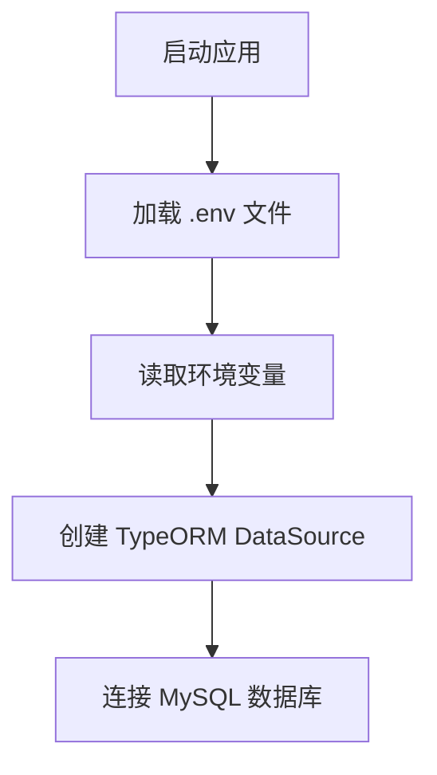
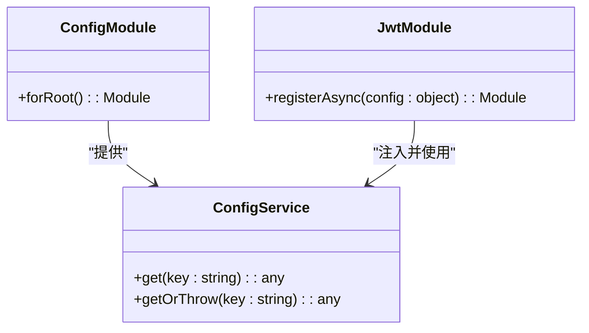
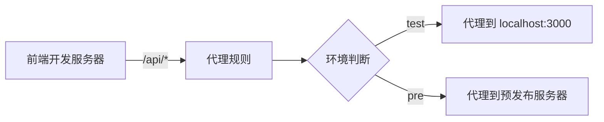

# 环境配置

<cite>
**本文档中引用的文件**  
- [config.ts](file://apps/admin-web/config/config.ts)
- [proxy.ts](file://apps/admin-web/config/proxy.ts)
- [routes.ts](file://apps/admin-web/config/routes.ts)
- [defaultSettings.ts](file://apps/admin-web/config/defaultSettings.ts)
- [.env](file://apps/server-api/.env)
- [typeorm.datasource.ts](file://apps/server-api/src/config/typeorm.datasource.ts)
- [app.module.ts](file://apps/server-api/src/app.module.ts)
- [auth.module.ts](file://apps/server-api/src/modules/auth/auth.module.ts)
- [jwt.strategy.ts](file://apps/server-api/src/modules/auth/strategies/jwt.strategy.ts)
- [docker-compose.yml](file://docker-compose.yml)
</cite>

## 目录
1. [简介](#简介)
2. [后端环境配置](#后端环境配置)
3. [前端环境配置](#前端环境配置)
4. [配置最佳实践与常见陷阱](#配置最佳实践与常见陷阱)

## 简介
本指南详细说明了多包仓库 `mall-monorepo` 中前后端应用的环境配置机制。重点阐述了后端 `server-api` 如何通过 `.env` 文件管理不同环境（开发、测试、生产）的敏感配置，以及前端 `admin-web` 如何通过 `config.ts` 文件进行 API 代理、路由和主题等设置。同时，本指南将指导开发者如何创建和管理各自的环境文件，并在不同环境中构建和运行应用。

**Section sources**
- [config.ts](file://apps/admin-web/config/config.ts)
- [typeorm.datasource.ts](file://apps/server-api/src/config/typeorm.datasource.ts)

## 后端环境配置

后端服务 `server-api` 采用 NestJS 框架，其环境配置主要依赖于 `.env` 文件和 `@nestjs/config` 模块，实现了对数据库、Redis、JWT 密钥等关键配置的安全管理。

### 环境变量文件 (.env)
根据项目结构文档，后端服务根目录下存在一个 `.env` 文件，用于存储所有环境相关的配置。该文件不应被提交到版本控制系统（如 Git），以防止敏感信息泄露。开发者应在本地创建此文件，并根据需要填充以下关键变量：

- **数据库配置**:
  - `DB_HOST`: 数据库服务器地址 (例如: `localhost` 或 `db.prod.example.com`)
  - `DB_PORT`: 数据库端口 (例如: `3306`)
  - `DB_USERNAME`: 数据库用户名
  - `DB_PASSWORD`: 数据库密码
  - `DB_DATABASE`: 要连接的数据库名称

- **Redis 配置**:
  - `REDIS_HOST`: Redis 服务器地址
  - `REDIS_PORT`: Redis 端口 (例如: `6379`)

- **JWT 配置**:
  - `JWT_SECRET`: JWT 签名密钥，用于生成和验证令牌。
  - `JWT_EXPIRES_IN`: JWT 令牌的有效期 (例如: `7d` 表示7天)。

### TypeORM 数据源配置
`typeorm.datasource.ts` 文件是数据库连接的核心配置。它通过 `dotenv` 库加载 `.env` 文件中的环境变量，并将其注入到 `DataSource` 配置中。

**Diagram sources**
- [typeorm.datasource.ts](file://apps/server-api/src/config/typeorm.datasource.ts#L5-L23)

**Section sources**
- [typeorm.datasource.ts](file://apps/server-api/src/config/typeorm.datasource.ts#L5-L23)

### 使用 NestJS ConfigService
在 `app.module.ts` 中，`ConfigModule.forRoot()` 被全局注册，使得 `ConfigService` 可以在应用的任何地方被注入和使用。这提供了一种更安全、更灵活的方式来访问配置。

例如，在 `auth.module.ts` 中，`JwtModule` 使用 `registerAsync` 方法异步地从 `ConfigService` 获取 `JWT_SECRET` 和 `JWT_EXPIRES_IN` 的值，而不是直接从 `process.env` 读取。

**Diagram sources**
- [app.module.ts](file://apps/server-api/src/app.module.ts#L79-L81)
- [auth.module.ts](file://apps/server-api/src/modules/auth/auth.module.ts#L14-L23)

**Section sources**
- [app.module.ts](file://apps/server-api/src/app.module.ts#L79-L81)
- [auth.module.ts](file://apps/server-api/src/modules/auth/auth.module.ts#L14-L23)

## 前端环境配置

前端应用 `admin-web` 基于 UmiJS 框架，其配置系统主要通过 `config.ts` 文件进行集中管理，涵盖了路由、代理、主题等多个方面。

### 核心配置文件 (config.ts)
`config.ts` 是前端应用的主配置文件，它导出一个由 `defineConfig` 函数定义的配置对象。

- **环境变量**: 文件开头通过 `process.env.REACT_APP_ENV` 读取环境标识，用于区分开发、测试或预发布环境。
- **路由配置**: 通过 `routes` 属性引入 `routes.ts` 文件，定义了应用的页面路由结构。
- **代理配置**: 通过 `proxy` 属性引入 `proxy.ts` 文件，实现了开发环境下的跨域请求代理。

### API 代理配置 (proxy.ts)
`proxy.ts` 文件定义了不同环境下的代理规则。这对于解决开发时的跨域问题至关重要。

**Diagram sources**
- [proxy.ts](file://apps/admin-web/config/proxy.ts#L28-L43)
- [config.ts](file://apps/admin-web/config/config.ts#L64)

**Section sources**
- [proxy.ts](file://apps/admin-web/config/proxy.ts#L28-L43)
- [config.ts](file://apps/admin-web/config/config.ts#L64)

### 路由与主题配置
- **路由 (routes.ts)**: 定义了应用的导航结构，包括路径、组件、图标和名称。例如，`/dashboard/analysis` 路径对应 `./dashboard/analysis` 组件。
- **主题 (defaultSettings.ts)**: 通过 `layout` 属性应用默认的 UI 主题设置，如导航主题 (`navTheme`)、主色调 (`colorPrimary`) 和布局模式 (`layout`)。

**Section sources**
- [routes.ts](file://apps/admin-web/config/routes.ts)
- [defaultSettings.ts](file://apps/admin-web/config/defaultSettings.ts)

## 配置最佳实践与常见陷阱

### 最佳实践
1.  **环境隔离**: 为开发、测试、生产环境维护独立的 `.env` 文件（如 `.env.development`, `.env.production`），并在 `docker-compose.yml` 中指定。
2.  **敏感信息保护**: 绝不将 `.env` 文件提交到代码仓库。使用 `.gitignore` 忽略它，并通过安全渠道（如 CI/CD 环境变量）分发生产环境的配置。
3.  **使用 ConfigService**: 在 NestJS 中优先使用 `ConfigService` 而非直接访问 `process.env`，因为它提供了类型安全和更优雅的错误处理（如 `getOrThrow`）。
4.  **明确的默认值**: 为非关键配置提供合理的默认值，例如 `process.env.DB_PORT || '3306'`，以提高应用的健壮性。

### 常见陷阱
1.  **忘记加载 .env**: 确保在应用启动时调用 `dotenv.config()`。在本项目中，`typeorm.datasource.ts` 已经执行了此操作。
2.  **生产环境代理失效**: UmiJS 的代理仅在开发模式下 (`npm run dev`) 有效。生产环境 (`npm run build`) 需要通过 Nginx 或其他反向代理服务器来处理跨域。
3.  **环境变量类型**: `process.env` 返回的值始终是字符串。对于数字或布尔值，需要手动转换（如 `parseInt(process.env.PORT)`）。
4.  **Docker 配置同步**: 在 `docker-compose.yml` 中定义的环境变量必须与应用内部期望的变量名完全一致，否则会导致连接失败。

**Section sources**
- [typeorm.datasource.ts](file://apps/server-api/src/config/typeorm.datasource.ts#L6)
- [config.ts](file://apps/admin-web/config/config.ts)
- [docker-compose.yml](file://docker-compose.yml)