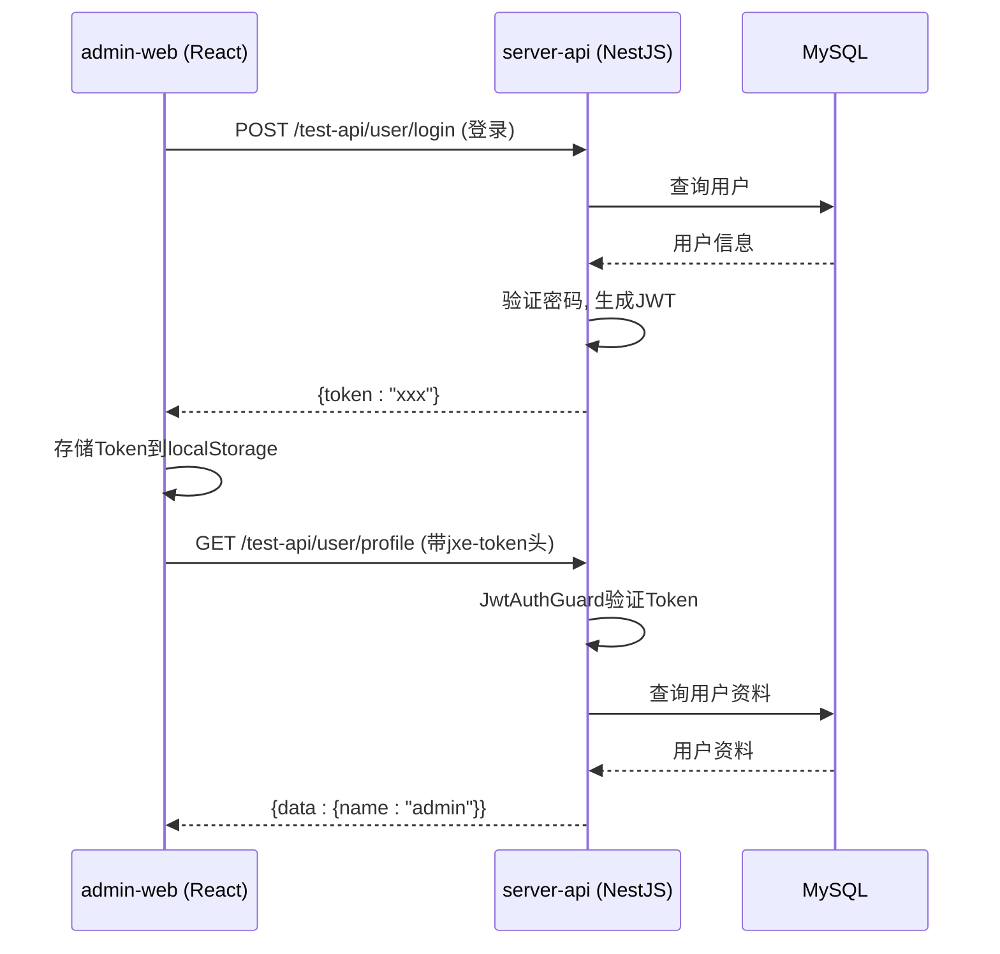
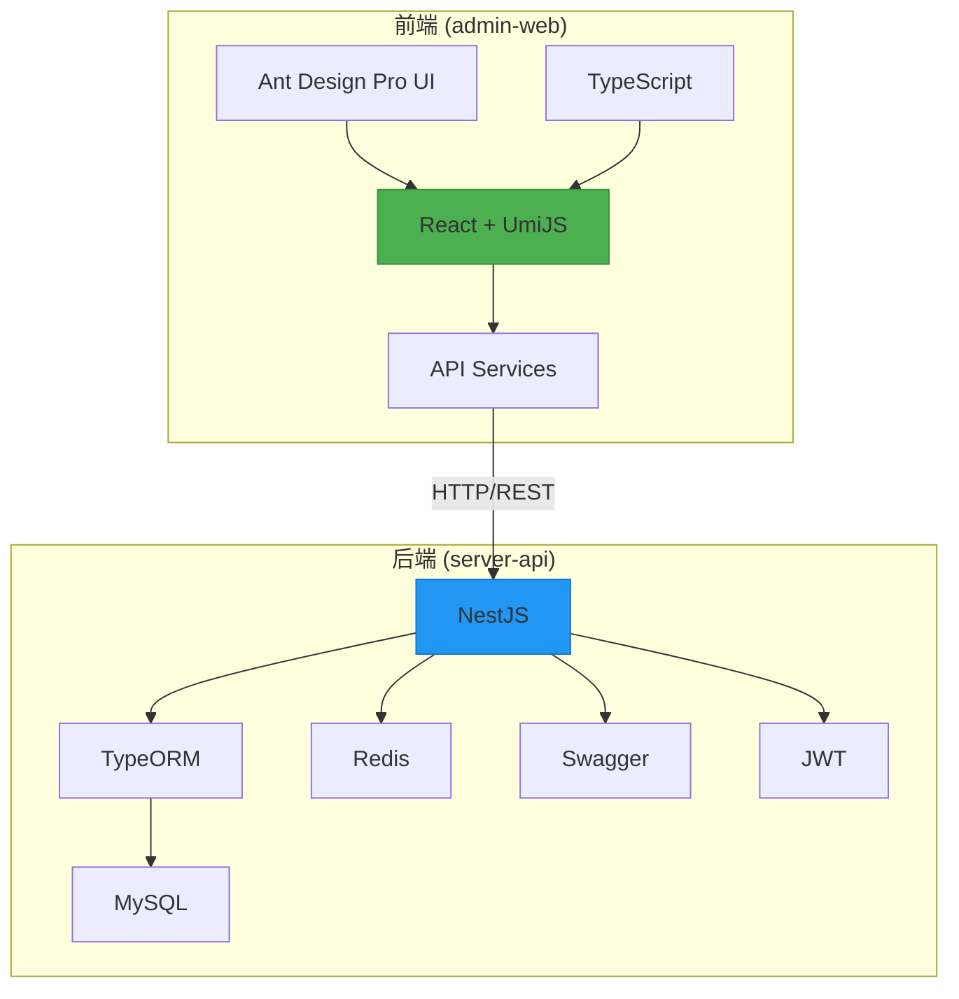

# 系统概述

<cite>
**本文档引用的文件**  
- [README.md](file://README.md)
- [package.json](file://package.json)
- [apps/admin-web/package.json](file://apps/admin-web/package.json)
- [apps/server-api/package.json](file://apps/server-api/package.json)
- [apps/admin-web/src/app.tsx](file://apps/admin-web/src/app.tsx)
- [apps/server-api/src/main.ts](file://apps/server-api/src/main.ts)
- [apps/admin-web/config/config.ts](file://apps/admin-web/config/config.ts)
- [apps/server-api/src/app.module.ts](file://apps/server-api/src/app.module.ts)
- [apps/server-api/src/common/interceptors/transform.interceptor.ts](file://apps/server-api/src/common/interceptors/transform.interceptor.ts)
- [apps/server-api/src/common/filters/http-exception.filter.ts](file://apps/server-api/src/common/filters/http-exception.filter.ts)
- [apps/admin-web/src/services/mall/index.ts](file://apps/admin-web/src/services/mall/index.ts)
- [apps/admin-web/src/services/mall/adminUser.ts](file://apps/admin-web/src/services/mall/adminUser.ts)
- [apps/server-api/src/modules/user/user.service.ts](file://apps/server-api/src/modules/user/user.service.ts)
- [apps/server-api/src/modules/auth/auth.module.ts](file://apps/server-api/src/modules/auth/auth.module.ts)
- [apps/server-api/src/modules/product/product.service.ts](file://apps/server-api/src/modules/product/product.service.ts)
- [apps/admin-web/src/types/index.ts](file://apps/admin-web/src/types/index.ts)
</cite>

## 目录
1. [项目目标与核心问题](#项目目标与核心问题)
2. [Monorepo架构设计理念](#monorepo架构设计理念)
3. [整体技术愿景与技术栈选择](#整体技术愿景与技术栈选择)
4. [前后端分离的技术实现](#前后端分离的技术实现)
5. [核心应用组件分析](#核心应用组件分析)
6. [数据交互方式与依赖关系](#数据交互方式与依赖关系)
7. [系统上下文与架构图](#系统上下文与架构图)
8. [技术决策背后的权衡分析](#技术决策背后的权衡分析)

## 项目目标与核心问题

mall-monorepo项目旨在构建一个现代化的全栈电商平台后台管理系统，通过采用Monorepo架构统一管理前后端代码，解决传统多仓库模式下代码复用困难、版本同步复杂、开发环境配置繁琐等核心问题。项目聚焦于电商管理场景，提供商品管理、订单处理、用户权限控制、营销活动配置等核心功能，为电商平台的运营和管理提供高效、稳定的技术支持。

**Section sources**
- [README.md](file://README.md#L1-L50)

## Monorepo架构设计理念

本项目采用Monorepo（单一代码仓库）架构，将前端应用（admin-web）和后端服务（server-api）统一管理在一个代码仓库中。这种设计打破了传统多仓库的隔离，实现了代码、配置和工具的集中化管理。通过pnpm工作区（pnpm-workspace.yaml）和根目录的package.json脚本，开发者可以使用`pnpm dev:server`和`pnpm dev:admin`等命令一键启动整个开发环境，极大地提升了开发效率和协作体验。Monorepo架构确保了前后端技术栈的统一（TypeScript），并为共享类型定义（shared types）提供了天然支持，从根本上解决了接口定义不一致的问题。

**Section sources**
- [README.md](file://README.md#L1-L50)
- [package.json](file://package.json#L1-L15)
- [pnpm-workspace.yaml](file://pnpm-workspace.yaml)

## 整体技术愿景与技术栈选择

项目的整体技术愿景是构建一个高内聚、低耦合、易于维护和扩展的全栈应用。为此，项目在技术选型上进行了精心考量：
- **TypeScript**: 作为核心语言，为整个项目提供强大的类型安全，减少运行时错误，提升代码可维护性。
- **React + UmiJS**: 前端采用React作为UI库，结合UmiJS框架，利用其约定式路由、插件化架构和内置的Ant Design Pro模板，快速搭建企业级后台管理系统。
- **NestJS**: 后端选用NestJS框架，其基于TypeScript、模块化设计和依赖注入的特性，使得代码结构清晰、易于测试和扩展，非常适合构建大型服务端应用。
- **Ant Design Pro**: 前端UI框架，提供了丰富的组件和开箱即用的页面模板，显著加速了后台管理界面的开发进程。

**Section sources**
- [README.md](file://README.md#L1-L50)
- [apps/admin-web/package.json](file://apps/admin-web/package.json#L1-L95)
- [apps/server-api/package.json](file://apps/server-api/package.json#L1-L110)

## 前后端分离的技术实现

项目严格遵循前后端分离的架构模式。前端`admin-web`应用是一个独立的单页应用（SPA），负责用户界面的渲染和交互逻辑。后端`server-api`服务是一个RESTful API服务器，专注于业务逻辑处理和数据持久化。两者通过HTTP/HTTPS协议进行通信，前端通过`@umijs/max`提供的`request`配置和`services`层调用后端API。UmiJS的`openAPI`插件从后端的Swagger文档（`/api-docs/json`）自动生成前端API调用代码，实现了接口的自动化同步，确保了前后端契约的一致性。

**Section sources**
- [apps/admin-web/config/config.ts](file://apps/admin-web/config/config.ts#L1-L182)
- [apps/admin-web/src/app.tsx](file://apps/admin-web/src/app.tsx#L1-L174)
- [apps/server-api/src/main.ts](file://apps/server-api/src/main.ts#L1-L73)

## 核心应用组件分析

### admin-web前端应用

`admin-web`是基于React和UmiJS构建的后台管理界面。其核心配置位于`config/config.ts`，定义了路由、代理、主题等。`src/app.tsx`文件是运行时配置的入口，通过`getInitialState`函数在应用启动时获取当前用户信息，并通过`request`配置实现了全局的请求拦截（注入`jxe-token`）和响应拦截（处理业务状态码和HTTP错误）。`services`目录下的API服务（如`adminUser.ts`）封装了所有对后端的HTTP请求。

**Section sources**
- [apps/admin-web/config/config.ts](file://apps/admin-web/config/config.ts#L1-L182)
- [apps/admin-web/src/app.tsx](file://apps/admin-web/src/app.tsx#L1-L174)
- [apps/admin-web/src/services/mall/adminUser.ts](file://apps/admin-web/src/services/mall/adminUser.ts#L1-L122)

### server-api后端服务

`server-api`是基于NestJS构建的后端服务。`main.ts`是应用的入口，配置了全局前缀（`v2-app-mall`）、跨域、Swagger文档、全局异常过滤器和拦截器。`app.module.ts`是根模块，通过`TypeOrmModule.forRootAsync`异步连接MySQL数据库，并注册了`AddressModule`、`ProductModule`、`UserModule`等多个业务模块。`TransformInterceptor`和`AllExceptionsFilter`实现了统一的响应格式和错误处理，确保了API返回结构的一致性。

**Section sources**
- [apps/server-api/src/main.ts](file://apps/server-api/src/main.ts#L1-L73)
- [apps/server-api/src/app.module.ts](file://apps/server-api/src/app.module.ts#L1-L162)
- [apps/server-api/src/common/interceptors/transform.interceptor.ts](file://apps/server-api/src/common/interceptors/transform.interceptor.ts#L1-L43)
- [apps/server-api/src/common/filters/http-exception.filter.ts](file://apps/server-api/src/common/filters/http-exception.filter.ts#L1-L39)

## 数据交互方式与依赖关系

前后端之间的数据交互遵循RESTful风格。前端通过HTTP请求调用后端API，后端返回统一格式的JSON数据。关键的依赖关系体现在：
- **类型共享**: 前后端通过`packages/shared-types`（项目中虽未直接列出，但根据`README.md`推断存在）共享DTO和VO类型，确保数据结构一致。
- **认证机制**: 使用JWT进行身份认证。前端在登录成功后将Token存储在`localStorage`中，后续请求通过请求拦截器自动添加`jxe-token`头。后端通过`JwtAuthGuard`和`JwtStrategy`验证Token的有效性。
- **API契约**: 后端通过Swagger生成API文档，前端通过`openAPI`插件消费该文档，自动生成类型安全的API调用代码，形成了一条从定义到实现的完整闭环。

**Diagram sources**
- [apps/admin-web/src/app.tsx](file://apps/admin-web/src/app.tsx#L1-L174)
- [apps/admin-web/src/services/mall/adminUser.ts](file://apps/admin-web/src/services/mall/adminUser.ts#L1-L122)
- [apps/server-api/src/modules/user/user.service.ts](file://apps/server-api/src/modules/user/user.service.ts#L1-L144)
- [apps/server-api/src/modules/auth/auth.module.ts](file://apps/server-api/src/modules/auth/auth.module.ts#L1-L28)

## 系统上下文与架构图

**Diagram sources**
- [apps/admin-web/package.json](file://apps/admin-web/package.json#L1-L95)
- [apps/server-api/package.json](file://apps/server-api/package.json#L1-L110)
- [apps/server-api/src/app.module.ts](file://apps/server-api/src/app.module.ts#L1-L162)

## 技术决策背后的权衡分析

- **选择TypeScript**: 权衡在于增加了开发的复杂性，但换来了卓越的类型安全、更好的代码提示和重构能力，对于大型项目而言，长期收益远大于初期学习成本。
- **选择Ant Design Pro**: 权衡在于UI风格可能不够独特，但其提供了极其丰富的组件和开箱即用的解决方案，极大地缩短了开发周期，特别适合快速构建企业级后台。
- **选择TypeORM**: 权衡在于其运行时性能可能略低于原始SQL或更轻量的ORM，但其Active Record和Data Mapper模式的混合、强大的关系映射和迁移功能，使得开发效率极高，非常适合业务逻辑复杂的电商系统。
- **Monorepo vs Multirepo**: Monorepo简化了依赖管理和版本同步，但可能导致仓库臃肿。本项目通过清晰的`apps/`和`packages/`划分，有效控制了复杂度，使得Monorepo的优势得以充分发挥。

**Section sources**
- [README.md](file://README.md#L1-L50)
- [apps/admin-web/package.json](file://apps/admin-web/package.json#L1-L95)
- [apps/server-api/package.json](file://apps/server-api/package.json#L1-L110)
- [apps/server-api/src/app.module.ts](file://apps/server-api/src/app.module.ts#L1-L162)