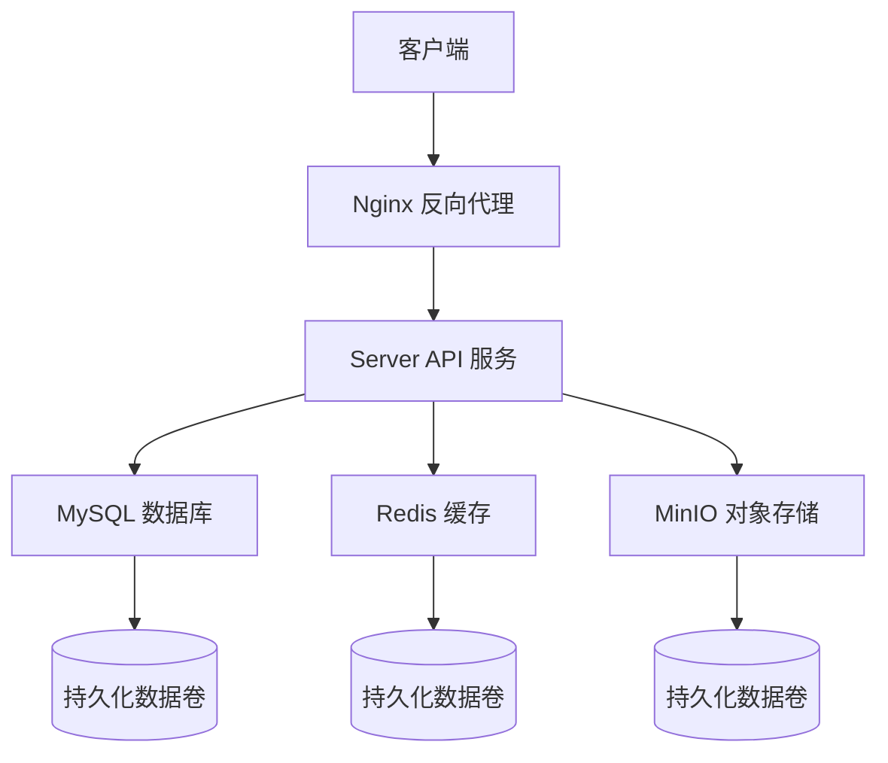
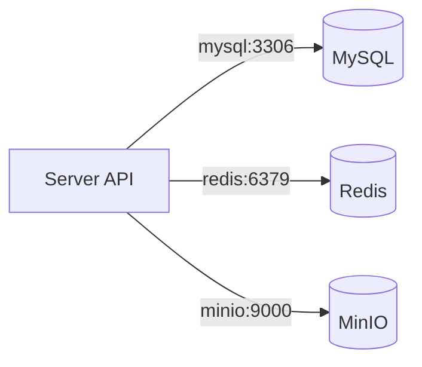
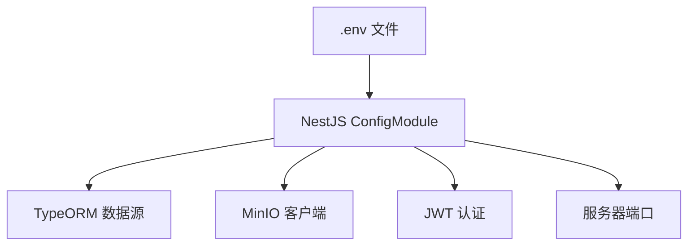

# 部署架构

<cite>
**本文档引用文件**  
- [docker-compose.yml](file://docker-compose.yml)
- [apps/server-api/.env](file://apps/server-api/.env)
- [apps/server-api/src/config/typeorm.datasource.ts](file://apps/server-api/src/config/typeorm.datasource.ts)
- [apps/server-api/src/app.module.ts](file://apps/server-api/src/app.module.ts)
- [apps/server-api/package.json](file://apps/server-api/package.json)
</cite>

## 目录

1. [简介](#简介)
2. [部署拓扑结构](#部署拓扑结构)
3. [容器职责与配置](#容器职责与配置)
4. [网络与数据持久化](#网络与数据持久化)
5. [环境变量注入](#环境变量注入)
6. [部署操作指南](#部署操作指南)
7. [可扩展性与高可用性](#可扩展性与高可用性)
8. [灾难恢复策略](#灾难恢复策略)
9. [运维监控建议](#运维监控建议)

## 简介

本部署架构文档详细描述了基于 `docker-compose.yml` 文件的生产环境部署方案。系统采用微服务架构，通过 Docker 容器化技术实现服务解耦与独立部署。核心组件包括 API 服务、MySQL 数据库、Redis 缓存和 MinIO 对象存储，各组件通过 Docker 网络进行安全通信，并通过数据卷实现持久化存储。

**Section sources**
- [docker-compose.yml](file://docker-compose.yml#L1-L42)

## 部署拓扑结构

系统部署采用分层架构，前端应用通过反向代理与后端 API 通信，后端服务通过内部 Docker 网络与数据存储组件交互。所有服务由 Docker Compose 统一编排，形成一个逻辑上的部署单元。

**Diagram sources**
- [docker-compose.yml](file://docker-compose.yml#L3-L42)

## 容器职责与配置

### MySQL 数据库容器

负责持久化存储业务数据，包括用户信息、商品数据、订单记录等。使用 MySQL 8.0 官方镜像，自动创建 `mall_db` 数据库，并配置专用访问账户。

**Section sources**
- [docker-compose.yml](file://docker-compose.yml#L3-L16)

### Redis 缓存容器

提供分布式缓存能力，用于存储会话信息、热点数据和接口响应缓存。集成在 NestJS 应用中，通过 `cache-manager-redis-store` 实现 HTTP 响应缓存拦截。

**Section sources**
- [docker-compose.yml](file://docker-compose.yml#L18-L26)
- [apps/server-api/src/app.module.ts](file://apps/server-api/src/app.module.ts#L71-L77)
- [apps/server-api/src/common/interceptors/cache.interceptor.ts](file://apps/server-api/src/common/interceptors/cache.interceptor.ts#L1-L45)

### MinIO 对象存储容器

提供兼容 S3 协议的对象存储服务，用于存储图片、文件等静态资源。配置独立的访问凭证，并通过 Web 控制台（端口 9001）进行管理。

**Section sources**
- [docker-compose.yml](file://docker-compose.yml#L28-L42)
- [apps/server-api/.env](file://apps/server-api/.env#L8-L13)

### Server API 服务

基于 NestJS 框架的后端服务，处理所有业务逻辑。通过 TypeORM 连接 MySQL，使用 Redis 进行缓存，并通过 MinIO SDK 实现文件上传下载。

**Section sources**
- [apps/server-api/src/config/typeorm.datasource.ts](file://apps/server-api/src/config/typeorm.datasource.ts#L1-L23)
- [apps/server-api/src/app.module.ts](file://apps/server-api/src/app.module.ts#L83-L98)

## 网络与数据持久化

### 网络配置

所有容器默认使用 Docker Compose 创建的默认网络进行通信。服务间通过容器名称进行 DNS 解析，如 API 服务通过 `mysql` 主机名访问数据库。

**Diagram sources**
- [docker-compose.yml](file://docker-compose.yml#L3-L42)
- [apps/server-api/.env](file://apps/server-api/.env#L2-L13)

### 数据持久化

通过 Docker 数据卷实现数据持久化，确保容器重启后数据不丢失：

- MySQL 数据挂载至 `./docker-data/mysql`
- Redis 数据挂载至 `./docker-data/redis`
- MinIO 数据挂载至 `./docker-data/minio`

**Section sources**
- [docker-compose.yml](file://docker-compose.yml#L16-L16)
- [docker-compose.yml](file://docker-compose.yml#L26-L26)
- [docker-compose.yml](file://docker-compose.yml#L42-L42)

## 环境变量注入

系统通过环境变量实现配置解耦，关键配置包括：

- **数据库连接**：`DB_HOST`, `DB_PORT`, `DB_USERNAME`, `DB_PASSWORD`, `DB_DATABASE`
- **MinIO 配置**：`MINIO_ENDPOINT`, `MINIO_PORT`, `MINIO_ACCESS_KEY`, `MINIO_SECRET_KEY`, `MINIO_BUCKET`
- **服务配置**：`PORT`, `JWT_SECRET`, `NODE_ENV`

这些变量在 `.env` 文件中定义，并由 NestJS 的 `ConfigModule` 加载。

**Diagram sources**
- [apps/server-api/.env](file://apps/server-api/.env#L1-L31)
- [apps/server-api/src/app.module.ts](file://apps/server-api/src/app.module.ts#L79-L81)

## 部署操作指南

### 构建与启动

1. 确保 Docker 和 Docker Compose 已安装
2. 执行 `docker-compose up -d` 启动所有服务
3. 首次启动会自动拉取镜像并初始化容器

### 健康检查

各服务的健康检查端点：
- MySQL：端口 3306 TCP 连接
- Redis：`redis-cli ping` 命令
- MinIO：`curl http://localhost:9000/minio/health/live`
- Server API：`GET /health` 接口

### 日志监控

- 查看容器日志：`docker logs <container_name>`
- API 服务日志格式为 JSON，便于 ELK 栈采集
- 关键操作均通过 Winston 日志库记录

**Section sources**
- [docker-compose.yml](file://docker-compose.yml#L1-L42)
- [apps/server-api/src/app.module.ts](file://apps/server-api/src/app.module.ts#L58-L69)

## 可扩展性与高可用性

### 水平扩展

- API 服务可部署多个实例，通过负载均衡分发流量
- Redis 支持主从复制和哨兵模式
- MinIO 支持分布式部署模式

### 配置优化

- 数据库连接池配置合理，避免连接耗尽
- 缓存策略通过 `@Cacheable` 装饰器灵活控制
- 请求限流通过 `ThrottlerModule` 实现，防止 DDoS 攻击

**Section sources**
- [apps/server-api/src/app.module.ts](file://apps/server-api/src/app.module.ts#L101-L108)
- [apps/server-api/src/common/interceptors/cache.interceptor.ts](file://apps/server-api/src/common/interceptors/cache.interceptor.ts#L1-L45)

## 灾难恢复策略

### 数据备份

- MySQL 数据卷应定期备份
- MinIO 数据可通过 `mc mirror` 命令同步到异地存储
- Redis RDB 快照文件需纳入备份计划

### 故障转移

- 数据库主从切换需预先配置
- 缓存击穿场景通过互斥锁和空值缓存应对
- 对象存储故障时可降级为本地存储临时方案

**Section sources**
- [docker-compose.yml](file://docker-compose.yml#L16-L16)
- [docker-compose.yml](file://docker-compose.yml#L26-L26)
- [docker-compose.yml](file://docker-compose.yml#L42-L42)

## 运维监控建议

### 监控指标

- 容器资源使用率（CPU、内存、网络）
- 数据库连接数和查询性能
- 缓存命中率
- 对象存储空间使用情况
- API 接口响应时间和错误率

### 告警设置

- 数据库磁盘使用率超过 80%
- 缓存命中率持续低于 50%
- 连续 3 次健康检查失败
- HTTP 5xx 错误率超过 1%

**Section sources**
- [apps/server-api/src/app.module.ts](file://apps/server-api/src/app.module.ts#L58-L69)
- [apps/server-api/src/common/interceptors/logging.interceptor.ts](file://apps/server-api/src/common/interceptors/logging.interceptor.ts)