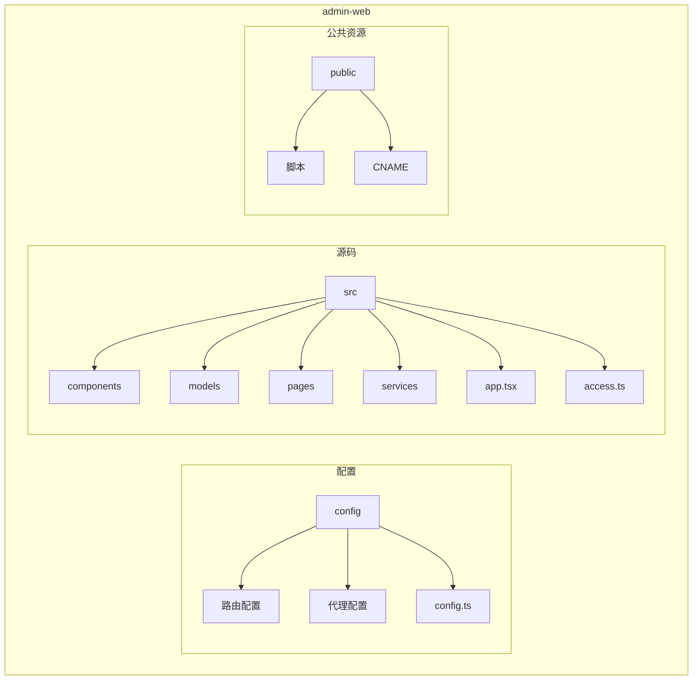
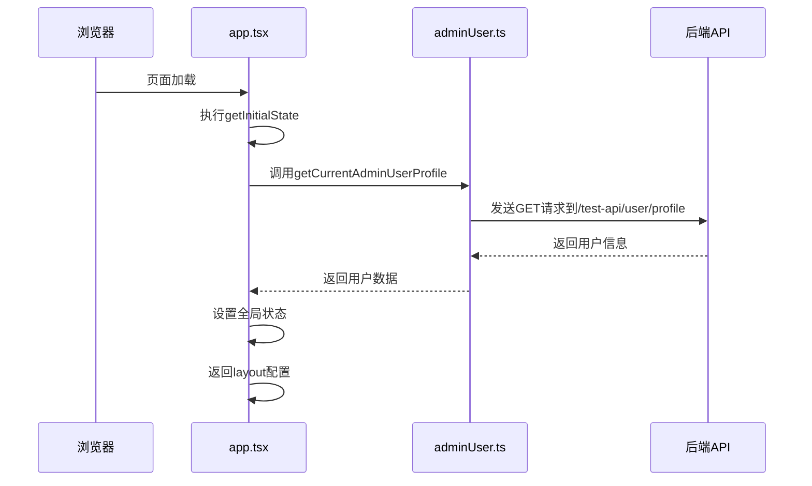
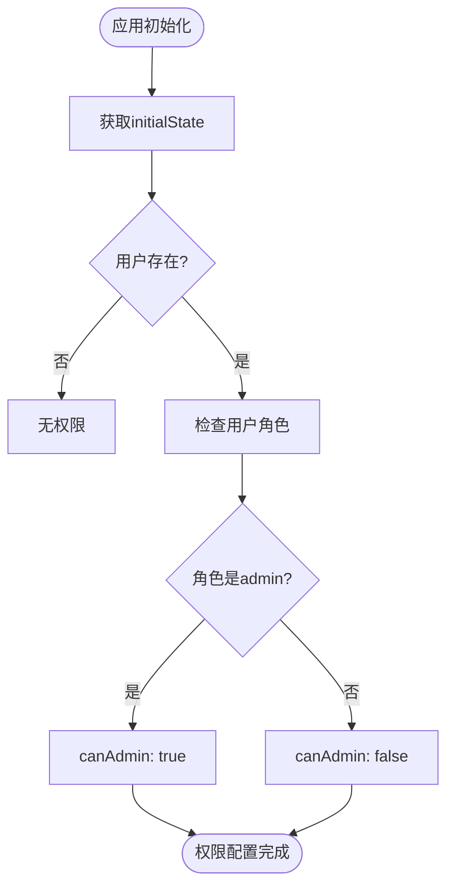
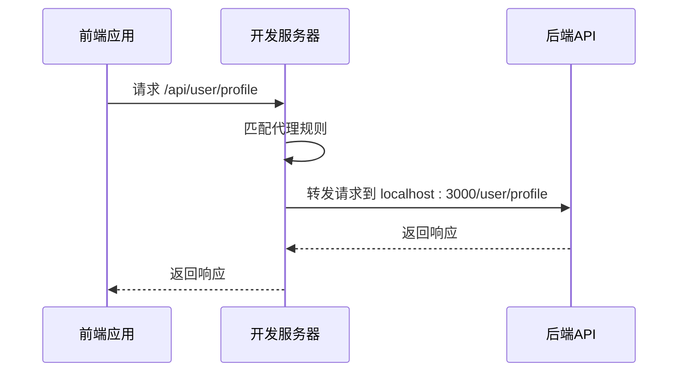
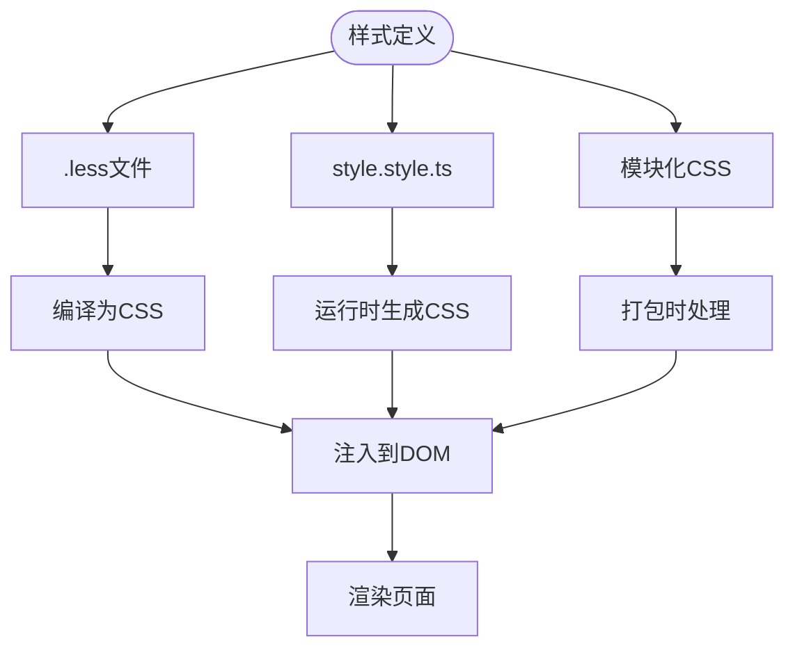
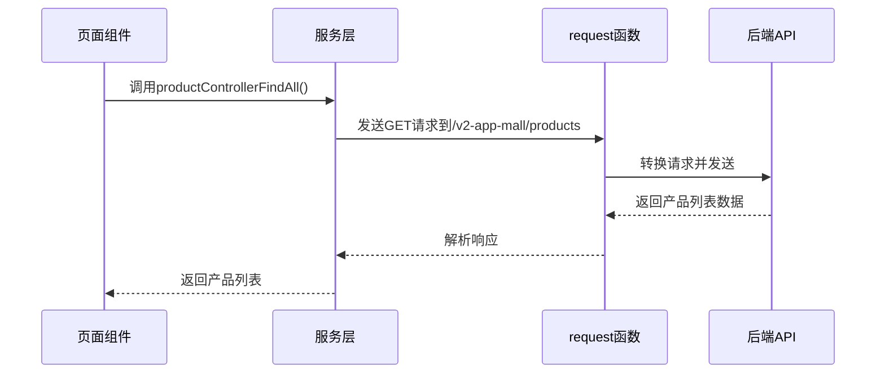
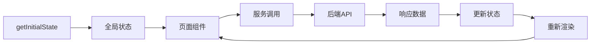
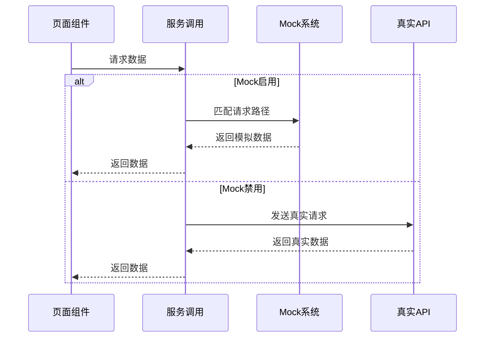

# 前端架构

<cite>
**本文档中引用的文件**  
- [app.tsx](file://apps/admin-web/src/app.tsx)
- [access.ts](file://apps/admin-web/src/access.ts)
- [config.ts](file://apps/admin-web/config/config.ts)
- [routes.ts](file://apps/admin-web/config/routes.ts)
- [proxy.ts](file://apps/admin-web/config/proxy.ts)
- [global.ts](file://apps/admin-web/src/models/global.ts)
- [index.ts](file://apps/admin-web/src/services/mall/index.ts)
- [product.ts](file://apps/admin-web/src/services/mall/product.ts)
- [adminUser.ts](file://apps/admin-web/src/services/mall/adminUser.ts)
- [service.ts](file://apps/admin-web/src/pages/dashboard/analysis/service.ts)
- [HeaderDropdown.tsx](file://apps/admin-web/src/components/HeaderDropdown/index.tsx)
- [Guide.tsx](file://apps/admin-web/src/components/Guide/Guide.tsx)
- [AvatarDropdown.tsx](file://apps/admin-web/src/components/RightContent/AvatarDropdown.tsx)
- [style.style.ts](file://apps/admin-web/src/pages/dashboard/analysis/style.style.ts)
- [_mock.ts](file://apps/admin-web/src/pages/account/center/_mock.ts)
</cite>

## 目录
1. [项目结构](#项目结构)
2. [核心架构与MVC模式](#核心架构与mvc模式)
3. [全局配置与权限控制](#全局配置与权限控制)
4. [路由与代理配置](#路由与代理配置)
5. [页面组织与路由映射](#页面组织与路由映射)
6. [组件设计与样式管理](#组件设计与样式管理)
7. [服务层与数据交互](#服务层与数据交互)
8. [数据流与Mock机制](#数据流与mock机制)
9. [最佳实践指导](#最佳实践指导)

## 项目结构

admin-web前端应用采用UmiJS和Ant Design Pro框架构建，遵循清晰的模块化结构。项目根目录下的`apps/admin-web`包含完整的前端代码，主要分为`config`、`src`、`public`等目录。

`src`目录是核心源码所在，包含`components`（可复用UI组件）、`models`（状态管理）、`pages`（页面组件）、`services`（API服务）等关键模块。这种组织方式体现了MVC模式中的关注点分离原则，将视图、控制器和模型逻辑清晰地划分到不同目录中。



**图示来源**  
- [apps/admin-web](file://apps/admin-web)

## 核心架构与MVC模式

admin-web应用基于UmiJS框架实现了现代化的MVC架构模式。UmiJS作为路由和插件管理的核心，与Ant Design Pro提供的UI组件库深度集成，构建了一个高效、可维护的前端应用架构。

在MVC模式中，`pages`目录中的组件扮演View（视图）的角色，负责UI展示和用户交互；`services`目录中的API封装作为Model（模型），管理数据获取和业务逻辑；而UmiJS的路由系统和`app.tsx`中的全局配置则承担Controller（控制器）的职责，协调视图和模型之间的交互。

这种架构通过UmiJS的约定式路由机制实现了自动化的页面映射，开发者只需在`src/pages`目录下创建相应文件，框架就会自动生成对应的路由配置，大大提高了开发效率。

**本节来源**  
- [app.tsx](file://apps/admin-web/src/app.tsx)
- [config.ts](file://apps/admin-web/config/config.ts)

## 全局配置与权限控制

### app.tsx中的全局配置

`app.tsx`文件是应用的运行时配置中心，通过导出特定的函数和配置对象来定义应用的全局行为。该文件主要包含三个核心配置：`getInitialState`、`layout`和`request`。

`getInitialState`函数在应用初始化时执行，用于获取全局状态。它通过调用`getCurrentAdminUserProfile`服务获取当前用户信息，并根据用户状态决定是否重定向到登录页面。这个全局状态包含了用户信息、加载状态和应用设置，为整个应用提供了统一的数据源。



**图示来源**  
- [app.tsx](file://apps/admin-web/src/app.tsx)
- [adminUser.ts](file://apps/admin-web/src/services/mall/adminUser.ts)

### 权限控制机制

权限控制通过`access.ts`文件实现，这是一个权限定义函数，基于`initialState`中的用户信息来判断用户权限。该机制利用UmiJS的access插件，实现了细粒度的路由级权限控制。

权限系统的核心是返回一个包含各种权限标识的对象，如`canAdmin`权限通过检查用户角色是否为'admin'来确定。这种基于角色的访问控制（RBAC）模式使得权限管理更加灵活和可扩展。



**图示来源**  
- [access.ts](file://apps/admin-web/src/access.ts)
- [app.tsx](file://apps/admin-web/src/app.tsx)

**本节来源**  
- [app.tsx](file://apps/admin-web/src/app.tsx#L1-L174)
- [access.ts](file://apps/admin-web/src/access.ts#L1-L13)

## 路由与代理配置

### 路由配置机制

路由配置主要由`config/routes.ts`文件定义，采用UmiJS的约定式路由配置方式。该文件导出一个路由配置数组，每个路由对象包含`path`、`component`、`routes`（子路由）、`redirect`、`wrappers`等属性。

路由配置采用了模块化的设计，将不同功能区域的页面分组管理。例如，仪表盘（dashboard）、表单（form）、列表（list）等都作为顶级路由，每个顶级路由下又包含多个子路由。这种层级化的路由结构使得应用导航更加清晰有序。

```mermaid
graph TB
Root[/] --> Dashboard[dashboard]
Root --> Form[form]
Root --> List[list]
Root --> Profile[profile]
Root --> Result[result]
Root --> Exception[exception]
Root --> Account[account]
Dashboard --> Analysis[analysis]
Dashboard --> Monitor[monitor]
Dashboard --> Workplace[workplace]
Form --> Basic[basic-form]
Form --> Step[step-form]
Form --> Advanced[advanced-form]
List --> Table[table-list]
List --> BasicList[basic-list]
List --> Card[card-list]
List --> Search[search]
Search --> Articles[articles]
Search --> Projects[projects]
Search --> Applications[applications]
```

**图示来源**  
- [routes.ts](file://apps/admin-web/config/routes.ts)

### 代理配置机制

代理配置在`config/proxy.ts`文件中定义，主要用于解决开发环境下的跨域问题。该配置通过`http-proxy-middleware`实现，将前端开发服务器的API请求代理到后端服务器。

代理配置支持多环境设置，包括`dev`、`test`、`pre`等不同环境的代理规则。当前配置中，`test`环境的代理将所有以`/api/`开头的请求转发到`localhost:3000`，并设置了`changeOrigin: true`以修改请求头中的origin，确保后端服务器能正确处理请求。



**图示来源**  
- [proxy.ts](file://apps/admin-web/config/proxy.ts)
- [config.ts](file://apps/admin-web/config/config.ts)

**本节来源**  
- [config.ts](file://apps/admin-web/config/config.ts#L1-L182)
- [routes.ts](file://apps/admin-web/config/routes.ts#L1-L275)
- [proxy.ts](file://apps/admin-web/config/proxy.ts#L1-L44)

## 页面组织与路由映射

### 页面目录结构

`src/pages`目录是应用页面组件的集中存放地，采用功能模块化的组织方式。每个功能模块（如dashboard、form、list等）都有独立的子目录，目录结构与路由配置保持一致。

页面组件的命名和路径遵循UmiJS的约定式路由规则：`src/pages/dashboard/analysis/index.tsx`对应路由`/dashboard/analysis`。这种约定优于配置的方式减少了路由配置的复杂性，提高了开发效率。

### 路由映射关系

路由映射关系在`routes.ts`文件中明确定义，每个路由配置对象的`component`属性指向对应的页面组件路径。UmiJS会自动解析这些路径并加载相应的组件。

```mermaid
classDiagram
class DashboardAnalysis {
+render() : JSX.Element
}
class DashboardMonitor {
+render() : JSX.Element
}
class DashboardWorkplace {
+render() : JSX.Element
}
class FormBasic {
+render() : JSX.Element
}
class FormStep {
+render() : JSX.Element
}
class FormAdvanced {
+render() : JSX.Element
}
DashboardAnalysis --> "/dashboard/analysis" : 路由映射
DashboardMonitor --> "/dashboard/monitor" : 路由映射
DashboardWorkplace --> "/dashboard/workplace" : 路由映射
FormBasic --> "/form/basic-form" : 路由映射
FormStep --> "/form/step-form" : 路由映射
FormAdvanced --> "/form/advanced-form" : 路由映射
```

**图示来源**  
- [routes.ts](file://apps/admin-web/config/routes.ts)
- [src/pages](file://apps/admin-web/src/pages)

**本节来源**  
- [routes.ts](file://apps/admin-web/config/routes.ts#L1-L275)

## 组件设计与样式管理

### 可复用UI组件设计

`src/components`目录存放可复用的UI组件，这些组件遵循单一职责原则，每个组件只负责特定的UI功能。例如，`HeaderDropdown`组件封装了下拉菜单的通用逻辑，`AvatarDropdown`组件处理用户头像相关的交互。

组件设计采用了TypeScript的类型系统，通过定义清晰的Props接口来确保组件的类型安全。同时，利用Ant Design的组件和样式变量，保持了UI风格的一致性。

```mermaid
classDiagram
class HeaderDropdown {
+overlayClassName? : string
+placement? : 'bottomLeft' | 'bottomRight' | 'topLeft' | 'topCenter' | 'topRight' | 'bottomCenter'
+render() : JSX.Element
}
class AvatarDropdown {
+menu? : boolean
+children? : React.ReactNode
+AvatarName() : JSX.Element
+render() : JSX.Element
}
class Guide {
+name : string
+render() : JSX.Element
}
HeaderDropdown <|-- AvatarDropdown : 继承
Guide --> "antd" : 依赖
HeaderDropdown --> "antd" : 依赖
AvatarDropdown --> "antd" : 依赖
```

**图示来源**  
- [HeaderDropdown.tsx](file://apps/admin-web/src/components/HeaderDropdown/index.tsx)
- [AvatarDropdown.tsx](file://apps/admin-web/src/components/RightContent/AvatarDropdown.tsx)
- [Guide.tsx](file://apps/admin-web/src/components/Guide/Guide.tsx)

### 样式管理策略

样式管理采用了多种技术结合的方式，包括Less、CSS-in-JS（通过`antd-style`）和模块化CSS。对于简单的样式，使用`.less`文件进行管理；对于需要动态样式的复杂组件，使用`createStyles`函数创建动态样式。

`style.style.ts`文件展示了CSS-in-JS的使用方式，通过`createStyles`函数创建样式钩子，利用Ant Design的token系统实现主题一致性。这种方式不仅支持动态样式计算，还能自动处理CSS变量和响应式设计。



**图示来源**  
- [Guide.less](file://apps/admin-web/src/components/Guide/Guide.less)
- [style.style.ts](file://apps/admin-web/src/pages/dashboard/analysis/style.style.ts)

**本节来源**  
- [HeaderDropdown.tsx](file://apps/admin-web/src/components/HeaderDropdown/index.tsx#L1-L42)
- [Guide.tsx](file://apps/admin-web/src/components/Guide/Guide.tsx#L1-L24)
- [AvatarDropdown.tsx](file://apps/admin-web/src/components/RightContent/AvatarDropdown.tsx#L1-L143)
- [style.style.ts](file://apps/admin-web/src/pages/dashboard/analysis/style.style.ts#L1-L161)

## 服务层与数据交互

### API封装机制

`src/services`目录是应用的服务层，负责与后端API进行数据交互。服务层采用分层设计，`mall`目录下按业务模块组织服务文件，如`product.ts`、`adminUser.ts`等，每个文件封装了对应模块的API调用。

服务层通过UmiJS的`request`函数进行HTTP请求，该函数基于axios封装，提供了统一的请求配置、拦截器和错误处理机制。每个API调用都定义了清晰的请求参数和响应类型，确保类型安全。

```mermaid
classDiagram
class ProductService {
+productControllerFindAll(params) : Promise<Product[]>
+productControllerCreate(body) : Promise<any>
+productControllerFindOne(params) : Promise<Product>
}
class AdminUserService {
+findAllAdminUser(params) : Promise<CommonRes & { data? : CommonPageRes & { records? : AdminUserVo[] } }>
+createAdminUser(body) : Promise<CommonRes & { data? : AdminUserVo }>
+deleteManyAdminUser(body) : Promise<CommonRes & { data? : Boolean }>
+findAdminUserById(params) : Promise<CommonRes & { data? : AdminUserVo }>
+updateAdminUser(params, body) : Promise<CommonRes & { data? : Boolean }>
+deleteAdminUser(params) : Promise<CommonRes & { data? : Boolean }>
+loginAdminUser(body) : Promise<CommonRes & { data? : String }>
+getCurrentAdminUserProfile() : Promise<CommonRes & { data? : AdminUserVo }>
+registerAdminUser(body) : Promise<CommonRes & { data? : AdminUserVo }>
}
ProductService --> "request" : 使用
AdminUserService --> "request" : 使用
"request" --> "axios" : 基于
```

**图示来源**  
- [product.ts](file://apps/admin-web/src/services/mall/product.ts)
- [adminUser.ts](file://apps/admin-web/src/services/mall/adminUser.ts)
- [index.ts](file://apps/admin-web/src/services/mall/index.ts)

### 业务模块服务调用

服务层通过`index.ts`文件统一导出所有业务模块的服务，形成一个服务聚合层。这种设计模式使得服务调用更加方便，开发者只需导入`services/mall`即可访问所有业务服务。

业务模块服务调用遵循RESTful设计原则，每个服务函数对应一个特定的HTTP请求。例如，`productControllerFindAll`对应GET请求获取产品列表，`productControllerCreate`对应POST请求创建新产品。



**图示来源**  
- [product.ts](file://apps/admin-web/src/services/mall/product.ts)
- [adminUser.ts](file://apps/admin-web/src/services/mall/adminUser.ts)

**本节来源**  
- [index.ts](file://apps/admin-web/src/services/mall/index.ts#L1-L45)
- [product.ts](file://apps/admin-web/src/services/mall/product.ts#L1-L38)
- [adminUser.ts](file://apps/admin-web/src/services/mall/adminUser.ts#L1-L122)

## 数据流与Mock机制

### 前端数据流

应用的数据流遵循单向数据流原则，从全局状态`initialState`开始，通过UmiJS的模型系统向下传递到各个页面组件。页面组件通过调用服务层API获取数据，并将数据更新到组件状态中，最后渲染到UI界面。

全局状态在`app.tsx`中通过`getInitialState`函数初始化，包含用户信息、应用设置等全局数据。页面组件通过`useModel`钩子访问这些全局状态，实现跨组件的数据共享。



**图示来源**  
- [app.tsx](file://apps/admin-web/src/app.tsx)
- [global.ts](file://apps/admin-web/src/models/global.ts)

### Mock数据机制

Mock数据机制在`_mock.ts`文件中实现，用于在开发阶段模拟后端API响应。UmiJS的Mock系统允许开发者定义请求路径和对应的响应数据，支持动态数据生成和复杂的数据结构。

Mock配置采用键值对的形式，键为请求方法和路径的组合，值为返回数据的生成函数。这种方式使得Mock数据更加灵活，可以模拟各种业务场景和边界条件。



**图示来源**  
- [_mock.ts](file://apps/admin-web/src/pages/account/center/_mock.ts)
- [config.ts](file://apps/admin-web/config/config.ts)

**本节来源**  
- [app.tsx](file://apps/admin-web/src/app.tsx#L1-L174)
- [global.ts](file://apps/admin-web/src/models/global.ts#L1-L14)
- [_mock.ts](file://apps/admin-web/src/pages/account/center/_mock.ts#L1-L250)
- [service.ts](file://apps/admin-web/src/pages/dashboard/analysis/service.ts#L1-L7)

## 最佳实践指导

### 组件复用实践

1. **单一职责原则**：每个组件只负责一个特定的功能，避免功能过于复杂。
2. **类型安全**：使用TypeScript定义清晰的Props接口，确保组件的类型安全。
3. **样式隔离**：使用CSS Modules或CSS-in-JS避免样式冲突，保持组件的独立性。
4. **可访问性**：遵循WCAG标准，确保组件对所有用户都可用。

### 页面开发实践

1. **路由约定**：遵循UmiJS的约定式路由，保持目录结构与路由路径的一致性。
2. **状态管理**：合理使用UmiJS的模型系统，避免过度使用全局状态。
3. **性能优化**：使用React.memo、useCallback等优化手段减少不必要的渲染。
4. **错误处理**：在页面层面处理可能的错误，提供友好的用户提示。

### API集成实践

1. **服务分层**：按业务模块组织服务文件，保持服务层的清晰结构。
2. **类型定义**：为每个API调用定义清晰的请求参数和响应类型。
3. **错误处理**：利用UmiJS的request配置统一处理HTTP错误和业务错误。
4. **Mock优先**：在开发阶段优先使用Mock数据，提高开发效率。

**本节来源**  
- [app.tsx](file://apps/admin-web/src/app.tsx)
- [access.ts](file://apps/admin-web/src/access.ts)
- [config.ts](file://apps/admin-web/config/config.ts)
- [routes.ts](file://apps/admin-web/config/routes.ts)
- [services](file://apps/admin-web/src/services)
- [components](file://apps/admin-web/src/components)
- [pages](file://apps/admin-web/src/pages)