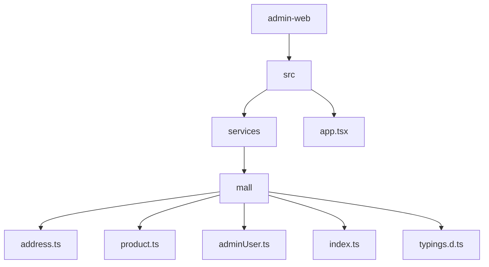
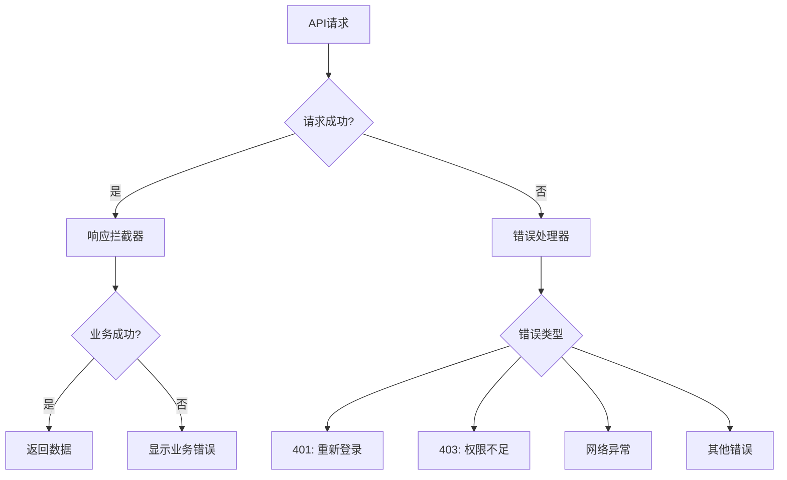

# API服务封装

<cite>
**本文档引用的文件**
- [address.ts](file://apps\admin-web\src\services\mall\address.ts)
- [product.ts](file://apps\admin-web\src\services\mall\product.ts)
- [adminUser.ts](file://apps\admin-web\src\services\mall\adminUser.ts)
- [index.ts](file://apps\admin-web\src\services\mall\index.ts)
- [app.tsx](file://apps\admin-web\src\app.tsx)
- [typings.d.ts](file://apps\admin-web\src\services\mall\typings.d.ts)
</cite>

## 目录

1. [项目结构](#项目结构)
2. [核心服务文件分析](#核心服务文件分析)
3. [API服务封装机制](#api服务封装机制)
4. [统一导出聚合模式](#统一导出聚合模式)
5. [请求配置与拦截器](#请求配置与拦截器)
6. [服务调用示例](#服务调用示例)
7. [错误处理策略](#错误处理策略)

## 项目结构

根据项目结构，API服务主要位于`apps/admin-web/src/services/mall/`目录下，该目录包含了多个业务模块的服务文件。



**图源**
- [project_structure](file://)

## 核心服务文件分析

### 地址服务 (address.ts)

地址服务文件封装了与地址管理相关的API调用，包括地址列表状态分组查询等操作。

**节源**
- [address.ts](file://apps\admin-web\src\services\mall\address.ts#L1-L19)

### 产品服务 (product.ts)

产品服务文件提供了商品管理的完整API封装，包括商品的增删改查操作。

**节源**
- [product.ts](file://apps\admin-web\src\services\mall\product.ts#L1-L38)

### 管理员用户服务 (adminUser.ts)

管理员用户服务文件包含了用户管理的完整功能，包括用户查询、创建、更新、删除以及登录注册等操作。

**节源**
- [adminUser.ts](file://apps\admin-web\src\services\mall\adminUser.ts#L1-L122)

## API服务封装机制

### 请求路径定义

API服务通过在请求函数中直接定义完整的RESTful API路径来实现请求路由。路径通常包含版本号和资源名称，如`/v2-app-mall/address/listStatusGroup`。

```typescript
// 示例：地址列表状态分组查询
return request<API.CommonRes & { data?: API.AddressGroupVO }>('/v2-app-mall/address/listStatusGroup', {
  method: 'GET',
  params: {
    ...params,
  },
  ...(options || {}),
});
```

### 参数序列化

服务函数通过参数解构和对象展开的方式处理请求参数。对于GET请求，参数通过`params`字段传递；对于POST/PUT等请求，数据通过`data`字段传递。

```typescript
// GET请求参数处理
export async function addressControllerListStatusGroup(
  params: API.AddressControllerListStatusGroupParams,
  options?: { [key: string]: any },
) {
  return request<API.CommonRes & { data?: API.AddressGroupVO }>('/v2-app-mall/address/listStatusGroup', {
    method: 'GET',
    params: {
      ...params,
    },
    ...(options || {}),
  });
}
```

### HTTP方法封装

不同HTTP方法通过`method`配置项进行封装：

- **GET请求**: 使用`method: 'GET'`，参数通过`params`传递
- **POST请求**: 使用`method: 'POST'`，数据通过`data`传递，设置`Content-Type`为`application/json`
- **PUT请求**: 使用`method: 'PUT'`，用于资源更新
- **DELETE请求**: 使用`method: 'DELETE'`，用于资源删除

```typescript
// POST请求示例
export async function productControllerCreate(body: API.CreateProductDto, options?: { [key: string]: any }) {
  return request<any>('/v2-app-mall/products', {
    method: 'POST',
    headers: {
      'Content-Type': 'application/json',
    },
    data: body,
    ...(options || {}),
  });
}
```

### 响应数据类型定义

服务函数使用泛型来定义响应数据的类型，确保类型安全。类型定义在`typings.d.ts`文件中，通过`API`命名空间组织。

```typescript
// 响应类型定义示例
declare namespace API {
  type AddressControllerListStatusGroupParams = {
    /** 站点ID */
    siteId: string;
    /** 纬度 */
    lat: string;
    /** 经度 */
    lng: string;
  };

  type AddressGroupVO = {
    /** 组名 */
    groupName: string;
    /** 地址列表 */
    addressList: string[];
  };
}
```

**节源**
- [typings.d.ts](file://apps\admin-web\src\services\mall\typings.d.ts#L1-L800)

## 统一导出聚合模式

`index.ts`文件采用了模块聚合模式，将所有业务模块的服务统一导入并导出，形成一个集中的API服务入口。

```typescript
// @ts-ignore
/* eslint-disable */
// API 更新时间：
// API 唯一标识：
import * as app from './app';
import * as address from './address';
import * as member from './member';
import * as guanggaojiekou from './guanggaojiekou';
import * as article from './article';
import * as calc from './calc';
import * as adminUser from './adminUser';
// ... 其他导入

export default {
  app,
  address,
  member,
  guanggaojiekou,
  article,
  calc,
  adminUser,
  // ... 其他导出
};
```

这种模式的优势包括：

1. **统一入口**: 所有API服务通过一个入口文件访问
2. **命名空间管理**: 通过对象属性的方式组织不同模块的服务
3. **易于维护**: 新增或移除服务模块只需修改导入和导出
4. **避免命名冲突**: 不同模块的同名函数可以通过命名空间区分

**节源**
- [index.ts](file://apps\admin-web\src\services\mall\index.ts#L1-L45)

## 请求配置与拦截器

### 全局请求配置

在`app.tsx`中配置了全局的请求设置，包括基础URL、超时时间、错误处理、请求拦截器和响应拦截器。

```typescript
export const request: RequestConfig = {
  baseURL: API_URL,
  timeout: 10000,

  // 错误处理配置
  errorConfig: {
    errorHandler: (error: any, opts: any) => {
      if (opts?.skipErrorHandler) throw error;

      if (error.response) {
        const { status, data } = error.response;

        // 捕获 401 Unauthorized
        if (status === 401) {
          message.error('登录已过期，请重新登录');
          localStorage.removeItem('token');
          history.push(LOGIN_PATH);
        }
        // 捕获 403 Forbidden
        else if (status === 403) {
          message.error(data?.msg || '您没有权限访问此资源');
        }
        // 其他 HTTP 错误
        else {
          message.error(data?.msg || '网络请求错误');
        }
      } else if (error.request) {
        // 请求发出但没有收到响应
        message.error('网络异常，无法连接到服务器');
      } else {
        message.error('请求配置错误');
      }
    },
  },

  // 请求拦截器 (注入 Token)
  requestInterceptors: [
    (config: any) => {
      const token = localStorage.getItem('token');
      if (token) {
        config.headers = {
          ...config.headers,
          'jxe-token': `${token}`,
        };
      }
      return config;
    },
  ],

  // 响应拦截器 (处理业务数据解包)
  responseInterceptors: [
    (response) => {
      const data = response.data as IApiResponse<any>;
      console.log('响应数据:', data);

      // 判断是否为后端返回的标准 JSON 结构
      if (data && typeof data === 'object' && 'status' in data) {
        // 业务成功
        if (data.status === ApiCode.SUCCESS) {
          return response; // 解包
        }
        // 业务失败
        else {
          message.error(data.prompt || '业务处理失败');
          return Promise.reject(data);
        }
      }

      // 非 JSON 响应 (如文件流) 原样返回
      return response;
    },
  ],
};
```

### 拦截器工作机制

1. **请求拦截器**: 在每个请求发送前自动注入认证令牌（token）
2. **响应拦截器**: 统一处理响应数据，解包业务数据结构
3. **错误处理器**: 集中处理各种HTTP错误状态码

**节源**
- [app.tsx](file://apps\admin-web\src\app.tsx#L99-L173)

## 服务调用示例

### 基本调用方式

```typescript
import { address, product, adminUser } from '@/services/mall';

// 获取地址列表状态分组
const addressGroup = await address.addressControllerListStatusGroup({
  siteId: '123',
  lat: '30.123',
  lng: '120.456'
});

// 创建新产品
const newProduct = await product.productControllerCreate({
  title: '新产品',
  description: '产品描述',
  mainImage: 'image_url',
  sku: {
    price: 100,
    stock: 50,
    attributes: {}
  }
});

// 查询管理员用户
const user = await adminUser.findAdminUserById({
  id: 'user_123'
});
```

### Promise处理

服务函数返回Promise，可以使用async/await或then/catch进行处理：

```typescript
// 使用 async/await
try {
  const result = await adminUser.findAllAdminUser({
    current: 1,
    pageSize: 10
  });
  console.log('用户列表:', result);
} catch (error) {
  console.error('请求失败:', error);
}

// 使用 then/catch
adminUser.getCurrentAdminUserProfile()
  .then(response => {
    console.log('当前用户信息:', response.data);
  })
  .catch(error => {
    console.error('获取用户信息失败:', error);
  });
```

## 错误处理策略

### 分层错误处理

系统采用了分层的错误处理策略：

1. **HTTP层错误处理**: 由`errorConfig.errorHandler`处理HTTP状态码错误
2. **业务层错误处理**: 由`responseInterceptors`处理业务逻辑错误
3. **应用层错误处理**: 在调用处使用try/catch处理特定业务逻辑

### 错误类型

1. **认证错误 (401)**: 自动清除token并跳转登录页
2. **权限错误 (403)**: 显示权限不足提示
3. **网络错误**: 显示网络连接异常提示
4. **业务错误**: 显示后端返回的业务提示信息



**图源**
- [app.tsx](file://apps\admin-web\src\app.tsx#L104-L132)
- [app.tsx](file://apps\admin-web\src\app.tsx#L149-L170)