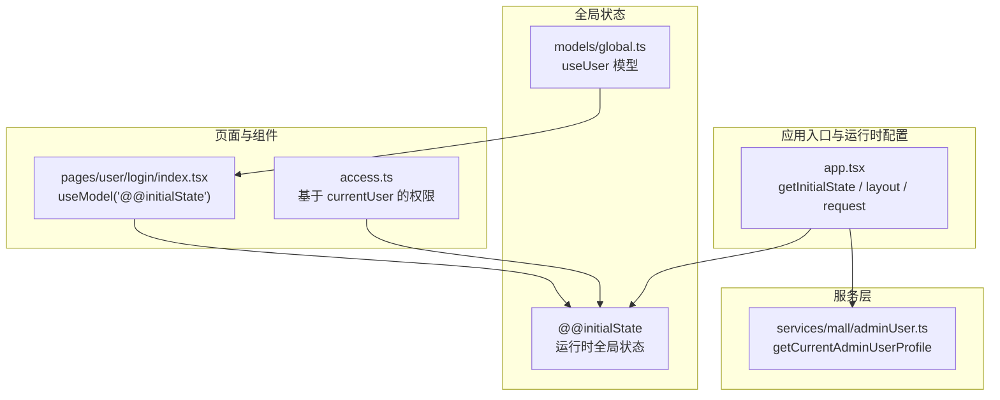
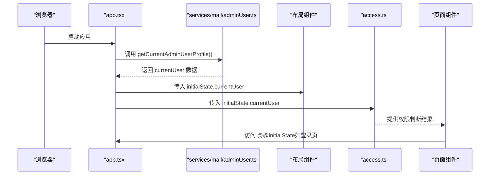
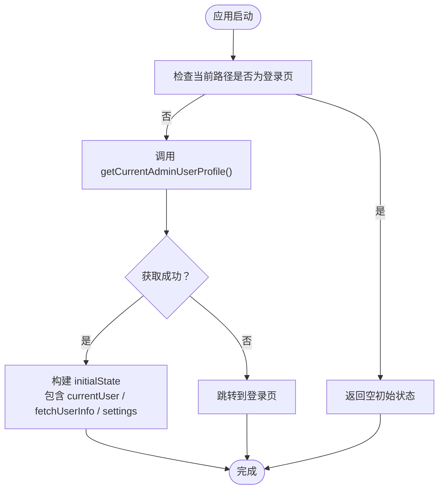
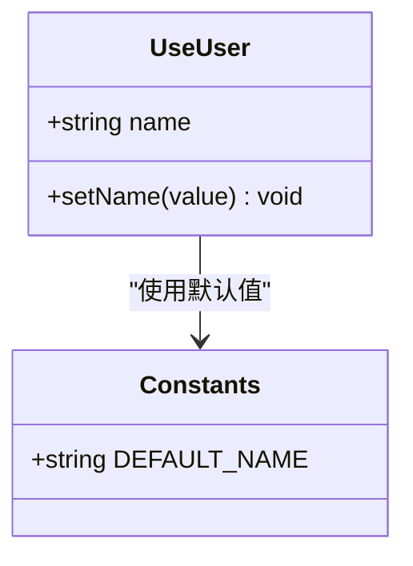
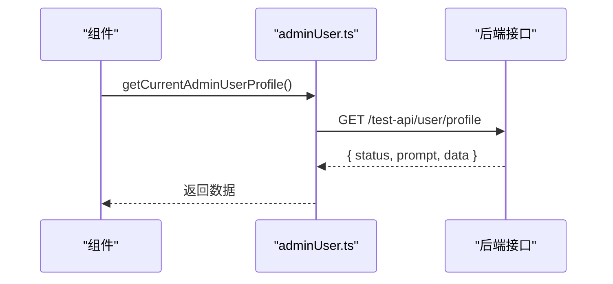
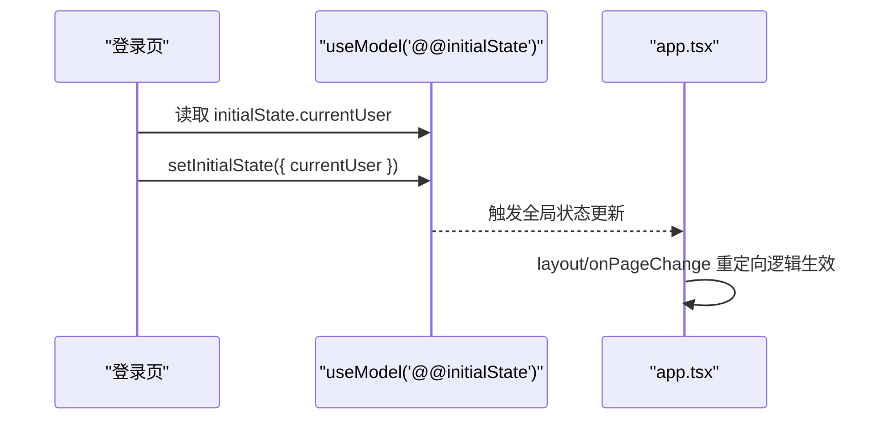
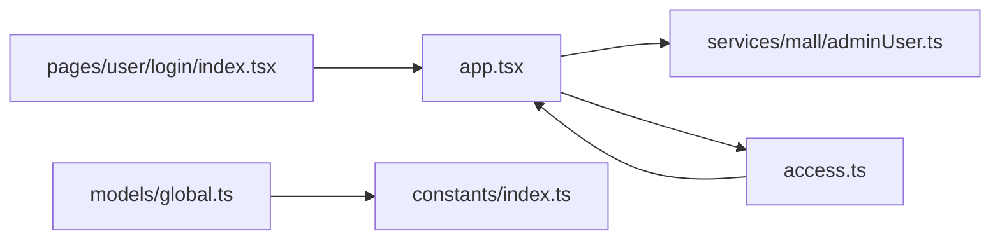

# 全局状态管理

<cite>
**本文引用的文件**
- [apps/admin-web/src/models/global.ts](file://apps/admin-web/src/models/global.ts)
- [apps/admin-web/src/constants/index.ts](file://apps/admin-web/src/constants/index.ts)
- [apps/admin-web/src/app.tsx](file://apps/admin-web/src/app.tsx)
- [apps/admin-web/src/access.ts](file://apps/admin-web/src/access.ts)
- [apps/admin-web/src/services/mall/adminUser.ts](file://apps/admin-web/src/services/mall/adminUser.ts)
- [apps/admin-web/src/pages/user/login/index.tsx](file://apps/admin-web/src/pages/user/login/index.tsx)
- [apps/admin-web/src/types/index.ts](file://apps/admin-web/src/types/index.ts)
- [apps/admin-web/typings.d.ts](file://apps/admin-web/typings.d.ts)
- [apps/admin-web/src/services/mall/typings.d.ts](file://apps/admin-web/src/services/mall/typings.d.ts)
</cite>

## 目录
1. [引言](#引言)
2. [项目结构](#项目结构)
3. [核心组件](#核心组件)
4. [架构总览](#架构总览)
5. [详细组件分析](#详细组件分析)
6. [依赖分析](#依赖分析)
7. [性能考虑](#性能考虑)
8. [故障排查指南](#故障排查指南)
9. [结论](#结论)
10. [附录](#附录)

## 引言
本文件围绕基于 Umi Max 的全局状态管理进行系统化解析，重点聚焦以下目标：
- 全局模型 global.ts 中 useUser 模型的实现与使用方式（useState、状态字段 name 与更新函数 setName）
- 应用初始化阶段通过 app.tsx 的 getInitialState 加载用户数据并与布局配置集成，实现用户信息的全局共享
- UmiJS 模型系统的工作原理、状态订阅机制以及在组件中通过 useModel 访问状态的模式
- 页面与组件中使用全局状态的最佳实践，以及与服务层数据获取的协同关系

## 项目结构
本项目的前端采用 Umi Max，全局状态主要通过两类方式实现：
- 运行时全局状态（InitialState）：通过 app.tsx 的 getInitialState 在应用启动时加载用户信息，并在布局与权限中共享
- 模型系统（Models）：通过 src/models 下的自定义模型（如 global.ts）提供局部或跨页面的状态与更新能力

图表来源
- [apps/admin-web/src/app.tsx](file://apps/admin-web/src/app.tsx#L1-L174)
- [apps/admin-web/src/models/global.ts](file://apps/admin-web/src/models/global.ts#L1-L14)
- [apps/admin-web/src/services/mall/adminUser.ts](file://apps/admin-web/src/services/mall/adminUser.ts#L103-L109)
- [apps/admin-web/src/pages/user/login/index.tsx](file://apps/admin-web/src/pages/user/login/index.tsx#L76-L82)
- [apps/admin-web/src/access.ts](file://apps/admin-web/src/access.ts#L1-L13)

章节来源
- [apps/admin-web/src/app.tsx](file://apps/admin-web/src/app.tsx#L1-L174)
- [apps/admin-web/src/models/global.ts](file://apps/admin-web/src/models/global.ts#L1-L14)

## 核心组件
- 运行时全局状态（InitialState）
  - 作用：在应用启动时加载用户信息，供布局、权限、页面等共享
  - 关键点：getInitialState 返回包含 currentUser、fetchUserInfo、settings 等字段的对象；layout 使用 initialState 渲染头像、水印与跳转逻辑；access 基于 currentUser 定义权限
- 模型系统（Models）
  - 作用：提供局部状态与更新函数，如 useUser 模型暴露 name 与 setName
  - 关键点：useUser 通过 useState 初始化 name，默认值来自 constants/index.ts 的 DEFAULT_NAME

章节来源
- [apps/admin-web/src/app.tsx](file://apps/admin-web/src/app.tsx#L18-L97)
- [apps/admin-web/src/access.ts](file://apps/admin-web/src/access.ts#L1-L13)
- [apps/admin-web/src/models/global.ts](file://apps/admin-web/src/models/global.ts#L1-L14)
- [apps/admin-web/src/constants/index.ts](file://apps/admin-web/src/constants/index.ts#L1-L2)

## 架构总览
Umi Max 的全局状态管理由“运行时全局状态”和“模型系统”共同构成，二者互补：
- 运行时全局状态负责“用户身份与全局配置”的一次性加载与共享
- 模型系统负责“局部状态与更新”的细粒度管理

图表来源
- [apps/admin-web/src/app.tsx](file://apps/admin-web/src/app.tsx#L27-L59)
- [apps/admin-web/src/services/mall/adminUser.ts](file://apps/admin-web/src/services/mall/adminUser.ts#L103-L109)
- [apps/admin-web/src/access.ts](file://apps/admin-web/src/access.ts#L1-L13)
- [apps/admin-web/src/pages/user/login/index.tsx](file://apps/admin-web/src/pages/user/login/index.tsx#L76-L82)

## 详细组件分析

### 运行时全局状态（app.tsx）
- getInitialState
  - 在页面刷新时执行，异步获取当前用户信息
  - 若非登录页且获取成功，则将 currentUser 注入 initialState
  - 若失败或未登录，则跳转到登录页
- layout
  - 使用 initialState 渲染头像、水印与页内跳转
  - onPageChange 中根据是否存在 currentUser 进行重定向
- request
  - 统一配置 baseURL、超时、错误处理、请求/响应拦截器
  - 自动注入 jxe-token，按业务约定解包响应

图表来源
- [apps/admin-web/src/app.tsx](file://apps/admin-web/src/app.tsx#L27-L59)

章节来源
- [apps/admin-web/src/app.tsx](file://apps/admin-web/src/app.tsx#L18-L97)
- [apps/admin-web/src/app.tsx](file://apps/admin-web/src/app.tsx#L99-L171)

### 模型系统（models/global.ts）
- useUser 模型
  - 使用 useState 定义 name 字段与 setName 更新函数
  - 默认值来源于 constants/index.ts 的 DEFAULT_NAME
  - 导出为 useUser，供组件通过 useModel 访问

图表来源
- [apps/admin-web/src/models/global.ts](file://apps/admin-web/src/models/global.ts#L1-L14)
- [apps/admin-web/src/constants/index.ts](file://apps/admin-web/src/constants/index.ts#L1-L2)

章节来源
- [apps/admin-web/src/models/global.ts](file://apps/admin-web/src/models/global.ts#L1-L14)
- [apps/admin-web/src/constants/index.ts](file://apps/admin-web/src/constants/index.ts#L1-L2)

### 服务层数据获取（services/mall/adminUser.ts）
- getCurrentAdminUserProfile
  - 通过 @umijs/max 的 request 发起 GET 请求，返回当前登录用户信息
  - 响应格式遵循统一的业务包装结构（status/prompt/data）

图表来源
- [apps/admin-web/src/services/mall/adminUser.ts](file://apps/admin-web/src/services/mall/adminUser.ts#L103-L109)

章节来源
- [apps/admin-web/src/services/mall/adminUser.ts](file://apps/admin-web/src/services/mall/adminUser.ts#L103-L109)

### 页面与组件中的使用（以登录页为例）
- 登录页通过 useModel('@@initialState') 获取与更新 initialState
- 与运行时全局状态协同，实现登录成功后的状态回写与页面跳转

图表来源
- [apps/admin-web/src/pages/user/login/index.tsx](file://apps/admin-web/src/pages/user/login/index.tsx#L76-L82)
- [apps/admin-web/src/app.tsx](file://apps/admin-web/src/app.tsx#L61-L97)

章节来源
- [apps/admin-web/src/pages/user/login/index.tsx](file://apps/admin-web/src/pages/user/login/index.tsx#L76-L82)

### 权限系统（access.ts）
- 基于 initialState.currentUser 判断角色，导出 canAdmin 等权限标识
- 与运行时全局状态强关联，确保权限判断依赖于真实用户身份

章节来源
- [apps/admin-web/src/access.ts](file://apps/admin-web/src/access.ts#L1-L13)

## 依赖分析
- 运行时全局状态依赖
  - app.tsx 依赖 services/mall/adminUser.ts 获取用户信息
  - access.ts 依赖 app.tsx 的 initialState.currentUser
  - 页面组件（如登录页）依赖 app.tsx 的 setInitialState 更新全局状态
- 模型系统依赖
  - models/global.ts 依赖 constants/index.ts 提供默认值
  - 组件通过 useModel 访问 useUser 模型

图表来源
- [apps/admin-web/src/app.tsx](file://apps/admin-web/src/app.tsx#L1-L174)
- [apps/admin-web/src/services/mall/adminUser.ts](file://apps/admin-web/src/services/mall/adminUser.ts#L103-L109)
- [apps/admin-web/src/access.ts](file://apps/admin-web/src/access.ts#L1-L13)
- [apps/admin-web/src/models/global.ts](file://apps/admin-web/src/models/global.ts#L1-L14)
- [apps/admin-web/src/constants/index.ts](file://apps/admin-web/src/constants/index.ts#L1-L2)
- [apps/admin-web/src/pages/user/login/index.tsx](file://apps/admin-web/src/pages/user/login/index.tsx#L76-L82)

章节来源
- [apps/admin-web/src/app.tsx](file://apps/admin-web/src/app.tsx#L1-L174)
- [apps/admin-web/src/services/mall/adminUser.ts](file://apps/admin-web/src/services/mall/adminUser.ts#L103-L109)
- [apps/admin-web/src/access.ts](file://apps/admin-web/src/access.ts#L1-L13)
- [apps/admin-web/src/models/global.ts](file://apps/admin-web/src/models/global.ts#L1-L14)
- [apps/admin-web/src/constants/index.ts](file://apps/admin-web/src/constants/index.ts#L1-L2)
- [apps/admin-web/src/pages/user/login/index.tsx](file://apps/admin-web/src/pages/user/login/index.tsx#L76-L82)

## 性能考虑
- 运行时全局状态仅在应用启动时加载一次，避免重复请求
- 通过 app.tsx 的 request 拦截器统一注入 token 与解包响应，减少页面层样板代码
- 模型系统 useUser 仅维护局部状态，避免不必要的全局重渲染

## 故障排查指南
- 登录态失效
  - 现象：401 未授权，自动跳转登录页
  - 处理：app.tsx 的 request.errorHandler 会清理本地 token 并跳转；确认服务端 JWT 有效
- 用户信息为空
  - 现象：layout 中头像/水印为空
  - 处理：检查 getInitialState 的 fetchUserInfo 流程与服务端返回；确认登录成功后 setInitialState 已写入 currentUser
- 权限判断异常
  - 现象：canAdmin 一直为 false
  - 处理：确认 access.ts 依赖的 currentUser 是否存在；检查 getInitialState 是否正确注入

章节来源
- [apps/admin-web/src/app.tsx](file://apps/admin-web/src/app.tsx#L99-L171)
- [apps/admin-web/src/app.tsx](file://apps/admin-web/src/app.tsx#L27-L59)
- [apps/admin-web/src/access.ts](file://apps/admin-web/src/access.ts#L1-L13)

## 结论
本项目通过“运行时全局状态 + 模型系统”的双轨设计实现了高效的全局状态管理：
- 运行时全局状态负责用户身份与全局配置的一次性加载与共享，确保布局与权限一致可用
- 模型系统提供局部状态与更新函数，满足页面级状态管理需求
- 与服务层协同，形成清晰的数据流：服务层负责数据获取，运行时全局状态负责数据注入，组件通过 useModel 访问

## 附录
- 类型与常量
  - IApiResponse 与 ApiCode 定义了统一的响应结构与业务状态码
  - DEFAULT_NAME 作为 useUser 模型的默认值来源
- 项目类型声明
  - 顶层 typings.d.ts 引入 @umijs/max/typings，确保 IDE 与编译器识别 Umi 的类型

章节来源
- [apps/admin-web/src/types/index.ts](file://apps/admin-web/src/types/index.ts#L1-L41)
- [apps/admin-web/src/constants/index.ts](file://apps/admin-web/src/constants/index.ts#L1-L2)
- [apps/admin-web/typings.d.ts](file://apps/admin-web/typings.d.ts#L1-L2)
- [apps/admin-web/src/services/mall/typings.d.ts](file://apps/admin-web/src/services/mall/typings.d.ts#L1-L120)