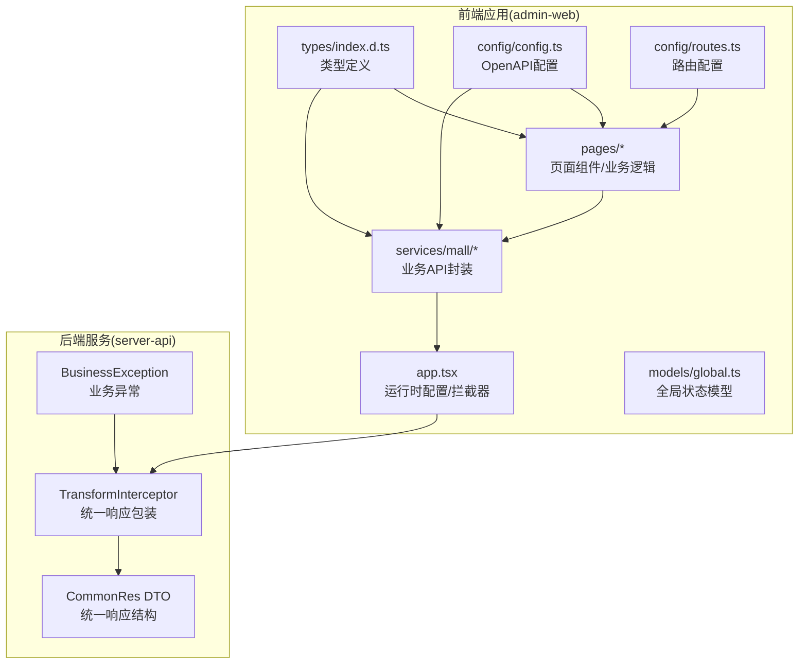
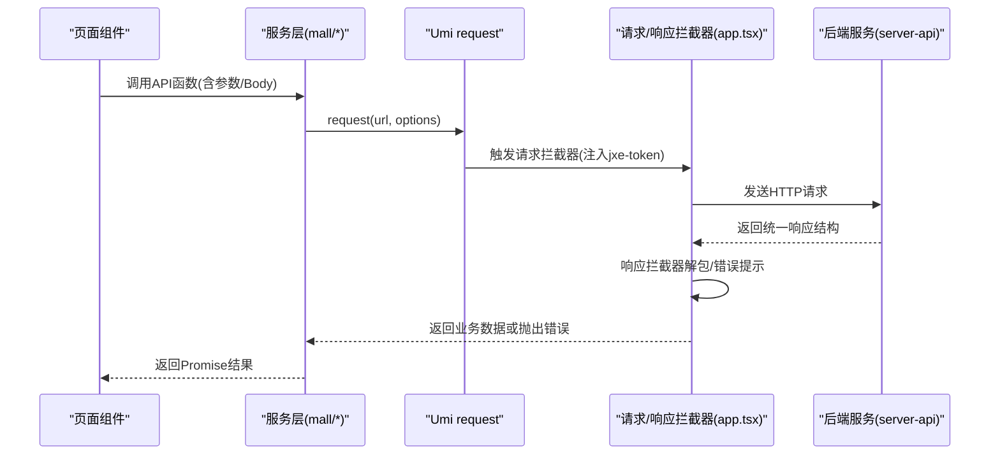
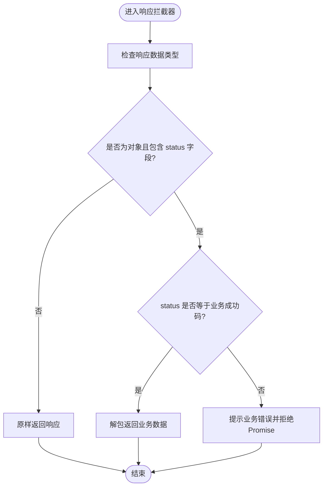
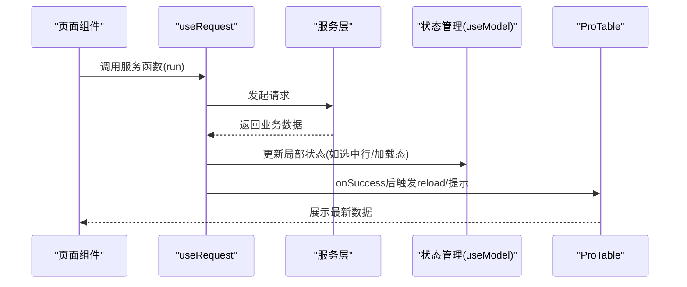
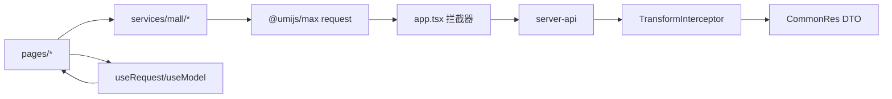

# 服务层与状态管理

<cite>
**本文引用的文件**
- [apps/admin-web/src/app.tsx](file://apps/admin-web/src/app.tsx)
- [apps/admin-web/src/models/global.ts](file://apps/admin-web/src/models/global.ts)
- [apps/admin-web/src/services/mall/index.ts](file://apps/admin-web/src/services/mall/index.ts)
- [apps/admin-web/src/services/mall/app.ts](file://apps/admin-web/src/services/mall/app.ts)
- [apps/admin-web/src/services/mall/product.ts](file://apps/admin-web/src/services/mall/product.ts)
- [apps/admin-web/src/services/mall/address.ts](file://apps/admin-web/src/services/mall/address.ts)
- [apps/admin-web/src/services/mall/adminUser.ts](file://apps/admin-web/src/services/mall/adminUser.ts)
- [apps/admin-web/src/constants/index.ts](file://apps/admin-web/src/constants/index.ts)
- [apps/admin-web/types/index.d.ts](file://apps/admin-web/types/index.d.ts)
- [apps/admin-web/src/pages/user/manage/index.tsx](file://apps/admin-web/src/pages/user/manage/index.tsx)
- [apps/admin-web/src/pages/list/table-list/index.tsx](file://apps/admin-web/src/pages/list/table-list/index.tsx)
- [apps/admin-web/src/pages/account/center/service.ts](file://apps/admin-web/src/pages/account/center/service.ts)
- [apps/admin-web/src/pages/dashboard/workplace/service.ts](file://apps/admin-web/src/pages/dashboard/workplace/service.ts)
- [apps/admin-web/config/config.ts](file://apps/admin-web/config/config.ts)
- [apps/admin-web/config/routes.ts](file://apps/admin-web/config/routes.ts)
- [apps/server-api/src/common/interceptors/transform.interceptor.ts](file://apps/server-api/src/common/interceptors/transform.interceptor.ts)
- [apps/server-api/src/common/dto/common-res.dto.ts](file://apps/server-api/src/common/dto/common-res.dto.ts)
- [apps/server-api/src/common/exceptions/business.exception.ts](file://apps/server-api/src/common/exceptions/business.exception.ts)
</cite>

## 目录
1. [引言](#引言)
2. [项目结构](#项目结构)
3. [核心组件](#核心组件)
4. [架构总览](#架构总览)
5. [详细组件分析](#详细组件分析)
6. [依赖关系分析](#依赖关系分析)
7. [性能考量](#性能考量)
8. [故障排查指南](#故障排查指南)
9. [结论](#结论)
10. [附录](#附录)

## 引言
本文件聚焦于 admin-web 的服务层架构与状态管理机制，重点解析以下方面：
- services 目录下 API 封装的设计模式与最佳实践
- mall/ 业务模块服务文件（如 product.ts、address.ts、adminUser.ts）如何封装对后端 RESTful API 的调用，包括请求参数处理、响应数据解构与错误处理
- app.tsx 中 request 配置的拦截器（requestInterceptors 与 responseInterceptors）如何实现统一认证（jxe-token 注入）与响应处理
- global.ts 中全局状态模型的定义与 UmiJS 模型系统（model）的集成方式
- 结合代码示例说明服务调用、状态更新与数据流管理的最佳实践

## 项目结构
admin-web 采用 Umi Max 作为前端框架，服务层通过 @umijs/max 的 request 统一封装 HTTP 请求；状态管理通过运行时配置 getInitialState 与 Umi 的 useModel/useRequest 等能力实现；类型定义来自 OpenAPI 生成的类型声明文件。

图表来源
- [apps/admin-web/src/app.tsx](file://apps/admin-web/src/app.tsx#L1-L174)
- [apps/admin-web/src/models/global.ts](file://apps/admin-web/src/models/global.ts#L1-L14)
- [apps/admin-web/src/services/mall/index.ts](file://apps/admin-web/src/services/mall/index.ts#L1-L45)
- [apps/admin-web/types/index.d.ts](file://apps/admin-web/types/index.d.ts#L1-L121)
- [apps/admin-web/config/config.ts](file://apps/admin-web/config/config.ts#L144-L181)
- [apps/admin-web/config/routes.ts](file://apps/admin-web/config/routes.ts#L1-L19)
- [apps/server-api/src/common/interceptors/transform.interceptor.ts](file://apps/server-api/src/common/interceptors/transform.interceptor.ts#L1-L42)
- [apps/server-api/src/common/dto/common-res.dto.ts](file://apps/server-api/src/common/dto/common-res.dto.ts#L1-L49)
- [apps/server-api/src/common/exceptions/business.exception.ts](file://apps/server-api/src/common/exceptions/business.exception.ts#L1-L34)

章节来源
- [apps/admin-web/src/app.tsx](file://apps/admin-web/src/app.tsx#L1-L174)
- [apps/admin-web/src/services/mall/index.ts](file://apps/admin-web/src/services/mall/index.ts#L1-L45)
- [apps/admin-web/config/config.ts](file://apps/admin-web/config/config.ts#L144-L181)
- [apps/admin-web/config/routes.ts](file://apps/admin-web/config/routes.ts#L1-L19)

## 核心组件
- 运行时配置与拦截器：在 app.tsx 中定义 baseURL、超时、错误处理策略、请求拦截器（注入 jxe-token）、响应拦截器（业务解包与错误提示）
- 全局状态模型：global.ts 提供基础的 useUser hook，演示如何以 React Hooks 形式组织全局状态
- 服务层封装：mall/ 下各业务模块文件以函数形式封装 RESTful API，统一使用 request，参数类型来自 OpenAPI 生成的类型
- 页面组件：通过 useRequest、useModel 等能力消费服务层，完成数据加载、状态更新与 UI 交互

章节来源
- [apps/admin-web/src/app.tsx](file://apps/admin-web/src/app.tsx#L99-L171)
- [apps/admin-web/src/models/global.ts](file://apps/admin-web/src/models/global.ts#L1-L14)
- [apps/admin-web/src/services/mall/index.ts](file://apps/admin-web/src/services/mall/index.ts#L1-L45)

## 架构总览
前端通过 @umijs/max 的 request 发起 HTTP 请求，请求拦截器统一注入 jxe-token，响应拦截器负责将后端统一响应结构解包为业务数据，错误处理策略集中于 errorConfig。后端通过 TransformInterceptor 将业务数据包装为统一响应结构，配合 CommonRes DTO 与 BusinessException 实现一致的错误语义。

图表来源
- [apps/admin-web/src/app.tsx](file://apps/admin-web/src/app.tsx#L99-L171)
- [apps/admin-web/src/services/mall/adminUser.ts](file://apps/admin-web/src/services/mall/adminUser.ts#L1-L122)
- [apps/server-api/src/common/interceptors/transform.interceptor.ts](file://apps/server-api/src/common/interceptors/transform.interceptor.ts#L1-L42)
- [apps/server-api/src/common/dto/common-res.dto.ts](file://apps/server-api/src/common/dto/common-res.dto.ts#L1-L49)

## 详细组件分析

### 服务层封装设计模式与最佳实践
- 设计模式
  - 函数式 API 封装：每个业务 API 以独立函数暴露，参数与返回值类型明确，便于调用与测试
  - 统一请求入口：所有请求通过 @umijs/max 的 request 发起，集中处理 baseURL、超时、拦截器等
  - 类型驱动：基于 OpenAPI 生成的类型定义，确保参数与响应结构强类型约束
- 参数处理
  - 查询参数：通过 params 字段传递，支持分页、筛选等场景
  - 请求体：通过 data 字段传递，设置 Content-Type 为 application/json
  - 可选选项：通过 options 合并传递，支持自定义 headers、timeout 等
- 响应解构
  - 响应拦截器将后端统一响应结构解包，仅返回业务数据
  - 非 JSON 响应（如文件流）原样返回
- 错误处理
  - HTTP 错误：由 errorConfig 统一处理，区分 401、403 等并进行提示与跳转
  - 业务错误：响应拦截器根据业务状态码提示用户友好信息并拒绝 Promise

章节来源
- [apps/admin-web/src/services/mall/app.ts](file://apps/admin-web/src/services/mall/app.ts#L1-L12)
- [apps/admin-web/src/services/mall/product.ts](file://apps/admin-web/src/services/mall/product.ts#L1-L38)
- [apps/admin-web/src/services/mall/address.ts](file://apps/admin-web/src/services/mall/address.ts#L1-L19)
- [apps/admin-web/src/services/mall/adminUser.ts](file://apps/admin-web/src/services/mall/adminUser.ts#L1-L122)
- [apps/admin-web/src/app.tsx](file://apps/admin-web/src/app.tsx#L99-L171)

### mall/ 业务模块服务文件详解
- product.ts
  - 列表查询：GET /v2-app-mall/products，参数合并至 params
  - 创建商品：POST /v2-app-mall/products，JSON 请求体
  - 单条查询：GET /v2-app-mall/products/${param0}，从 params 中拆分 id
- address.ts
  - 地址状态分组：GET /v2-app-mall/address/listStatusGroup，参数合并至 params
- adminUser.ts
  - 批量查询、创建、批量删除、按 id 查询、更新、删除、登录、当前用户信息、注册等完整 CRUD 与认证流程
  - 登录成功后，前端需持久化 token，后续请求由拦截器自动注入 jxe-token

章节来源
- [apps/admin-web/src/services/mall/product.ts](file://apps/admin-web/src/services/mall/product.ts#L1-L38)
- [apps/admin-web/src/services/mall/address.ts](file://apps/admin-web/src/services/mall/address.ts#L1-L19)
- [apps/admin-web/src/services/mall/adminUser.ts](file://apps/admin-web/src/services/mall/adminUser.ts#L1-L122)

### app.tsx 中 request 配置与拦截器
- baseURL 与超时：统一基地址与请求超时
- errorConfig：集中处理 HTTP 错误，401 清除本地 token 并跳转登录，403 显示权限提示，其他错误显示网络异常或请求配置错误
- requestInterceptors：从 localStorage 读取 token，注入 jxe-token 请求头
- responseInterceptors：判断响应是否为统一响应结构，业务成功则解包返回，业务失败则提示并拒绝 Promise；非 JSON 响应原样返回

图表来源
- [apps/admin-web/src/app.tsx](file://apps/admin-web/src/app.tsx#L134-L171)

章节来源
- [apps/admin-web/src/app.tsx](file://apps/admin-web/src/app.tsx#L99-L171)

### global.ts 中全局状态模型与 UmiJS 集成
- global.ts 提供一个简单的 useUser hook，演示如何以 React Hooks 的形式组织全局状态（如 name），并导出供组件使用
- 在页面组件中可通过 useModel 获取与更新该状态，实现跨组件共享与联动
- 与运行时配置 getInitialState 的结合：getInitialState 可从后端拉取当前用户信息并注入到 initialState，供布局与组件使用

章节来源
- [apps/admin-web/src/models/global.ts](file://apps/admin-web/src/models/global.ts#L1-L14)
- [apps/admin-web/src/app.tsx](file://apps/admin-web/src/app.tsx#L26-L59)

### 服务调用、状态更新与数据流最佳实践
- 页面组件通过 useRequest 调用服务层函数，自动处理加载态与错误提示
- 在 onSuccess 中刷新表格、弹出成功提示、重置选中项等
- 在 onError 中统一提示失败原因，避免重复的 try/catch
- 使用 actionRef.reload() 刷新 ProTable 数据源，保持 UI 与数据一致性
- 通过 useModel/useEffect 管理局部状态，避免过度使用全局状态

图表来源
- [apps/admin-web/src/pages/user/manage/index.tsx](file://apps/admin-web/src/pages/user/manage/index.tsx#L1-L185)
- [apps/admin-web/src/pages/list/table-list/index.tsx](file://apps/admin-web/src/pages/list/table-list/index.tsx#L1-L200)

章节来源
- [apps/admin-web/src/pages/user/manage/index.tsx](file://apps/admin-web/src/pages/user/manage/index.tsx#L1-L185)
- [apps/admin-web/src/pages/list/table-list/index.tsx](file://apps/admin-web/src/pages/list/table-list/index.tsx#L1-L200)

## 依赖关系分析
- 服务层依赖
  - @umijs/max/request：统一发起 HTTP 请求
  - OpenAPI 生成的类型定义：确保参数与响应强类型
- 页面组件依赖
  - 服务层函数：封装具体业务 API
  - Umi 的 useRequest/useModel：简化数据加载与状态管理
- 运行时配置依赖
  - app.tsx 的 request 配置影响所有服务层请求行为
  - getInitialState 与布局配置共同决定初始状态与鉴权流程
- 后端依赖
  - TransformInterceptor：统一响应包装
  - CommonRes DTO：统一响应结构
  - BusinessException：业务异常语义化

图表来源
- [apps/admin-web/src/services/mall/index.ts](file://apps/admin-web/src/services/mall/index.ts#L1-L45)
- [apps/admin-web/src/app.tsx](file://apps/admin-web/src/app.tsx#L99-L171)
- [apps/server-api/src/common/interceptors/transform.interceptor.ts](file://apps/server-api/src/common/interceptors/transform.interceptor.ts#L1-L42)
- [apps/server-api/src/common/dto/common-res.dto.ts](file://apps/server-api/src/common/dto/common-res.dto.ts#L1-L49)

章节来源
- [apps/admin-web/src/services/mall/index.ts](file://apps/admin-web/src/services/mall/index.ts#L1-L45)
- [apps/admin-web/src/app.tsx](file://apps/admin-web/src/app.tsx#L99-L171)
- [apps/server-api/src/common/interceptors/transform.interceptor.ts](file://apps/server-api/src/common/interceptors/transform.interceptor.ts#L1-L42)
- [apps/server-api/src/common/dto/common-res.dto.ts](file://apps/server-api/src/common/dto/common-res.dto.ts#L1-L49)

## 性能考量
- 请求缓存：可在拦截器或服务层增加缓存策略（如基于 URL 与参数的键值缓存），减少重复请求
- 批量操作：页面组件中批量删除/更新时，建议合并请求或使用后台批处理接口，避免多次往返
- 分页与懒加载：ProTable 的分页参数需与服务层一致，避免不必要的全量数据传输
- 超时与重试：合理设置超时时间，必要时在 errorConfig 中实现有限重试策略
- 类型预编译：OpenAPI 生成的类型定义有助于在构建阶段发现类型问题，减少运行时错误

## 故障排查指南
- 401 未授权
  - 现象：弹出“登录已过期，请重新登录”，localStorage 中 token 被清除
  - 排查：确认 jxe-token 是否正确注入；检查后端 JWT 有效性；确认登录流程是否成功写入 token
- 403 权限不足
  - 现象：提示“您没有权限访问此资源”
  - 排查：确认用户角色与菜单权限；检查后端权限守卫是否生效
- 业务错误
  - 现象：响应拦截器提示业务失败，如参数错误
  - 排查：查看后端 BusinessException 抛出的 userPrompt；核对请求参数与 DTO
- 网络异常
  - 现象：提示“网络异常，无法连接到服务器”或“请求配置错误”
  - 排查：检查 baseURL、代理配置、跨域设置；确认服务端可达

章节来源
- [apps/admin-web/src/app.tsx](file://apps/admin-web/src/app.tsx#L103-L132)
- [apps/server-api/src/common/exceptions/business.exception.ts](file://apps/server-api/src/common/exceptions/business.exception.ts#L1-L34)

## 结论
admin-web 的服务层通过 @umijs/max 的 request 实现统一的请求与响应处理，配合拦截器完成认证与解包；mall/ 业务模块以函数式封装 API，参数与响应类型由 OpenAPI 生成，保证了强类型与可维护性；运行时配置与 Umi 的 useRequest/useModel 使状态管理与数据流清晰可控。整体架构具备良好的扩展性与可维护性，适合在复杂业务场景中持续演进。

## 附录
- OpenAPI 配置：在 config.ts 中启用 openAPI，指定 schemaPath 与 projectName，自动生成服务层与类型定义
- 路由配置：routes.ts 定义用户相关路由与布局，login 路由不使用布局，便于独立展示

章节来源
- [apps/admin-web/config/config.ts](file://apps/admin-web/config/config.ts#L144-L181)
- [apps/admin-web/config/routes.ts](file://apps/admin-web/config/routes.ts#L1-L19)