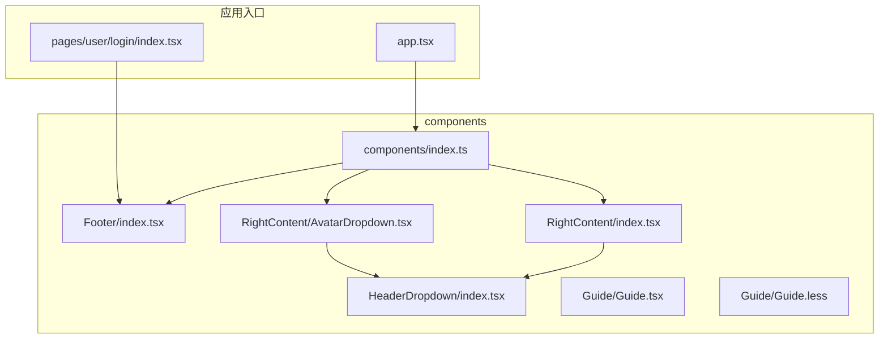
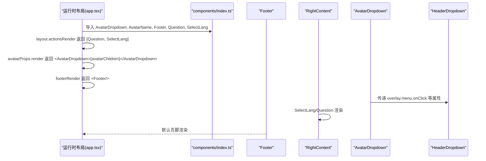
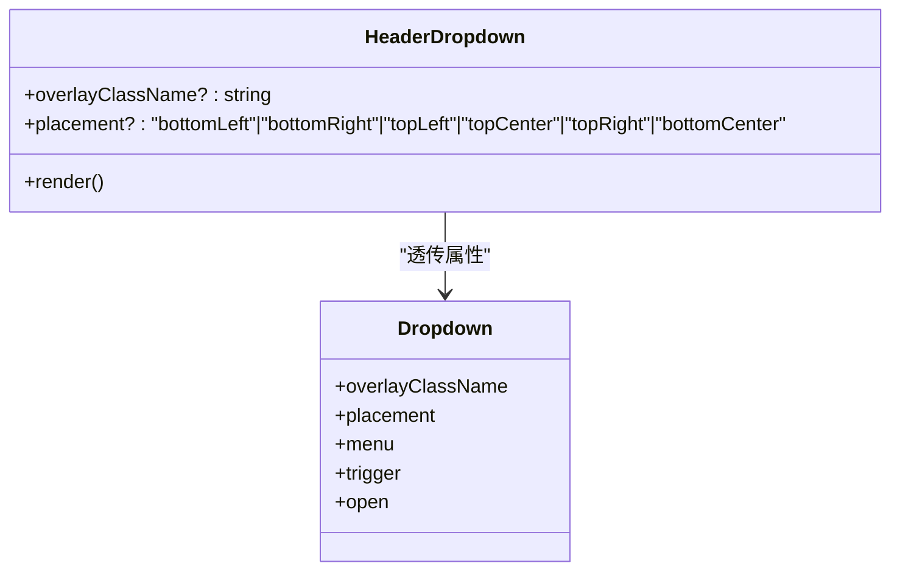
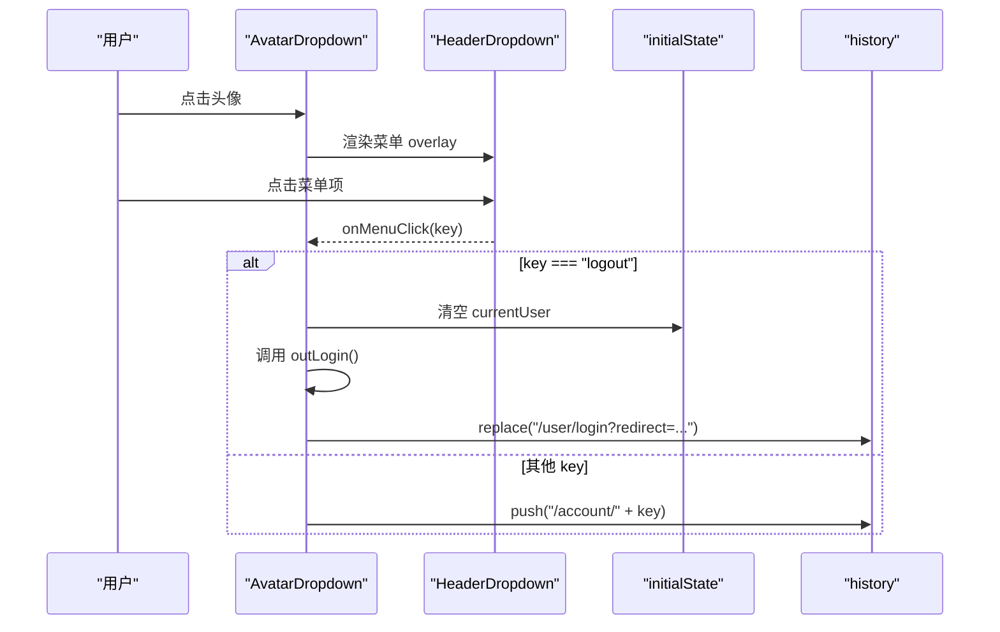
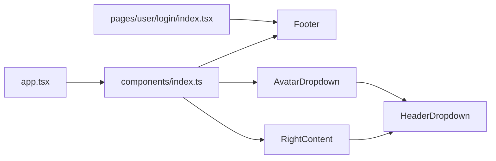

# 基础UI组件

<cite>
**本文引用的文件**
- [apps/admin-web/src/components/Footer/index.tsx](file://apps/admin-web/src/components/Footer/index.tsx)
- [apps/admin-web/src/components/HeaderDropdown/index.tsx](file://apps/admin-web/src/components/HeaderDropdown/index.tsx)
- [apps/admin-web/src/components/RightContent/index.tsx](file://apps/admin-web/src/components/RightContent/index.tsx)
- [apps/admin-web/src/components/RightContent/AvatarDropdown.tsx](file://apps/admin-web/src/components/RightContent/AvatarDropdown.tsx)
- [apps/admin-web/src/components/Guide/Guide.tsx](file://apps/admin-web/src/components/Guide/Guide.tsx)
- [apps/admin-web/src/components/Guide/Guide.less](file://apps/admin-web/src/components/Guide/Guide.less)
- [apps/admin-web/src/components/index.ts](file://apps/admin-web/src/components/index.ts)
- [apps/admin-web/src/app.tsx](file://apps/admin-web/src/app.tsx)
- [apps/admin-web/src/pages/user/login/index.tsx](file://apps/admin-web/src/pages/user/login/index.tsx)
- [apps/admin-web/src/global.less](file://apps/admin-web/src/global.less)
- [apps/admin-web/src/global.style.ts](file://apps/admin-web/src/global.style.ts)
</cite>

## 目录
1. [简介](#简介)
2. [项目结构](#项目结构)
3. [核心组件](#核心组件)
4. [架构总览](#架构总览)
5. [详细组件分析](#详细组件分析)
6. [依赖关系分析](#依赖关系分析)
7. [性能考量](#性能考量)
8. [故障排查指南](#故障排查指南)
9. [结论](#结论)
10. [附录](#附录)

## 简介
本文件聚焦于 admin-web 中的基础 UI 组件设计与实现，重点解析以下组件：
- Footer：基于 ProComponents 默认页脚的二次封装，用于统一版权与链接展示。
- HeaderDropdown：对 Ant Design Dropdown 的轻量封装，提供响应式样式与可选的 placement 类型约束。
- RightContent：右侧工具区容器，包含语言选择器与帮助链接。
- AvatarDropdown：复合头像下拉菜单组件，整合用户信息、菜单项与退出登录流程。
- Guide：示例引导组件，演示样式与逻辑分离（.less 与 TS）的实践。

同时，本文将分析 components/index.ts 的导出机制与模块化组织方式，结合运行时布局配置说明这些组件在页面中的复用方法，并总结响应式设计实现原理与定制化开发指南（样式覆盖、主题适配、无障碍支持）。

## 项目结构
基础组件位于 src/components 下，采用按功能分层的模块化组织：
- Footer：独立布局组件
- HeaderDropdown：下拉菜单封装
- RightContent：右侧工具区（含 AvatarDropdown）
- Guide：示例组件（样式与逻辑分离）

图表来源
- [apps/admin-web/src/components/Footer/index.tsx](file://apps/admin-web/src/components/Footer/index.tsx#L1-L37)
- [apps/admin-web/src/components/HeaderDropdown/index.tsx](file://apps/admin-web/src/components/HeaderDropdown/index.tsx#L1-L42)
- [apps/admin-web/src/components/RightContent/index.tsx](file://apps/admin-web/src/components/RightContent/index.tsx#L1-L34)
- [apps/admin-web/src/components/RightContent/AvatarDropdown.tsx](file://apps/admin-web/src/components/RightContent/AvatarDropdown.tsx#L1-L143)
- [apps/admin-web/src/components/Guide/Guide.tsx](file://apps/admin-web/src/components/Guide/Guide.tsx#L1-L24)
- [apps/admin-web/src/components/Guide/Guide.less](file://apps/admin-web/src/components/Guide/Guide.less#L1-L5)
- [apps/admin-web/src/components/index.ts](file://apps/admin-web/src/components/index.ts#L1-L13)
- [apps/admin-web/src/app.tsx](file://apps/admin-web/src/app.tsx#L1-L174)
- [apps/admin-web/src/pages/user/login/index.tsx](file://apps/admin-web/src/pages/user/login/index.tsx#L1-L225)

章节来源
- [apps/admin-web/src/components/index.ts](file://apps/admin-web/src/components/index.ts#L1-L13)
- [apps/admin-web/src/app.tsx](file://apps/admin-web/src/app.tsx#L1-L174)

## 核心组件
本节从架构设计、Props 接口定义、事件处理机制、复合组件封装模式等方面进行深入剖析。

- Footer
  - 设计定位：作为统一的页脚组件，继承 ProComponents 默认页脚能力，集中维护版权与外部链接。
  - Props 与行为：无自定义 Props，通过传入链接数组与文案控制展示；样式上设置背景透明以贴合布局。
  - 使用场景：在运行时布局配置中由 footerRender 返回，贯穿所有页面底部。

- HeaderDropdown
  - 设计定位：对 Ant Design Dropdown 的轻量封装，增强移动端响应式宽度与可选 placement 类型约束。
  - Props 接口：暴露 overlayClassName 与 placement（限定枚举值），其余透传给 Dropdown。
  - 事件处理：不直接处理菜单点击，而是通过父组件传入的 overlay.menu.onClick 等回调完成交互。
  - 响应式：在小于 token.screenXS 的屏幕宽度下，下拉框宽度自适应为 100%。

- RightContent
  - 设计定位：右侧工具区容器，提供语言选择器与帮助链接两个内建小部件。
  - SelectLang：基于 Umi 的 SelectLang，提供国际化语言切换。
  - Question：帮助链接，打开官方文档链接，具备标题提示与内边距样式。

- AvatarDropdown（复合组件）
  - 设计定位：将头像、用户名称与下拉菜单组合为一个可复用的右上角用户入口。
  - Props 接口：menu（是否渲染“个人中心/个人设置”菜单）、children（头像内容）。
  - 事件处理：onMenuClick 根据 key 分发到不同路由（如 /account/center、/account/settings），或触发退出登录流程。
  - 退出登录：调用 outLogin 后，若无 redirect 参数则将当前路径写入 redirect 并跳转至登录页；同时清空全局 currentUser。
  - 加载态：在未获取到 initialState 或 currentUser 时，显示小型加载指示器。
  - 复合封装：内部使用 HeaderDropdown 承载菜单，实现“样式 + 行为”的统一管理。

- Guide（样式与逻辑分离）
  - 设计定位：脚手架示例组件，演示样式与逻辑分离的实践。
  - 逻辑：接收 name 属性并渲染欢迎标题。
  - 样式：通过本地 less 文件定义样式类，组件内以模块化方式引入。
  - 分离实践：TSX 仅负责逻辑与结构，样式独立于组件文件，便于主题与覆盖。

章节来源
- [apps/admin-web/src/components/Footer/index.tsx](file://apps/admin-web/src/components/Footer/index.tsx#L1-L37)
- [apps/admin-web/src/components/HeaderDropdown/index.tsx](file://apps/admin-web/src/components/HeaderDropdown/index.tsx#L1-L42)
- [apps/admin-web/src/components/RightContent/index.tsx](file://apps/admin-web/src/components/RightContent/index.tsx#L1-L34)
- [apps/admin-web/src/components/RightContent/AvatarDropdown.tsx](file://apps/admin-web/src/components/RightContent/AvatarDropdown.tsx#L1-L143)
- [apps/admin-web/src/components/Guide/Guide.tsx](file://apps/admin-web/src/components/Guide/Guide.tsx#L1-L24)
- [apps/admin-web/src/components/Guide/Guide.less](file://apps/admin-web/src/components/Guide/Guide.less#L1-L5)

## 架构总览
基础组件通过 components/index.ts 统一导出，供运行时布局配置与页面按需导入使用。运行时布局配置在 app.tsx 中定义，将组件挂载到顶部右侧工具区、水印、页脚等位置，形成一致的 UI 体验。

图表来源
- [apps/admin-web/src/components/index.ts](file://apps/admin-web/src/components/index.ts#L1-L13)
- [apps/admin-web/src/app.tsx](file://apps/admin-web/src/app.tsx#L61-L96)
- [apps/admin-web/src/components/RightContent/index.tsx](file://apps/admin-web/src/components/RightContent/index.tsx#L1-L34)
- [apps/admin-web/src/components/RightContent/AvatarDropdown.tsx](file://apps/admin-web/src/components/RightContent/AvatarDropdown.tsx#L44-L142)
- [apps/admin-web/src/components/HeaderDropdown/index.tsx](file://apps/admin-web/src/components/HeaderDropdown/index.tsx#L1-L42)
- [apps/admin-web/src/components/Footer/index.tsx](file://apps/admin-web/src/components/Footer/index.tsx#L1-L37)

## 详细组件分析

### Footer 组件
- 架构设计
  - 基于 ProComponents 的 DefaultFooter，集中维护链接与版权信息，避免各页面重复配置。
  - 通过运行时布局配置的 footerRender 返回实例，确保全局一致性。
- Props 与事件
  - 无自定义 Props；通过 links 数组与 copyright 控制展示。
- 使用示例
  - 在 app.tsx 的 layout.footerRender 中返回 <Footer/>，即可在所有页面底部显示。

章节来源
- [apps/admin-web/src/components/Footer/index.tsx](file://apps/admin-web/src/components/Footer/index.tsx#L1-L37)
- [apps/admin-web/src/app.tsx](file://apps/admin-web/src/app.tsx#L71-L74)

### HeaderDropdown 组件
- 架构设计
  - 对 Ant Design Dropdown 的轻量封装，提供响应式样式与 placement 类型约束。
  - 通过 createStyles 生成样式类，并与外部 overlayClassName 合并。
- Props 接口
  - overlayClassName?: string
  - placement?: 'bottomLeft' | 'bottomRight' | 'topLeft' | 'topCenter' | 'topRight' | 'bottomCenter'
  - 其余透传给 Dropdown
- 事件处理
  - 不直接处理菜单点击，交由父组件传入的 overlay.menu.onClick 等回调处理。
- 响应式实现
  - 在小于 token.screenXS 的屏幕宽度下，下拉框宽度自适应为 100%。

图表来源
- [apps/admin-web/src/components/HeaderDropdown/index.tsx](file://apps/admin-web/src/components/HeaderDropdown/index.tsx#L1-L42)

章节来源
- [apps/admin-web/src/components/HeaderDropdown/index.tsx](file://apps/admin-web/src/components/HeaderDropdown/index.tsx#L1-L42)

### RightContent 组件
- 架构设计
  - 提供右侧工具区的两个内建小部件：SelectLang 与 Question。
  - SelectLang 基于 Umi 的语言切换组件；Question 为帮助链接。
- Props 与事件
  - SelectLang 无自定义 Props；Question 通过 a 标签打开外链，具备标题与内边距样式。
- 使用示例
  - 在 app.tsx 的 layout.actionsRender 返回 [Question, SelectLang]，即可在顶部右侧显示。

章节来源
- [apps/admin-web/src/components/RightContent/index.tsx](file://apps/admin-web/src/components/RightContent/index.tsx#L1-L34)
- [apps/admin-web/src/app.tsx](file://apps/admin-web/src/app.tsx#L61-L69)

### AvatarDropdown（复合组件）
- 架构设计
  - 将头像、用户名称与下拉菜单组合为一个复合组件，内部使用 HeaderDropdown 承载菜单。
  - 通过 Umi 的 initialState 管理用户信息与全局状态。
- Props 接口
  - menu?: boolean（是否渲染“个人中心/个人设置”菜单）
  - children?: React.ReactNode（头像内容）
- 事件处理
  - onMenuClick 根据 key 分发到不同路由（如 /account/center、/account/settings），或触发退出登录流程。
  - 退出登录：调用 outLogin 后，若无 redirect 参数则将当前路径写入 redirect 并跳转至登录页；同时清空全局 currentUser。
- 加载态
  - 在未获取到 initialState 或 currentUser 时，显示小型加载指示器。
- 使用示例
  - 在 app.tsx 的 avatarProps.render 中返回 <AvatarDropdown>{avatarChildren}</AvatarDropdown>，即可在顶部右侧显示用户入口。

图表来源
- [apps/admin-web/src/components/RightContent/AvatarDropdown.tsx](file://apps/admin-web/src/components/RightContent/AvatarDropdown.tsx#L44-L142)
- [apps/admin-web/src/components/HeaderDropdown/index.tsx](file://apps/admin-web/src/components/HeaderDropdown/index.tsx#L1-L42)
- [apps/admin-web/src/app.tsx](file://apps/admin-web/src/app.tsx#L61-L70)

章节来源
- [apps/admin-web/src/components/RightContent/AvatarDropdown.tsx](file://apps/admin-web/src/components/RightContent/AvatarDropdown.tsx#L1-L143)
- [apps/admin-web/src/app.tsx](file://apps/admin-web/src/app.tsx#L61-L70)

### Guide 组件（样式与逻辑分离）
- 设计定位
  - 示例组件，演示样式与逻辑分离的实践。
- 逻辑
  - 接收 name 属性并渲染欢迎标题。
- 样式
  - 通过本地 less 文件定义样式类，组件内以模块化方式引入。
- 分离实践
  - TSX 仅负责逻辑与结构，样式独立于组件文件，便于主题与覆盖。

章节来源
- [apps/admin-web/src/components/Guide/Guide.tsx](file://apps/admin-web/src/components/Guide/Guide.tsx#L1-L24)
- [apps/admin-web/src/components/Guide/Guide.less](file://apps/admin-web/src/components/Guide/Guide.less#L1-L5)

## 依赖关系分析
- 组件导出机制
  - components/index.ts 统一导出 Footer、Question、SelectLang、AvatarDropdown、AvatarName，便于按需导入与减少路径污染。
- 运行时布局集成
  - app.tsx 通过 layout.actionsRender、avatarProps.render、footerRender 等钩子，将组件挂载到顶部右侧工具区、头像区域与页脚。
- 页面使用
  - 登录页等页面可直接导入 Footer 用于特定页面底部展示。

图表来源
- [apps/admin-web/src/components/index.ts](file://apps/admin-web/src/components/index.ts#L1-L13)
- [apps/admin-web/src/app.tsx](file://apps/admin-web/src/app.tsx#L1-L174)
- [apps/admin-web/src/pages/user/login/index.tsx](file://apps/admin-web/src/pages/user/login/index.tsx#L1-L225)

章节来源
- [apps/admin-web/src/components/index.ts](file://apps/admin-web/src/components/index.ts#L1-L13)
- [apps/admin-web/src/app.tsx](file://apps/admin-web/src/app.tsx#L61-L96)
- [apps/admin-web/src/pages/user/login/index.tsx](file://apps/admin-web/src/pages/user/login/index.tsx#L1-L225)

## 性能考量
- 组件复用与渲染
  - 通过 components/index.ts 统一导出，减少重复导入与路径变更成本，提升构建与维护效率。
- 响应式样式
  - HeaderDropdown 在小屏下自动占满宽度，降低移动端交互成本。
  - 全局样式与全局样式模块在 768px 以下对表格等组件进行优化，提升移动端可读性。
- 事件处理
  - AvatarDropdown 的 onMenuClick 仅在需要时触发路由跳转或退出登录，避免不必要的副作用。

章节来源
- [apps/admin-web/src/components/HeaderDropdown/index.tsx](file://apps/admin-web/src/components/HeaderDropdown/index.tsx#L1-L42)
- [apps/admin-web/src/global.less](file://apps/admin-web/src/global.less#L79-L95)
- [apps/admin-web/src/global.style.ts](file://apps/admin-web/src/global.style.ts#L25-L38)

## 故障排查指南
- 退出登录后未跳转
  - 检查 onMenuClick 中的 redirect 参数逻辑与 history.replace 调用。
  - 确认 outLogin 是否成功返回，以及是否正确设置 redirect。
- 头像菜单不显示
  - 检查 initialState.currentUser 是否存在；AvatarDropdown 在未获取到用户信息时会显示加载态。
  - 确认 avatarProps.render 是否返回了 AvatarDropdown。
- 语言切换无效
  - 检查 SelectLang 的样式与布局配置，确认 actionsRender 返回了 SelectLang。
- 页脚不显示
  - 检查 app.tsx 的 footerRender 是否返回了 Footer。

章节来源
- [apps/admin-web/src/components/RightContent/AvatarDropdown.tsx](file://apps/admin-web/src/components/RightContent/AvatarDropdown.tsx#L44-L142)
- [apps/admin-web/src/app.tsx](file://apps/admin-web/src/app.tsx#L61-L74)

## 结论
admin-web 的基础 UI 组件通过清晰的模块化组织与运行时布局集成，实现了统一的头部、右侧工具区、页脚与用户入口体验。HeaderDropdown 与 AvatarDropdown 体现了对第三方组件的轻量封装与响应式适配；components/index.ts 的导出机制提升了可维护性；Guide 组件展示了样式与逻辑分离的良好实践。整体架构简洁、职责明确，适合在多页面中复用与扩展。

## 附录

### 复用方法与最佳实践
- 在页面中复用 Footer
  - 登录页等页面可直接导入 Footer 并在页面底部渲染，保持一致的版权与链接展示。
- 在运行时布局中复用 RightContent 与 AvatarDropdown
  - 通过 app.tsx 的 actionsRender、avatarProps.render、footerRender 将组件挂载到全局布局。
- 复合组件 AvatarDropdown 的扩展
  - 可通过 menu 参数控制是否显示“个人中心/个人设置”，或在 children 中传入自定义头像元素。
- Guide 的样式覆盖
  - 通过模块化 less 引入与覆盖，实现主题化与局部样式定制。

章节来源
- [apps/admin-web/src/pages/user/login/index.tsx](file://apps/admin-web/src/pages/user/login/index.tsx#L1-L225)
- [apps/admin-web/src/app.tsx](file://apps/admin-web/src/app.tsx#L61-L96)
- [apps/admin-web/src/components/Guide/Guide.tsx](file://apps/admin-web/src/components/Guide/Guide.tsx#L1-L24)
- [apps/admin-web/src/components/Guide/Guide.less](file://apps/admin-web/src/components/Guide/Guide.less#L1-L5)

### 响应式设计实现原理
- 移动端适配
  - HeaderDropdown 在小于 token.screenXS 时宽度自适应为 100%，提升移动端交互体验。
  - 全局样式在 768px 以下对表格等组件进行横向滚动与换行优化。
- 主题与样式覆盖
  - 使用 createStyles 与 antd-style 的 token，实现主题变量驱动的样式。
  - Guide 通过 less 文件与组件内样式模块化引入，便于覆盖与主题化。

章节来源
- [apps/admin-web/src/components/HeaderDropdown/index.tsx](file://apps/admin-web/src/components/HeaderDropdown/index.tsx#L1-L42)
- [apps/admin-web/src/global.less](file://apps/admin-web/src/global.less#L79-L95)
- [apps/admin-web/src/global.style.ts](file://apps/admin-web/src/global.style.ts#L25-L38)

### 定制化开发指南
- 样式覆盖
  - 对 HeaderDropdown：通过 overlayClassName 合并样式类，或在 createStyles 中扩展 hover、圆角等样式。
  - 对 AvatarDropdown：通过样式模块化与 antd-style 的 token，调整悬停背景色与圆角。
  - 对 Guide：通过 less 文件覆盖 title 样式，或在组件内引入额外样式类。
- 主题适配
  - 使用 antd-style 的 createStyles 与 token，确保颜色、间距、圆角等符合主题规范。
- 无障碍访问支持
  - 为按钮与链接提供语义化标题与可访问文本，确保键盘导航与屏幕阅读器友好。
  - 对菜单项提供明确的键位标识与可读文案，避免仅依赖图标传达信息。

章节来源
- [apps/admin-web/src/components/HeaderDropdown/index.tsx](file://apps/admin-web/src/components/HeaderDropdown/index.tsx#L1-L42)
- [apps/admin-web/src/components/RightContent/AvatarDropdown.tsx](file://apps/admin-web/src/components/RightContent/AvatarDropdown.tsx#L1-L143)
- [apps/admin-web/src/components/Guide/Guide.tsx](file://apps/admin-web/src/components/Guide/Guide.tsx#L1-L24)