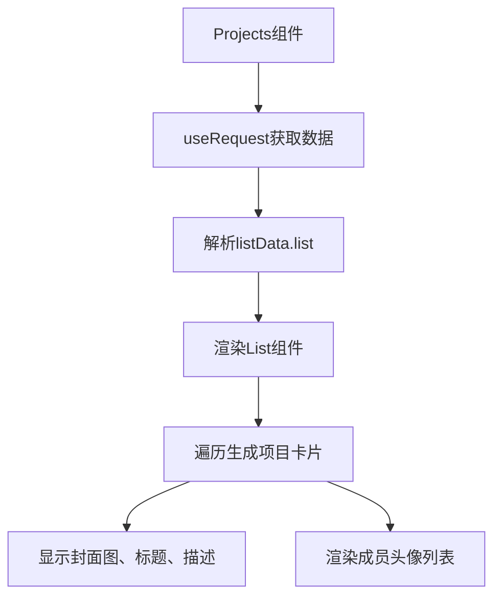
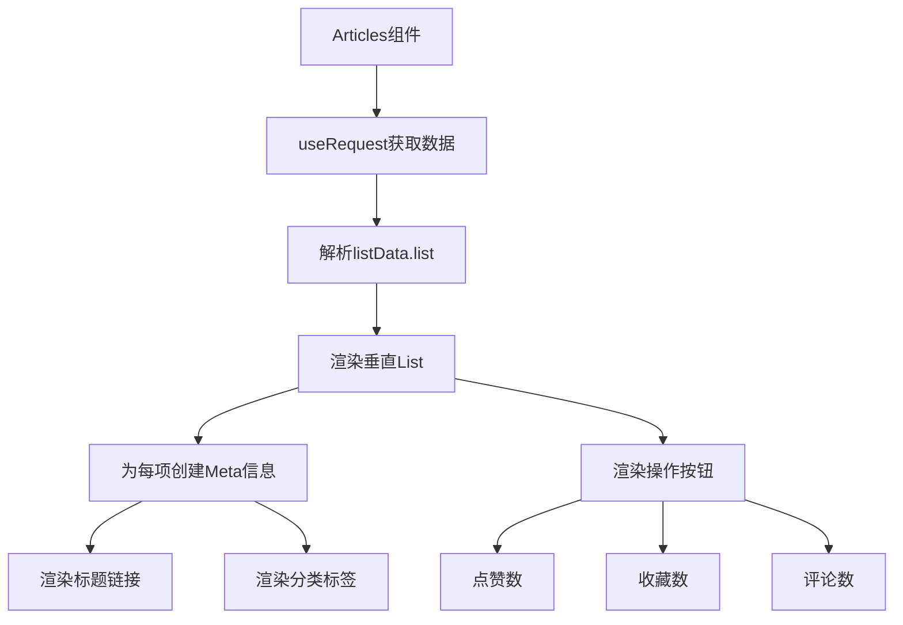
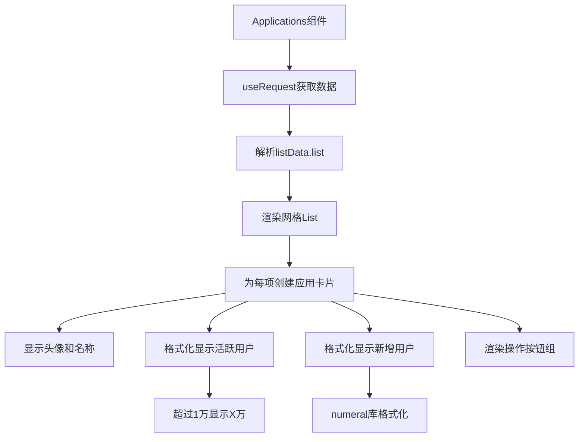
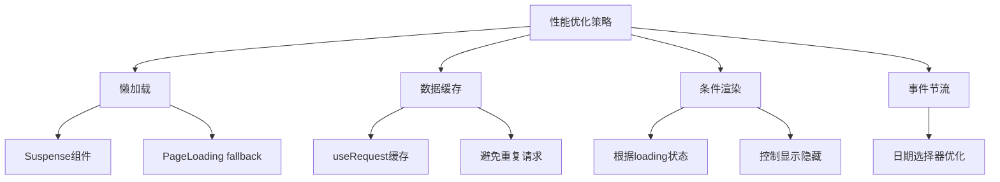
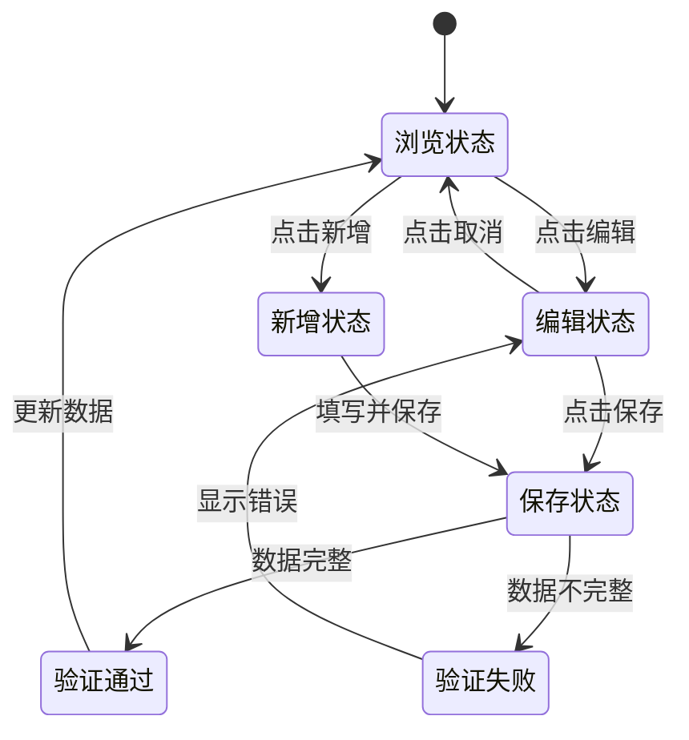
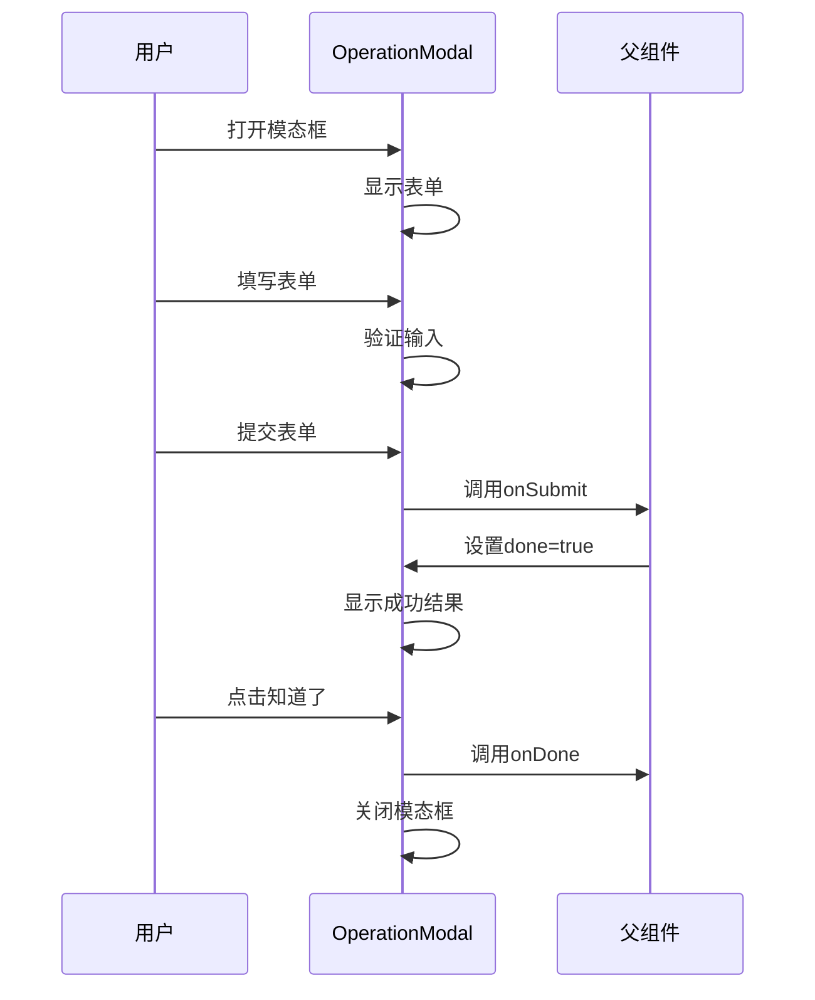
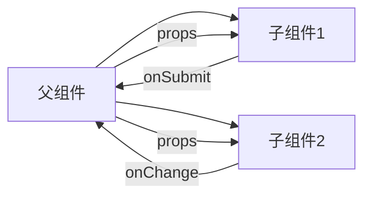

# 复合业务组件

<cite>
**本文档引用文件**  
- [index.tsx](file://apps/admin-web/src/pages/account/center/index.tsx)
- [service.ts](file://apps/admin-web/src/pages/account/center/service.ts)
- [Projects/index.tsx](file://apps/admin-web/src/pages/account/center/components/Projects/index.tsx)
- [Articles/index.tsx](file://apps/admin-web/src/pages/account/center/components/Articles/index.tsx)
- [Applications/index.tsx](file://apps/admin-web/src/pages/account/center/components/Applications/index.tsx)
- [index.tsx](file://apps/admin-web/src/pages/dashboard/analysis/index.tsx)
- [MiniProgress/index.tsx](file://apps/admin-web/src/pages/dashboard/analysis/components/Charts/MiniProgress/index.tsx)
- [index.tsx](file://apps/admin-web/src/pages/form/advanced-form/index.tsx)
- [TableForm.tsx](file://apps/admin-web/src/pages/form/advanced-form/components/TableForm.tsx)
- [index.tsx](file://apps/admin-web/src/pages/list/basic-list/index.tsx)
- [OperationModal.tsx](file://apps/admin-web/src/pages/list/basic-list/components/OperationModal.tsx)
</cite>

## 目录
1. [简介](#简介)
2. [账户中心复合组件体系](#账户中心复合组件体系)
3. [数据可视化组件实现原理](#数据可视化组件实现原理)
4. [表单处理与状态管理机制](#表单处理与状态管理机制)
5. [可配置性设计与插槽机制](#可配置性设计与插槽机制)
6. [事件总线模式与组件通信](#事件总线模式与组件通信)
7. [开发范式与最佳实践](#开发范式与最佳实践)
8. [总结](#总结)

## 简介
本文档全面剖析admin-web中的复合业务组件体系，重点解读account/center下的Projects、Articles、Applications等组件的领域模型与数据绑定方式，分析其与后端API服务的交互模式。深入探讨dashboard/analysis中Charts、MiniProgress等数据可视化组件的实现原理与性能优化策略。说明form/advanced-form中TableForm和list/basic-list中OperationModal的表单处理与状态管理机制。结合具体代码示例，阐述这些复合组件的可配置性设计、插槽机制和事件总线模式，为开发者提供复杂业务组件的开发范式与最佳实践指导。

## 账户中心复合组件体系

在`account/center`页面中，通过标签页切换展示了Projects、Articles、Applications三大业务模块。该页面采用模块化设计，将不同业务功能拆分为独立组件，通过统一的数据服务进行管理。

核心组件通过`useRequest`钩子从`service.ts`中获取数据，实现了数据请求与组件渲染的分离。`queryCurrent`函数通过`@umijs/max`提供的`request`方法调用`/api/currentUserDetail`接口获取用户信息，而`queryFakeList`则用于获取列表数据。

**Section sources**
- [index.tsx](file://apps/admin-web/src/pages/account/center/index.tsx#L1-L279)
- [service.ts](file://apps/admin-web/src/pages/account/center/service.ts#L1-L15)

### Projects组件领域模型
Projects组件采用Ant Design的List和Card组件构建网格布局，每个项目卡片包含封面图、标题、描述和成员头像列表。组件通过`dayjs`库处理时间显示，使用`relativeTime`插件实现"几小时前"等相对时间格式。

数据绑定方面，组件通过`useRequest`获取数据后，将`listData?.list`作为dataSource传递给List组件。成员头像列表通过嵌套的AvatarList组件实现，支持悬停提示功能。



**Diagram sources**
- [Projects/index.tsx](file://apps/admin-web/src/pages/account/center/components/Projects/index.tsx#L1-L66)

**Section sources**
- [Projects/index.tsx](file://apps/admin-web/src/pages/account/center/components/Projects/index.tsx#L1-L66)

### Articles组件数据绑定
Articles组件采用垂直布局的List组件，每个文章项包含标题、标签、操作按钮和内容摘要。组件通过`ArticleListContent`子组件实现内容区域的复用。

数据绑定采用典型的React列表渲染模式，通过`renderItem`函数为每个列表项创建UI。操作区域使用`IconText`封装的图标文本组件，包含点赞、收藏和评论数。标签区域使用Ant Design的Tag组件展示文章分类。



**Diagram sources**
- [Articles/index.tsx](file://apps/admin-web/src/pages/account/center/components/Articles/index.tsx#L1-L72)

**Section sources**
- [Articles/index.tsx](file://apps/admin-web/src/pages/account/center/components/Articles/index.tsx#L1-L72)

### Applications组件交互模式
Applications组件展示应用列表，每个应用卡片包含头像、名称、活跃用户数和新增用户数。组件通过`formatWan`工具函数实现万级数据的格式化显示，当数值超过10000时自动转换为"X万"格式。

交互方面，卡片提供下载、编辑、分享和更多操作的下拉菜单。`CardInfo`子组件采用双列布局展示统计数据，通过`numeral`库格式化新增用户数的显示。



**Diagram sources**
- [Applications/index.tsx](file://apps/admin-web/src/pages/account/center/components/Applications/index.tsx#L1-L137)

**Section sources**
- [Applications/index.tsx](file://apps/admin-web/src/pages/account/center/components/Applications/index.tsx#L1-L137)

## 数据可视化组件实现原理

dashboard/analysis页面集成了多种数据可视化组件，包括图表、进度条和统计卡片。这些组件通过合理的状态管理和性能优化策略，确保了复杂数据展示的流畅性。

### MiniProgress组件实现
MiniProgress组件是一个微型进度条组件，用于在有限空间内展示进度信息。组件支持目标线标记，通过`target`属性指定目标百分比，并在进度条上方显示目标标记。

实现原理上，组件使用CSS样式控制进度条的宽度和颜色，通过`Tooltip`组件实现目标值的悬停提示。`percent`属性控制实际进度的显示宽度，`color`属性自定义进度条颜色。

```mermaid
classDiagram
class MiniProgress {
+target : number
+targetLabel? : string
+color? : string
+size? : number
+percent? : number
+style? : CSSProperties
+render() : JSX.Element
}
MiniProgress --> Tooltip : "使用"
MiniProgress --> "CSS样式" : "控制"
```

**Diagram sources**
- [MiniProgress/index.tsx](file://apps/admin-web/src/pages/dashboard/analysis/components/Charts/MiniProgress/index.tsx#L1-L49)

**Section sources**
- [MiniProgress/index.tsx](file://apps/admin-web/src/pages/dashboard/analysis/components/Charts/MiniProgress/index.tsx#L1-L49)

### 性能优化策略
数据可视化组件采用了多种性能优化策略：

1. **懒加载**：通过`Suspense`组件实现非关键区域的懒加载，如`PageLoading`作为fallback组件
2. **数据缓存**：`useRequest`钩子自动处理请求缓存，避免重复请求
3. **条件渲染**：根据`loading`状态控制组件的显示与隐藏
4. **事件节流**：日期范围选择器的变更事件经过合理处理，避免频繁触发



**Section sources**
- [index.tsx](file://apps/admin-web/src/pages/dashboard/analysis/index.tsx#L1-L158)

## 表单处理与状态管理机制

复杂的表单场景需要精细的状态管理机制来处理用户输入、验证和提交。admin-web中的高级表单和列表操作表单展示了两种典型的实现模式。

### TableForm状态管理
TableForm组件实现了可编辑表格的完整状态管理，支持行内编辑、新增和删除操作。组件维护了多个状态变量：

- `data`：表格数据源
- `loading`：保存操作的加载状态
- `cacheOriginData`：编辑前的原始数据缓存
- `index`：新行的唯一标识计数器

当用户进入编辑模式时，组件会保存当前行的原始数据到`cacheOriginData`中，以便在取消编辑时恢复。保存操作包含客户端验证，确保必填字段不为空。



**Section sources**
- [TableForm.tsx](file://apps/admin-web/src/pages/form/advanced-form/components/TableForm.tsx#L1-L269)

### OperationModal表单处理
OperationModal组件基于`ModalForm`实现模态表单，采用分步提交模式。组件通过`done`状态区分表单输入和提交成功两个阶段。

表单验证通过`rules`属性配置，包含必填验证和长度验证。提交成功后，组件切换到结果展示状态，显示"操作成功"的Result组件。这种设计模式提供了良好的用户体验反馈。



**Diagram sources**
- [OperationModal.tsx](file://apps/admin-web/src/pages/list/basic-list/components/OperationModal.tsx#L1-L130)

**Section sources**
- [OperationModal.tsx](file://apps/admin-web/src/pages/list/basic-list/components/OperationModal.tsx#L1-L130)

## 可配置性设计与插槽机制

复合组件的可配置性设计是提高组件复用性的关键。admin-web中的组件通过多种方式实现了高度的可配置性。

### 组件属性配置
组件通过TypeScript接口定义清晰的属性契约，如MiniProgress组件的`MiniProgressProps`接口明确指定了`target`、`targetLabel`、`color`等可配置属性。这种强类型定义不仅提高了代码的可维护性，也为开发者提供了清晰的使用文档。

Projects、Articles等组件通过`useStyles`钩子引入样式配置，实现了样式与逻辑的分离。这种方式支持主题定制和样式覆盖，提高了组件的适应性。

### 插槽机制实现
虽然React没有原生的插槽概念，但通过`children`属性和渲染属性模式实现了类似的功能。OperationModal组件的`trigger`属性就是一个典型的渲染属性，允许父组件自定义触发器。

TableForm组件的`onChange`回调函数也体现了插槽思想，父组件可以通过该回调监听表格数据的变化，实现数据的双向绑定。

```mermaid
classDiagram
class Component {
+props : Props
+children : ReactNode
+render() : JSX.Element
}
class ConfigurableComponent {
+config : Config
+slots : Slots
+render() : JSX.Element
}
Component <|-- ConfigurableComponent
ConfigurableComponent --> "配置对象" : "接收"
ConfigurableComponent --> "插槽" : "支持"
```

**Section sources**
- [MiniProgress/index.tsx](file://apps/admin-web/src/pages/dashboard/analysis/components/Charts/MiniProgress/index.tsx#L1-L49)
- [OperationModal.tsx](file://apps/admin-web/src/pages/list/basic-list/components/OperationModal.tsx#L1-L130)

## 事件总线模式与组件通信

在复杂的组件体系中，组件间的通信是关键挑战。admin-web采用了多种通信模式来解耦组件依赖。

### 状态提升模式
在account/center页面中，tabKey状态被提升到父组件Center中管理。子组件通过onTabChange回调通知父组件状态变化，父组件根据当前tabKey决定渲染哪个子组件。这种模式避免了子组件间的直接依赖。

### 回调函数通信
TableForm组件通过onChange回调将数据变化通知父组件，OperationModal通过onSubmit和onDone回调与父组件通信。这种单向数据流模式符合React的设计哲学，使数据流向清晰可预测。



**Section sources**
- [index.tsx](file://apps/admin-web/src/pages/account/center/index.tsx#L1-L279)
- [TableForm.tsx](file://apps/admin-web/src/pages/form/advanced-form/components/TableForm.tsx#L1-L269)

## 开发范式与最佳实践

基于对admin-web复合组件体系的分析，可以总结出以下开发范式与最佳实践：

### 组件设计原则
1. **单一职责**：每个组件只负责一个明确的功能
2. **可配置性**：通过props提供足够的配置选项
3. **可复用性**：设计通用接口，适应不同使用场景
4. **可测试性**：逻辑与UI分离，便于单元测试

### 状态管理最佳实践
1. **状态提升**：将共享状态提升到最近的共同父组件
2. **不可变性**：始终创建新对象而不是修改现有对象
3. **批量更新**：合理使用useState的函数式更新
4. **清理副作用**：在useEffect中返回清理函数

### 性能优化建议
1. **懒加载**：对非关键组件使用Suspense
2. **记忆化**：使用useMemo和useCallback避免重复计算
3. **虚拟滚动**：对长列表使用虚拟滚动技术
4. **防抖节流**：对频繁触发的事件进行优化

## 总结
admin-web中的复合业务组件体系展示了现代前端开发的最佳实践。通过模块化设计、清晰的状态管理、高效的性能优化和良好的可配置性，这些组件为复杂业务场景提供了可靠的解决方案。开发者在构建类似组件时，应遵循单一职责原则，合理设计组件接口，注重性能优化，并建立完善的测试体系，以确保组件的质量和可维护性。