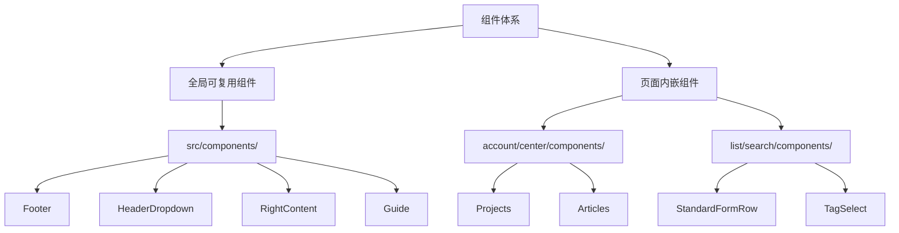
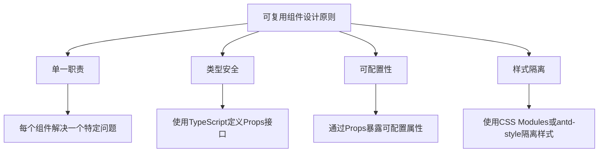
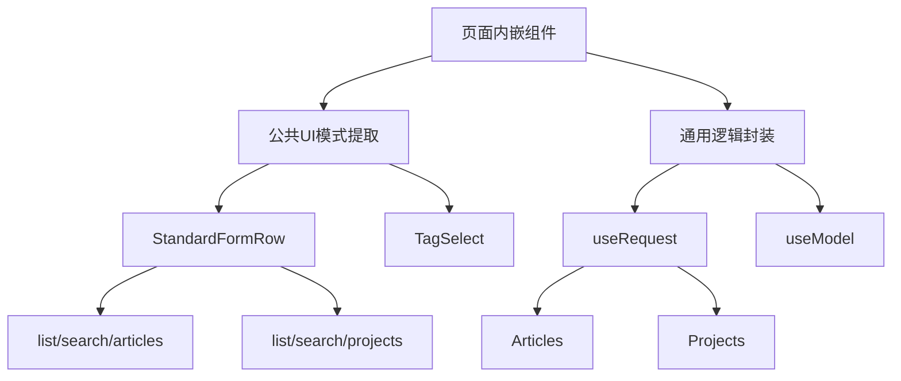
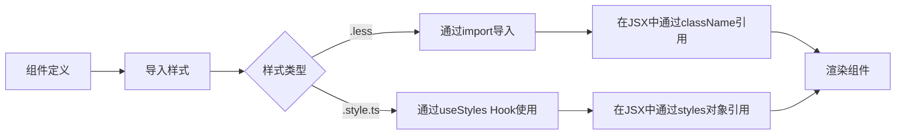
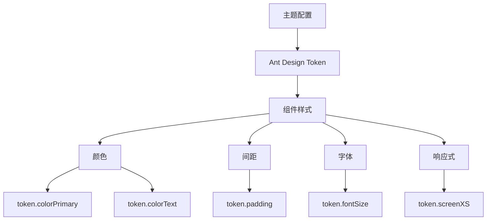
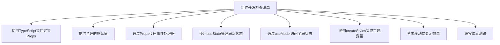

# 组件体系

<cite>
**本文档引用的文件**  
- [Footer/index.tsx](file://apps/admin-web/src/components/Footer/index.tsx)
- [HeaderDropdown/index.tsx](file://apps/admin-web/src/components/HeaderDropdown/index.tsx)
- [RightContent/index.tsx](file://apps/admin-web/src/components/RightContent/index.tsx)
- [RightContent/AvatarDropdown.tsx](file://apps/admin-web/src/components/RightContent/AvatarDropdown.tsx)
- [global.less](file://apps/admin-web/src/global.less)
- [global.style.ts](file://apps/admin-web/src/global.style.ts)
- [app.tsx](file://apps/admin-web/src/app.tsx)
- [components/index.ts](file://apps/admin-web/src/components/index.ts)
- [Guide/Guide.tsx](file://apps/admin-web/src/components/Guide/Guide.tsx)
- [Guide/Guide.less](file://apps/admin-web/src/components/Guide/Guide.less)
- [account/center/components/Projects/index.style.ts](file://apps/admin-web/src/pages/account/center/components/Projects/index.style.ts)
- [account/center/components/Articles/index.style.ts](file://apps/admin-web/src/pages/account/center/components/Articles/index.style.ts)
- [dashboard/workplace/components/EditableLinkGroup/index.style.ts](file://apps/admin-web/src/pages/dashboard/workplace/components/EditableLinkGroup/index.style.ts)
- [list/search/articles/index.tsx](file://apps/admin-web/src/pages/list/search/articles/index.tsx)
- [list/search/projects/index.tsx](file://apps/admin-web/src/pages/list/search/projects/index.tsx)
- [dashboard/analysis/index.tsx](file://apps/admin-web/src/pages/dashboard/analysis/index.tsx)
</cite>

## 目录
1. [组件体系架构概述](#组件体系架构概述)
2. [可复用UI组件设计原则](#可复用ui组件设计原则)
3. [基础组件实现细节](#基础组件实现细节)
4. [页面内嵌组件封装模式](#页面内嵌组件封装模式)
5. [样式管理机制](#样式管理机制)
6. [全局样式与主题配置](#全局样式与主题配置)
7. [组件开发最佳实践](#组件开发最佳实践)

## 组件体系架构概述

admin-web项目采用模块化组件架构，将UI元素分为全局可复用组件和页面内嵌组件两大类。全局组件位于`src/components/`目录下，通过`index.ts`文件统一导出，便于在应用各处引用。页面内嵌组件则按功能模块组织在各自页面目录下的`components/`子目录中，如`account/center/components/`。这种分层架构既保证了核心UI元素的一致性，又为特定页面提供了灵活的定制空间。

**组件体系架构图**

**图示来源**
- [app.tsx](file://apps/admin-web/src/app.tsx#L8-L9)
- [components/index.ts](file://apps/admin-web/src/components/index.ts#L8-L12)

## 可复用UI组件设计原则

admin-web的可复用UI组件遵循单一职责、高内聚低耦合的设计原则。每个组件专注于解决一个特定的UI问题，如`Footer`组件专门负责渲染页面底部信息，`HeaderDropdown`组件封装了下拉菜单的通用样式和行为。组件通过TypeScript接口明确定义Props，确保类型安全和开发时的智能提示。同时，组件设计注重可配置性，通过Props暴露关键属性，如`HeaderDropdown`的`overlayClassName`和`placement`属性，允许开发者根据需要进行定制。

**可复用组件设计原则**

**图示来源**
- [HeaderDropdown/index.tsx](file://apps/admin-web/src/components/HeaderDropdown/index.tsx#L17-L26)
- [RightContent/AvatarDropdown.tsx](file://apps/admin-web/src/components/RightContent/AvatarDropdown.tsx#L15-L18)

## 基础组件实现细节

### Footer组件
`Footer`组件基于Ant Design Pro的`DefaultFooter`构建，通过设置`background: 'none'`实现了透明背景，使其能够无缝融入不同页面布局。组件预设了Ant Design系列产品的链接，包括Ant Design Pro官网、GitHub仓库和Ant Design官网，为用户提供便捷的资源访问入口。

**Section sources**
- [Footer/index.tsx](file://apps/admin-web/src/components/Footer/index.tsx#L5-L36)

### HeaderDropdown组件
`HeaderDropdown`组件是对Ant Design `Dropdown`组件的封装，主要解决了响应式设计中的样式问题。通过`antd-style`的`createStyles`创建响应式样式，当屏幕宽度小于`token.screenXS`时，下拉菜单宽度自动设置为100%，确保在移动设备上的良好显示效果。

**Section sources**
- [HeaderDropdown/index.tsx](file://apps/admin-web/src/components/HeaderDropdown/index.tsx#L7-L41)

### RightContent组件
`RightContent`目录下的组件构成了页面右上角的功能区域。`AvatarDropdown`组件实现了用户头像下拉菜单，集成了个人中心、个人设置和退出登录等功能。组件通过`useModel('@@initialState')`访问全局状态，获取当前用户信息，并在用户点击"退出登录"时调用`outLogin`服务完成登出流程。

**Section sources**
- [RightContent/index.tsx](file://apps/admin-web/src/components/RightContent/index.tsx#L6-L33)
- [RightContent/AvatarDropdown.tsx](file://apps/admin-web/src/components/RightContent/AvatarDropdown.tsx#L44-L142)

## 页面内嵌组件封装模式

### Projects组件
位于`account/center/components/Projects`的`Projects`组件用于展示用户参与的项目列表。组件采用卡片式布局，每个项目卡片包含封面图、标题、描述和成员列表。成员列表通过`AvatarList`组件实现，支持鼠标悬停显示成员姓名的提示功能。

**Section sources**
- [account/center/components/Projects/index.style.ts](file://apps/admin-web/src/pages/account/center/components/Projects/index.style.ts#L3-L49)

### Articles组件
`Articles`组件用于展示文章列表，采用垂直列表布局。每篇文章包含标题、标签、摘要和操作计数（点赞、评论等）。组件通过`ArticleListContent`子组件渲染文章内容，实现了关注点分离的设计模式。

**Section sources**
- [account/center/components/Articles/index.style.ts](file://apps/admin-web/src/pages/account/center/components/Articles/index.style.ts#L3-L14)

### 复用策略
页面内嵌组件的复用策略主要体现在两个层面：一是通过提取公共UI模式创建可复用的子组件，如`StandardFormRow`和`TagSelect`被多个搜索页面共享；二是通过高阶组件或自定义Hook封装通用逻辑，如`useRequest`被广泛用于数据获取和加载状态管理。

**图示来源**
- [list/search/articles/index.tsx](file://apps/admin-web/src/pages/list/search/articles/index.tsx#L13-L14)
- [list/search/projects/index.tsx](file://apps/admin-web/src/pages/list/search/projects/index.tsx#L7-L8)

## 样式管理机制

admin-web项目采用`.less`和`.style.ts`相结合的样式管理机制。`.less`文件用于定义传统的CSS样式规则，支持嵌套、变量和混合等特性；`.style.ts`文件则利用`antd-style`库的`createStyles`函数，以TypeScript对象的形式定义样式，实现了类型安全和主题变量的无缝集成。

### .less样式文件
`Guide.less`文件展示了传统的LESS样式定义方式，通过嵌套规则定义`.title`类的样式，设置了居中对齐和较细的字体权重。

**Section sources**
- [Guide/Guide.less](file://apps/admin-web/src/components/Guide/Guide.less#L1-L4)

### .style.ts样式文件
`index.style.ts`文件展示了现代的TypeScript样式定义方式。`createStyles`函数接收一个以`token`为参数的函数，`token`包含了Ant Design的主题变量，如`token.colorPrimary`和`token.fontSize`。这种方式使得组件样式能够自动适应主题变化。

**Section sources**
- [dashboard/workplace/components/EditableLinkGroup/index.style.ts](file://apps/admin-web/src/pages/dashboard/workplace/components/EditableLinkGroup/index.style.ts#L3-L19)

### 样式应用流程

**图示来源**
- [Guide/Guide.tsx](file://apps/admin-web/src/components/Guide/Guide.tsx#L3)
- [EditableLinkGroup/index.tsx](file://apps/admin-web/src/pages/dashboard/workplace/components/EditableLinkGroup/index.tsx#L4)

## 全局样式与主题配置

### 全局样式
`global.less`文件定义了应用的全局样式，包括字体定义、布局高度、列表样式和响应式规则。文件通过`@font-face`引入AlibabaSans字体族，并为不同字重提供相应的字体文件。`html, body, #root`选择器设置了100%高度，确保布局填满整个视口。

**Section sources**
- [global.less](file://apps/admin-web/src/global.less#L1-L95)

### 全局样式TS
`global.style.ts`文件以TypeScript方式重新定义了部分全局样式，与`global.less`形成互补。这种方式使得全局样式也能享受TypeScript的类型检查和开发工具支持。

**Section sources**
- [global.style.ts](file://apps/admin-web/src/global.style.ts#L3-L39)

### 主题配置应用
组件通过`createStyles(({ token }) => {...})`访问Ant Design的主题变量，实现了与主题系统的深度集成。例如，`Projects`组件的`card`样式使用`token.colorTextHeading`作为标题颜色，`token.colorPrimary`作为悬停时的链接颜色，确保了组件外观与整体主题的一致性。

**图示来源**
- [global.less](file://apps/admin-web/src/global.less#L79-L94)
- [account/center/components/Projects/index.style.ts](file://apps/admin-web/src/pages/account/center/components/Projects/index.style.ts#L3-L49)

## 组件开发最佳实践

### Props定义
组件应使用TypeScript接口明确定义Props，区分必选和可选属性。对于复杂对象，应定义详细的接口结构，避免使用`any`类型。可复用组件应提供合理的默认值，降低使用门槛。

### 事件处理
事件处理函数应通过Props传递，遵循React的标准事件命名规范（如`onClick`、`onChange`）。对于需要访问组件内部状态的事件，可通过回调函数传递相关数据。

### 状态管理
组件状态管理应遵循自上而下的数据流原则。全局状态通过`useModel('@@initialState')`访问，局部状态使用`useState`或`useReducer`管理。避免在组件内部直接操作DOM或产生副作用，应通过Effect Hook集中管理。

### 响应式设计
组件应考虑不同屏幕尺寸下的显示效果，使用`@media`查询或`token.screenXS`等主题变量实现响应式布局。对于列表类组件，应提供移动端友好的单列布局。

**组件开发检查清单**

**图示来源**
- [app.tsx](file://apps/admin-web/src/app.tsx#L19-L24)
- [HeaderDropdown/index.tsx](file://apps/admin-web/src/components/HeaderDropdown/index.tsx#L17-L26)