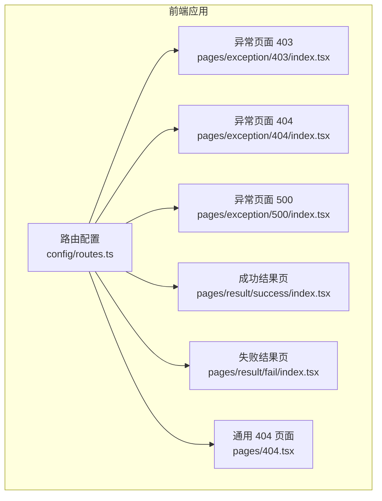
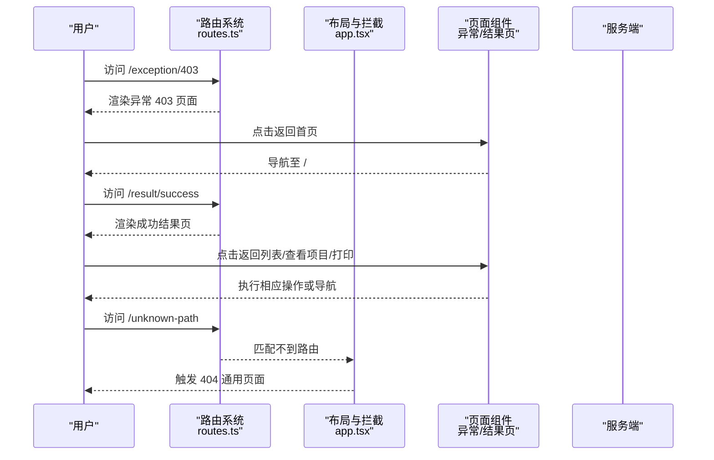
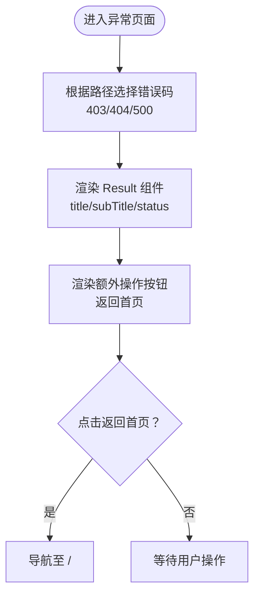
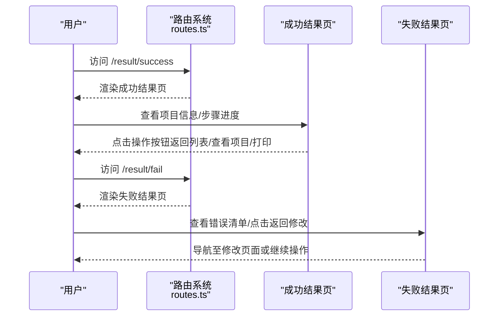
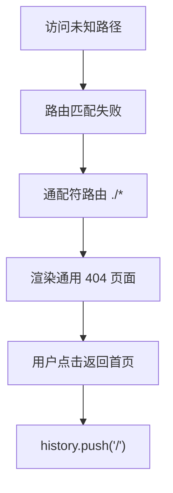
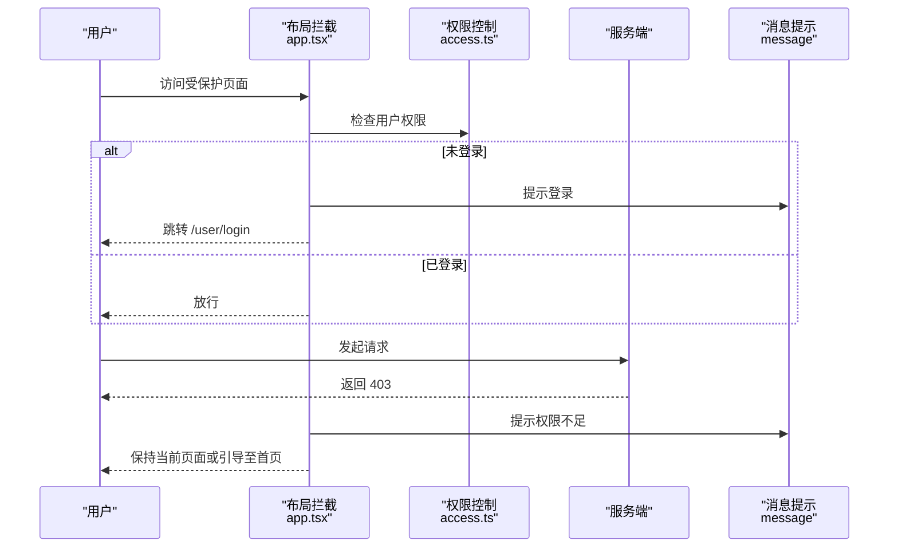
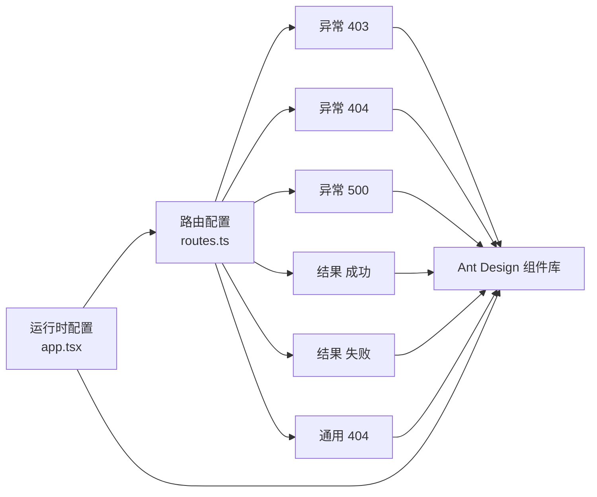

# 异常处理页面

<cite>
**本文引用的文件**
- [apps/admin-web/config/routes.ts](file://apps/admin-web/config/routes.ts)
- [apps/admin-web/src/pages/exception/403/index.tsx](file://apps/admin-web/src/pages/exception/403/index.tsx)
- [apps/admin-web/src/pages/exception/404/index.tsx](file://apps/admin-web/src/pages/exception/404/index.tsx)
- [apps/admin-web/src/pages/exception/500/index.tsx](file://apps/admin-web/src/pages/exception/500/index.tsx)
- [apps/admin-web/src/pages/404.tsx](file://apps/admin-web/src/pages/404.tsx)
- [apps/admin-web/src/pages/result/success/index.tsx](file://apps/admin-web/src/pages/result/success/index.tsx)
- [apps/admin-web/src/pages/result/success/index.style.ts](file://apps/admin-web/src/pages/result/success/index.style.ts)
- [apps/admin-web/src/pages/result/fail/index.tsx](file://apps/admin-web/src/pages/result/fail/index.tsx)
- [apps/admin-web/src/pages/result/fail/index.style.ts](file://apps/admin-web/src/pages/result/fail/index.style.ts)
- [apps/admin-web/src/app.tsx](file://apps/admin-web/src/app.tsx)
- [apps/admin-web/src/access.ts](file://apps/admin-web/src/access.ts)
</cite>

## 目录
1. [简介](#简介)
2. [项目结构](#项目结构)
3. [核心组件](#核心组件)
4. [架构总览](#架构总览)
5. [详细组件分析](#详细组件分析)
6. [依赖关系分析](#依赖关系分析)
7. [性能考量](#性能考量)
8. [故障排查指南](#故障排查指南)
9. [结论](#结论)
10. [附录](#附录)

## 简介
本文件系统化阐述后台管理系统中“异常处理页面”与“结果反馈页面”的设计与实现，覆盖 403、404、500 等异常页面以及 success、fail 等结果页面。内容包括：
- 路由配置（routes.ts）与页面组件实现
- 在用户导航过程中的作用机制
- 异常页面的错误码处理逻辑与友好提示设计
- 结果页面的成功/失败状态展示模式与操作引导
- 如何通过统一的 UI 组件（Result 组件）实现一致的用户体验
- 面向开发者的可扩展方案与最佳实践

## 项目结构
异常与结果页面主要位于前端应用的 pages 目录下，路由配置集中于 config/routes.ts。页面组件统一采用 Ant Design 的 Result 组件，配合 Card、GridContent、Button、Descriptions、Steps 等组件，形成一致的视觉与交互体验。

图表来源
- [apps/admin-web/config/routes.ts](file://apps/admin-web/config/routes.ts#L191-L242)
- [apps/admin-web/src/pages/exception/403/index.tsx](file://apps/admin-web/src/pages/exception/403/index.tsx#L1-L18)
- [apps/admin-web/src/pages/exception/404/index.tsx](file://apps/admin-web/src/pages/exception/404/index.tsx#L1-L18)
- [apps/admin-web/src/pages/exception/500/index.tsx](file://apps/admin-web/src/pages/exception/500/index.tsx#L1-L18)
- [apps/admin-web/src/pages/404.tsx](file://apps/admin-web/src/pages/404.tsx#L1-L21)
- [apps/admin-web/src/pages/result/success/index.tsx](file://apps/admin-web/src/pages/result/success/index.tsx#L1-L138)
- [apps/admin-web/src/pages/result/fail/index.tsx](file://apps/admin-web/src/pages/result/fail/index.tsx#L1-L76)

章节来源
- [apps/admin-web/config/routes.ts](file://apps/admin-web/config/routes.ts#L191-L242)

## 核心组件
- 异常页面组件：基于 Ant Design Result 组件，分别展示 403、404、500 的状态码、标题、副标题与返回首页的操作按钮。
- 结果页面组件：基于 Ant Design Result 组件，分别展示 success 与 error 状态，包含标题、副标题、额外操作按钮及附加内容（如描述列表、步骤条、错误清单等）。
- 通用 404 页面：在未匹配到任何路由时显示，提供返回首页的按钮。
- 路由配置：集中定义异常与结果页面的路由路径、重定向规则与嵌套路由结构。

章节来源
- [apps/admin-web/src/pages/exception/403/index.tsx](file://apps/admin-web/src/pages/exception/403/index.tsx#L1-L18)
- [apps/admin-web/src/pages/exception/404/index.tsx](file://apps/admin-web/src/pages/exception/404/index.tsx#L1-L18)
- [apps/admin-web/src/pages/exception/500/index.tsx](file://apps/admin-web/src/pages/exception/500/index.tsx#L1-L18)
- [apps/admin-web/src/pages/result/success/index.tsx](file://apps/admin-web/src/pages/result/success/index.tsx#L1-L138)
- [apps/admin-web/src/pages/result/fail/index.tsx](file://apps/admin-web/src/pages/result/fail/index.tsx#L1-L76)
- [apps/admin-web/src/pages/404.tsx](file://apps/admin-web/src/pages/404.tsx#L1-L21)

## 架构总览
异常与结果页面在前端应用中的整体工作流程如下：
- 路由层：通过 config/routes.ts 定义异常与结果页面的路由路径与嵌套结构；同时配置通配符路由以捕获未匹配路径并跳转至通用 404 页面。
- 页面层：各异常与结果页面组件负责渲染统一的 UI 结构与交互元素。
- 运行时层：通过 app.tsx 的运行时配置，统一处理网络请求错误、业务错误与权限相关错误，确保用户在不同场景下获得一致的反馈与跳转行为。

图表来源
- [apps/admin-web/config/routes.ts](file://apps/admin-web/config/routes.ts#L191-L242)
- [apps/admin-web/src/pages/404.tsx](file://apps/admin-web/src/pages/404.tsx#L1-L21)
- [apps/admin-web/src/app.tsx](file://apps/admin-web/src/app.tsx#L75-L97)

## 详细组件分析

### 异常页面（403/404/500）
- 设计要点
  - 使用 Ant Design Result 组件，status 分别为 403、404、500，title 与 subTitle 提供清晰的错误语义。
  - 提供“返回首页”按钮，使用 Link 或 history.push 实现导航。
  - 统一使用 Card 与无边框变体，保证页面卡片化展示的一致性。
- 路由配置
  - 在 config/routes.ts 中定义 /exception 路由组，包含 403、404、500 子路由，并设置默认重定向至 403。
- 用户导航机制
  - 当用户访问 /exception 时，自动重定向到 /exception/403。
  - 当用户访问 /exception/404 或 /exception/500 时，直接渲染对应页面。
  - 未匹配到任何路由时，通过通配符路由 ./* 跳转至通用 404 页面。

图表来源
- [apps/admin-web/src/pages/exception/403/index.tsx](file://apps/admin-web/src/pages/exception/403/index.tsx#L1-L18)
- [apps/admin-web/src/pages/exception/404/index.tsx](file://apps/admin-web/src/pages/exception/404/index.tsx#L1-L18)
- [apps/admin-web/src/pages/exception/500/index.tsx](file://apps/admin-web/src/pages/exception/500/index.tsx#L1-L18)
- [apps/admin-web/config/routes.ts](file://apps/admin-web/config/routes.ts#L214-L242)

章节来源
- [apps/admin-web/src/pages/exception/403/index.tsx](file://apps/admin-web/src/pages/exception/403/index.tsx#L1-L18)
- [apps/admin-web/src/pages/exception/404/index.tsx](file://apps/admin-web/src/pages/exception/404/index.tsx#L1-L18)
- [apps/admin-web/src/pages/exception/500/index.tsx](file://apps/admin-web/src/pages/exception/500/index.tsx#L1-L18)
- [apps/admin-web/config/routes.ts](file://apps/admin-web/config/routes.ts#L214-L242)

### 结果页面（success/fail）
- 成功结果页（success）
  - 使用 Result(status="success") 展示“提交成功”，提供副标题说明与多个操作按钮（返回列表、查看项目、打印）。
  - 通过 Descriptions 与 Steps 展示项目相关信息与审批流程进度，增强可读性与上下文信息。
  - 使用 GridContent 与 Card 实现页面内容容器与卡片化布局。
- 失败结果页（fail）
  - 使用 Result(status="error") 展示“提交失败”，提供错误原因列表与“返回修改”按钮。
  - 通过样式模块化定义错误图标与标题样式，提升一致性与可维护性。
- 路由配置
  - 在 config/routes.ts 中定义 /result 路由组，包含 success、fail 子路由，并设置默认重定向至 success。

图表来源
- [apps/admin-web/config/routes.ts](file://apps/admin-web/config/routes.ts#L191-L213)
- [apps/admin-web/src/pages/result/success/index.tsx](file://apps/admin-web/src/pages/result/success/index.tsx#L1-L138)
- [apps/admin-web/src/pages/result/fail/index.tsx](file://apps/admin-web/src/pages/result/fail/index.tsx#L1-L76)

章节来源
- [apps/admin-web/src/pages/result/success/index.tsx](file://apps/admin-web/src/pages/result/success/index.tsx#L1-L138)
- [apps/admin-web/src/pages/result/success/index.style.ts](file://apps/admin-web/src/pages/result/success/index.style.ts#L1-L21)
- [apps/admin-web/src/pages/result/fail/index.tsx](file://apps/admin-web/src/pages/result/fail/index.tsx#L1-L76)
- [apps/admin-web/src/pages/result/fail/index.style.ts](file://apps/admin-web/src/pages/result/fail/index.style.ts#L1-L18)
- [apps/admin-web/config/routes.ts](file://apps/admin-web/config/routes.ts#L191-L213)

### 通用 404 页面
- 设计要点
  - 使用 Ant Design Result 组件，status="404"，title 与 subTitle 明确提示页面不存在。
  - 提供“返回首页”按钮，使用 history.push 实现导航。
- 路由配置
  - 在 config/routes.ts 中通过通配符 ./* 将所有未匹配路径重定向至 404 页面，确保兜底体验。

图表来源
- [apps/admin-web/src/pages/404.tsx](file://apps/admin-web/src/pages/404.tsx#L1-L21)
- [apps/admin-web/config/routes.ts](file://apps/admin-web/config/routes.ts#L270-L275)

章节来源
- [apps/admin-web/src/pages/404.tsx](file://apps/admin-web/src/pages/404.tsx#L1-L21)
- [apps/admin-web/config/routes.ts](file://apps/admin-web/config/routes.ts#L270-L275)

### 运行时错误处理与权限拦截
- 网络请求错误处理（app.tsx）
  - 通过 request.errorConfig.errorHandler 统一处理 HTTP 状态码错误：
    - 401：登录过期，清除本地 token 并跳转登录页
    - 403：权限不足，提示用户无权访问
    - 其他 HTTP 错误：提示网络请求错误
  - 通过 responseInterceptors 解包业务响应，当 status 非成功时统一提示业务错误并拒绝 Promise，避免页面重复渲染错误页。
- 权限拦截（app.tsx + access.ts）
  - 在布局的 onPageChange 中检查用户是否已登录，未登录则重定向至登录页。
  - access.ts 定义权限标识（如 canAdmin），可在页面或组件中按需使用。

图表来源
- [apps/admin-web/src/app.tsx](file://apps/admin-web/src/app.tsx#L75-L97)
- [apps/admin-web/src/app.tsx](file://apps/admin-web/src/app.tsx#L99-L171)
- [apps/admin-web/src/access.ts](file://apps/admin-web/src/access.ts#L1-L13)

章节来源
- [apps/admin-web/src/app.tsx](file://apps/admin-web/src/app.tsx#L75-L97)
- [apps/admin-web/src/app.tsx](file://apps/admin-web/src/app.tsx#L99-L171)
- [apps/admin-web/src/access.ts](file://apps/admin-web/src/access.ts#L1-L13)

## 依赖关系分析
- 路由依赖
  - config/routes.ts 定义了异常与结果页面的路由树，决定页面的访问路径与默认重定向。
- 组件依赖
  - 各异常与结果页面均依赖 Ant Design 的 Result、Card、Button、Descriptions、Steps、GridContent 等组件。
  - 成功结果页依赖样式模块（index.style.ts）以统一标题与图标样式。
- 运行时依赖
  - app.tsx 的运行时配置为全局错误处理与权限拦截提供统一入口，影响所有页面的错误反馈与导航行为。

图表来源
- [apps/admin-web/config/routes.ts](file://apps/admin-web/config/routes.ts#L191-L242)
- [apps/admin-web/src/pages/exception/403/index.tsx](file://apps/admin-web/src/pages/exception/403/index.tsx#L1-L18)
- [apps/admin-web/src/pages/exception/404/index.tsx](file://apps/admin-web/src/pages/exception/404/index.tsx#L1-L18)
- [apps/admin-web/src/pages/exception/500/index.tsx](file://apps/admin-web/src/pages/exception/500/index.tsx#L1-L18)
- [apps/admin-web/src/pages/result/success/index.tsx](file://apps/admin-web/src/pages/result/success/index.tsx#L1-L138)
- [apps/admin-web/src/pages/result/fail/index.tsx](file://apps/admin-web/src/pages/result/fail/index.tsx#L1-L76)
- [apps/admin-web/src/pages/404.tsx](file://apps/admin-web/src/pages/404.tsx#L1-L21)
- [apps/admin-web/src/app.tsx](file://apps/admin-web/src/app.tsx#L99-L171)

章节来源
- [apps/admin-web/config/routes.ts](file://apps/admin-web/config/routes.ts#L191-L242)
- [apps/admin-web/src/app.tsx](file://apps/admin-web/src/app.tsx#L99-L171)

## 性能考量
- 组件渲染
  - 异常与结果页面均为轻量级展示组件，使用 Card 与 Result 等组件，渲染开销低。
- 路由匹配
  - 通过明确的静态路由与通配符兜底，减少不必要的动态匹配成本。
- 错误处理
  - 在运行时统一处理网络错误与业务错误，避免页面重复渲染错误页，降低无效重绘。
- 样式模块化
  - 成功/失败页面的样式通过样式模块化定义，便于缓存与复用，减少样式抖动。

## 故障排查指南
- 访问异常页面后无法返回首页
  - 检查页面中返回按钮的导航逻辑（Link 或 history.push），确认路径正确。
  - 若使用 Link，确保路由配置中存在对应路径。
- 404 页面未显示
  - 确认通配符路由 ./* 是否存在且位于路由表末尾。
  - 检查页面组件是否正确导出并被路由引用。
- 登录过期或权限不足导致频繁跳转
  - 检查 app.tsx 的错误处理逻辑与权限拦截逻辑，确认 401/403 分支是否触发。
  - 确认本地存储的 token 是否有效，请求头是否正确注入。
- 业务错误未提示
  - 检查 responseInterceptors 是否正确解包业务响应并抛出错误。
  - 确认业务状态码与提示文案是否符合预期。

章节来源
- [apps/admin-web/src/pages/404.tsx](file://apps/admin-web/src/pages/404.tsx#L1-L21)
- [apps/admin-web/config/routes.ts](file://apps/admin-web/config/routes.ts#L270-L275)
- [apps/admin-web/src/app.tsx](file://apps/admin-web/src/app.tsx#L99-L171)

## 结论
该系统通过统一的路由配置与页面组件，实现了异常与结果页面的一致性与可维护性。运行时配置进一步强化了错误处理与权限拦截，确保用户在不同场景下获得清晰、友好的反馈与导航体验。开发者可在此基础上扩展新的异常与结果页面，或定制错误提示与操作引导，以满足更复杂的业务需求。

## 附录
- 扩展建议
  - 新增异常页面：在 config/routes.ts 中新增路由项，并创建对应页面组件，复用 Result 组件与 Card 容器。
  - 新增结果页面：在 /result 下新增子路由与页面组件，统一使用 Result 的 status、title、subTitle 与 extra 结构。
  - 自定义错误提示：在 app.tsx 的 errorConfig.errorHandler 中扩展更多状态码分支，提供更细粒度的提示与引导。
  - 权限细化：在 access.ts 中扩展权限标识，并在页面中使用 Access 组件进行细粒度控制。