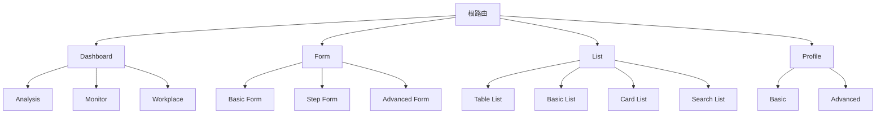
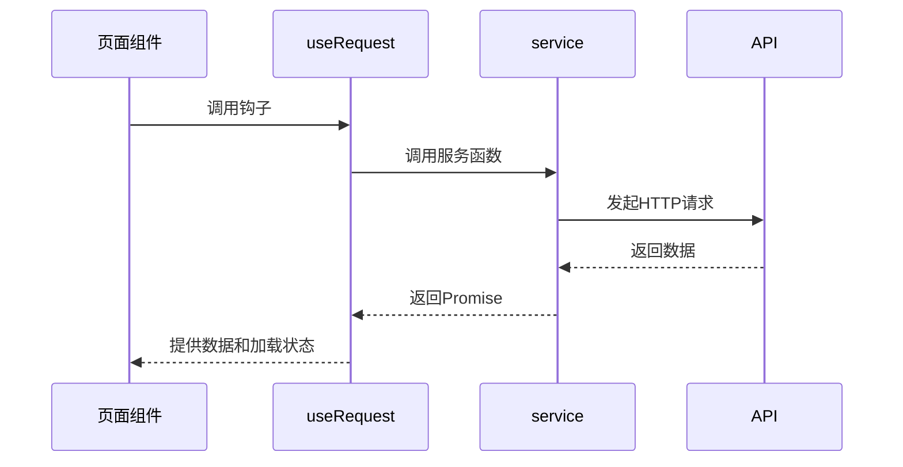
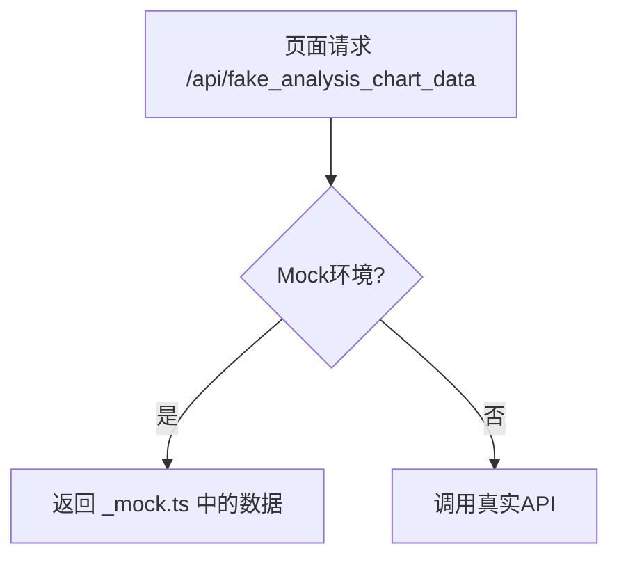

# 核心功能页面

<cite>
**本文档引用的文件**  
- [routes.ts](file://apps/admin-web/config/routes.ts)
- [analysis/index.tsx](file://apps/admin-web/src/pages/dashboard/analysis/index.tsx)
- [monitor/index.tsx](file://apps/admin-web/src/pages/dashboard/monitor/index.tsx)
- [workplace/index.tsx](file://apps/admin-web/src/pages/dashboard/workplace/index.tsx)
- [basic-form/index.tsx](file://apps/admin-web/src/pages/form/basic-form/index.tsx)
- [step-form/index.tsx](file://apps/admin-web/src/pages/form/step-form/index.tsx)
- [advanced-form/index.tsx](file://apps/admin-web/src/pages/form/advanced-form/index.tsx)
- [table-list/index.tsx](file://apps/admin-web/src/pages/list/table-list/index.tsx)
- [basic-list/index.tsx](file://apps/admin-web/src/pages/list/basic-list/index.tsx)
- [card-list/index.tsx](file://apps/admin-web/src/pages/list/card-list/index.tsx)
- [search/index.tsx](file://apps/admin-web/src/pages/list/search/index.tsx)
- [basic/index.tsx](file://apps/admin-web/src/pages/profile/basic/index.tsx)
- [advanced/index.tsx](file://apps/admin-web/src/pages/profile/advanced/index.tsx)
- [analysis/service.ts](file://apps/admin-web/src/pages/dashboard/analysis/service.ts)
- [monitor/service.ts](file://apps/admin-web/src/pages/dashboard/monitor/service.ts)
- [workplace/service.ts](file://apps/admin-web/src/pages/dashboard/workplace/service.ts)
- [basic-form/service.ts](file://apps/admin-web/src/pages/form/basic-form/service.ts)
- [analysis/_mock.ts](file://apps/admin-web/src/pages/dashboard/analysis/_mock.ts)
- [monitor/_mock.ts](file://apps/admin-web/src/pages/dashboard/monitor/_mock.ts)
- [workplace/_mock.ts](file://apps/admin-web/src/pages/dashboard/workplace/_mock.ts)
- [basic-form/_mock.ts](file://apps/admin-web/src/pages/form/basic-form/_mock.ts)
- [analysis/style.style.ts](file://apps/admin-web/src/pages/dashboard/analysis/style.style.ts)
- [monitor/style.style.ts](file://apps/admin-web/src/pages/dashboard/monitor/style.style.ts)
- [workplace/style.style.ts](file://apps/admin-web/src/pages/dashboard/workplace/style.style.ts)
- [basic-form/style.style.ts](file://apps/admin-web/src/pages/form/basic-form/style.style.ts)
</cite>

## 目录
1. [介绍](#介绍)
2. [路由配置与页面映射](#路由配置与页面映射)
3. [Dashboard模块](#dashboard模块)
4. [Form模块](#form模块)
5. [List模块](#list模块)
6. [Profile模块](#profile模块)
7. [数据加载与服务机制](#数据加载与服务机制)
8. [模拟数据配置](#模拟数据配置)
9. [样式管理](#样式管理)
10. [最佳实践总结](#最佳实践总结)

## 介绍
本文档深入解析admin-web的核心功能页面结构，重点阐述dashboard、form、list和profile四大模块的实现机制。通过分析各模块的路由配置、页面组件、数据可视化方案、表单设计模式、列表渲染策略和用户信息展示逻辑，结合数据加载流程、模拟数据配置和样式管理，为开发者提供页面开发的最佳实践。

## 路由配置与页面映射
admin-web的路由配置在`routes.ts`文件中定义，采用嵌套路由结构，将核心功能模块组织为独立的路由组。每个路由项通过`path`定义访问路径，`component`指定对应的页面组件，`name`设置菜单名称，`icon`配置导航图标。



**Diagram sources**
- [routes.ts](file://apps/admin-web/config/routes.ts)

**Section sources**
- [routes.ts](file://apps/admin-web/config/routes.ts)

## Dashboard模块
Dashboard模块包含analysis、monitor和workplace三个子页面，分别提供数据分析、实时监控和工作台功能。

### Analysis子页面
Analysis页面通过`useRequest`钩子调用`fakeChartData`服务获取数据，使用`GridContent`布局组件组织页面结构。页面包含多个可视化组件：
- `IntroduceRow`：关键指标介绍
- `SalesCard`：销售数据趋势图
- `TopSearch`：热门搜索词分析
- `ProportionSales`：销售渠道占比饼图
- `OfflineData`：线下门店数据对比

数据可视化通过Ant Design Pro的图表组件实现，结合`Suspense`组件提供加载状态。

**Section sources**
- [analysis/index.tsx](file://apps/admin-web/src/pages/dashboard/analysis/index.tsx)
- [analysis/service.ts](file://apps/admin-web/src/pages/dashboard/analysis/service.ts)
- [analysis/_mock.ts](file://apps/admin-web/src/pages/dashboard/analysis/_mock.ts)
- [analysis/style.style.ts](file://apps/admin-web/src/pages/dashboard/analysis/style.style.ts)

### Monitor子页面
Monitor页面专注于实时监控功能，使用多种图表类型展示系统状态：
- `Statistic`组件显示关键指标
- `Gauge`仪表盘展示券核效率
- `Progress`进度条显示各品类占比
- `WordCloud`词云展示热门搜索
- `Liquid`水波图显示资源剩余

页面采用`GridContent`布局，通过`Row`和`Col`组件实现响应式栅格布局，确保在不同屏幕尺寸下都有良好的显示效果。

**Section sources**
- [monitor/index.tsx](file://apps/admin-web/src/pages/dashboard/monitor/index.tsx)
- [monitor/service.ts](file://apps/admin-web/src/pages/dashboard/monitor/service.ts)
- [monitor/_mock.ts](file://apps/admin-web/src/pages/dashboard/monitor/_mock.ts)
- [monitor/style.style.ts](file://apps/admin-web/src/pages/dashboard/monitor/style.style.ts)

### Workplace子页面
Workplace页面作为工作台，整合了多个业务模块：
- `PageHeaderContent`：用户欢迎信息
- `ExtraContent`：关键统计指标
- `ProjectList`：进行中的项目卡片
- `ActivitiesList`：用户动态流
- `EditableLinkGroup`：快捷导航
- `Radar`：能力雷达图

页面通过`useRequest`并行加载项目公告和用户活动数据，使用`List`组件渲染动态列表，`Card.Grid`实现项目卡片布局。

**Section sources**
- [workplace/index.tsx](file://apps/admin-web/src/pages/dashboard/workplace/index.tsx)
- [workplace/service.ts](file://apps/admin-web/src/pages/dashboard/workplace/service.ts)
- [workplace/_mock.ts](file://apps/admin-web/src/pages/dashboard/workplace/_mock.ts)
- [workplace/style.style.ts](file://apps/admin-web/src/pages/dashboard/workplace/style.style.ts)

## Form模块
Form模块提供三种表单模式：基础表单、分步表单和高级表单，满足不同复杂度的表单需求。

### Basic Form
基础表单用于收集少量数据，采用垂直布局。使用`ProForm`组件封装表单逻辑，包含多种输入控件：
- `ProFormText`：文本输入
- `ProFormDateRangePicker`：日期范围选择
- `ProFormTextArea`：多行文本
- `ProFormDigit`：数字输入
- `ProFormRadio.Group`：单选框
- `ProFormDependency`：表单依赖控制

表单通过`useRequest`管理提交状态，成功后显示消息提示。

**Section sources**
- [basic-form/index.tsx](file://apps/admin-web/src/pages/form/basic-form/index.tsx)
- [basic-form/service.ts](file://apps/admin-web/src/pages/form/basic-form/service.ts)
- [basic-form/_mock.ts](file://apps/admin-web/src/pages/form/basic-form/_mock.ts)
- [basic-form/style.style.ts](file://apps/admin-web/src/pages/form/basic-form/style.style.ts)

### Step Form
分步表单将复杂表单任务分解为多个步骤，引导用户完成。使用`StepsForm`组件实现多步骤流程：
- 第一步：填写转账信息（付款账户、收款账户、金额等）
- 第二步：确认转账信息（摘要展示、支付密码）
- 第三步：完成（成功结果页）

通过`formRef`引用管理表单实例，`onFinish`回调处理步骤间的数据传递。

**Section sources**
- [step-form/index.tsx](file://apps/admin-web/src/pages/form/step-form/index.tsx)
- [step-form/data.d.ts](file://apps/admin-web/src/pages/form/step-form/data.d.ts)
- [step-form/style.style.ts](file://apps/admin-web/src/pages/form/step-form/style.style.ts)

### Advanced Form
高级表单用于一次性输入和提交大批量数据。包含多个表单区域和复杂交互：
- 仓库管理：基本信息输入
- 任务管理：任务配置
- 成员管理：可编辑表格

使用`EditableProTable`实现表格内编辑功能，`FooterToolbar`显示表单验证错误信息，提供批量操作支持。

**Section sources**
- [advanced-form/index.tsx](file://apps/admin-web/src/pages/form/advanced-form/index.tsx)
- [advanced-form/service.ts](file://apps/admin-web/src/pages/form/advanced-form/service.ts)
- [advanced-form/style.style.ts](file://apps/admin-web/src/pages/form/advanced-form/style.style.ts)

## List模块
List模块提供多种列表展示方式，满足不同业务场景需求。

### Table List
表格列表使用`ProTable`组件，提供完整的表格功能：
- 搜索过滤
- 分页控制
- 批量操作
- 列排序
- 操作按钮

通过`actionRef`引用控制表格刷新，`ModalForm`和`UpdateForm`组件实现新建和编辑功能，`Drawer`组件展示详情。

**Section sources**
- [table-list/index.tsx](file://apps/admin-web/src/pages/list/table-list/index.tsx)
- [table-list/data.ts](file://apps/admin-web/src/pages/list/table-list/data.ts)
- [table-list/service.ts](file://apps/admin-web/src/pages/list/table-list/service.ts)

### Basic List
基础列表使用`List`组件，结合`List.Item.Meta`和自定义内容组件实现。包含：
- 信息统计卡片
- 列表项操作菜单
- 分页控制
- 添加/编辑模态框

通过`Segmented`组件实现筛选，`Search`组件提供搜索功能。

**Section sources**
- [basic-list/index.tsx](file://apps/admin-web/src/pages/list/basic-list/index.tsx)
- [basic-list/data.d.ts](file://apps/admin-web/src/pages/list/basic-list/data.d.ts)
- [basic-list/service.ts](file://apps/admin-web/src/pages/list/basic-list/service.ts)
- [basic-list/style.style.ts](file://apps/admin-web/src/pages/list/basic-list/style.style.ts)

### Card List
卡片列表使用`List`组件的`grid`模式，实现响应式卡片布局。特点包括：
- 自适应栅格
- 卡片悬停效果
- 操作按钮
- 新增按钮（特殊卡片）

通过`extraContent`显示额外信息，`content`显示页面描述。

**Section sources**
- [card-list/index.tsx](file://apps/admin-web/src/pages/list/card-list/index.tsx)
- [card-list/data.d.ts](file://apps/admin-web/src/pages/list/card-list/data.d.ts)
- [card-list/service.ts](file://apps/admin-web/src/pages/list/card-list/service.ts)
- [card-list/style.style.ts](file://apps/admin-web/src/pages/list/card-list/style.style.ts)

### Search List
搜索列表使用`Outlet`和`tabList`实现多标签页搜索功能。包含：
- 搜索框
- 标签页切换
- 动态路由加载

通过`useMatch`和`history`实现标签页导航，`PageContainer`的`tabActiveKey`和`onTabChange`管理标签状态。

**Section sources**
- [search/index.tsx](file://apps/admin-web/src/pages/list/search/index.tsx)
- [search/articles/index.tsx](file://apps/admin-web/src/pages/list/search/articles/index.tsx)
- [search/projects/index.tsx](file://apps/admin-web/src/pages/list/search/projects/index.tsx)
- [search/applications/index.tsx](file://apps/admin-web/src/pages/list/search/applications/index.tsx)

## Profile模块
Profile模块提供用户信息展示功能，包含基础和高级两种视图。

### Basic Profile
基础个人页使用`Descriptions`和`ProTable`组件展示结构化数据。包含：
- 退款申请信息
- 用户联系信息
- 退货商品表格
- 退货进度表格

通过`render`函数自定义表格单元格渲染，实现总计行的特殊样式。

**Section sources**
- [basic/index.tsx](file://apps/admin-web/src/pages/profile/basic/index.tsx)
- [basic/data.d.ts](file://apps/admin-web/src/pages/profile/basic/data.d.ts)
- [basic/service.ts](file://apps/admin-web/src/pages/profile/basic/service.ts)
- [basic/style.style.ts](file://apps/admin-web/src/pages/profile/basic/style.style.ts)

### Advanced Profile
高级个人页提供更丰富的信息展示：
- 流程进度（Steps组件）
- 多层级用户信息
- 操作日志标签页
- 响应式布局

使用`GridContent`布局，`Steps`组件展示审批流程，`Card`嵌套实现复杂信息结构。

**Section sources**
- [advanced/index.tsx](file://apps/admin-web/src/pages/profile/advanced/index.tsx)
- [advanced/data.d.ts](file://apps/admin-web/src/pages/profile/advanced/data.d.ts)
- [advanced/service.ts](file://apps/admin-web/src/pages/profile/advanced/service.ts)
- [advanced/style.style.ts](file://apps/admin-web/src/pages/profile/advanced/style.style.ts)

## 数据加载与服务机制
各页面通过`useRequest`钩子管理数据加载，服务函数定义在`service.ts`文件中，使用`request`方法发起API调用。



**Diagram sources**
- [analysis/service.ts](file://apps/admin-web/src/pages/dashboard/analysis/service.ts)
- [monitor/service.ts](file://apps/admin-web/src/pages/dashboard/monitor/service.ts)
- [workplace/service.ts](file://apps/admin-web/src/pages/dashboard/workplace/service.ts)
- [basic-form/service.ts](file://apps/admin-web/src/pages/form/basic-form/service.ts)

**Section sources**
- [analysis/service.ts](file://apps/admin-web/src/pages/dashboard/analysis/service.ts)
- [monitor/service.ts](file://apps/admin-web/src/pages/dashboard/monitor/service.ts)
- [workplace/service.ts](file://apps/admin-web/src/pages/dashboard/workplace/service.ts)
- [basic-form/service.ts](file://apps/admin-web/src/pages/form/basic-form/service.ts)

## 模拟数据配置
模拟数据在`_mock.ts`文件中定义，用于开发和测试环境。通过`umi`的mock机制，将API请求映射到本地数据。



**Diagram sources**
- [analysis/_mock.ts](file://apps/admin-web/src/pages/dashboard/analysis/_mock.ts)
- [monitor/_mock.ts](file://apps/admin-web/src/pages/dashboard/monitor/_mock.ts)
- [workplace/_mock.ts](file://apps/admin-web/src/pages/dashboard/workplace/_mock.ts)
- [basic-form/_mock.ts](file://apps/admin-web/src/pages/form/basic-form/_mock.ts)

**Section sources**
- [analysis/_mock.ts](file://apps/admin-web/src/pages/dashboard/analysis/_mock.ts)
- [monitor/_mock.ts](file://apps/admin-web/src/pages/dashboard/monitor/_mock.ts)
- [workplace/_mock.ts](file://apps/admin-web/src/pages/dashboard/workplace/_mock.ts)
- [basic-form/_mock.ts](file://apps/admin-web/src/pages/form/basic-form/_mock.ts)

## 样式管理
样式通过`style.style.ts`文件使用CSS-in-JS管理，`useStyles`钩子返回样式对象。

```mermaid
classDiagram
class style.style.ts {
+useStyles() : object
+styles : object
}
class Component {
+useStyles() : object
+styles : object
}
Component --> style.style.ts : "import"
```

**Diagram sources**
- [analysis/style.style.ts](file://apps/admin-web/src/pages/dashboard/analysis/style.style.ts)
- [monitor/style.style.ts](file://apps/admin-web/src/pages/dashboard/monitor/style.style.ts)
- [workplace/style.style.ts](file://apps/admin-web/src/pages/dashboard/workplace/style.style.ts)
- [basic-form/style.style.ts](file://apps/admin-web/src/pages/form/basic-form/style.style.ts)

**Section sources**
- [analysis/style.style.ts](file://apps/admin-web/src/pages/dashboard/analysis/style.style.ts)
- [monitor/style.style.ts](file://apps/admin-web/src/pages/dashboard/monitor/style.style.ts)
- [workplace/style.style.ts](file://apps/admin-web/src/pages/dashboard/workplace/style.style.ts)
- [basic-form/style.style.ts](file://apps/admin-web/src/pages/form/basic-form/style.style.ts)

## 最佳实践总结
1. **路由组织**：使用嵌套路由将相关功能分组，保持路由结构清晰
2. **数据管理**：统一使用`useRequest`管理异步请求，保持数据加载模式一致
3. **组件复用**：提取公共组件（如`Info`、`ListContent`）提高代码复用性
4. **样式管理**：采用CSS-in-JS方案，实现样式作用域隔离
5. **表单设计**：根据复杂度选择合适的表单模式，合理使用表单依赖和验证
6. **列表实现**：根据数据特点选择合适的列表组件，优化渲染性能
7. **用户体验**：提供加载状态、错误提示和成功反馈，提升交互体验