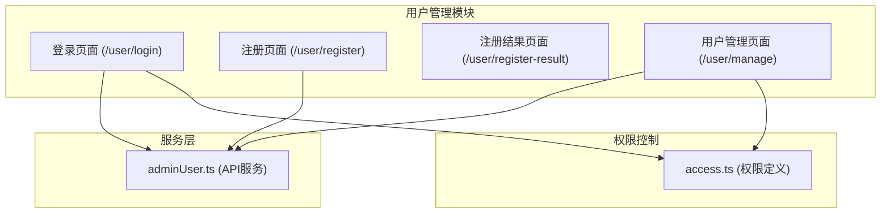
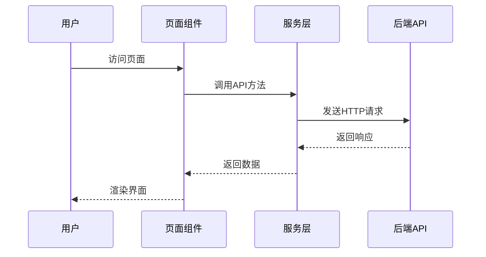
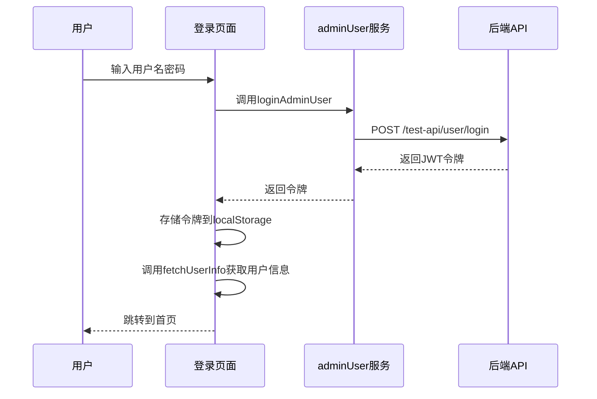
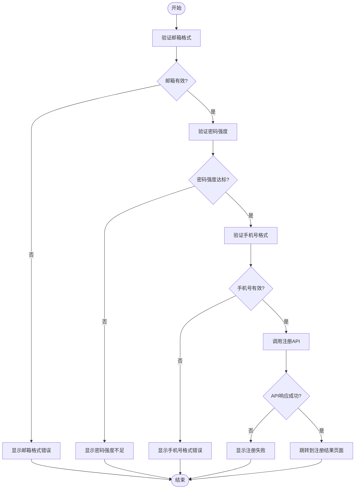
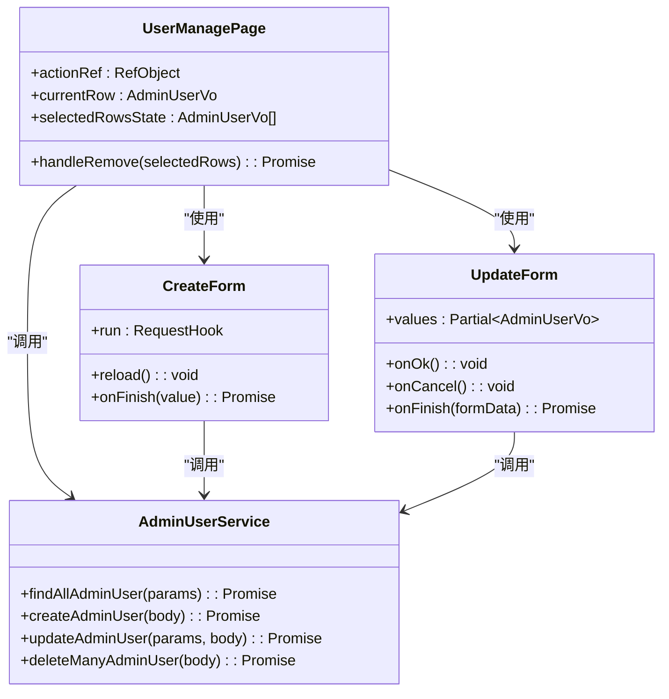
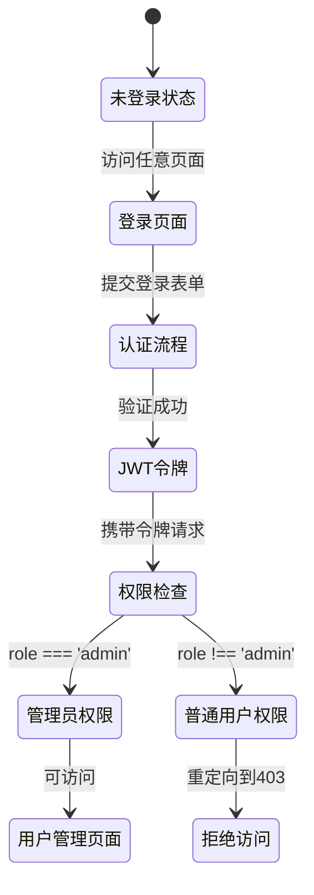
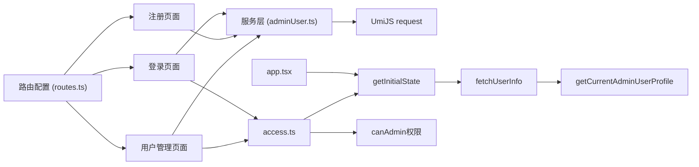

# 用户管理页面

<cite>
**本文档引用的文件**  
- [routes.ts](file://apps/admin-web/config/routes.ts)
- [login/index.tsx](file://apps/admin-web/src/pages/user/login/index.tsx)
- [register/index.tsx](file://apps/admin-web/src/pages/user/register/index.tsx)
- [register-result/index.tsx](file://apps/admin-web/src/pages/user/register-result/index.tsx)
- [manage/index.tsx](file://apps/admin-web/src/pages/user/manage/index.tsx)
- [CreateForm.tsx](file://apps/admin-web/src/pages/user/manage/components/CreateForm.tsx)
- [UpdateForm.tsx](file://apps/admin-web/src/pages/user/manage/components/UpdateForm.tsx)
- [adminUser.ts](file://apps/admin-web/src/services/mall/adminUser.ts)
- [access.ts](file://apps/admin-web/src/access.ts)
- [app.tsx](file://apps/admin-web/src/app.tsx)
</cite>

## 目录
1. [项目结构](#项目结构)
2. [核心组件](#核心组件)
3. [架构概述](#架构概述)
4. [详细组件分析](#详细组件分析)
5. [依赖分析](#依赖分析)
6. [性能考虑](#性能考虑)
7. [故障排除指南](#故障排除指南)
8. [结论](#结论)

## 项目结构

根据项目目录结构，用户管理相关页面位于 `apps/admin-web/src/pages/user/` 目录下，包含四个核心页面：登录（login）、注册（register）、注册结果（register-result）和用户管理（manage）。这些页面通过 `apps/admin-web/config/routes.ts` 文件进行路由配置，实现了清晰的导航结构。

**图示来源**  
- [routes.ts](file://apps/admin-web/config/routes.ts#L15-L80)
- 项目结构信息

## 核心组件

用户管理功能的核心组件包括四个页面组件和两个表单组件（CreateForm.tsx 和 UpdateForm.tsx），以及一个服务文件（adminUser.ts）和权限控制文件（access.ts）。这些组件共同构成了完整的用户管理功能体系，实现了从用户认证到用户管理的完整业务流程。

**组件来源**  
- [login/index.tsx](file://apps/admin-web/src/pages/user/login/index.tsx#L1-L225)
- [register/index.tsx](file://apps/admin-web/src/pages/user/register/index.tsx#L1-L310)
- [register-result/index.tsx](file://apps/admin-web/src/pages/user/register-result/index.tsx#L1-L39)
- [manage/index.tsx](file://apps/admin-web/src/pages/user/manage/index.tsx#L1-L185)

## 架构概述

系统采用前后端分离架构，前端使用 UmiJS 框架构建管理后台，后端使用 NestJS 提供 RESTful API 服务。用户管理功能的实现遵循典型的分层架构模式，包括路由层、页面层、服务层和权限控制层。

**图示来源**  
- [adminUser.ts](file://apps/admin-web/src/services/mall/adminUser.ts#L1-L121)
- [app.tsx](file://apps/admin-web/src/app.tsx#L99-L171)

## 详细组件分析

### 登录页面分析

登录页面实现了用户认证功能，包含登录和注册两种模式切换。页面使用 ProForm 组件构建表单，通过 loginAdminUser 和 registerAdminUser 服务方法与后端交互。

**图示来源**  
- [login/index.tsx](file://apps/admin-web/src/pages/user/login/index.tsx#L100-L125)
- [adminUser.ts](file://apps/admin-web/src/services/mall/adminUser.ts#L91-L101)

### 注册页面分析

注册页面实现了用户注册功能，包含邮箱、密码、手机号等字段的验证。页面通过 registerAdminUser 服务方法与后端交互，完成用户注册流程。

**图示来源**  
- [register/index.tsx](file://apps/admin-web/src/pages/user/register/index.tsx#L101-L103)
- [adminUser.ts](file://apps/admin-web/src/services/mall/adminUser.ts#L111-L121)

### 用户管理页面分析

用户管理页面实现了管理员用户的CRUD操作，使用 ProTable 组件展示用户列表，通过 CreateForm 和 UpdateForm 组件实现创建和更新功能。

**图示来源**  
- [manage/index.tsx](file://apps/admin-web/src/pages/user/manage/index.tsx#L1-L185)
- [CreateForm.tsx](file://apps/admin-web/src/pages/user/manage/components/CreateForm.tsx#L1-L87)
- [UpdateForm.tsx](file://apps/admin-web/src/pages/user/manage/components/UpdateForm.tsx#L1-L43)
- [adminUser.ts](file://apps/admin-web/src/services/mall/adminUser.ts#L1-L121)

### 权限控制分析

权限控制系统基于用户角色实现，通过 access.ts 文件定义权限规则，结合 UmiJS 的权限模型实现页面级访问控制。

**图示来源**  
- [access.ts](file://apps/admin-web/src/access.ts#L1-L12)
- [app.tsx](file://apps/admin-web/src/app.tsx#L61-L96)

## 依赖分析

用户管理功能的实现依赖于多个核心模块，包括路由配置、服务调用、权限控制和全局状态管理。这些模块之间存在明确的依赖关系，形成了一个完整的功能闭环。

**图示来源**  
- [routes.ts](file://apps/admin-web/config/routes.ts#L15-L80)
- [adminUser.ts](file://apps/admin-web/src/services/mall/adminUser.ts#L1-L121)
- [app.tsx](file://apps/admin-web/src/app.tsx#L27-L58)
- [access.ts](file://apps/admin-web/src/access.ts#L1-L12)

## 性能考虑

在用户管理功能的实现中，考虑了多个性能优化点。首先，通过 useRequest Hook 实现了请求的防抖和加载状态管理，提升了用户体验。其次，表格数据采用分页加载方式，避免一次性加载大量数据导致页面卡顿。此外，JWT 令牌存储在 localStorage 中，减少了重复认证的开销。

在异常处理方面，系统实现了全局错误处理机制，在 requestInterceptors 中统一处理 HTTP 状态码错误，如 401 未授权和 403 禁止访问，确保了系统的健壮性。

## 故障排除指南

当用户管理功能出现问题时，可以按照以下步骤进行排查：

1. **登录失败**：检查用户名密码是否正确，确认后端服务是否正常运行
2. **注册失败**：验证表单输入是否符合要求，特别是邮箱格式和密码强度
3. **权限不足**：确认当前用户角色是否具有相应权限，检查 access.ts 中的权限定义
4. **数据不显示**：检查网络请求是否成功，确认 JWT 令牌是否有效
5. **页面跳转异常**：检查路由配置是否正确，确认页面组件路径是否匹配

**故障排除来源**  
- [app.tsx](file://apps/admin-web/src/app.tsx#L104-L131)
- [login/index.tsx](file://apps/admin-web/src/pages/user/login/index.tsx#L122-L124)
- [register/index.tsx](file://apps/admin-web/src/pages/user/register/index.tsx#L92-L98)

## 结论

用户管理功能通过四个页面组件和相关服务的协同工作，实现了完整的用户生命周期管理。系统采用现代化的前端架构，结合 JWT 认证机制和基于角色的权限控制，确保了功能的完整性和安全性。通过合理的组件拆分和服务封装，代码具有良好的可维护性和扩展性，为后续功能迭代奠定了坚实基础。