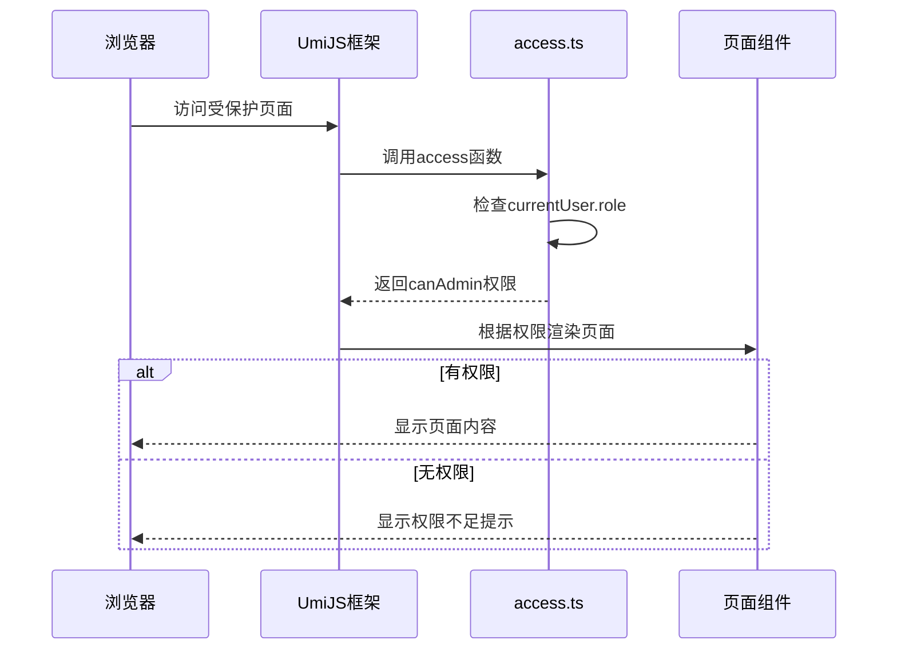
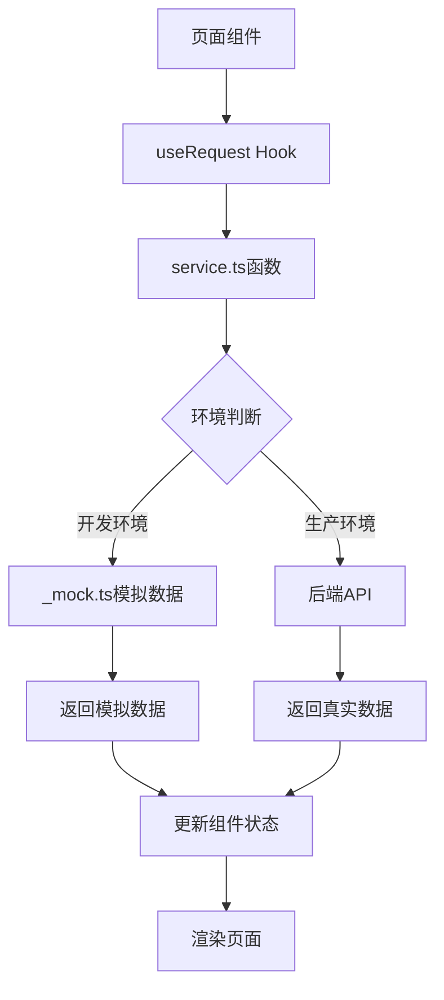

# 页面结构

<cite>
**本文档中引用的文件**  
- [routes.ts](file://apps/admin-web/config/routes.ts)
- [app.tsx](file://apps/admin-web/src/app.tsx)
- [access.ts](file://apps/admin-web/src/access.ts)
- [Admin.tsx](file://apps/admin-web/src/pages/Admin.tsx)
- [Welcome.tsx](file://apps/admin-web/src/pages/Welcome.tsx)
- [account/center/index.tsx](file://apps/admin-web/src/pages/account/center/index.tsx)
- [dashboard/analysis/index.tsx](file://apps/admin-web/src/pages/dashboard/analysis/index.tsx)
- [form/basic-form/index.tsx](file://apps/admin-web/src/pages/form/basic-form/index.tsx)
- [list/table-list/index.tsx](file://apps/admin-web/src/pages/list/table-list/index.tsx)
- [profile/basic/index.tsx](file://apps/admin-web/src/pages/profile/basic/index.tsx)
- [account/center/_mock.ts](file://apps/admin-web/src/pages/account/center/_mock.ts)
- [dashboard/analysis/_mock.ts](file://apps/admin-web/src/pages/dashboard/analysis/_mock.ts)
- [account/center/service.ts](file://apps/admin-web/src/pages/account/center/service.ts)
- [dashboard/analysis/service.ts](file://apps/admin-web/src/pages/dashboard/analysis/service.ts)
- [adminUser.ts](file://apps/admin-web/src/services/mall/adminUser.ts)
</cite>

## 目录
1. [项目结构概述](#项目结构概述)
2. [UmiJS路由配置机制](#umijS路由配置机制)
3. [核心功能模块组织方式](#核心功能模块组织方式)
4. [页面组件布局与功能划分](#页面组件布局与功能划分)
5. [页面级权限控制实现](#页面级权限控制实现)
6. [数据加载模式分析](#数据加载模式分析)
7. [最佳实践指导](#最佳实践指导)

## 项目结构概述

admin-web项目采用UmiJS框架构建，遵循约定优于配置的原则。项目结构清晰，主要分为配置文件、公共资源和源代码三大部分。源代码位于`src`目录下，包含组件、模型、页面和服务等子目录，其中`pages`目录是页面组件的主要存放位置，与`config/routes.ts`中的路由配置形成映射关系。

**Section sources**
- [routes.ts](file://apps/admin-web/config/routes.ts)
- [app.tsx](file://apps/admin-web/src/app.tsx)

## UmiJS路由配置机制

UmiJS的路由配置通过`config/routes.ts`文件实现，采用约定式路由与配置式路由相结合的方式。路由配置文件定义了应用的导航结构，每个路由对象包含`path`、`component`、`routes`（子路由）、`redirect`、`wrappers`（包装组件）、`name`（名称）和`icon`（图标）等关键属性。

路由的`component`属性采用相对路径形式，以`./`开头，指向`src/pages`目录下的具体页面组件文件。例如，`/dashboard/analysis`路径对应的组件为`./dashboard/analysis`，实际指向`src/pages/dashboard/analysis/index.tsx`文件。这种映射关系使得路由配置与页面文件结构保持高度一致，便于维护和理解。

路由配置支持嵌套路由，通过`routes`属性定义子路由，实现多级菜单结构。例如，`dashboard`路由包含`analysis`、`monitor`和`workplace`三个子路由，形成二级导航菜单。同时，通过`redirect`属性实现路由重定向，如根路径`/`重定向到`/dashboard/analysis`，`/user`路径重定向到`/user/login`。

```mermaid
graph TB
A[/] --> B[/dashboard]
A --> C[/user]
A --> D[/form]
A --> E[/list]
A --> F[/profile]
A --> G[/result]
A --> H[/exception]
A --> I[/account]
B --> B1[/dashboard/analysis]
B --> B2[/dashboard/monitor]
B --> B3[/dashboard/workplace]
C --> C1[/user/login]
C --> C2[/user/register]
C --> C3[/user/register-result]
D --> D1[/form/basic-form]
D --> D2[/form/step-form]
D --> D3[/form/advanced-form]
E --> E1[/list/table-list]
E --> E2[/list/basic-list]
E --> E3[/list/card-list]
E --> E4[/list/search/articles]
E --> E5[/list/search/projects]
E --> E6[/list/search/applications]
F --> F1[/profile/basic]
F --> F2[/profile/advanced]
H --> H1[/exception/403]
H --> H2[/exception/404]
H --> H3[/exception/500]
I --> I1[/account/center]
I --> I2[/account/settings]
```

**Diagram sources**
- [routes.ts](file://apps/admin-web/config/routes.ts)

**Section sources**
- [routes.ts](file://apps/admin-web/config/routes.ts)

## 核心功能模块组织方式

admin-web的核心功能模块包括account（账户）、dashboard（仪表盘）、form（表单）、list（列表）和profile（个人资料）等。这些模块在`src/pages`目录下以独立子目录的形式组织，每个模块包含其相关的页面组件、样式文件、数据定义和服务调用。

- **account模块**：包含`center`（个人中心）和`settings`（设置）两个子模块，分别对应用户信息展示和账户设置功能。
- **dashboard模块**：包含`analysis`（分析）、`monitor`（监控）和`workplace`（工作台）三个子模块，提供数据可视化和系统监控功能。
- **form模块**：包含`basic-form`（基础表单）、`step-form`（分步表单）和`advanced-form`（高级表单）三个子模块，覆盖不同复杂度的表单场景。
- **list模块**：包含`table-list`（表格列表）、`basic-list`（基础列表）、`card-list`（卡片列表）和`search`（搜索列表）四个子模块，提供多种数据展示方式。
- **profile模块**：包含`basic`（基本信息）和`advanced`（高级信息）两个子模块，用于展示用户详细信息。

这种模块化组织方式使得功能边界清晰，便于团队协作开发和维护。

**Section sources**
- [routes.ts](file://apps/admin-web/config/routes.ts)

## 页面组件布局与功能划分

页面组件采用React函数式组件编写，遵循Ant Design Pro的设计规范。核心页面组件如`Welcome.tsx`和`Admin.tsx`位于`src/pages`根目录下，分别作为欢迎页和管理员专用页。

`Welcome.tsx`组件使用`PageContainer`作为布局容器，内部包含多个`InfoCard`卡片组件，用于展示项目介绍和学习资源链接。`Admin.tsx`组件同样使用`PageContainer`，但通过`content`属性指定页面标题，并包含一个带有成功提示的`Alert`组件和一个居中的标题。

各功能模块的页面组件通常包含以下结构：
1. **布局容器**：使用`PageContainer`或`GridContent`作为页面布局容器。
2. **卡片组件**：使用`Card`组件包裹主要内容，提供视觉分组。
3. **数据展示**：根据功能需求使用`Table`、`List`、`Chart`等组件展示数据。
4. **交互元素**：包含`Button`、`Form`、`Modal`等交互组件，实现用户操作。

例如，`account/center/index.tsx`组件使用`GridContent`布局，左侧显示用户头像和基本信息，右侧通过标签页（Tabs）展示文章、应用和项目等操作内容。

**Section sources**
- [Admin.tsx](file://apps/admin-web/src/pages/Admin.tsx)
- [Welcome.tsx](file://apps/admin-web/src/pages/Welcome.tsx)
- [account/center/index.tsx](file://apps/admin-web/src/pages/account/center/index.tsx)

## 页面级权限控制实现

页面级权限控制通过UmiJS的`access`插件实现。`src/access.ts`文件定义了权限检查函数，该函数接收全局状态作为参数，返回一个包含权限标识的对象。



**Diagram sources**
- [access.ts](file://apps/admin-web/src/access.ts)

`access.ts`文件中定义了`canAdmin`权限，逻辑为检查当前用户的角色是否为`admin`。在路由配置中，可以通过`wrappers`属性指定权限检查组件，或者在页面组件内部使用`useAccess` Hook来检查权限。

`app.tsx`文件中的`getInitialState`函数负责初始化全局状态，包括当前用户信息。该函数在应用启动时执行，从后端API获取用户信息并存储在全局状态中，供权限检查函数使用。

**Section sources**
- [access.ts](file://apps/admin-web/src/access.ts)
- [app.tsx](file://apps/admin-web/src/app.tsx)

## 数据加载模式分析

数据加载采用`_mock.ts`与`service.ts`配合使用的模式，实现开发环境下的数据模拟和生产环境下的真实数据请求。

`_mock.ts`文件位于各页面模块目录下，定义了模拟数据接口。例如，`account/center/_mock.ts`文件定义了`/api/currentUserDetail`和`/api/fake_list_Detail`两个接口，返回预设的用户信息和列表数据。这些模拟接口在开发环境中被UmiJS自动识别并启用。

`service.ts`文件位于同一目录下，定义了数据请求函数。这些函数使用UmiJS提供的`request`方法，向后端API发起HTTP请求。例如，`account/center/service.ts`文件中的`queryCurrent`函数请求`/api/currentUserDetail`接口获取当前用户信息。

在页面组件中，通过`useRequest` Hook调用`service.ts`中定义的函数来加载数据。开发环境中，请求被`_mock.ts`中的模拟接口拦截并返回模拟数据；生产环境中，请求直接发送到后端服务器。



**Diagram sources**
- [account/center/_mock.ts](file://apps/admin-web/src/pages/account/center/_mock.ts)
- [account/center/service.ts](file://apps/admin-web/src/pages/account/center/service.ts)
- [dashboard/analysis/_mock.ts](file://apps/admin-web/src/pages/dashboard/analysis/_mock.ts)
- [dashboard/analysis/service.ts](file://apps/admin-web/src/pages/dashboard/analysis/service.ts)

`app.tsx`文件中的`request`配置定义了全局请求拦截器和响应拦截器。请求拦截器自动添加认证令牌（token），响应拦截器处理HTTP状态码和业务错误，提供统一的错误提示。

**Section sources**
- [account/center/_mock.ts](file://apps/admin-web/src/pages/account/center/_mock.ts)
- [account/center/service.ts](file://apps/admin-web/src/pages/account/center/service.ts)
- [dashboard/analysis/_mock.ts](file://apps/admin-web/src/pages/dashboard/analysis/_mock.ts)
- [dashboard/analysis/service.ts](file://apps/admin-web/src/pages/dashboard/analysis/service.ts)
- [app.tsx](file://apps/admin-web/src/app.tsx)

## 最佳实践指导

1. **页面创建**：在`src/pages`目录下创建新模块目录，添加`index.tsx`页面组件文件，并在`config/routes.ts`中配置相应路由。
2. **路由配置**：遵循现有路由命名规范，使用小写字母和连字符分隔单词。为路由添加`name`和`icon`属性，确保菜单项显示正确。
3. **权限集成**：在`src/access.ts`中定义新的权限标识，在需要权限控制的页面或组件中使用`useAccess` Hook进行检查。
4. **数据加载**：为新功能创建对应的`_mock.ts`和`service.ts`文件，确保开发和生产环境的数据加载一致性。
5. **组件复用**：将可复用的UI元素提取为独立组件，存放在`src/components`目录下，提高代码复用率。
6. **样式管理**：使用CSS Modules或styled-components管理组件样式，避免样式冲突。
7. **错误处理**：在`app.tsx`的`request`配置中完善错误处理逻辑，提供友好的用户提示。

通过遵循这些最佳实践，可以确保代码质量和开发效率，维护项目的一致性和可维护性。

**Section sources**
- [routes.ts](file://apps/admin-web/config/routes.ts)
- [access.ts](file://apps/admin-web/src/access.ts)
- [app.tsx](file://apps/admin-web/src/app.tsx)