# API路由与控制器

<cite>
**本文档引用的文件**
- [api-res-wrapper.decorator.ts](file://apps/server-api/src/common/decorators/api-res-wrapper.decorator.ts)
- [jwt-auth.guard.ts](file://apps/server-api/src/common/guards/jwt-auth.guard.ts)
- [address.controller.ts](file://apps/server-api/src/modules/address/address.controller.ts)
- [goods.controller.ts](file://apps/server-api/src/modules/goods/goods.controller.ts)
- [app.module.ts](file://apps/server-api/src/app.module.ts)
- [main.ts](file://apps/server-api/src/main.ts)
- [logging.interceptor.ts](file://apps/server-api/src/common/interceptors/logging.interceptor.ts)
- [transform.interceptor.ts](file://apps/server-api/src/common/interceptors/transform.interceptor.ts)
- [http-exception.filter.ts](file://apps/server-api/src/common/filters/http-exception.filter.ts)
- [public.decorator.ts](file://apps/server-api/src/common/decorators/public.decorator.ts)
- [string-to-bigint.pipe.ts](file://apps/server-api/src/common/pipes/string-to-bigint.pipe.ts)
- [common-res.dto.ts](file://apps/server-api/src/common/dto/common-res.dto.ts)
- [response.interface.ts](file://apps/server-api/src/common/interfaces/response.interface.ts)
- [Good.dto.ts](file://apps/server-api/src/modules/goods/dto/Good.dto.ts)
- [AddressGroup.vo.ts](file://apps/server-api/src/modules/address/vo/AddressGroup.vo.ts)
</cite>

## 目录
1. [引言](#引言)
2. [项目结构](#项目结构)
3. [核心组件](#核心组件)
4. [架构概述](#架构概述)
5. [详细组件分析](#详细组件分析)
6. [依赖分析](#依赖分析)
7. [性能考虑](#性能考虑)
8. [故障排除指南](#故障排除指南)
9. [结论](#结论)

## 引言
本文档系统阐述了基于NestJS框架的后端RESTful API路由设计原则与控制器实现规范。通过分析`address`、`goods`等模块的控制器实现，详细说明了统一响应包装、JWT认证守卫、请求验证管道、异常处理和日志拦截器的协同工作机制。文档还提供了API版本管理、路由前缀配置和安全防护的最佳实践指南。

## 项目结构
本项目采用单体仓库（monorepo）架构，包含多个应用和共享模块。后端API服务位于`apps/server-api`目录下，遵循NestJS的标准项目结构，包含模块、控制器、服务、DTO、实体等组件。

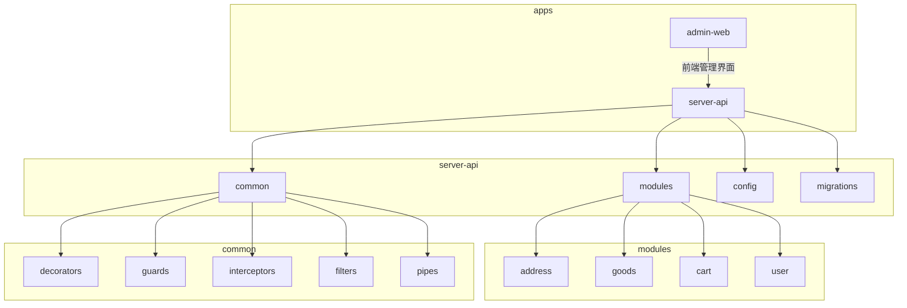

**图示来源**
- [app.module.ts](file://apps/server-api/src/app.module.ts#L47-L161)
- [project_structure](file://#L1-L200)

**本节来源**
- [app.module.ts](file://apps/server-api/src/app.module.ts#L1-L162)

## 核心组件
本系统的核心组件包括路由控制器、统一响应包装器、JWT认证守卫、日志拦截器和异常过滤器。这些组件共同构成了一个健壮、安全且易于维护的RESTful API服务。

**本节来源**
- [main.ts](file://apps/server-api/src/main.ts#L1-L73)
- [app.module.ts](file://apps/server-api/src/app.module.ts#L1-L162)

## 架构概述
系统采用分层架构设计，包含控制器层、服务层和数据访问层。通过全局拦截器、守卫和过滤器实现了横切关注点的统一处理。

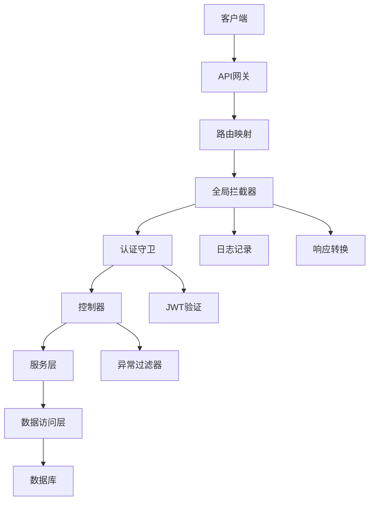

**图示来源**
- [main.ts](file://apps/server-api/src/main.ts#L27-L32)
- [app.module.ts](file://apps/server-api/src/app.module.ts#L141-L157)

## 详细组件分析

### 路由设计与控制器实现
系统遵循RESTful设计原则，使用NestJS的装饰器模式定义路由和HTTP方法。每个模块都有独立的控制器，通过`@Controller`装饰器定义基础路由路径。

#### 路由映射与HTTP方法
在`address`和`goods`模块中，控制器使用标准的HTTP方法装饰器（`@Get`、`@Post`、`@Patch`、`@Delete`）来映射不同的端点。例如，`address.controller.ts`中的`listStatusGroup`方法使用`@Get('listStatusGroup')`来处理GET请求。

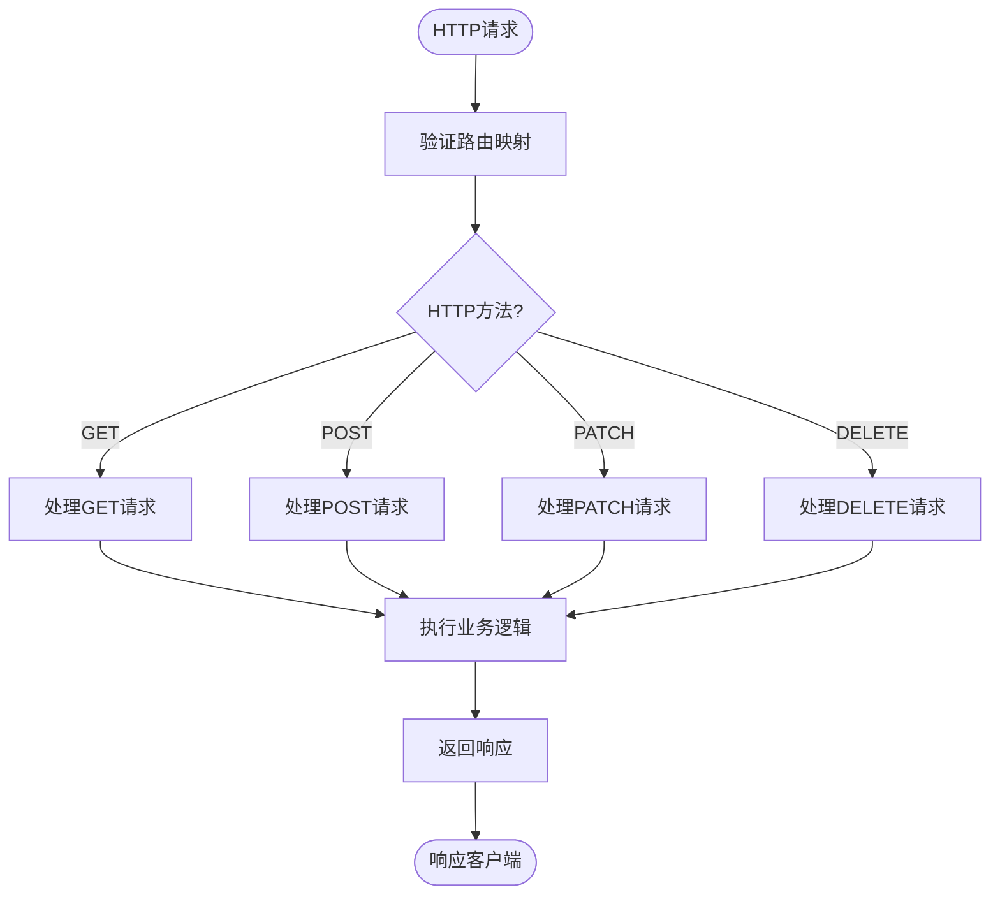

**图示来源**
- [address.controller.ts](file://apps/server-api/src/modules/address/address.controller.ts#L10-L41)
- [goods.controller.ts](file://apps/server-api/src/modules/goods/goods.controller.ts#L27-L120)

#### 请求参数处理机制
控制器通过`@Query`、`@Body`、`@Param`等装饰器来提取和验证请求参数。系统还使用自定义管道（如`StringToBigIntPipe`）进行参数类型转换。

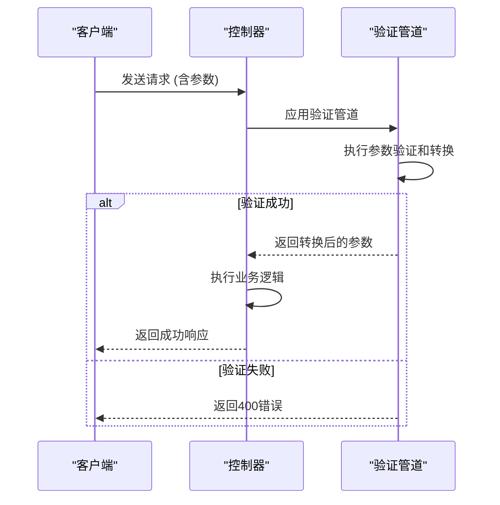

**图示来源**
- [goods.controller.ts](file://apps/server-api/src/modules/goods/goods.controller.ts#L67-L71)
- [string-to-bigint.pipe.ts](file://apps/server-api/src/common/pipes/string-to-bigint.pipe.ts#L1-L13)

### 统一响应包装策略
系统通过`api-res-wrapper.decorator.ts`实现了响应格式的统一包装，确保所有API响应都遵循一致的数据结构。

#### 响应包装器实现
`ApiResWrapper`装饰器使用NestJS的`applyDecorators`组合了`ApiExtraModels`和`ApiOkResponse`，为Swagger文档生成提供了完整的响应结构定义。

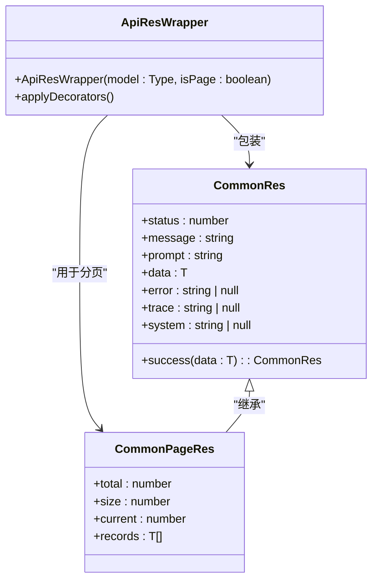

**图示来源**
- [api-res-wrapper.decorator.ts](file://apps/server-api/src/common/decorators/api-res-wrapper.decorator.ts#L1-L50)
- [common-res.dto.ts](file://apps/server-api/src/common/dto/common-res.dto.ts#L1-L49)

#### 响应拦截器工作流程
`TransformInterceptor`作为全局拦截器，在请求处理完成后自动包装响应数据，确保所有成功响应都符合统一格式。

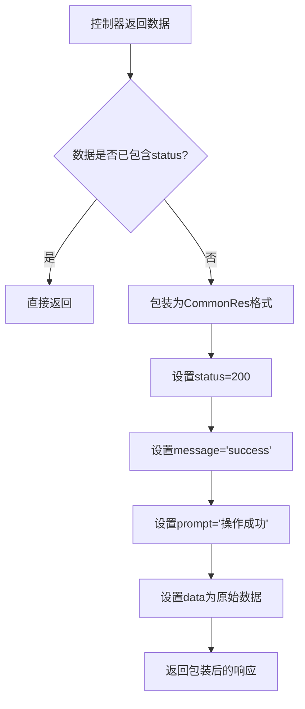

**图示来源**
- [transform.interceptor.ts](file://apps/server-api/src/common/interceptors/transform.interceptor.ts#L1-L43)
- [common-res.dto.ts](file://apps/server-api/src/common/dto/common-res.dto.ts#L38-L48)

### JWT认证守卫应用
系统使用`jwt-auth.guard.ts`实现JWT认证守卫，保护需要身份验证的API端点。

#### 认证守卫实现
`JwtAuthGuard`继承自NestJS的`AuthGuard('jwt')`，并重写了`canActivate`和`handleRequest`方法，支持通过`@Public()`装饰器跳过认证。

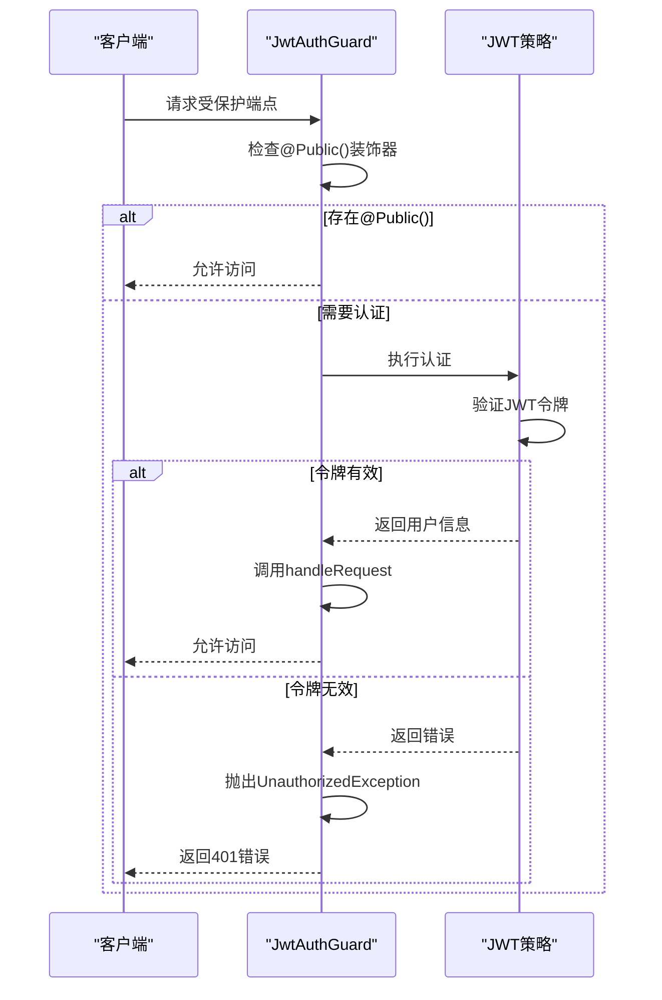

**图示来源**
- [jwt-auth.guard.ts](file://apps/server-api/src/common/guards/jwt-auth.guard.ts#L1-L32)
- [public.decorator.ts](file://apps/server-api/src/common/decorators/public.decorator.ts#L1-L5)

#### 权限控制流程
认证守卫与`@Public()`装饰器协同工作，实现了灵活的权限控制机制。公共端点可以被匿名访问，而受保护端点需要有效的JWT令牌。

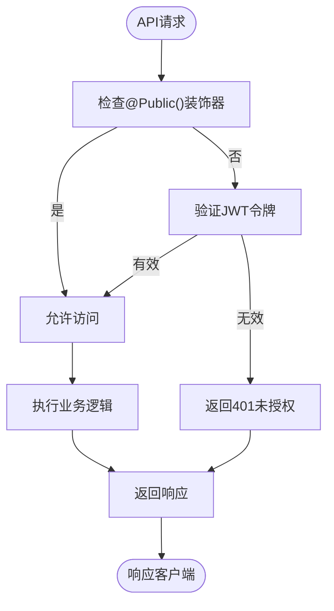

**图示来源**
- [jwt-auth.guard.ts](file://apps/server-api/src/common/guards/jwt-auth.guard.ts#L11-L18)
- [public.decorator.ts](file://apps/server-api/src/common/decorators/public.decorator.ts#L4)

### 异常处理与日志记录
系统通过全局异常过滤器和日志拦截器实现了统一的错误处理和日志记录机制。

#### 异常处理流程
`AllExceptionsFilter`捕获所有异常，将其转换为统一的错误响应格式，确保客户端收到一致的错误信息。

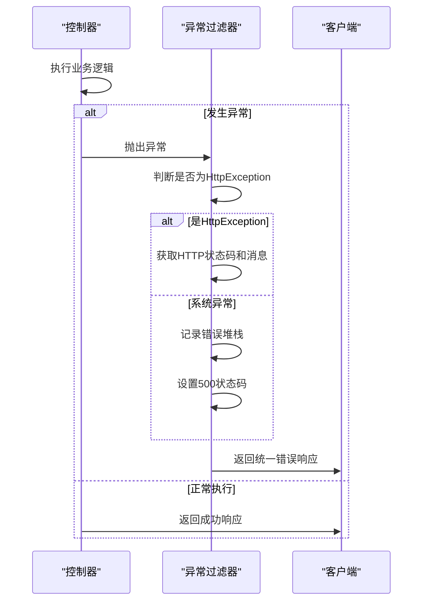

**图示来源**
- [http-exception.filter.ts](file://apps/server-api/src/common/filters/http-exception.filter.ts#L1-L39)
- [response.interface.ts](file://apps/server-api/src/common/interfaces/response.interface.ts#L7-L13)

#### 日志拦截器工作机制
`LoggingInterceptor`记录每个请求的详细信息，包括请求方法、URL、处理时间和跟踪ID，便于问题排查和性能分析。

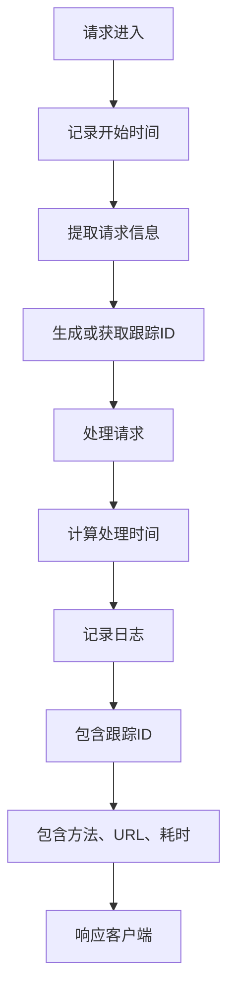

**图示来源**
- [logging.interceptor.ts](file://apps/server-api/src/common/interceptors/logging.interceptor.ts#L1-L51)
- [app.module.ts](file://apps/server-api/src/app.module.ts#L153-L157)

## 依赖分析
系统通过NestJS的依赖注入机制管理组件间的依赖关系，确保代码的可测试性和可维护性。

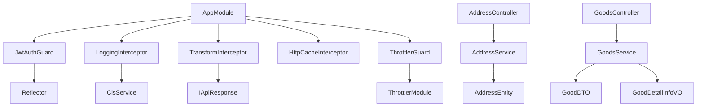

**图示来源**
- [app.module.ts](file://apps/server-api/src/app.module.ts#L141-L157)
- [address.controller.ts](file://apps/server-api/src/modules/address/address.controller.ts#L8)
- [goods.controller.ts](file://apps/server-api/src/modules/goods/goods.controller.ts#L20)

**本节来源**
- [app.module.ts](file://apps/server-api/src/app.module.ts#L1-L162)
- [address.controller.ts](file://apps/server-api/src/modules/address/address.controller.ts#L1-L41)
- [goods.controller.ts](file://apps/server-api/src/modules/goods/goods.controller.ts#L1-L120)

## 性能考虑
系统在设计时考虑了多个性能优化点，包括缓存、请求节流和数据库连接池。

### 缓存策略
通过`CacheModule`和`HttpCacheInterceptor`实现了响应缓存，减少重复请求对后端的压力。

### 请求节流
使用`ThrottlerModule`限制客户端的请求频率，防止API被滥用。

### 数据库优化
通过`TypeOrmModule.forRootAsync`配置了数据库连接池，并启用了实体自动加载功能。

[无具体文件来源，为通用性能建议]

## 故障排除指南
当API出现问题时，可以按照以下步骤进行排查：

1. 检查日志文件，查找错误堆栈
2. 验证JWT令牌是否有效
3. 检查请求参数是否符合DTO定义
4. 确认数据库连接是否正常
5. 查看缓存状态

**本节来源**
- [logging.interceptor.ts](file://apps/server-api/src/common/interceptors/logging.interceptor.ts#L8)
- [http-exception.filter.ts](file://apps/server-api/src/common/filters/http-exception.filter.ts#L27)
- [main.ts](file://apps/server-api/src/main.ts#L68)

## 结论
本文档详细阐述了后端RESTful API的路由设计原则与控制器实现规范。通过统一的响应包装、JWT认证、请求验证和异常处理机制，系统实现了高可用性、安全性和可维护性。建议在开发新API时遵循本文档中的最佳实践，确保代码质量和系统稳定性。

[无具体文件来源，为总结性内容]