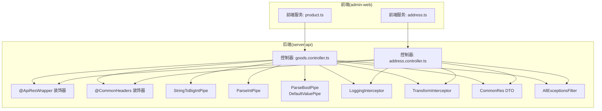
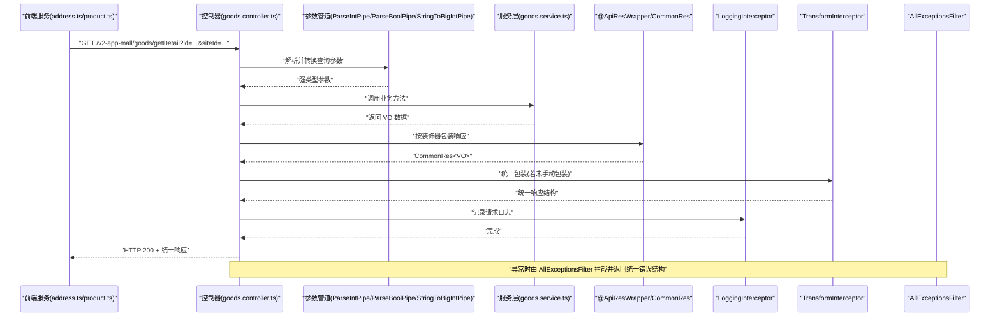
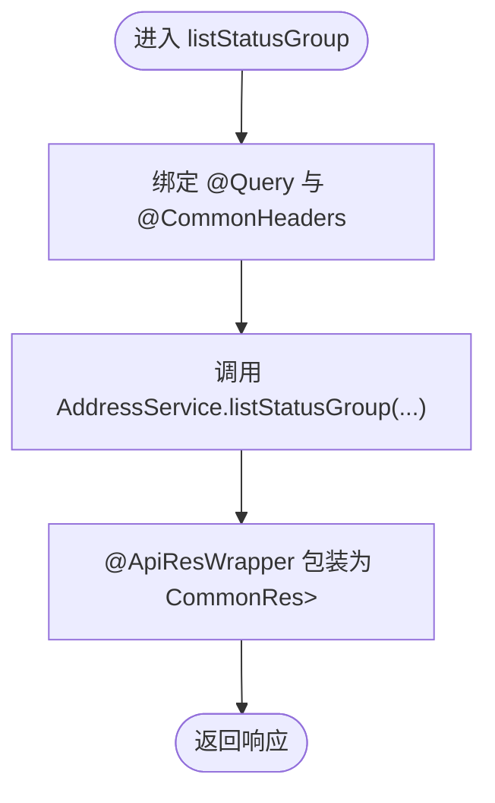
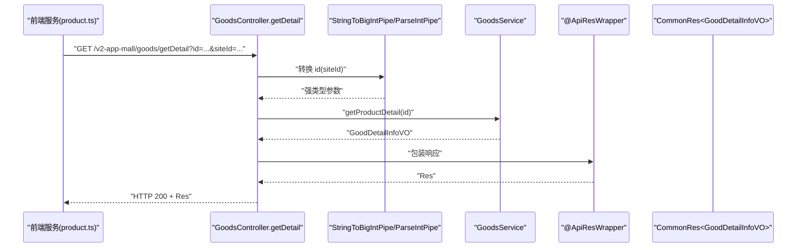
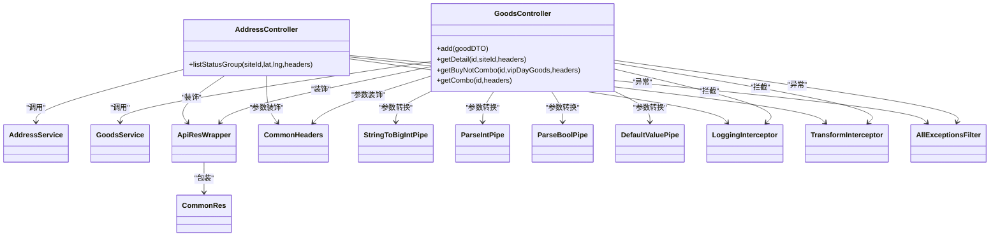

# 控制器实现

<cite>
**本文引用的文件**
- [apps/server-api/src/modules/address/address.controller.ts](file://apps/server-api/src/modules/address/address.controller.ts)
- [apps/server-api/src/modules/goods/goods.controller.ts](file://apps/server-api/src/modules/goods/goods.controller.ts)
- [apps/server-api/src/common/decorators/api-res-wrapper.decorator.ts](file://apps/server-api/src/common/decorators/api-res-wrapper.decorator.ts)
- [apps/server-api/src/common/decorators/common-headers.decorator.ts](file://apps/server-api/src/common/decorators/common-headers.decorator.ts)
- [apps/server-api/src/common/pipes/string-to-bigint.pipe.ts](file://apps/server-api/src/common/pipes/string-to-bigint.pipe.ts)
- [apps/server-api/src/common/interceptors/logging.interceptor.ts](file://apps/server-api/src/common/interceptors/logging.interceptor.ts)
- [apps/server-api/src/common/interceptors/transform.interceptor.ts](file://apps/server-api/src/common/interceptors/transform.interceptor.ts)
- [apps/server-api/src/common/dto/common-res.dto.ts](file://apps/server-api/src/common/dto/common-res.dto.ts)
- [apps/server-api/src/common/filters/http-exception.filter.ts](file://apps/server-api/src/common/filters/http-exception.filter.ts)
- [apps/admin-web/src/services/mall/address.ts](file://apps/admin-web/src/services/mall/address.ts)
- [apps/admin-web/src/services/mall/product.ts](file://apps/admin-web/src/services/mall/product.ts)
- [apps/server-api/src/modules/address/vo/addressGroup.vo.ts](file://apps/server-api/src/modules/address/vo/addressGroup.vo.ts)
- [apps/server-api/src/modules/goods/vo/GoodDetailInfo.vo.ts](file://apps/server-api/src/modules/goods/vo/GoodDetailInfo.vo.ts)
- [apps/server-api/src/modules/goods/vo/GoodBuyInfo.vo.ts](file://apps/server-api/src/modules/goods/vo/GoodBuyInfo.vo.ts)
- [apps/server-api/src/modules/goods/vo/GoodBaseInfo.vo.ts](file://apps/server-api/src/modules/goods/vo/GoodBaseInfo.vo.ts)
</cite>

## 目录
1. [引言](#引言)
2. [项目结构](#项目结构)
3. [核心组件](#核心组件)
4. [架构总览](#架构总览)
5. [详细组件分析](#详细组件分析)
6. [依赖关系分析](#依赖关系分析)
7. [性能考量](#性能考量)
8. [故障排查指南](#故障排查指南)
9. [结论](#结论)

## 引言
本文件聚焦于 NestJS 控制器的实现机制，围绕 address.controller.ts 与 goods.controller.ts 中的关键方法（如 listStatusGroup、getDetail 等），系统讲解请求处理函数的参数绑定（@Query、@Body、@Param）、类型转换（StringToBigIntPipe、ParseIntPipe、ParseBoolPipe、DefaultValuePipe）以及统一响应格式（@ApiResWrapper）的应用。同时结合前端服务层调用，梳理 API 请求与响应的数据流，并说明异常处理与日志记录的集成方式。

## 项目结构
- 后端采用多模块结构，控制器位于 modules 下的各功能模块中；装饰器、管道、拦截器、过滤器等位于 common 目录下。
- 前端服务层通过 @umijs/max 的 request 方法发起 HTTP 请求，调用后端 REST 接口。

图表来源
- [apps/admin-web/src/services/mall/address.ts](file://apps/admin-web/src/services/mall/address.ts#L1-L19)
- [apps/admin-web/src/services/mall/product.ts](file://apps/admin-web/src/services/mall/product.ts#L1-L38)
- [apps/server-api/src/modules/address/address.controller.ts](file://apps/server-api/src/modules/address/address.controller.ts#L1-L41)
- [apps/server-api/src/modules/goods/goods.controller.ts](file://apps/server-api/src/modules/goods/goods.controller.ts#L1-L120)
- [apps/server-api/src/common/decorators/api-res-wrapper.decorator.ts](file://apps/server-api/src/common/decorators/api-res-wrapper.decorator.ts#L1-L50)
- [apps/server-api/src/common/decorators/common-headers.decorator.ts](file://apps/server-api/src/common/decorators/common-headers.decorator.ts#L1-L46)
- [apps/server-api/src/common/pipes/string-to-bigint.pipe.ts](file://apps/server-api/src/common/pipes/string-to-bigint.pipe.ts#L1-L13)
- [apps/server-api/src/common/interceptors/logging.interceptor.ts](file://apps/server-api/src/common/interceptors/logging.interceptor.ts#L1-L51)
- [apps/server-api/src/common/interceptors/transform.interceptor.ts](file://apps/server-api/src/common/interceptors/transform.interceptor.ts#L1-L43)
- [apps/server-api/src/common/dto/common-res.dto.ts](file://apps/server-api/src/common/dto/common-res.dto.ts#L1-L49)
- [apps/server-api/src/common/filters/http-exception.filter.ts](file://apps/server-api/src/common/filters/http-exception.filter.ts#L1-L39)

章节来源
- [apps/server-api/src/modules/address/address.controller.ts](file://apps/server-api/src/modules/address/address.controller.ts#L1-L41)
- [apps/server-api/src/modules/goods/goods.controller.ts](file://apps/server-api/src/modules/goods/goods.controller.ts#L1-L120)
- [apps/admin-web/src/services/mall/address.ts](file://apps/admin-web/src/services/mall/address.ts#L1-L19)
- [apps/admin-web/src/services/mall/product.ts](file://apps/admin-web/src/services/mall/product.ts#L1-L38)

## 核心组件
- 参数绑定与类型转换
  - @Query：用于绑定查询参数，配合 ParseIntPipe、ParseBoolPipe、DefaultValuePipe 实现强类型转换与默认值处理。
  - @Body：用于绑定请求体，配合 DTO 进行结构化校验。
  - @Param：用于绑定路由参数（在 goods.controller.ts 中有使用）。
  - 自定义管道：StringToBigIntPipe 将长整型字符串转换为字符串，确保跨语言/跨平台一致的传输类型。
- 统一响应格式
  - @ApiResWrapper：通过 Swagger 注解统一包装响应结构，自动注入 CommonRes 外层与 VO 内层数据模型。
  - CommonRes：定义统一的响应字段（status、message、prompt、data、error、trace、system）。
- 日志与异常
  - LoggingInterceptor：记录请求方法、URL、耗时与 traceId。
  - AllExceptionsFilter：捕获未处理异常，输出统一 JSON 结构。
  - TransformInterceptor：对控制器返回进行统一包装（若未手动包装则自动包裹）。

章节来源
- [apps/server-api/src/common/decorators/api-res-wrapper.decorator.ts](file://apps/server-api/src/common/decorators/api-res-wrapper.decorator.ts#L1-L50)
- [apps/server-api/src/common/dto/common-res.dto.ts](file://apps/server-api/src/common/dto/common-res.dto.ts#L1-L49)
- [apps/server-api/src/common/interceptors/logging.interceptor.ts](file://apps/server-api/src/common/interceptors/logging.interceptor.ts#L1-L51)
- [apps/server-api/src/common/interceptors/transform.interceptor.ts](file://apps/server-api/src/common/interceptors/transform.interceptor.ts#L1-L43)
- [apps/server-api/src/common/filters/http-exception.filter.ts](file://apps/server-api/src/common/filters/http-exception.filter.ts#L1-L39)
- [apps/server-api/src/common/pipes/string-to-bigint.pipe.ts](file://apps/server-api/src/common/pipes/string-to-bigint.pipe.ts#L1-L13)
- [apps/server-api/src/common/decorators/common-headers.decorator.ts](file://apps/server-api/src/common/decorators/common-headers.decorator.ts#L1-L46)

## 架构总览
下面以 goods.controller.ts 的 getDetail 为例，展示一次请求从前端到后端的完整流程。

图表来源
- [apps/admin-web/src/services/mall/address.ts](file://apps/admin-web/src/services/mall/address.ts#L1-L19)
- [apps/admin-web/src/services/mall/product.ts](file://apps/admin-web/src/services/mall/product.ts#L1-L38)
- [apps/server-api/src/modules/goods/goods.controller.ts](file://apps/server-api/src/modules/goods/goods.controller.ts#L1-L120)
- [apps/server-api/src/common/decorators/api-res-wrapper.decorator.ts](file://apps/server-api/src/common/decorators/api-res-wrapper.decorator.ts#L1-L50)
- [apps/server-api/src/common/dto/common-res.dto.ts](file://apps/server-api/src/common/dto/common-res.dto.ts#L1-L49)
- [apps/server-api/src/common/interceptors/logging.interceptor.ts](file://apps/server-api/src/common/interceptors/logging.interceptor.ts#L1-L51)
- [apps/server-api/src/common/interceptors/transform.interceptor.ts](file://apps/server-api/src/common/interceptors/transform.interceptor.ts#L1-L43)
- [apps/server-api/src/common/filters/http-exception.filter.ts](file://apps/server-api/src/common/filters/http-exception.filter.ts#L1-L39)

## 详细组件分析

### AddressController：listStatusGroup
- 路径与方法
  - GET /v2-app-mall/address/listStatusGroup
- 参数绑定与类型转换
  - @Query('siteId'): string
  - @Query('lat'): string
  - @Query('lng'): string
  - @CommonHeaders(): 提取公共请求头（如 siteId、shopId 等）
- 统一响应
  - @ApiResWrapper(AddressGroupVO[])：自动包装为 CommonRes<List<AddressGroupVO>>
- 业务流程
  - 控制器接收参数后，直接委托给 AddressService.listStatusGroup 并返回结果。

图表来源
- [apps/server-api/src/modules/address/address.controller.ts](file://apps/server-api/src/modules/address/address.controller.ts#L1-L41)
- [apps/server-api/src/common/decorators/api-res-wrapper.decorator.ts](file://apps/server-api/src/common/decorators/api-res-wrapper.decorator.ts#L1-L50)
- [apps/server-api/src/modules/address/vo/addressGroup.vo.ts](file://apps/server-api/src/modules/address/vo/addressGroup.vo.ts#L1-L12)

章节来源
- [apps/server-api/src/modules/address/address.controller.ts](file://apps/server-api/src/modules/address/address.controller.ts#L1-L41)
- [apps/server-api/src/modules/address/vo/addressGroup.vo.ts](file://apps/server-api/src/modules/address/vo/addressGroup.vo.ts#L1-L12)

### GoodsController：getDetail
- 路径与方法
  - GET /v2-app-mall/goods/getDetail
- 参数绑定与类型转换
  - @Query('id', StringToBigIntPipe): string（长整型字符串）
  - @Query('siteId', ParseIntPipe): number
  - @CommonHeaders(): 提取公共请求头
- 统一响应
  - @ApiResWrapper(GoodDetailInfoVO)：自动包装为 CommonRes<GoodDetailInfoVO>
- 业务流程
  - 控制器接收参数后，调用 GoodsService.getProductDetail(id)，返回 GoodDetailInfoVO。

图表来源
- [apps/admin-web/src/services/mall/product.ts](file://apps/admin-web/src/services/mall/product.ts#L1-L38)
- [apps/server-api/src/modules/goods/goods.controller.ts](file://apps/server-api/src/modules/goods/goods.controller.ts#L1-L120)
- [apps/server-api/src/common/pipes/string-to-bigint.pipe.ts](file://apps/server-api/src/common/pipes/string-to-bigint.pipe.ts#L1-L13)
- [apps/server-api/src/common/decorators/api-res-wrapper.decorator.ts](file://apps/server-api/src/common/decorators/api-res-wrapper.decorator.ts#L1-L50)
- [apps/server-api/src/modules/goods/vo/GoodDetailInfo.vo.ts](file://apps/server-api/src/modules/goods/vo/GoodDetailInfo.vo.ts#L1-L98)

章节来源
- [apps/server-api/src/modules/goods/goods.controller.ts](file://apps/server-api/src/modules/goods/goods.controller.ts#L1-L120)
- [apps/server-api/src/common/pipes/string-to-bigint.pipe.ts](file://apps/server-api/src/common/pipes/string-to-bigint.pipe.ts#L1-L13)
- [apps/server-api/src/modules/goods/vo/GoodDetailInfo.vo.ts](file://apps/server-api/src/modules/goods/vo/GoodDetailInfo.vo.ts#L1-L98)

### GoodsController：getBuyNotCombo
- 路径与方法
  - GET /v2-app-mall/goods/getBuyNotCombo
- 参数绑定与类型转换
  - @Query('id', StringToBigIntPipe): string
  - @Query('vipDayGoods', new DefaultValuePipe(false), ParseBoolPipe): boolean
  - @CommonHeaders(): 提取公共请求头
- 统一响应
  - @ApiResWrapper(GoodBuyInfoVO)：自动包装为 CommonRes<GoodBuyInfoVO>

章节来源
- [apps/server-api/src/modules/goods/goods.controller.ts](file://apps/server-api/src/modules/goods/goods.controller.ts#L1-L120)
- [apps/server-api/src/modules/goods/vo/GoodBuyInfo.vo.ts](file://apps/server-api/src/modules/goods/vo/GoodBuyInfo.vo.ts#L1-L78)

### GoodsController：getCombo
- 路径与方法
  - GET /v2-app-mall/goods/getCombo
- 参数绑定与类型转换
  - @Query('id', StringToBigIntPipe): string
  - @CommonHeaders(): 提取公共请求头
- 统一响应
  - @ApiResWrapper(GoodBaseInfoVO)：自动包装为 CommonRes<GoodBaseInfoVO>

章节来源
- [apps/server-api/src/modules/goods/goods.controller.ts](file://apps/server-api/src/modules/goods/goods.controller.ts#L1-L120)
- [apps/server-api/src/modules/goods/vo/GoodBaseInfo.vo.ts](file://apps/server-api/src/modules/goods/vo/GoodBaseInfo.vo.ts#L1-L68)

### GoodsController：add
- 路径与方法
  - POST /v2-app-mall/goods/add
- 参数绑定与类型转换
  - @Body(): GoodDTO（结构化校验）
- 统一响应
  - @ApiResWrapper(String)：自动包装为 CommonRes<String>

章节来源
- [apps/server-api/src/modules/goods/goods.controller.ts](file://apps/server-api/src/modules/goods/goods.controller.ts#L1-L120)

## 依赖关系分析
- 控制器依赖
  - 控制器依赖服务层（AddressService、GoodsService）执行业务逻辑。
  - 控制器依赖装饰器（@ApiResWrapper、@CommonHeaders）与管道（StringToBigIntPipe、ParseIntPipe、ParseBoolPipe、DefaultValuePipe）进行参数绑定与类型转换。
- 拦截器与过滤器
  - LoggingInterceptor：记录请求日志，包含 traceId、方法、URL、耗时。
  - TransformInterceptor：统一包装响应结构，避免重复手写包装。
  - AllExceptionsFilter：捕获异常并输出统一 JSON。
- 响应模型
  - CommonRes：作为统一响应载体，承载业务状态、消息、提示与数据。

图表来源
- [apps/server-api/src/modules/address/address.controller.ts](file://apps/server-api/src/modules/address/address.controller.ts#L1-L41)
- [apps/server-api/src/modules/goods/goods.controller.ts](file://apps/server-api/src/modules/goods/goods.controller.ts#L1-L120)
- [apps/server-api/src/common/decorators/api-res-wrapper.decorator.ts](file://apps/server-api/src/common/decorators/api-res-wrapper.decorator.ts#L1-L50)
- [apps/server-api/src/common/decorators/common-headers.decorator.ts](file://apps/server-api/src/common/decorators/common-headers.decorator.ts#L1-L46)
- [apps/server-api/src/common/pipes/string-to-bigint.pipe.ts](file://apps/server-api/src/common/pipes/string-to-bigint.pipe.ts#L1-L13)
- [apps/server-api/src/common/interceptors/logging.interceptor.ts](file://apps/server-api/src/common/interceptors/logging.interceptor.ts#L1-L51)
- [apps/server-api/src/common/interceptors/transform.interceptor.ts](file://apps/server-api/src/common/interceptors/transform.interceptor.ts#L1-L43)
- [apps/server-api/src/common/filters/http-exception.filter.ts](file://apps/server-api/src/common/filters/http-exception.filter.ts#L1-L39)
- [apps/server-api/src/common/dto/common-res.dto.ts](file://apps/server-api/src/common/dto/common-res.dto.ts#L1-L49)

章节来源
- [apps/server-api/src/modules/address/address.controller.ts](file://apps/server-api/src/modules/address/address.controller.ts#L1-L41)
- [apps/server-api/src/modules/goods/goods.controller.ts](file://apps/server-api/src/modules/goods/goods.controller.ts#L1-L120)

## 性能考量
- 参数转换与校验
  - 使用 ParseIntPipe、ParseBoolPipe、DefaultValuePipe 可减少手写校验逻辑，提升稳定性与性能。
  - StringToBigIntPipe 保证长整型字符串在跨语言传输时保持一致，避免解析开销。
- 响应包装
  - @ApiResWrapper 与 TransformInterceptor 统一包装响应，减少重复代码，提高一致性。
- 日志记录
  - LoggingInterceptor 记录 traceId、方法、URL、耗时，便于性能监控与问题定位。

[本节为通用指导，不直接分析具体文件]

## 故障排查指南
- 统一异常处理
  - AllExceptionsFilter 捕获所有异常，输出统一 JSON（code、data、msg）。对于 HttpException，会映射 HTTP 状态码为业务状态码；未知异常打印堆栈，便于排查。
- 日志追踪
  - LoggingInterceptor 优先从 CLS 获取 traceId，其次从请求头或请求 ID 获取，最后回退为“no-trace”。日志包含 traceId、方法、URL、耗时。
- 响应结构
  - 若控制器返回已包含 status/data 的结构，TransformInterceptor 将直接透传，避免重复包装。

章节来源
- [apps/server-api/src/common/filters/http-exception.filter.ts](file://apps/server-api/src/common/filters/http-exception.filter.ts#L1-L39)
- [apps/server-api/src/common/interceptors/logging.interceptor.ts](file://apps/server-api/src/common/interceptors/logging.interceptor.ts#L1-L51)
- [apps/server-api/src/common/interceptors/transform.interceptor.ts](file://apps/server-api/src/common/interceptors/transform.interceptor.ts#L1-L43)

## 结论
通过参数装饰器与管道的组合，NestJS 控制器实现了强类型的参数绑定与转换；借助 @ApiResWrapper 与拦截器，实现了统一响应格式与日志记录；异常过滤器提供了全局异常处理能力。前端服务层通过 @umijs/max 的 request 方法发起请求，后端控制器仅需关注业务逻辑与参数绑定，整体架构清晰、可维护性强。