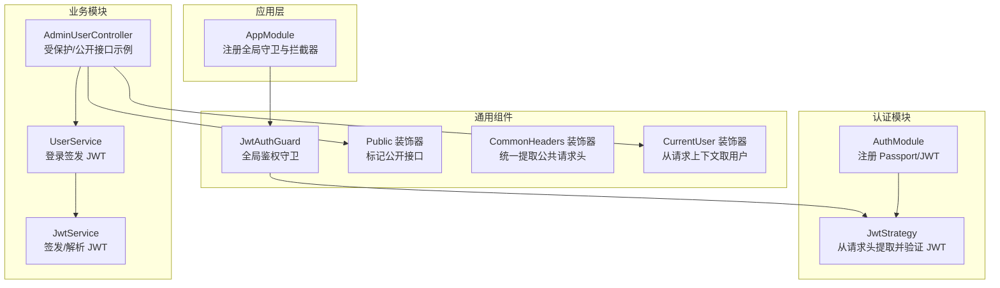
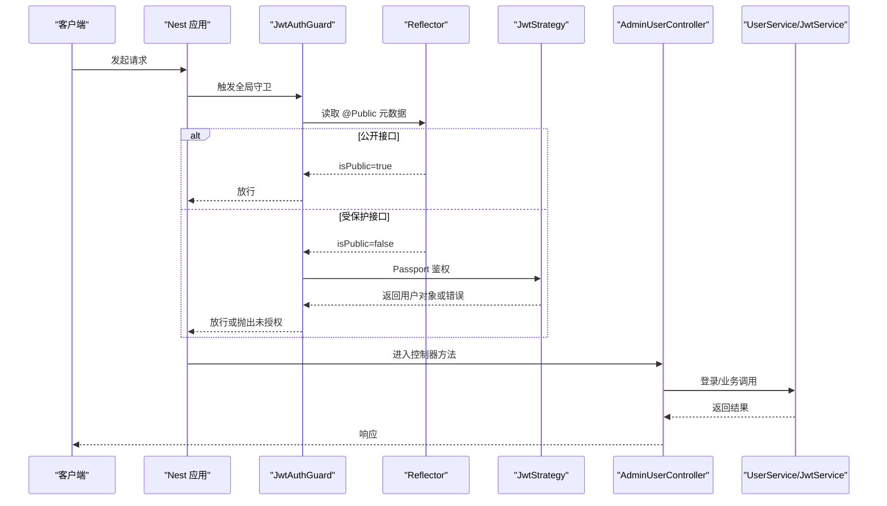
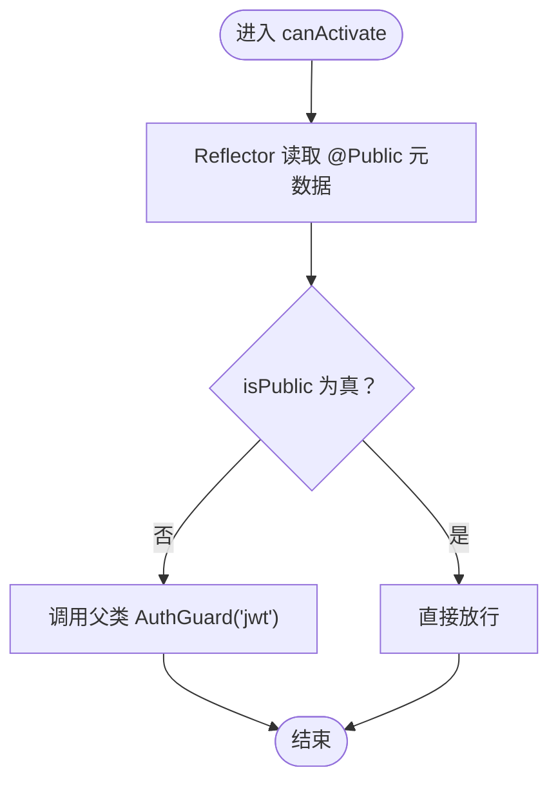
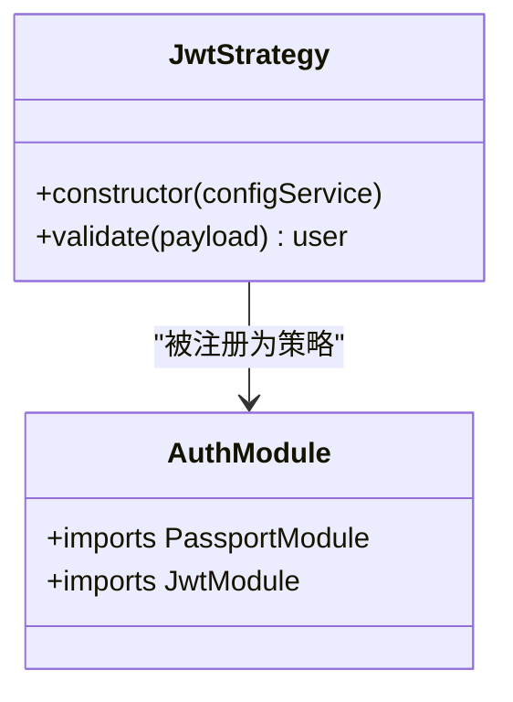
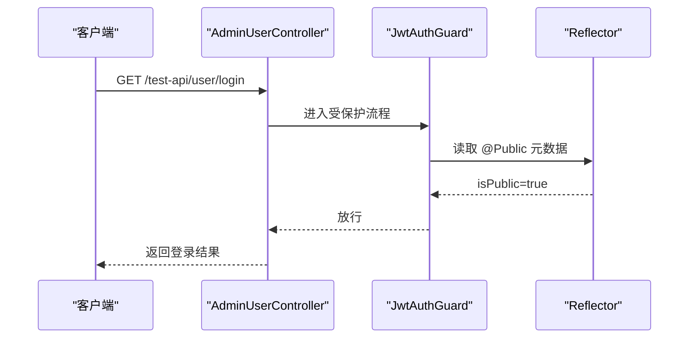
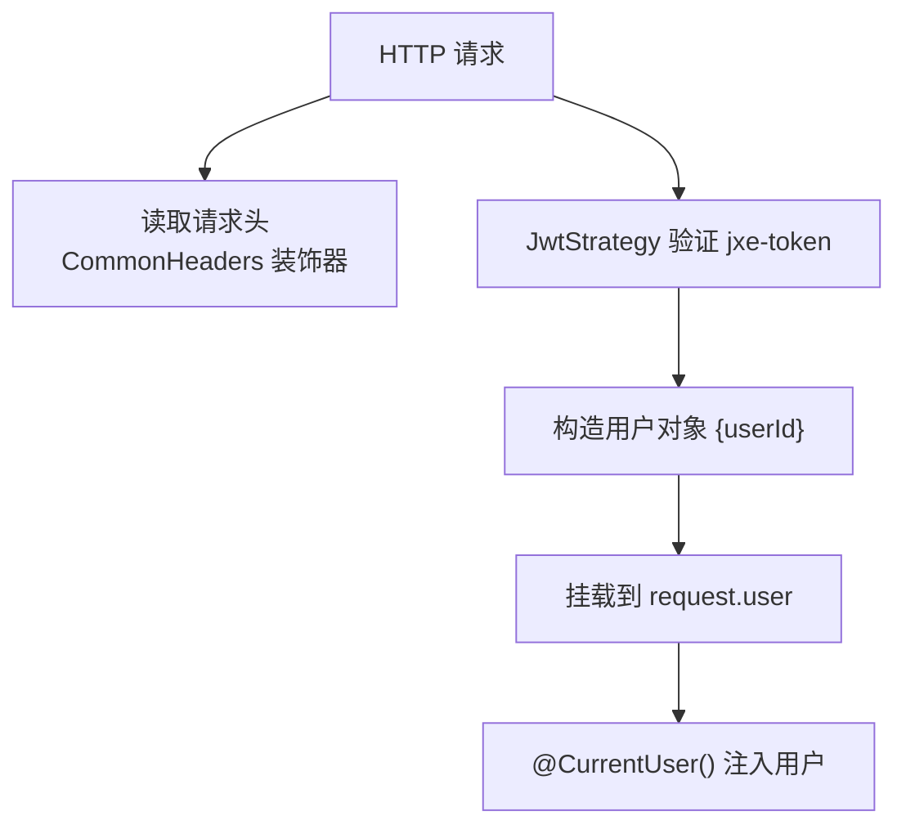
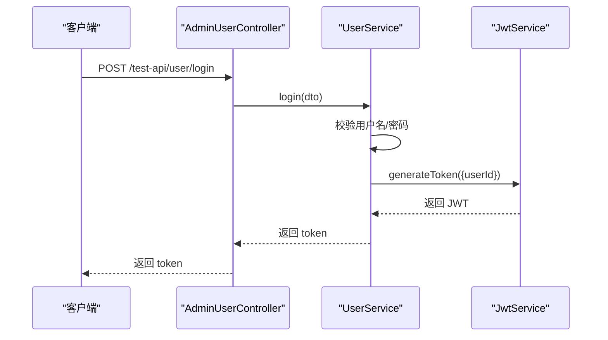
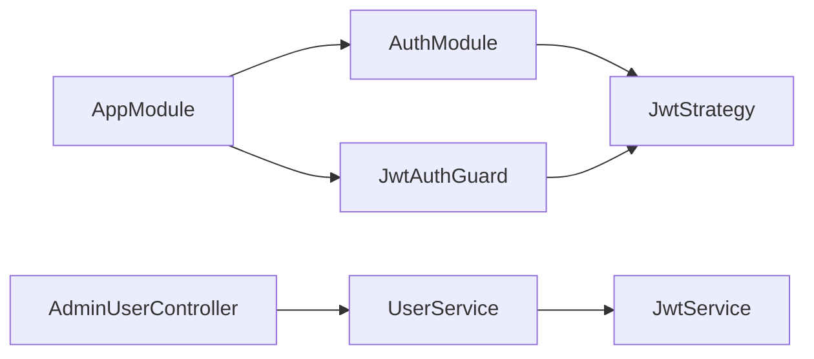

# 认证与权限控制

<cite>
**本文引用的文件列表**
- [jwt-auth.guard.ts](file://apps/server-api/src/common/guards/jwt-auth.guard.ts)
- [public.decorator.ts](file://apps/server-api/src/common/decorators/public.decorator.ts)
- [common-headers.decorator.ts](file://apps/server-api/src/common/decorators/common-headers.decorator.ts)
- [user.decorator.ts](file://apps/server-api/src/common/decorators/user.decorator.ts)
- [jwt.strategy.ts](file://apps/server-api/src/modules/auth/strategies/jwt.strategy.ts)
- [auth.module.ts](file://apps/server-api/src/modules/auth/auth.module.ts)
- [app.module.ts](file://apps/server-api/src/app.module.ts)
- [admin-user.controller.ts](file://apps/server-api/src/modules/user/controllers/admin-user.controller.ts)
- [user.service.ts](file://apps/server-api/src/modules/user/user.service.ts)
- [jwt.service.ts](file://apps/server-api/src/modules/jwt/jwt.service.ts)
- [response.interface.ts](file://apps/server-api/src/common/interfaces/response.interface.ts)
</cite>

## 目录
1. [引言](#引言)
2. [项目结构](#项目结构)
3. [核心组件](#核心组件)
4. [架构总览](#架构总览)
5. [详细组件分析](#详细组件分析)
6. [依赖关系分析](#依赖关系分析)
7. [性能与安全考量](#性能与安全考量)
8. [故障排查指南](#故障排查指南)
9. [结论](#结论)

## 引言
本文件系统性讲解基于 JWT 的认证与权限控制体系，重点围绕以下主题展开：
- JwtAuthGuard 守卫的实现原理与全局应用方式
- 控制器中通过 @Public 装饰器区分公开接口与受保护接口
- CommonHeaders 装饰器在请求头处理中的作用
- 用户身份信息在请求上下文中的传递方式
- 权限分级、令牌刷新与安全防护的最佳实践

## 项目结构
该系统采用 NestJS 微服务风格的 monorepo 结构，认证与权限控制相关代码主要集中在 server-api 应用中，核心位置如下：
- 守卫与装饰器位于 common 目录
- 认证模块与策略位于 modules/auth
- 用户模块与控制器位于 modules/user
- JWT 服务与控制器位于 modules/jwt
- 全局守卫在 app.module 中注册

图表来源
- [app.module.ts](file://apps/server-api/src/app.module.ts#L141-L160)
- [auth.module.ts](file://apps/server-api/src/modules/auth/auth.module.ts#L1-L28)
- [jwt.strategy.ts](file://apps/server-api/src/modules/auth/strategies/jwt.strategy.ts#L1-L28)
- [jwt-auth.guard.ts](file://apps/server-api/src/common/guards/jwt-auth.guard.ts#L1-L32)
- [public.decorator.ts](file://apps/server-api/src/common/decorators/public.decorator.ts#L1-L5)
- [common-headers.decorator.ts](file://apps/server-api/src/common/decorators/common-headers.decorator.ts#L1-L46)
- [user.decorator.ts](file://apps/server-api/src/common/decorators/user.decorator.ts#L1-L8)
- [admin-user.controller.ts](file://apps/server-api/src/modules/user/controllers/admin-user.controller.ts#L1-L92)
- [user.service.ts](file://apps/server-api/src/modules/user/user.service.ts#L1-L144)
- [jwt.service.ts](file://apps/server-api/src/modules/jwt/jwt.service.ts#L1-L58)

章节来源
- [app.module.ts](file://apps/server-api/src/app.module.ts#L141-L160)
- [auth.module.ts](file://apps/server-api/src/modules/auth/auth.module.ts#L1-L28)

## 核心组件
- JwtAuthGuard：全局 JWT 鉴权守卫，支持 @Public 装饰器跳过鉴权
- JwtStrategy：从请求头 jxe-token 提取并验证 JWT，返回用户标识
- Public 装饰器：通过反射标记接口为“公开”，绕过 JwtAuthGuard
- CommonHeaders 装饰器：统一从请求头提取一组固定字段
- CurrentUser 装饰器：从请求上下文 request.user 取当前用户
- UserService：登录时签发 JWT
- JwtService：封装 JWT 的签发与解析

章节来源
- [jwt-auth.guard.ts](file://apps/server-api/src/common/guards/jwt-auth.guard.ts#L1-L32)
- [jwt.strategy.ts](file://apps/server-api/src/modules/auth/strategies/jwt.strategy.ts#L1-L28)
- [public.decorator.ts](file://apps/server-api/src/common/decorators/public.decorator.ts#L1-L5)
- [common-headers.decorator.ts](file://apps/server-api/src/common/decorators/common-headers.decorator.ts#L1-L46)
- [user.decorator.ts](file://apps/server-api/src/common/decorators/user.decorator.ts#L1-L8)
- [user.service.ts](file://apps/server-api/src/modules/user/user.service.ts#L109-L134)
- [jwt.service.ts](file://apps/server-api/src/modules/jwt/jwt.service.ts#L1-L58)

## 架构总览
下图展示了从请求进入应用到鉴权放行的关键流程，包括公开接口与受保护接口的区别、请求头处理与用户上下文传递。

图表来源
- [jwt-auth.guard.ts](file://apps/server-api/src/common/guards/jwt-auth.guard.ts#L11-L30)
- [public.decorator.ts](file://apps/server-api/src/common/decorators/public.decorator.ts#L1-L5)
- [jwt.strategy.ts](file://apps/server-api/src/modules/auth/strategies/jwt.strategy.ts#L1-L28)
- [admin-user.controller.ts](file://apps/server-api/src/modules/user/controllers/admin-user.controller.ts#L69-L91)
- [user.service.ts](file://apps/server-api/src/modules/user/user.service.ts#L109-L134)
- [jwt.service.ts](file://apps/server-api/src/modules/jwt/jwt.service.ts#L33-L45)

## 详细组件分析

### JwtAuthGuard 守卫
- 功能要点
  - 继承自 AuthGuard('jwt')，默认使用 passport-jwt 策略
  - 在 canActivate 中通过 Reflector 读取 @Public 元数据，若为 true 则直接放行
  - handleRequest 中统一处理错误与用户对象，未授权时抛出异常
- 与全局守卫的关系
  - 在 AppModule 中以 APP_GUARD 注册，作用于所有路由
- 与策略的协作
  - 当非公开接口时，交由 JwtStrategy 验证 jxe-token 并返回用户对象

图表来源
- [jwt-auth.guard.ts](file://apps/server-api/src/common/guards/jwt-auth.guard.ts#L11-L18)

章节来源
- [jwt-auth.guard.ts](file://apps/server-api/src/common/guards/jwt-auth.guard.ts#L1-L32)
- [app.module.ts](file://apps/server-api/src/app.module.ts#L141-L160)

### JwtStrategy 策略
- 功能要点
  - 从请求头 jxe-token 提取 JWT
  - 使用配置项 JWT_SECRET 验证签名，且不忽略过期
  - validate 返回包含 userId 的用户对象，供守卫与控制器使用
- 与 AuthModule 的集成
  - AuthModule 中注册 PassportModule.defaultStrategy='jwt'，并配置 JwtModule.signOptions

图表来源
- [jwt.strategy.ts](file://apps/server-api/src/modules/auth/strategies/jwt.strategy.ts#L1-L28)
- [auth.module.ts](file://apps/server-api/src/modules/auth/auth.module.ts#L1-L28)

章节来源
- [jwt.strategy.ts](file://apps/server-api/src/modules/auth/strategies/jwt.strategy.ts#L1-L28)
- [auth.module.ts](file://apps/server-api/src/modules/auth/auth.module.ts#L1-L28)

### @Public 装饰器与公开接口
- 公开接口识别机制
  - Public 装饰器通过 SetMetadata 设置 isPublic=true
  - JwtAuthGuard 在 canActivate 中读取该元数据，若为 true 则放行
- 控制器中的应用
  - AdminUserController 中 login/register 方法使用 @Public，使其无需携带 jxe-token 即可访问
  - profile 方法未标注 @Public，受全局守卫保护

图表来源
- [admin-user.controller.ts](file://apps/server-api/src/modules/user/controllers/admin-user.controller.ts#L69-L83)
- [public.decorator.ts](file://apps/server-api/src/common/decorators/public.decorator.ts#L1-L5)
- [jwt-auth.guard.ts](file://apps/server-api/src/common/guards/jwt-auth.guard.ts#L11-L18)

章节来源
- [admin-user.controller.ts](file://apps/server-api/src/modules/user/controllers/admin-user.controller.ts#L69-L91)
- [public.decorator.ts](file://apps/server-api/src/common/decorators/public.decorator.ts#L1-L5)
- [jwt-auth.guard.ts](file://apps/server-api/src/common/guards/jwt-auth.guard.ts#L11-L18)

### 请求头处理与用户上下文传递
- CommonHeaders 装饰器
  - 从请求头提取一组固定字段（如 jxe-token、siteId、timestamp 等），返回强类型的对象
  - 注意：Express/NestJS 会将 Header 键名转为小写，因此读取时需使用小写键名
- CurrentUser 装饰器
  - 从 request.user 获取当前用户对象（由 JwtStrategy.validate 返回）
  - 在受保护接口中，可通过 @CurrentUser() 注入用户信息
- 用户身份在上下文中的传递
  - JwtStrategy.validate 返回 { userId }，守卫将其放入 request.user
  - 后续控制器方法可通过 @CurrentUser() 或直接访问 request.user 获取用户

图表来源
- [common-headers.decorator.ts](file://apps/server-api/src/common/decorators/common-headers.decorator.ts#L1-L46)
- [user.decorator.ts](file://apps/server-api/src/common/decorators/user.decorator.ts#L1-L8)
- [jwt.strategy.ts](file://apps/server-api/src/modules/auth/strategies/jwt.strategy.ts#L19-L26)

章节来源
- [common-headers.decorator.ts](file://apps/server-api/src/common/decorators/common-headers.decorator.ts#L1-L46)
- [user.decorator.ts](file://apps/server-api/src/common/decorators/user.decorator.ts#L1-L8)
- [jwt.strategy.ts](file://apps/server-api/src/modules/auth/strategies/jwt.strategy.ts#L19-L26)

### 登录与令牌签发
- 登录流程
  - AdminUserController.login 使用 @Public，允许匿名访问
  - UserService.login 校验账号密码后，使用 JwtService.generateToken 生成 JWT
  - JwtService 从配置读取密钥与过期时间，签发包含 userId 的 JWT
- 令牌内容与过期
  - payload 包含 userId
  - 过期时间由配置项 JWT_EXPIRATION_TIME 决定（秒）

图表来源
- [admin-user.controller.ts](file://apps/server-api/src/modules/user/controllers/admin-user.controller.ts#L69-L75)
- [user.service.ts](file://apps/server-api/src/modules/user/user.service.ts#L109-L134)
- [jwt.service.ts](file://apps/server-api/src/modules/jwt/jwt.service.ts#L33-L45)

章节来源
- [admin-user.controller.ts](file://apps/server-api/src/modules/user/controllers/admin-user.controller.ts#L69-L75)
- [user.service.ts](file://apps/server-api/src/modules/user/user.service.ts#L109-L134)
- [jwt.service.ts](file://apps/server-api/src/modules/jwt/jwt.service.ts#L1-L58)

## 依赖关系分析
- 全局守卫
  - AppModule 通过 APP_GUARD 注册 JwtAuthGuard，作用于所有路由
- 认证模块
  - AuthModule 注册 PassportModule.defaultStrategy='jwt' 与 JwtModule.signOptions
  - JwtStrategy 依赖 ConfigService 读取 JWT_SECRET
- 控制器与服务
  - AdminUserController 依赖 UserService；UserService 依赖 JwtService
  - JwtAuthGuard 依赖 Reflector 与 JwtStrategy

图表来源
- [app.module.ts](file://apps/server-api/src/app.module.ts#L141-L160)
- [auth.module.ts](file://apps/server-api/src/modules/auth/auth.module.ts#L1-L28)
- [jwt.strategy.ts](file://apps/server-api/src/modules/auth/strategies/jwt.strategy.ts#L1-L28)
- [admin-user.controller.ts](file://apps/server-api/src/modules/user/controllers/admin-user.controller.ts#L1-L92)
- [user.service.ts](file://apps/server-api/src/modules/user/user.service.ts#L1-L144)
- [jwt.service.ts](file://apps/server-api/src/modules/jwt/jwt.service.ts#L1-L58)

章节来源
- [app.module.ts](file://apps/server-api/src/app.module.ts#L141-L160)
- [auth.module.ts](file://apps/server-api/src/modules/auth/auth.module.ts#L1-L28)

## 性能与安全考量
- 性能
  - 全局守卫仅做一次鉴权判断，成本低
  - 对公开接口使用 @Public 装饰器避免不必要的鉴权开销
  - 建议结合缓存与限流（项目中已引入 ThrottlerGuard）
- 安全
  - 策略严格校验签名与过期时间，拒绝无效/过期令牌
  - 密钥长度建议足够长，生产环境务必妥善保管
  - 建议启用 HTTPS、CSRF 防护与安全响应头
- 权限分级
  - 当前实现仅区分公开与受保护两类
  - 如需细粒度权限，可在控制器中增加角色/权限校验逻辑，并结合 @CurrentUser() 获取用户信息进行判定
- 令牌刷新
  - 当前未见专用刷新令牌流程
  - 建议采用短期访问令牌 + 短期刷新令牌的双令牌模型，或在登录时同时下发短期访问令牌与长期刷新令牌，刷新时仅更新访问令牌
- 最佳实践清单
  - 明确区分公开与受保护接口，避免误将敏感接口暴露
  - 在受保护接口中使用 @CurrentUser() 获取用户身份，避免重复解析 JWT
  - 对关键操作记录审计日志，便于追踪
  - 对令牌有效期进行合理配置，兼顾用户体验与安全

## 故障排查指南
- 401 未授权
  - 可能原因：缺少 jxe-token、令牌无效、令牌过期、策略校验失败
  - 定位路径：JwtAuthGuard.handleRequest 会抛出未授权异常
- 公开接口仍被拦截
  - 检查是否正确使用 @Public 装饰器
  - 确认 Reflector 是否能读取到 isPublic 元数据
- 请求头字段为空
  - CommonHeaders 装饰器按小写键名读取，确认前端是否正确发送
- 用户上下文为空
  - 确认 JwtStrategy.validate 是否返回了用户对象
  - 检查全局守卫是否正常执行

章节来源
- [jwt-auth.guard.ts](file://apps/server-api/src/common/guards/jwt-auth.guard.ts#L20-L30)
- [public.decorator.ts](file://apps/server-api/src/common/decorators/public.decorator.ts#L1-L5)
- [common-headers.decorator.ts](file://apps/server-api/src/common/decorators/common-headers.decorator.ts#L24-L46)
- [jwt.strategy.ts](file://apps/server-api/src/modules/auth/strategies/jwt.strategy.ts#L19-L26)

## 结论
本项目通过 JwtAuthGuard、JwtStrategy、@Public 装饰器与 CurrentUser 装饰器，构建了清晰的认证与权限控制体系：
- 全局守卫统一处理受保护接口
- @Public 装饰器明确区分公开接口
- 请求头处理与用户上下文传递规范
- 登录流程通过 JwtService 完成令牌签发
在此基础上，建议进一步完善权限分级与令牌刷新机制，以满足更复杂的业务场景与更高的安全要求。