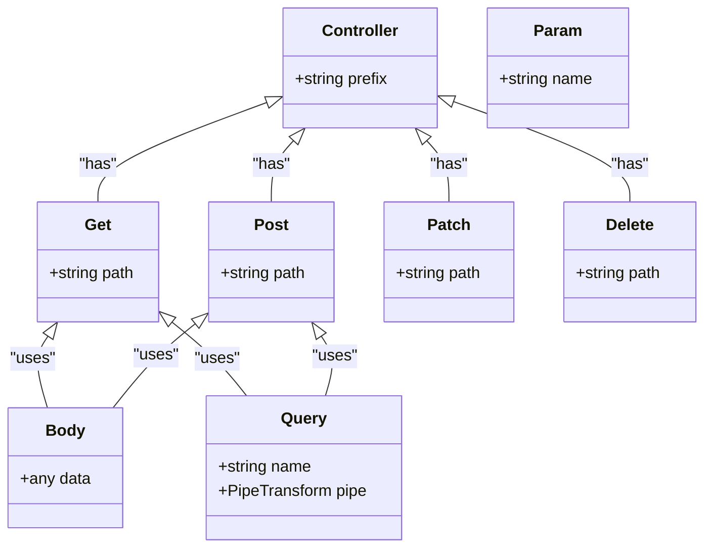
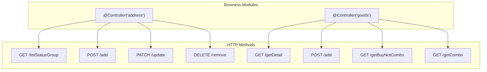
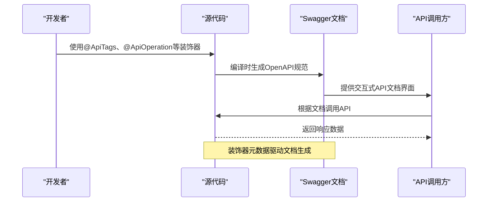
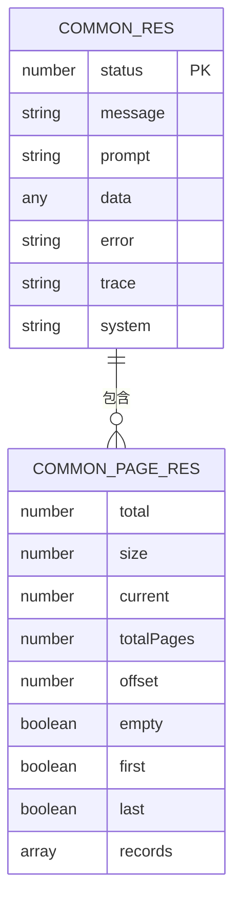
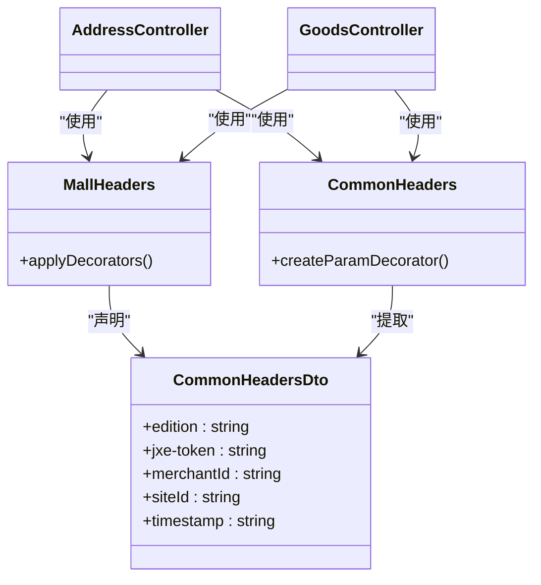
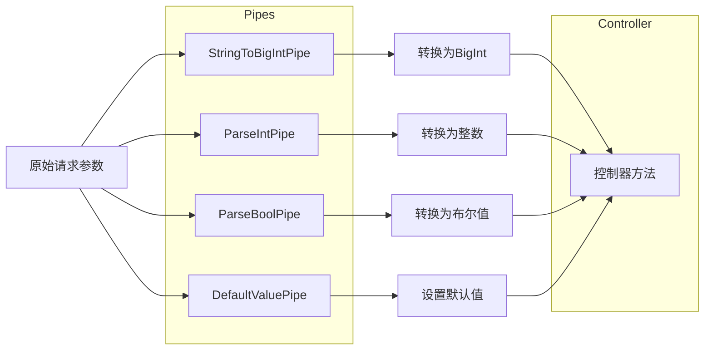
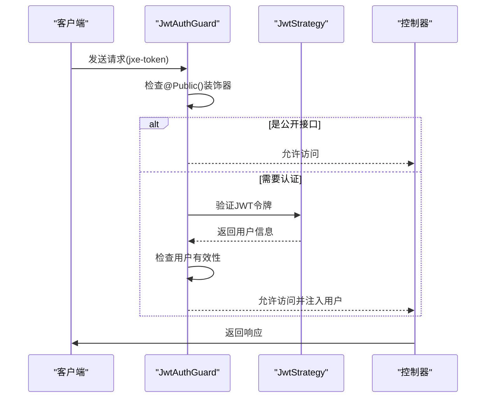

# 路由设计规范

<cite>
**本文档引用的文件**
- [address.controller.ts](file://apps/server-api/src/modules/address/address.controller.ts)
- [goods.controller.ts](file://apps/server-api/src/modules/goods/goods.controller.ts)
- [api-res-wrapper.decorator.ts](file://apps/server-api/src/common/decorators/api-res-wrapper.decorator.ts)
- [mall-headers.decorator.ts](file://apps/server-api/src/common/decorators/mall-headers.decorator.ts)
- [common-headers.decorator.ts](file://apps/server-api/src/common/decorators/common-headers.decorator.ts)
- [public.decorator.ts](file://apps/server-api/src/common/decorators/public.decorator.ts)
- [user.decorator.ts](file://apps/server-api/src/common/decorators/user.decorator.ts)
- [common-res.dto.ts](file://apps/server-api/src/common/dto/common-res.dto.ts)
- [common-page.dto.ts](file://apps/server-api/src/common/dto/common-page.dto.ts)
- [jwt-auth.guard.ts](file://apps/server-api/src/common/guards/jwt-auth.guard.ts)
- [transform.interceptor.ts](file://apps/server-api/src/common/interceptors/transform.interceptor.ts)
- [string-to-bigint.pipe.ts](file://apps/server-api/src/common/pipes/string-to-bigint.pipe.ts)
- [app.module.ts](file://apps/server-api/src/app.module.ts)
</cite>

## 目录
1. [引言](#引言)
2. [核心装饰器详解](#核心装饰器详解)
3. [路由定义与RESTful实践](#路由定义与restful实践)
4. [Swagger文档集成](#swagger文档集成)
5. [统一响应结构](#统一响应结构)
6. [公共请求头处理](#公共请求头处理)
7. [参数转换与验证](#参数转换与验证)
8. [安全与权限控制](#安全与权限控制)
9. [最佳实践指南](#最佳实践指南)
10. [结论](#结论)

## 引言

本规范详细阐述了项目后端API路由的设计原则与实现规范。通过分析`@Controller`、`@Get`、`@Post`等装饰器的使用方式，说明路由前缀、路径参数和查询参数的定义方法。结合address和goods模块的代码实例，展示RESTful风格的路由映射实践。同时解释`@ApiTags`和`@ApiOperation`在Swagger文档生成中的作用，并提供路由版本控制、命名规范和安全防护的最佳实践指南。

## 核心装饰器详解

NestJS框架中的装饰器是构建API路由的核心。`@Controller`装饰器用于定义控制器的路由前缀，`@Get`、`@Post`、`@Patch`、`@Delete`等装饰器用于映射HTTP方法到具体处理函数。

**Diagram sources**
- [address.controller.ts](file://apps/server-api/src/modules/address/address.controller.ts#L10)
- [goods.controller.ts](file://apps/server-api/src/modules/goods/goods.controller.ts#L27)

**Section sources**
- [address.controller.ts](file://apps/server-api/src/modules/address/address.controller.ts#L1-L41)
- [goods.controller.ts](file://apps/server-api/src/modules/goods/goods.controller.ts#L1-L120)

## 路由定义与RESTful实践

项目采用RESTful风格设计API路由，通过模块化组织不同业务领域的接口。每个模块的控制器使用`@Controller`装饰器定义基础路由前缀。

在address模块中，`@Controller('address')`定义了所有地址相关接口的基础路径。具体接口如`listStatusGroup`通过`@Get('listStatusGroup')`映射到GET请求，形成完整的`/address/listStatusGroup`路由。

**Diagram sources**
- [address.controller.ts](file://apps/server-api/src/modules/address/address.controller.ts#L10)
- [goods.controller.ts](file://apps/server-api/src/modules/goods/goods.controller.ts#L27)

**Section sources**
- [address.controller.ts](file://apps/server-api/src/modules/address/address.controller.ts#L10-L41)
- [goods.controller.ts](file://apps/server-api/src/modules/goods/goods.controller.ts#L27-L120)

## Swagger文档集成

项目使用NestJS Swagger模块实现API文档的自动生成。`@ApiTags`装饰器用于对API进行分类，`@ApiOperation`用于描述接口功能，`@ApiQuery`用于定义查询参数。

**Diagram sources**
- [address.controller.ts](file://apps/server-api/src/modules/address/address.controller.ts#L2-L3)
- [goods.controller.ts](file://apps/server-api/src/modules/goods/goods.controller.ts#L11-L12)

**Section sources**
- [address.controller.ts](file://apps/server-api/src/modules/address/address.controller.ts#L2-L41)
- [goods.controller.ts](file://apps/server-api/src/modules/goods/goods.controller.ts#L11-L120)

## 统一响应结构

项目采用统一的响应包装器`ApiResWrapper`确保所有API返回一致的数据格式。该装饰器基于`CommonRes`DTO类，包含状态码、消息、提示和数据等字段。

**Diagram sources**
- [common-res.dto.ts](file://apps/server-api/src/common/dto/common-res.dto.ts#L6)
- [common-page.dto.ts](file://apps/server-api/src/common/dto/common-page.dto.ts#L7)
- [api-res-wrapper.decorator.ts](file://apps/server-api/src/common/decorators/api-res-wrapper.decorator.ts#L11)

**Section sources**
- [common-res.dto.ts](file://apps/server-api/src/common/dto/common-res.dto.ts#L1-L49)
- [common-page.dto.ts](file://apps/server-api/src/common/dto/common-page.dto.ts#L1-L68)
- [api-res-wrapper.decorator.ts](file://apps/server-api/src/common/decorators/api-res-wrapper.decorator.ts#L1-L50)

## 公共请求头处理

项目定义了`MallHeaders`和`CommonHeaders`装饰器来处理公共请求头。`MallHeaders`用于在Swagger文档中声明所有公共头字段，而`CommonHeaders`作为参数装饰器从请求中提取这些头信息。

**Diagram sources**
- [mall-headers.decorator.ts](file://apps/server-api/src/common/decorators/mall-headers.decorator.ts#L25)
- [common-headers.decorator.ts](file://apps/server-api/src/common/decorators/common-headers.decorator.ts#L24)
- [common-headers.decorator.ts](file://apps/server-api/src/common/decorators/common-headers.decorator.ts#L4)

**Section sources**
- [mall-headers.decorator.ts](file://apps/server-api/src/common/decorators/mall-headers.decorator.ts#L1-L37)
- [common-headers.decorator.ts](file://apps/server-api/src/common/decorators/common-headers.decorator.ts#L1-L46)

## 参数转换与验证

项目使用管道(Pipe)机制进行参数转换和验证。`StringToBigIntPipe`用于将字符串类型的ID转换为BigInt格式，`ParseIntPipe`和`ParseBoolPipe`用于类型解析，`DefaultValuePipe`提供默认值。

**Diagram sources**
- [string-to-bigint.pipe.ts](file://apps/server-api/src/common/pipes/string-to-bigint.pipe.ts#L4)
- [goods.controller.ts](file://apps/server-api/src/modules/goods/goods.controller.ts#L67)

**Section sources**
- [string-to-bigint.pipe.ts](file://apps/server-api/src/common/pipes/string-to-bigint.pipe.ts#L1-L13)
- [goods.controller.ts](file://apps/server-api/src/modules/goods/goods.controller.ts#L67-L94)

## 安全与权限控制

项目采用JWT认证机制进行安全控制。`JwtAuthGuard`作为全局守卫，通过`@Public()`装饰器标记无需认证的接口。`CurrentUser`参数装饰器用于获取当前登录用户信息。

**Diagram sources**
- [jwt-auth.guard.ts](file://apps/server-api/src/common/guards/jwt-auth.guard.ts#L6)
- [public.decorator.ts](file://apps/server-api/src/common/decorators/public.decorator.ts#L4)
- [user.decorator.ts](file://apps/server-api/src/common/decorators/user.decorator.ts#L3)

**Section sources**
- [jwt-auth.guard.ts](file://apps/server-api/src/common/guards/jwt-auth.guard.ts#L1-L32)
- [public.decorator.ts](file://apps/server-api/src/common/decorators/public.decorator.ts#L1-L5)
- [user.decorator.ts](file://apps/server-api/src/common/decorators/user.decorator.ts#L1-L8)

## 最佳实践指南

### 路由命名规范
- 使用小写连字符命名法（kebab-case）
- 路由前缀对应业务模块名称
- 动词使用标准HTTP方法，避免在路径中包含动词

### 版本控制
- 在API设计初期考虑版本控制
- 可通过路由前缀包含版本号（如/v1/address）
- 保持向后兼容性，避免破坏性变更

### 安全防护
- 敏感接口必须进行身份验证
- 公共接口明确标记`@Public()`装饰器
- 输入参数必须进行类型验证和转换
- 关键操作应记录审计日志

### 性能优化
- 对读取操作使用缓存机制
- 分页查询限制最大返回记录数
- 复杂查询提供适当的数据库索引

### 错误处理
- 使用统一的错误响应格式
- 提供清晰的错误码和用户提示
- 记录详细的错误跟踪信息

## 结论

本项目通过NestJS框架实现了结构清晰、规范统一的API路由设计。通过装饰器驱动的方式，将路由定义、文档生成、安全控制和响应处理等关注点分离，提高了代码的可维护性和可读性。建议在后续开发中严格遵循本文档规定的规范，确保API设计的一致性和质量。