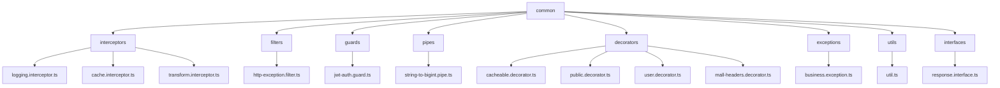
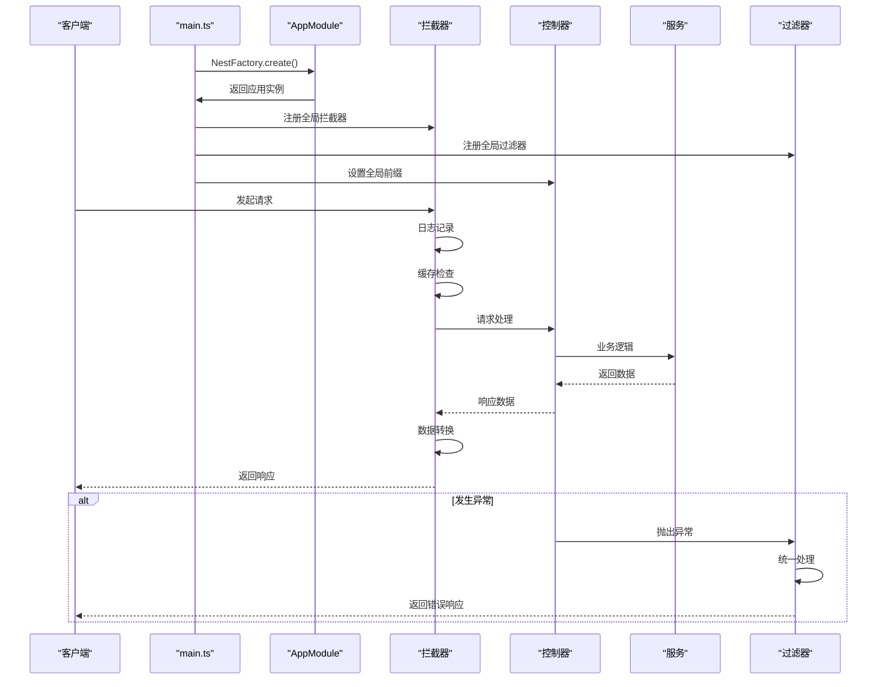
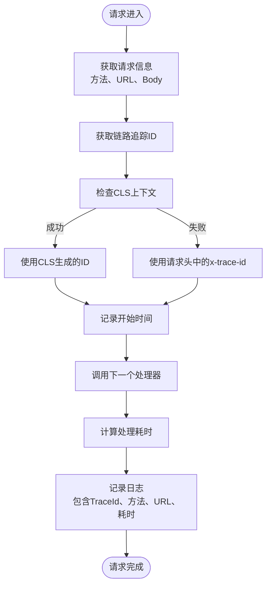
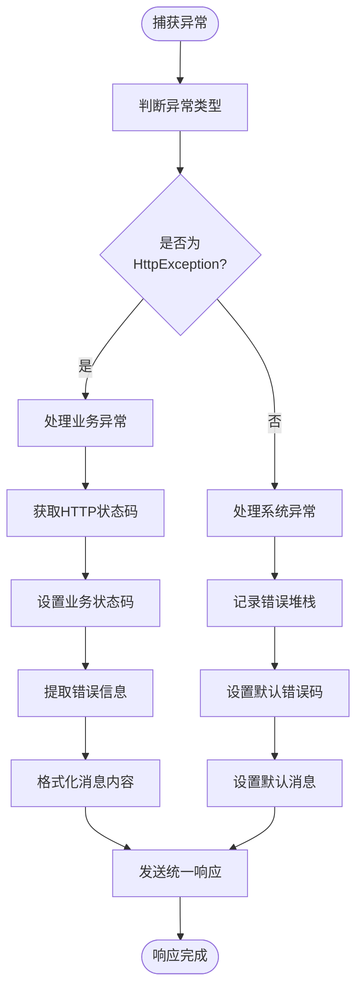
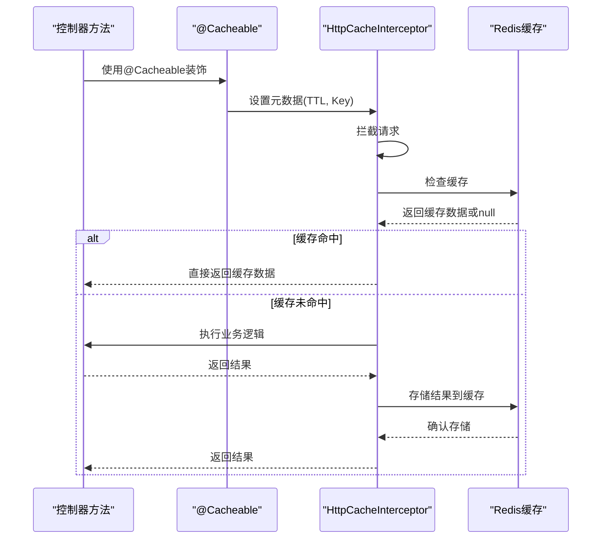
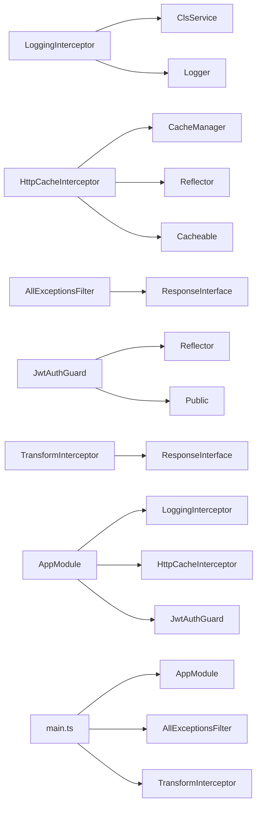
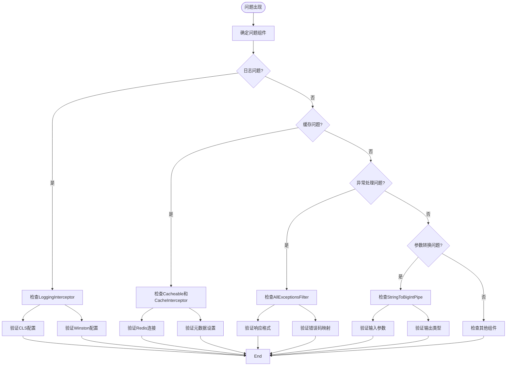

# 公共基础组件

<cite>
**本文档中引用的文件**  
- [logging.interceptor.ts](file://apps/server-api/src/common/interceptors/logging.interceptor.ts)
- [http-exception.filter.ts](file://apps/server-api/src/common/filters/http-exception.filter.ts)
- [string-to-bigint.pipe.ts](file://apps/server-api/src/common/pipes/string-to-bigint.pipe.ts)
- [util.ts](file://apps/server-api/src/common/utils/util.ts)
- [cacheable.decorator.ts](file://apps/server-api/src/common/decorators/cacheable.decorator.ts)
- [cache.interceptor.ts](file://apps/server-api/src/common/interceptors/cache.interceptor.ts)
- [business.exception.ts](file://apps/server-api/src/common/exceptions/business.exception.ts)
- [response.interface.ts](file://apps/server-api/src/common/interfaces/response.interface.ts)
- [transform.interceptor.ts](file://apps/server-api/src/common/interceptors/transform.interceptor.ts)
- [jwt-auth.guard.ts](file://apps/server-api/src/common/guards/jwt-auth.guard.ts)
- [public.decorator.ts](file://apps/server-api/src/common/decorators/public.decorator.ts)
- [user.decorator.ts](file://apps/server-api/src/common/decorators/user.decorator.ts)
- [mall-headers.decorator.ts](file://apps/server-api/src/common/decorators/mall-headers.decorator.ts)
- [app.module.ts](file://apps/server-api/src/app.module.ts)
- [main.ts](file://apps/server-api/src/main.ts)
</cite>

## 目录
1. [简介](#简介)
2. [项目结构](#项目结构)
3. [核心组件](#核心组件)
4. [架构概览](#架构概览)
5. [详细组件分析](#详细组件分析)
6. [依赖分析](#依赖分析)
7. [性能考量](#性能考量)
8. [故障排除指南](#故障排除指南)
9. [结论](#结论)

## 简介
本文档系统梳理了后端公共基础组件的设计与实现，重点解析日志记录、异常处理、参数转换、工具方法和缓存机制等核心功能。通过分析拦截器、过滤器、管道和装饰器的实现原理，为开发者提供统一的开发规范和扩展指南。

## 项目结构
后端公共基础组件集中存放在 `apps/server-api/src/common` 目录下，按照功能划分为多个子模块，包括拦截器、过滤器、守卫、管道、装饰器、异常处理和工具类等。这种组织方式实现了关注点分离，便于维护和复用。



**图示来源**
- [app.module.ts](file://apps/server-api/src/app.module.ts#L47-L161)

**本节来源**
- [app.module.ts](file://apps/server-api/src/app.module.ts#L1-L162)

## 核心组件
本系统的核心公共组件包括日志拦截器、异常过滤器、参数转换管道、通用工具类和缓存装饰器。这些组件共同构建了系统的基础设施，提供了统一的日志记录、错误处理、数据转换和性能优化能力。

**本节来源**
- [logging.interceptor.ts](file://apps/server-api/src/common/interceptors/logging.interceptor.ts#L1-L51)
- [http-exception.filter.ts](file://apps/server-api/src/common/filters/http-exception.filter.ts#L1-L39)
- [string-to-bigint.pipe.ts](file://apps/server-api/src/common/pipes/string-to-bigint.pipe.ts#L1-L13)
- [util.ts](file://apps/server-api/src/common/utils/util.ts#L1-L15)
- [cacheable.decorator.ts](file://apps/server-api/src/common/decorators/cacheable.decorator.ts#L1-L17)

## 架构概览
系统采用 NestJS 框架的模块化架构，通过依赖注入机制将公共基础组件集成到应用中。在应用启动时，通过全局配置注册拦截器、过滤器、守卫和管道，确保所有请求都能经过统一的处理流程。



**图示来源**
- [main.ts](file://apps/server-api/src/main.ts#L1-L73)
- [app.module.ts](file://apps/server-api/src/app.module.ts#L140-L158)

## 详细组件分析

### 日志记录机制分析
`LoggingInterceptor` 实现了全面的请求日志记录功能，通过链路追踪ID关联相关请求，监控请求响应时间，并输出结构化日志。



**图示来源**
- [logging.interceptor.ts](file://apps/server-api/src/common/interceptors/logging.interceptor.ts#L1-L51)

**本节来源**
- [logging.interceptor.ts](file://apps/server-api/src/common/interceptors/logging.interceptor.ts#L1-L51)
- [app.module.ts](file://apps/server-api/src/app.module.ts#L143-L144)

### 异常统一处理策略分析
`AllExceptionsFilter` 实现了业务异常与系统异常的统一处理策略，确保所有异常都以标准化的JSON格式返回。



**图示来源**
- [http-exception.filter.ts](file://apps/server-api/src/common/filters/http-exception.filter.ts#L1-L39)
- [business.exception.ts](file://apps/server-api/src/common/exceptions/business.exception.ts#L1-L34)

**本节来源**
- [http-exception.filter.ts](file://apps/server-api/src/common/filters/http-exception.filter.ts#L1-L39)
- [business.exception.ts](file://apps/server-api/src/common/exceptions/business.exception.ts#L1-L34)
- [response.interface.ts](file://apps/server-api/src/common/interfaces/response.interface.ts#L1-L14)

### 请求参数转换分析
`StringToBigIntPipe` 实现了请求参数的类型转换功能，确保字符串类型的参数能够正确转换为BigInt类型。

```mermaid
classDiagram
class StringToBigIntPipe {
+transform(value : string) : string
}
StringToBigIntPipe --> PipeTransform : "实现"
note right of StringToBigIntPipe
负责将字符串参数转换为BigInt类型
处理null和undefined的边界情况
确保数值转换的安全性
end
```

**图示来源**
- [string-to-bigint.pipe.ts](file://apps/server-api/src/common/pipes/string-to-bigint.pipe.ts#L1-L13)

**本节来源**
- [string-to-bigint.pipe.ts](file://apps/server-api/src/common/pipes/string-to-bigint.pipe.ts#L1-L13)

### 通用工具方法分析
`Util` 类封装了通用的工具方法，提供了可复用的实用功能。

```mermaid
classDiagram
class Util {
+static generatePhone() : string
}
note right of Util
静态工具类
提供生成随机手机号的方法
可扩展其他通用工具方法
end
```

**图示来源**
- [util.ts](file://apps/server-api/src/common/utils/util.ts#L1-L15)

**本节来源**
- [util.ts](file://apps/server-api/src/common/utils/util.ts#L1-L15)

### 缓存装饰器分析
`Cacheable` 装饰器与 `HttpCacheInterceptor` 配合实现了方法级别的缓存功能，支持自定义缓存键和过期时间。



**图示来源**
- [cacheable.decorator.ts](file://apps/server-api/src/common/decorators/cacheable.decorator.ts#L1-L17)
- [cache.interceptor.ts](file://apps/server-api/src/common/interceptors/cache.interceptor.ts#L1-L46)

**本节来源**
- [cacheable.decorator.ts](file://apps/server-api/src/common/decorators/cacheable.decorator.ts#L1-L17)
- [cache.interceptor.ts](file://apps/server-api/src/common/interceptors/cache.interceptor.ts#L1-L46)

## 依赖分析
公共基础组件之间存在明确的依赖关系，通过 NestJS 的依赖注入系统进行管理。核心依赖关系如下：



**图示来源**
- [app.module.ts](file://apps/server-api/src/app.module.ts#L1-L162)
- [main.ts](file://apps/server-api/src/main.ts#L1-L73)

**本节来源**
- [app.module.ts](file://apps/server-api/src/app.module.ts#L1-L162)
- [main.ts](file://apps/server-api/src/main.ts#L1-L73)

## 性能考量
系统在设计公共基础组件时充分考虑了性能影响，通过异步处理、缓存机制和资源优化等手段确保高性能。

- **日志记录**：使用 Winston 日志库，支持异步写入和结构化输出，减少I/O阻塞
- **缓存机制**：集成 Redis 缓存，显著降低数据库查询压力，提高响应速度
- **链路追踪**：通过 CLS (Continuation Local Storage) 实现上下文传递，避免频繁创建对象
- **全局配置**：在应用启动时一次性注册全局组件，避免运行时重复初始化
- **条件执行**：如缓存拦截器会先检查是否有 `@Cacheable` 装饰器，避免不必要的处理

**本节来源**
- [logging.interceptor.ts](file://apps/server-api/src/common/interceptors/logging.interceptor.ts#L1-L51)
- [cache.interceptor.ts](file://apps/server-api/src/common/interceptors/cache.interceptor.ts#L1-L46)
- [app.module.ts](file://apps/server-api/src/app.module.ts#L49-L57)
- [main.ts](file://apps/server-api/src/main.ts#L15-L16)

## 故障排除指南
当公共基础组件出现问题时，可参考以下排查步骤：



**本节来源**
- [logging.interceptor.ts](file://apps/server-api/src/common/interceptors/logging.interceptor.ts#L1-L51)
- [http-exception.filter.ts](file://apps/server-api/src/common/filters/http-exception.filter.ts#L1-L39)
- [string-to-bigint.pipe.ts](file://apps/server-api/src/common/pipes/string-to-bigint.pipe.ts#L1-L13)
- [cacheable.decorator.ts](file://apps/server-api/src/common/decorators/cacheable.decorator.ts#L1-L17)
- [cache.interceptor.ts](file://apps/server-api/src/common/interceptors/cache.interceptor.ts#L1-L46)

## 结论
本文档系统梳理了后端公共基础组件的设计与实现，涵盖了日志记录、异常处理、参数转换、工具方法和缓存机制等核心功能。这些组件通过 NestJS 框架的拦截器、过滤器、管道和装饰器机制，构建了一个健壮、可维护的后端基础设施。开发者可以基于这些组件快速开发新功能，同时确保代码风格和处理逻辑的一致性。建议在开发新模块时复用这些公共组件，并遵循相同的扩展规范，以保持系统的整体性和可维护性。