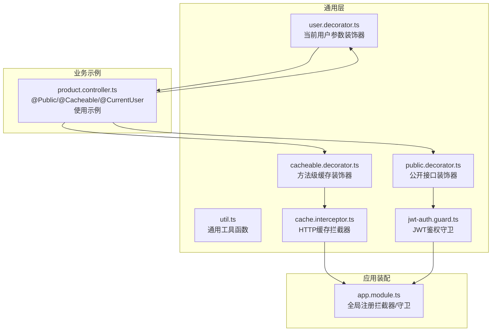
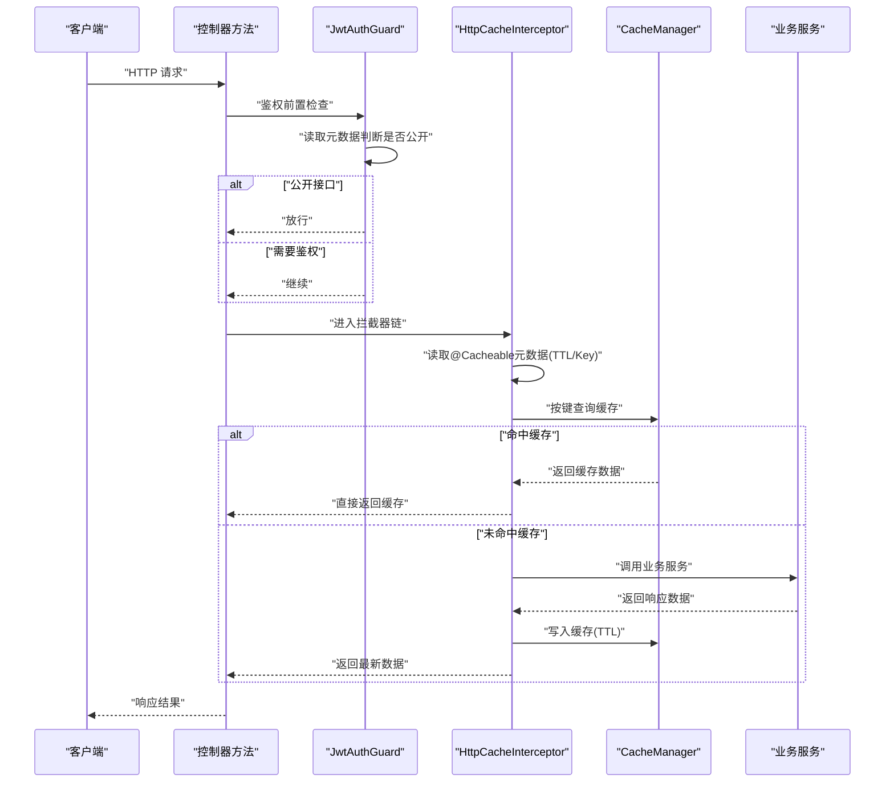
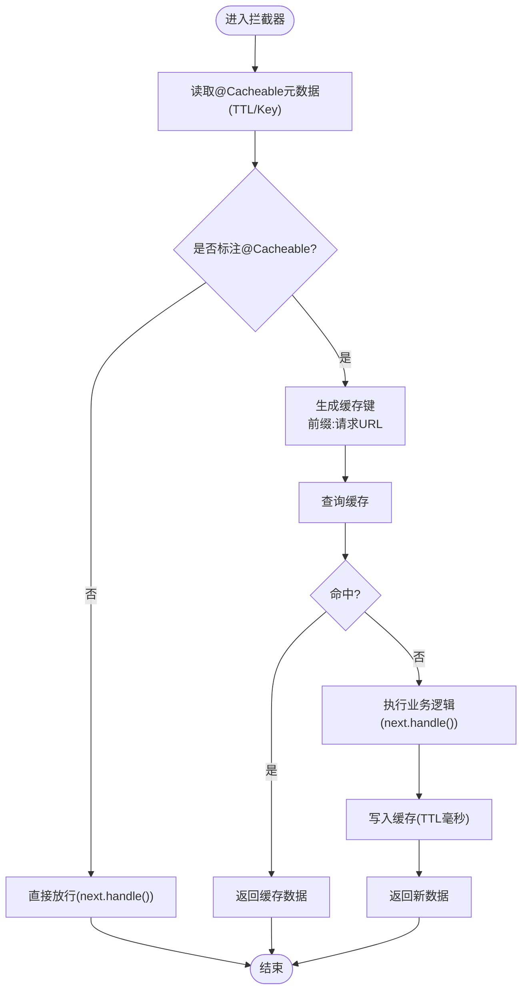
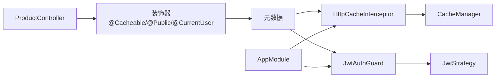

# 工具类与装饰器

<cite>
**本文引用的文件**
- [util.ts](file://apps/server-api/src/common/utils/util.ts)
- [cacheable.decorator.ts](file://apps/server-api/src/common/decorators/cacheable.decorator.ts)
- [public.decorator.ts](file://apps/server-api/src/common/decorators/public.decorator.ts)
- [user.decorator.ts](file://apps/server-api/src/common/decorators/user.decorator.ts)
- [cache.interceptor.ts](file://apps/server-api/src/common/interceptors/cache.interceptor.ts)
- [jwt-auth.guard.ts](file://apps/server-api/src/common/guards/jwt-auth.guard.ts)
- [app.module.ts](file://apps/server-api/src/app.module.ts)
- [product.controller.ts](file://apps/server-api/src/modules/product/product.controller.ts)
- [jwt.strategy.ts](file://apps/server-api/src/modules/auth/strategies/jwt.strategy.ts)
</cite>

## 目录
1. [引言](#引言)
2. [项目结构](#项目结构)
3. [核心组件](#核心组件)
4. [架构总览](#架构总览)
5. [详细组件分析](#详细组件分析)
6. [依赖关系分析](#依赖关系分析)
7. [性能与线程安全考量](#性能与线程安全考量)
8. [故障排查指南](#故障排查指南)
9. [结论](#结论)
10. [附录](#附录)

## 引言
本文件系统性阐述服务端通用工具类与自定义装饰器的设计理念与工程实践，重点覆盖：
- 工具类 util.ts 的通用函数设计与潜在优化点
- 缓存装饰器 cacheable.decorator.ts 与缓存拦截器 cache.interceptor.ts 的协作机制，包括缓存键生成策略、TTL 配置与条件缓存控制
- 路由权限豁免装饰器 public.decorator.ts 与用户信息提取装饰器 user.decorator.ts 的实现机制
- 装饰器工厂函数的编写规范与依赖注入系统的生命周期管理

## 项目结构
围绕“通用工具与装饰器”的相关文件主要分布在以下路径：
- common/utils：通用工具函数
- common/decorators：自定义装饰器
- common/interceptors：拦截器（含缓存拦截器）
- common/guards：守卫（含 JWT 鉴权守卫）
- app.module：全局注册拦截器与守卫
- 典型控制器示例：演示装饰器的实际使用

图表来源
- [util.ts](file://apps/server-api/src/common/utils/util.ts#L1-L15)
- [cacheable.decorator.ts](file://apps/server-api/src/common/decorators/cacheable.decorator.ts#L1-L17)
- [public.decorator.ts](file://apps/server-api/src/common/decorators/public.decorator.ts#L1-L5)
- [user.decorator.ts](file://apps/server-api/src/common/decorators/user.decorator.ts#L1-L8)
- [cache.interceptor.ts](file://apps/server-api/src/common/interceptors/cache.interceptor.ts#L1-L46)
- [jwt-auth.guard.ts](file://apps/server-api/src/common/guards/jwt-auth.guard.ts#L1-L32)
- [app.module.ts](file://apps/server-api/src/app.module.ts#L140-L162)
- [product.controller.ts](file://apps/server-api/src/modules/product/product.controller.ts#L1-L31)

章节来源
- [app.module.ts](file://apps/server-api/src/app.module.ts#L140-L162)

## 核心组件
- 工具类 util.ts：提供静态工具方法，当前包含手机号生成等基础能力，便于测试与数据构造。
- 缓存装饰器 cacheable.decorator.ts：通过元数据标记 TTL 与可选键前缀，驱动拦截器进行方法级缓存。
- 公开接口装饰器 public.decorator.ts：通过元数据标记“公开”属性，使守卫允许该路由绕过鉴权。
- 用户信息装饰器 user.decorator.ts：从请求上下文提取当前用户对象，供控制器参数注入使用。
- 缓存拦截器 cache.interceptor.ts：读取装饰器元数据，按规则生成缓存键并执行命中/回填逻辑。
- JWT 鉴权守卫 jwt-auth.guard.ts：优先判断是否为公开接口，否则委托父类进行 JWT 校验。

章节来源
- [util.ts](file://apps/server-api/src/common/utils/util.ts#L1-L15)
- [cacheable.decorator.ts](file://apps/server-api/src/common/decorators/cacheable.decorator.ts#L1-L17)
- [public.decorator.ts](file://apps/server-api/src/common/decorators/public.decorator.ts#L1-L5)
- [user.decorator.ts](file://apps/server-api/src/common/decorators/user.decorator.ts#L1-L8)
- [cache.interceptor.ts](file://apps/server-api/src/common/interceptors/cache.interceptor.ts#L1-L46)
- [jwt-auth.guard.ts](file://apps/server-api/src/common/guards/jwt-auth.guard.ts#L1-L32)

## 架构总览
装饰器与拦截器/守卫的协作流程如下：

图表来源
- [cache.interceptor.ts](file://apps/server-api/src/common/interceptors/cache.interceptor.ts#L1-L46)
- [cacheable.decorator.ts](file://apps/server-api/src/common/decorators/cacheable.decorator.ts#L1-L17)
- [jwt-auth.guard.ts](file://apps/server-api/src/common/guards/jwt-auth.guard.ts#L1-L32)
- [product.controller.ts](file://apps/server-api/src/modules/product/product.controller.ts#L18-L31)

## 详细组件分析

### 工具类 Util（util.ts）
- 设计理念
  - 提供静态工具方法，便于在测试、DTO 构造、日志输出等场景复用。
  - 当前实现为简单随机手机号生成，适合快速构造测试数据。
- 性能与线程安全
  - 使用浏览器/Node 环境的随机数生成器，属于纯函数式工具，无共享状态，天然线程安全。
  - 若后续扩展加密/哈希等操作，建议采用一次性实例化与不可变输入，避免跨调用状态污染。
- 可能的优化方向
  - 将随机数生成逻辑抽象为可配置范围与格式模板的工厂函数。
  - 对于加密/哈希等 CPU 密集型任务，考虑异步化与缓存热点摘要。

章节来源
- [util.ts](file://apps/server-api/src/common/utils/util.ts#L1-L15)

### 缓存装饰器 Cacheable（cacheable.decorator.ts）
- 设计要点
  - 通过元数据键标记 TTL 与可选键前缀，装饰器本身不直接访问缓存，仅负责标注。
  - 支持为不同方法设置独立 TTL 与键前缀，便于精细化缓存策略。
- 使用方式
  - 在控制器方法上添加 @Cacheable(ttl, keyPrefix?)，拦截器读取元数据决定是否启用缓存。
- 与拦截器的配合
  - 拦截器在进入处理器前读取元数据；若未标注，则直接放行，不产生额外开销。

章节来源
- [cacheable.decorator.ts](file://apps/server-api/src/common/decorators/cacheable.decorator.ts#L1-L17)

### 缓存拦截器 HttpCacheInterceptor（cache.interceptor.ts）
- 缓存键生成策略
  - 键格式：前缀:请求URL（例如：前缀为 product_list，URL 为 /products?page=1，则键为 product_list:/products?page=1）。
  - 前缀默认值：若未指定 keyPrefix，则使用 http_cache。
- TTL 配置
  - 从元数据读取 TTL（秒），写入缓存时转换为毫秒（注意 cache-manager 版本差异）。
- 条件缓存控制
  - 仅当方法标注 @Cacheable 时才启用缓存；未标注则直接放行。
- 命中与回填
  - 命中：直接返回缓存数据，不进入控制器逻辑。
  - 未命中：执行业务逻辑并将结果写入缓存。

图表来源
- [cache.interceptor.ts](file://apps/server-api/src/common/interceptors/cache.interceptor.ts#L1-L46)
- [cacheable.decorator.ts](file://apps/server-api/src/common/decorators/cacheable.decorator.ts#L1-L17)

章节来源
- [cache.interceptor.ts](file://apps/server-api/src/common/interceptors/cache.interceptor.ts#L1-L46)

### 公开接口装饰器 Public（public.decorator.ts）
- 设计要点
  - 通过元数据标记 isPublic=true，守卫在 canActivate 中读取该元数据决定是否放行。
- 应用场景
  - 登录页、公告列表、公开资源等无需鉴权的接口。
- 与守卫的协作
  - 守卫优先检查公开标记，若为公开接口则直接放行；否则委托父类进行 JWT 校验。

章节来源
- [public.decorator.ts](file://apps/server-api/src/common/decorators/public.decorator.ts#L1-L5)
- [jwt-auth.guard.ts](file://apps/server-api/src/common/guards/jwt-auth.guard.ts#L1-L32)

### 用户信息装饰器 CurrentUser（user.decorator.ts）
- 设计要点
  - 使用 createParamDecorator 从请求上下文提取 request.user。
  - 与 JWT 策略返回的用户对象一致，便于在控制器中直接注入当前用户。
- 使用示例
  - 在控制器方法参数上使用 @CurrentUser()，即可获得当前用户对象。

章节来源
- [user.decorator.ts](file://apps/server-api/src/common/decorators/user.decorator.ts#L1-L8)
- [jwt.strategy.ts](file://apps/server-api/src/modules/auth/strategies/jwt.strategy.ts#L1-L27)

### 控制器使用示例（product.controller.ts）
- 典型组合
  - @Public()：允许匿名访问
  - @Cacheable(60, 'product_list')：对列表接口启用缓存，TTL 60 秒，键前缀 product_list
  - @CurrentUser()：在方法参数中注入当前用户对象
- 效果验证
  - 未命中缓存时，控制台会打印提示语句，表明业务逻辑被执行；命中缓存时直接返回缓存数据。

章节来源
- [product.controller.ts](file://apps/server-api/src/modules/product/product.controller.ts#L18-L31)

## 依赖关系分析
- 全局装配
  - AppModule 将 HttpCacheInterceptor 与 JwtAuthGuard 注册为全局拦截器与守卫，确保装饰器行为在整个应用生效。
- 组件耦合
  - 装饰器仅依赖元数据约定，不直接依赖具体实现，降低耦合度。
  - 拦截器与守卫通过 Reflector 读取元数据，形成松耦合的运行时决策机制。
- 外部依赖
  - CacheManager 提供统一缓存抽象；JWT 策略负责用户身份解析。

图表来源
- [app.module.ts](file://apps/server-api/src/app.module.ts#L140-L162)
- [cache.interceptor.ts](file://apps/server-api/src/common/interceptors/cache.interceptor.ts#L1-L46)
- [jwt-auth.guard.ts](file://apps/server-api/src/common/guards/jwt-auth.guard.ts#L1-L32)
- [product.controller.ts](file://apps/server-api/src/modules/product/product.controller.ts#L1-L31)
- [jwt.strategy.ts](file://apps/server-api/src/modules/auth/strategies/jwt.strategy.ts#L1-L27)

章节来源
- [app.module.ts](file://apps/server-api/src/app.module.ts#L140-L162)

## 性能与线程安全考量
- 线程安全
  - 工具类 util.ts 的方法为纯函数，无共享状态，天然线程安全。
  - 缓存装饰器与拦截器均基于元数据与请求上下文，不持有全局可变状态，符合无状态设计。
- 性能优化
  - 缓存键生成：使用“前缀:请求URL”，可按模块/接口维度隔离缓存，避免键冲突。
  - TTL 设置：针对高频只读接口（如列表）设置合理 TTL，减少数据库压力。
  - 缓存命中路径：命中时直接返回，避免进入业务逻辑与序列化开销。
  - 注意 cache-manager 版本差异：写入 TTL 时需按毫秒单位处理，避免缓存不生效。
- 可观测性
  - 在未命中缓存时打印日志，便于定位缓存策略效果与业务逻辑执行情况。

章节来源
- [cache.interceptor.ts](file://apps/server-api/src/common/interceptors/cache.interceptor.ts#L1-L46)
- [util.ts](file://apps/server-api/src/common/utils/util.ts#L1-L15)

## 故障排查指南
- 缓存未生效
  - 确认方法是否添加 @Cacheable 装饰器；拦截器仅对标注的方法启用缓存。
  - 检查 TTL 是否正确传递；写入 TTL 时需注意单位转换。
  - 核对键前缀与 URL 是否一致；键格式为“前缀:请求URL”。
- 缓存命中异常
  - 检查 CacheManager 配置与版本；确保 TTL 单位与实现一致。
  - 确认请求参数顺序影响 URL，导致键不同；必要时在装饰器中加入参数摘要。
- 鉴权误放行
  - 确认 @Public 装饰器是否正确标注；守卫会优先检查公开标记。
  - 检查元数据读取是否被其他装饰器覆盖；Reflector 的读取顺序需明确。
- 用户信息为空
  - 确认 JWT 策略 validate 是否返回了期望的用户对象；控制器中 @CurrentUser 依赖 request.user。
  - 检查请求头 jxe-token 是否正确传递且未过期。

章节来源
- [cache.interceptor.ts](file://apps/server-api/src/common/interceptors/cache.interceptor.ts#L1-L46)
- [jwt-auth.guard.ts](file://apps/server-api/src/common/guards/jwt-auth.guard.ts#L1-L32)
- [user.decorator.ts](file://apps/server-api/src/common/decorators/user.decorator.ts#L1-L8)
- [jwt.strategy.ts](file://apps/server-api/src/modules/auth/strategies/jwt.strategy.ts#L1-L27)

## 结论
- 装饰器通过元数据实现声明式能力（缓存、公开、用户注入），拦截器与守卫在运行时读取元数据做出决策，形成低耦合、高可维护的扩展机制。
- 工具类以纯函数形式提供基础能力，具备良好的线程安全性与可测试性。
- 建议在生产环境中进一步完善缓存键生成策略（如参数摘要）、TTL 分层配置与缓存监控，持续优化性能与可观测性。

## 附录
- 装饰器工厂函数编写规范
  - 使用 SetMetadata 或 createParamDecorator 作为工厂，返回可被装饰器语法使用的函数。
  - 元数据键命名清晰、唯一，避免与其他装饰器冲突。
  - 在拦截器/守卫中使用 Reflector 读取元数据，支持 getAllAndOverride 以覆盖多处标注。
- 依赖注入生命周期管理
  - 拦截器与守卫通常为单例或请求作用域，避免在其中保存请求上下文以外的状态。
  - 全局注册通过 AppModule 的 provide/useClass 形式集中管理，确保装饰器行为一致生效。