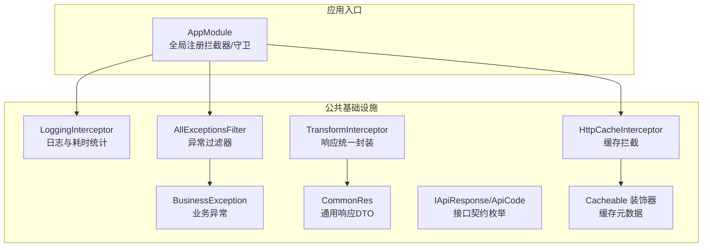
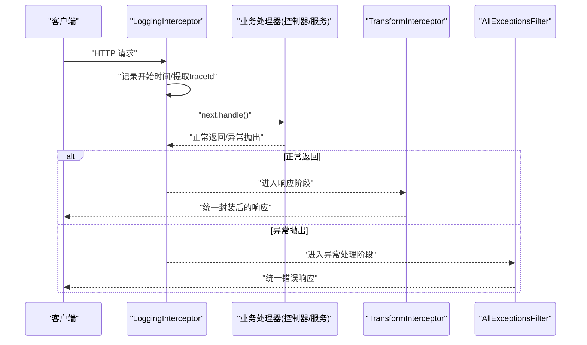
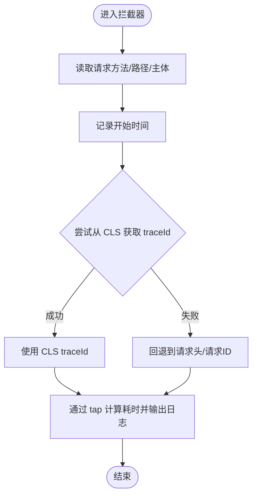
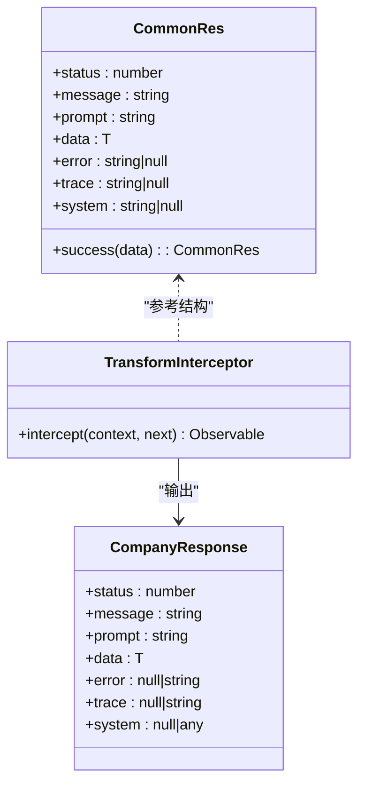
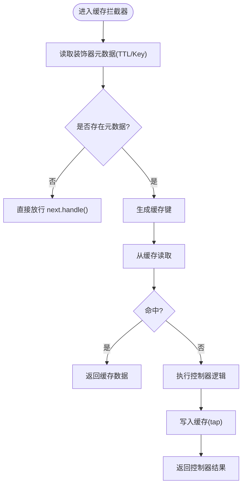
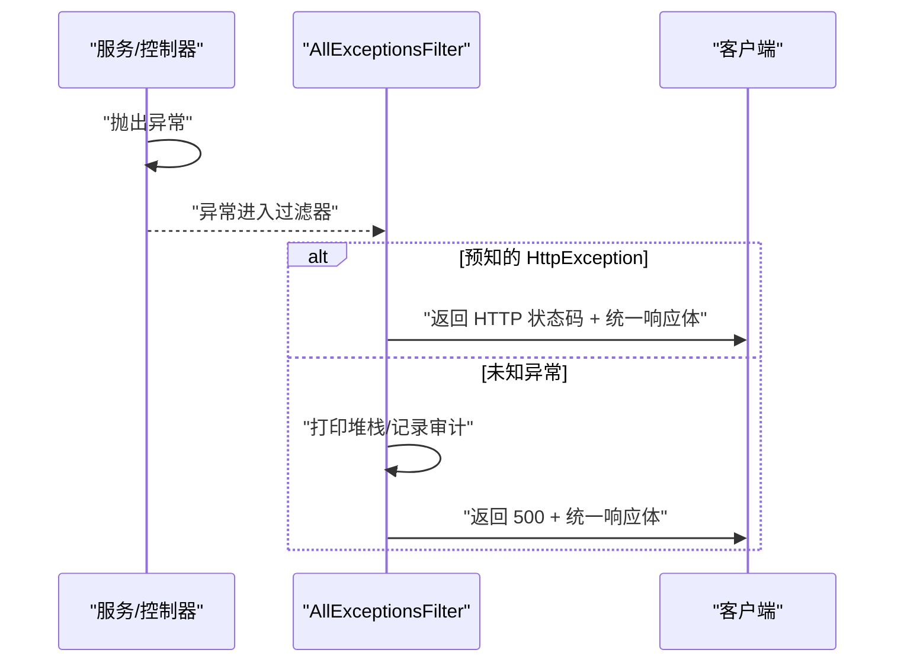
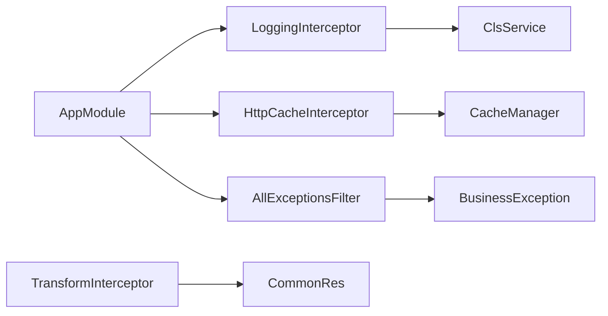

# 拦截器与过滤器

<cite>
**本文引用的文件**
- [apps/server-api/src/common/interceptors/logging.interceptor.ts](file://apps/server-api/src/common/interceptors/logging.interceptor.ts)
- [apps/server-api/src/common/interceptors/transform.interceptor.ts](file://apps/server-api/src/common/interceptors/transform.interceptor.ts)
- [apps/server-api/src/common/interceptors/cache.interceptor.ts](file://apps/server-api/src/common/interceptors/cache.interceptor.ts)
- [apps/server-api/src/common/filters/http-exception.filter.ts](file://apps/server-api/src/common/filters/http-exception.filter.ts)
- [apps/server-api/src/common/dto/common-res.dto.ts](file://apps/server-api/src/common/dto/common-res.dto.ts)
- [apps/server-api/src/common/exceptions/business.exception.ts](file://apps/server-api/src/common/exceptions/business.exception.ts)
- [apps/server-api/src/common/interfaces/response.interface.ts](file://apps/server-api/src/common/interfaces/response.interface.ts)
- [apps/server-api/src/common/decorators/cacheable.decorator.ts](file://apps/server-api/src/common/decorators/cacheable.decorator.ts)
- [apps/server-api/src/app.module.ts](file://apps/server-api/src/app.module.ts)
</cite>

## 目录
1. [简介](#简介)
2. [项目结构](#项目结构)
3. [核心组件](#核心组件)
4. [架构总览](#架构总览)
5. [详细组件分析](#详细组件分析)
6. [依赖关系分析](#依赖关系分析)
7. [性能考量](#性能考量)
8. [故障排查指南](#故障排查指南)
9. [结论](#结论)
10. [附录](#附录)

## 简介
本文件聚焦于本项目的拦截器与过滤器实现机制，围绕以下目标展开：
- 深入解析 logging.interceptor.ts 如何通过 RxJS 操作符捕获请求生命周期并记录性能指标，以及与日志系统的集成最佳实践。
- 分析 transform.interceptor.ts 在响应数据统一封装中的作用，并结合 common-res.dto.ts 实现标准化输出。
- 详述 http-exception.filter.ts 对 BusinessException 与 HTTP 异常的分层处理逻辑，包括错误码映射、敏感信息过滤与审计日志触发。
- 提供自定义拦截器与过滤器的开发模板及注册方式，说明其在 AOP 编程中的典型应用场景。

## 项目结构
本项目采用多包结构，拦截器与过滤器位于 server-api 应用的公共模块下，分别用于横切关注点：日志、响应封装、缓存、异常处理等。

图表来源
- [apps/server-api/src/app.module.ts](file://apps/server-api/src/app.module.ts#L140-L162)
- [apps/server-api/src/common/interceptors/logging.interceptor.ts](file://apps/server-api/src/common/interceptors/logging.interceptor.ts#L1-L51)
- [apps/server-api/src/common/interceptors/transform.interceptor.ts](file://apps/server-api/src/common/interceptors/transform.interceptor.ts#L1-L43)
- [apps/server-api/src/common/interceptors/cache.interceptor.ts](file://apps/server-api/src/common/interceptors/cache.interceptor.ts#L1-L46)
- [apps/server-api/src/common/filters/http-exception.filter.ts](file://apps/server-api/src/common/filters/http-exception.filter.ts#L1-L39)
- [apps/server-api/src/common/dto/common-res.dto.ts](file://apps/server-api/src/common/dto/common-res.dto.ts#L1-L49)
- [apps/server-api/src/common/exceptions/business.exception.ts](file://apps/server-api/src/common/exceptions/business.exception.ts#L1-L34)
- [apps/server-api/src/common/interfaces/response.interface.ts](file://apps/server-api/src/common/interfaces/response.interface.ts#L1-L14)
- [apps/server-api/src/common/decorators/cacheable.decorator.ts](file://apps/server-api/src/common/decorators/cacheable.decorator.ts#L1-L17)

章节来源
- [apps/server-api/src/app.module.ts](file://apps/server-api/src/app.module.ts#L140-L162)

## 核心组件
- 日志拦截器：在请求进入与离开之间计算耗时，收集 traceId 并输出结构化日志。
- 响应封装拦截器：统一将控制器返回值包装为标准响应结构，支持手动返回已包装数据的场景。
- 缓存拦截器：基于装饰器元数据从缓存读取或写入响应，提升查询性能。
- 异常过滤器：对业务异常与 HTTP 异常进行差异化处理，输出统一格式的错误响应。
- 业务异常：继承 HttpException，携带业务错误码与用户提示，便于统一处理与审计。

章节来源
- [apps/server-api/src/common/interceptors/logging.interceptor.ts](file://apps/server-api/src/common/interceptors/logging.interceptor.ts#L1-L51)
- [apps/server-api/src/common/interceptors/transform.interceptor.ts](file://apps/server-api/src/common/interceptors/transform.interceptor.ts#L1-L43)
- [apps/server-api/src/common/interceptors/cache.interceptor.ts](file://apps/server-api/src/common/interceptors/cache.interceptor.ts#L1-L46)
- [apps/server-api/src/common/filters/http-exception.filter.ts](file://apps/server-api/src/common/filters/http-exception.filter.ts#L1-L39)
- [apps/server-api/src/common/exceptions/business.exception.ts](file://apps/server-api/src/common/exceptions/business.exception.ts#L1-L34)

## 架构总览
拦截器与过滤器作为 NestJS AOP 的关键构件，在请求生命周期的关键节点注入横切逻辑，形成“前置处理—业务执行—后置处理”的闭环。

图表来源
- [apps/server-api/src/common/interceptors/logging.interceptor.ts](file://apps/server-api/src/common/interceptors/logging.interceptor.ts#L1-L51)
- [apps/server-api/src/common/interceptors/transform.interceptor.ts](file://apps/server-api/src/common/interceptors/transform.interceptor.ts#L1-L43)
- [apps/server-api/src/common/filters/http-exception.filter.ts](file://apps/server-api/src/common/filters/http-exception.filter.ts#L1-L39)

## 详细组件分析

### 日志拦截器：请求生命周期与性能指标
- 生命周期捕获：在 intercept 中读取请求方法、路径与主体，记录开始时间；通过 RxJS tap 在响应发出后计算耗时并输出日志。
- TraceId 来源优先级：优先从 CLS 获取；若不可用则回退到请求头 x-trace-id 或请求对象 id；均无则标记为 no-trace。
- 性能指标：以毫秒为单位记录请求耗时，便于后续监控与告警。
- 日志系统集成建议：
  - 使用结构化日志（JSON）以便日志平台采集与检索。
  - 将 traceId 作为日志字段，贯穿整个调用链。
  - 对敏感字段（如 body）进行脱敏处理后再输出。

图表来源
- [apps/server-api/src/common/interceptors/logging.interceptor.ts](file://apps/server-api/src/common/interceptors/logging.interceptor.ts#L1-L51)

章节来源
- [apps/server-api/src/common/interceptors/logging.interceptor.ts](file://apps/server-api/src/common/interceptors/logging.interceptor.ts#L1-L51)

### 响应封装拦截器：统一封装与标准化输出
- 统一包装：将控制器返回值包装为包含状态码、消息、提示、数据、错误跟踪与系统扩展信息的标准结构。
- 手动返回兼容：若返回值已包含 status 字段且包含 data，则视为已手动包装，直接透传，避免重复包装。
- 默认提示：默认提示可在控制器层面覆盖；trace 字段预留用于后续接入 CLS。
- 与 DTO 的关系：common-res.dto.ts 定义了通用响应模型，便于 Swagger 文档生成与前后端契约一致。

图表来源
- [apps/server-api/src/common/interceptors/transform.interceptor.ts](file://apps/server-api/src/common/interceptors/transform.interceptor.ts#L1-L43)
- [apps/server-api/src/common/dto/common-res.dto.ts](file://apps/server-api/src/common/dto/common-res.dto.ts#L1-L49)

章节来源
- [apps/server-api/src/common/interceptors/transform.interceptor.ts](file://apps/server-api/src/common/interceptors/transform.interceptor.ts#L1-L43)
- [apps/server-api/src/common/dto/common-res.dto.ts](file://apps/server-api/src/common/dto/common-res.dto.ts#L1-L49)

### 缓存拦截器：基于装饰器的自动缓存
- 元数据来源：通过反射读取装饰器设置的 TTL 与 Key 前缀；未设置装饰器时直接放行。
- 缓存键生成：前缀:请求 URL，确保不同路由与参数组合的隔离。
- 命中策略：命中直接返回缓存数据，绕过控制器逻辑；未命中执行控制器并将结果写入缓存。
- TTL 单位：注意 cache-manager v4 与 v3 的差异，当前实现按毫秒处理。

图表来源
- [apps/server-api/src/common/interceptors/cache.interceptor.ts](file://apps/server-api/src/common/interceptors/cache.interceptor.ts#L1-L46)
- [apps/server-api/src/common/decorators/cacheable.decorator.ts](file://apps/server-api/src/common/decorators/cacheable.decorator.ts#L1-L17)

章节来源
- [apps/server-api/src/common/interceptors/cache.interceptor.ts](file://apps/server-api/src/common/interceptors/cache.interceptor.ts#L1-L46)
- [apps/server-api/src/common/decorators/cacheable.decorator.ts](file://apps/server-api/src/common/decorators/cacheable.decorator.ts#L1-L17)

### 异常过滤器：业务异常与 HTTP 异常的分层处理
- 全局捕获：@Catch() 捕获所有异常，统一处理。
- HTTP 异常识别：区分 HttpException 与非 HttpException，前者使用其状态码，后者映射为 500。
- 业务异常映射：BusinessException 继承 HttpException，统一返回 400，但响应体包含业务错误码与用户提示，便于前端展示与审计。
- 敏感信息过滤：对响应消息做数组/字符串兼容处理，必要时仅返回第一条，避免泄露内部细节。
- 审计日志触发：对未知异常打印堆栈，便于定位问题；可在此处扩展审计日志写入。

图表来源
- [apps/server-api/src/common/filters/http-exception.filter.ts](file://apps/server-api/src/common/filters/http-exception.filter.ts#L1-L39)
- [apps/server-api/src/common/exceptions/business.exception.ts](file://apps/server-api/src/common/exceptions/business.exception.ts#L1-L34)
- [apps/server-api/src/common/interfaces/response.interface.ts](file://apps/server-api/src/common/interfaces/response.interface.ts#L1-L14)

章节来源
- [apps/server-api/src/common/filters/http-exception.filter.ts](file://apps/server-api/src/common/filters/http-exception.filter.ts#L1-L39)
- [apps/server-api/src/common/exceptions/business.exception.ts](file://apps/server-api/src/common/exceptions/business.exception.ts#L1-L34)
- [apps/server-api/src/common/interfaces/response.interface.ts](file://apps/server-api/src/common/interfaces/response.interface.ts#L1-L14)

## 依赖关系分析
- 全局注册：AppModule 通过 APP_INTERCEPTOR 与 APP_GUARD 注册日志拦截器与缓存拦截器，确保全局生效。
- CLS 集成：日志拦截器依赖 CLS 提供 traceId，AppModule 已配置全局 CLS 中间件。
- 缓存管理：缓存拦截器依赖 cache-manager 与 @nestjs/cache-manager，AppModule 已注册全局缓存。
- 异常处理：异常过滤器与业务异常共同构成统一错误处理体系。

图表来源
- [apps/server-api/src/app.module.ts](file://apps/server-api/src/app.module.ts#L140-L162)
- [apps/server-api/src/common/interceptors/logging.interceptor.ts](file://apps/server-api/src/common/interceptors/logging.interceptor.ts#L1-L51)
- [apps/server-api/src/common/interceptors/cache.interceptor.ts](file://apps/server-api/src/common/interceptors/cache.interceptor.ts#L1-L46)
- [apps/server-api/src/common/filters/http-exception.filter.ts](file://apps/server-api/src/common/filters/http-exception.filter.ts#L1-L39)
- [apps/server-api/src/common/interceptors/transform.interceptor.ts](file://apps/server-api/src/common/interceptors/transform.interceptor.ts#L1-L43)
- [apps/server-api/src/common/dto/common-res.dto.ts](file://apps/server-api/src/common/dto/common-res.dto.ts#L1-L49)

章节来源
- [apps/server-api/src/app.module.ts](file://apps/server-api/src/app.module.ts#L140-L162)

## 性能考量
- 日志开销：日志输出为同步 I/O，建议在生产环境使用异步传输器（如文件轮转）并控制日志级别。
- 缓存命中率：合理设置 TTL 与 Key 前缀，避免缓存污染；对高并发读取场景优先考虑命中缓存。
- 响应封装成本：map 操作为轻量转换，通常可忽略；若返回数据体量较大，建议在上游进行必要的裁剪。
- 异常处理：对未知异常打印堆栈会带来额外 I/O，建议配合审计日志系统统一上报。

## 故障排查指南
- 无法获取 traceId：检查 CLS 是否正确初始化与挂载中间件；确认请求头 x-trace-id 是否传递。
- 缓存未生效：确认装饰器是否正确设置 TTL 与 Key 前缀；检查缓存存储是否可用；核对 URL 参数变化导致的键冲突。
- 响应未被统一封装：若控制器已手动返回包含 status 的对象，拦截器会透传；需确保控制器返回原始数据或遵循统一封装约定。
- 业务异常未按预期返回：确认 BusinessException 的构造参数与响应体结构；检查异常是否被上层捕获或重抛。

章节来源
- [apps/server-api/src/common/interceptors/logging.interceptor.ts](file://apps/server-api/src/common/interceptors/logging.interceptor.ts#L1-L51)
- [apps/server-api/src/common/interceptors/cache.interceptor.ts](file://apps/server-api/src/common/interceptors/cache.interceptor.ts#L1-L46)
- [apps/server-api/src/common/interceptors/transform.interceptor.ts](file://apps/server-api/src/common/interceptors/transform.interceptor.ts#L1-L43)
- [apps/server-api/src/common/filters/http-exception.filter.ts](file://apps/server-api/src/common/filters/http-exception.filter.ts#L1-L39)

## 结论
本项目通过拦截器与过滤器实现了请求生命周期的可观测性、响应的标准化与缓存优化，并以 BusinessException 与统一异常过滤器构建了清晰的错误处理体系。建议在生产环境中进一步完善日志结构化、审计日志与缓存策略，持续优化性能与可维护性。

## 附录

### 开发模板与注册方式（自定义拦截器）
- 模板要点
  - 实现 NestInterceptor 接口，使用 RxJS 操作符在请求进入与响应发出之间注入逻辑。
  - 在 AppModule 中通过 provide: APP_INTERCEPTOR 与 useClass 注册为全局拦截器。
  - 若需依赖注入，确保构造函数参数在模块中可解析。
- 示例流程
  - 创建拦截器文件，编写 intercept 方法。
  - 在 app.module.ts 的 providers 中添加全局注册项。
  - 如需条件启用，可通过装饰器或元数据在拦截器内部判断。

章节来源
- [apps/server-api/src/app.module.ts](file://apps/server-api/src/app.module.ts#L140-L162)
- [apps/server-api/src/common/interceptors/logging.interceptor.ts](file://apps/server-api/src/common/interceptors/logging.interceptor.ts#L1-L51)

### 开发模板与注册方式（自定义过滤器）
- 模板要点
  - 实现 ExceptionFilter 接口，使用 @Catch() 捕获异常类型或全部异常。
  - 在 catch 中根据异常类型决定 HTTP 状态码与业务响应体。
  - 在 AppModule 中通过 provide: APP_FILTER 与 useClass 注册为全局过滤器。
- 示例流程
  - 创建过滤器文件，编写 catch 方法。
  - 在 app.module.ts 的 providers 中添加全局注册项。
  - 如需多过滤器共存，注意优先级与匹配顺序。

章节来源
- [apps/server-api/src/app.module.ts](file://apps/server-api/src/app.module.ts#L140-L162)
- [apps/server-api/src/common/filters/http-exception.filter.ts](file://apps/server-api/src/common/filters/http-exception.filter.ts#L1-L39)