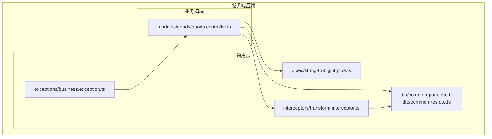
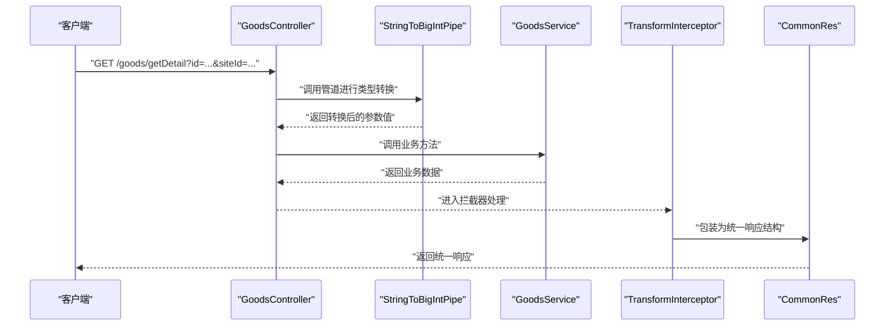
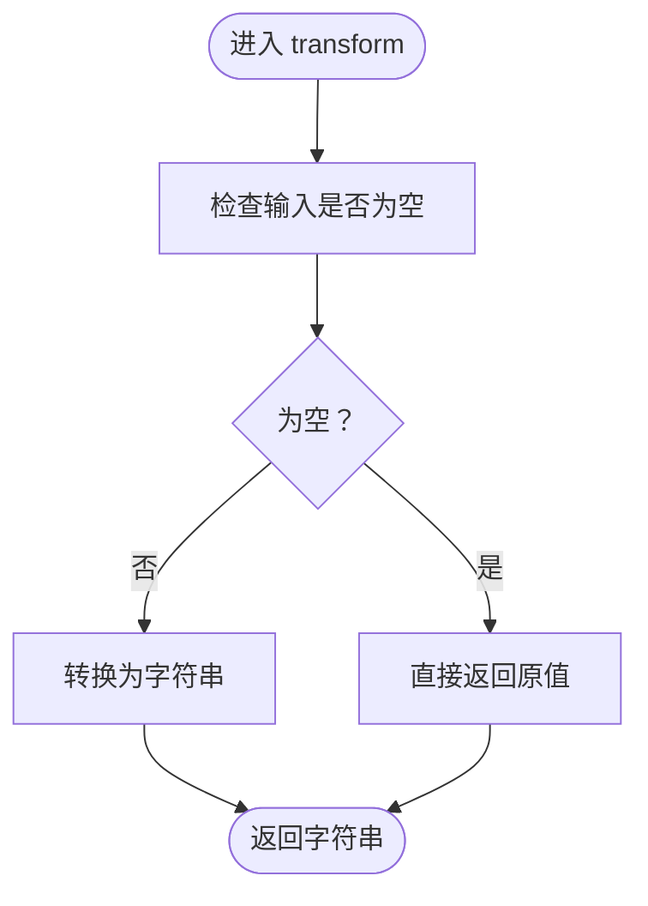
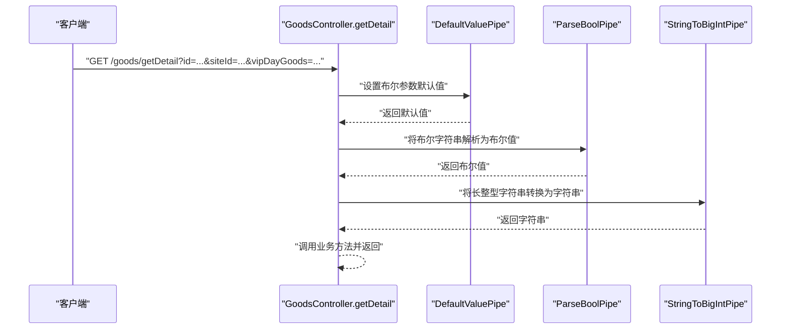
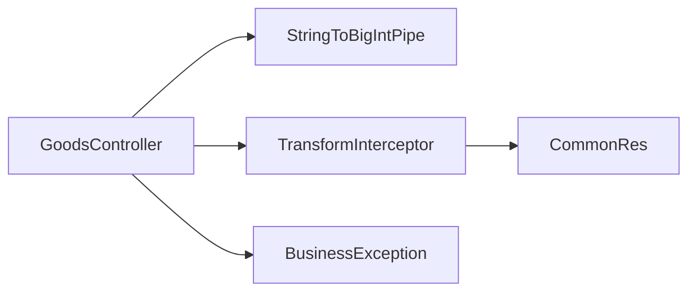

# 数据转换管道

<cite>
**本文引用的文件**
- [apps/server-api/src/common/pipes/string-to-bigint.pipe.ts](file://apps/server-api/src/common/pipes/string-to-bigint.pipe.ts)
- [apps/server-api/src/modules/goods/goods.controller.ts](file://apps/server-api/src/modules/goods/goods.controller.ts)
- [apps/server-api/src/common/dto/common-page.dto.ts](file://apps/server-api/src/common/dto/common-page.dto.ts)
- [apps/server-api/src/common/dto/common-res.dto.ts](file://apps/server-api/src/common/dto/common-res.dto.ts)
- [apps/server-api/src/common/exceptions/business.exception.ts](file://apps/server-api/src/common/exceptions/business.exception.ts)
- [apps/server-api/src/common/interceptors/transform.interceptor.ts](file://apps/server-api/src/common/interceptors/transform.interceptor.ts)
</cite>

## 目录
1. [引言](#引言)
2. [项目结构](#项目结构)
3. [核心组件](#核心组件)
4. [架构总览](#架构总览)
5. [详细组件分析](#详细组件分析)
6. [依赖关系分析](#依赖关系分析)
7. [性能考量](#性能考量)
8. [故障排查指南](#故障排查指南)
9. [结论](#结论)
10. [附录](#附录)

## 引言
本文件围绕“管道（Pipe）在请求数据验证与转换中的关键作用”展开，重点剖析以下目标：
- 以 string-to-bigint.pipe.ts 为例，说明如何通过自定义管道实现字符串到 BigInt 类型的转换，避免 JavaScript 数字精度丢失问题；
- 结合 goods.controller.ts 中对 Query 参数的处理，展示管道在 DTO 验证、类型转换与默认值填充中的综合应用；
- 总结自定义管道的开发规范，包括 @Injectable() 装饰器使用、transform 方法实现、错误抛出机制；
- 提供管道在参数装饰器（@Query、@Body）中的注册方式与执行顺序控制策略。

## 项目结构
本仓库采用多包结构，服务端位于 apps/server-api。与本文主题相关的关键目录与文件如下：
- common/pipes：存放通用管道，如字符串到 BigInt 的转换管道；
- modules/goods：业务模块控制器，演示 Query 参数装饰器中管道的注册与使用；
- common/dto：通用 DTO，如分页结果模型；
- common/exceptions：业务异常类，用于统一错误抛出；
- common/interceptors：统一响应包装拦截器，配合管道与控制器输出一致的响应结构。

图表来源
- [apps/server-api/src/common/pipes/string-to-bigint.pipe.ts](file://apps/server-api/src/common/pipes/string-to-bigint.pipe.ts#L1-L13)
- [apps/server-api/src/modules/goods/goods.controller.ts](file://apps/server-api/src/modules/goods/goods.controller.ts#L1-L120)
- [apps/server-api/src/common/dto/common-page.dto.ts](file://apps/server-api/src/common/dto/common-page.dto.ts#L1-L68)
- [apps/server-api/src/common/dto/common-res.dto.ts](file://apps/server-api/src/common/dto/common-res.dto.ts#L1-L49)
- [apps/server-api/src/common/exceptions/business.exception.ts](file://apps/server-api/src/common/exceptions/business.exception.ts#L1-L34)
- [apps/server-api/src/common/interceptors/transform.interceptor.ts](file://apps/server-api/src/common/interceptors/transform.interceptor.ts#L1-L42)

章节来源
- [apps/server-api/src/common/pipes/string-to-bigint.pipe.ts](file://apps/server-api/src/common/pipes/string-to-bigint.pipe.ts#L1-L13)
- [apps/server-api/src/modules/goods/goods.controller.ts](file://apps/server-api/src/modules/goods/goods.controller.ts#L1-L120)
- [apps/server-api/src/common/dto/common-page.dto.ts](file://apps/server-api/src/common/dto/common-page.dto.ts#L1-L68)
- [apps/server-api/src/common/dto/common-res.dto.ts](file://apps/server-api/src/common/dto/common-res.dto.ts#L1-L49)
- [apps/server-api/src/common/exceptions/business.exception.ts](file://apps/server-api/src/common/exceptions/business.exception.ts#L1-L34)
- [apps/server-api/src/common/interceptors/transform.interceptor.ts](file://apps/server-api/src/common/interceptors/transform.interceptor.ts#L1-L42)

## 核心组件
- 自定义管道 StringToBigIntPipe：实现字符串到 BigInt 的转换，确保长整型数值在传输过程中不丢失精度；
- GoodsController：在 Query 参数装饰器中注册管道，完成类型转换与默认值处理；
- CommonPageRes：通用分页结果模型，体现 DTO 层对字段的规范化；
- CommonRes：通用响应包装模型，配合拦截器统一输出结构；
- BusinessException：业务异常类，用于在管道或控制器中抛出标准化错误；
- TransformInterceptor：统一响应包装拦截器，保证接口返回结构一致。

章节来源
- [apps/server-api/src/common/pipes/string-to-bigint.pipe.ts](file://apps/server-api/src/common/pipes/string-to-bigint.pipe.ts#L1-L13)
- [apps/server-api/src/modules/goods/goods.controller.ts](file://apps/server-api/src/modules/goods/goods.controller.ts#L1-L120)
- [apps/server-api/src/common/dto/common-page.dto.ts](file://apps/server-api/src/common/dto/common-page.dto.ts#L1-L68)
- [apps/server-api/src/common/dto/common-res.dto.ts](file://apps/server-api/src/common/dto/common-res.dto.ts#L1-L49)
- [apps/server-api/src/common/exceptions/business.exception.ts](file://apps/server-api/src/common/exceptions/business.exception.ts#L1-L34)
- [apps/server-api/src/common/interceptors/transform.interceptor.ts](file://apps/server-api/src/common/interceptors/transform.interceptor.ts#L1-L42)

## 架构总览
下图展示了从客户端请求到统一响应输出的完整链路，突出管道在参数解析阶段的作用以及拦截器在响应阶段的统一包装。

图表来源
- [apps/server-api/src/modules/goods/goods.controller.ts](file://apps/server-api/src/modules/goods/goods.controller.ts#L51-L120)
- [apps/server-api/src/common/pipes/string-to-bigint.pipe.ts](file://apps/server-api/src/common/pipes/string-to-bigint.pipe.ts#L1-L13)
- [apps/server-api/src/common/interceptors/transform.interceptor.ts](file://apps/server-api/src/common/interceptors/transform.interceptor.ts#L1-L42)
- [apps/server-api/src/common/dto/common-res.dto.ts](file://apps/server-api/src/common/dto/common-res.dto.ts#L1-L49)

## 详细组件分析

### 组件A：StringToBigIntPipe（字符串到 BigInt 的转换）
- 设计要点
  - 使用 @Injectable() 装饰器声明为可注入服务，便于在控制器中通过参数装饰器注册；
  - 实现 PipeTransform<string, string> 接口，明确输入输出类型；
  - transform 方法对空值进行安全处理，避免未定义/空值导致的异常；
  - 当前实现返回字符串形式，满足前端/下游系统对长整型字符串的需求。
- 关键行为
  - 输入为空时直接返回原值，避免破坏上游逻辑；
  - 将输入转换为字符串，确保后续处理不会因类型不匹配而报错；
  - 若需真正转换为 BigInt，可在 transform 内部添加转换逻辑并在必要处抛出错误。
- 错误处理建议
  - 当输入无法转换为合法字符串或超出范围时，抛出 BusinessException，交由全局过滤器统一处理；
  - 在转换失败时返回明确的错误码与用户提示，便于前端展示与定位问题。

图表来源
- [apps/server-api/src/common/pipes/string-to-bigint.pipe.ts](file://apps/server-api/src/common/pipes/string-to-bigint.pipe.ts#L1-L13)

章节来源
- [apps/server-api/src/common/pipes/string-to-bigint.pipe.ts](file://apps/server-api/src/common/pipes/string-to-bigint.pipe.ts#L1-L13)
- [apps/server-api/src/common/exceptions/business.exception.ts](file://apps/server-api/src/common/exceptions/business.exception.ts#L1-L34)

### 组件B：GoodsController（Query 参数装饰器中的管道注册与默认值）
- 管道注册方式
  - 在 @Query('id', StringToBigIntPipe) 中显式注册自定义管道，确保 id 参数被转换为字符串；
  - 在 @Query('siteId', ParseIntPipe) 中使用内置管道将字符串转换为整数；
  - 对布尔参数使用 DefaultValuePipe 与 ParseBoolPipe 组合，实现默认值与类型转换。
- 执行顺序
  - 参数装饰器的第二个参数按从左到右的顺序依次执行：先执行 DefaultValuePipe，再执行 ParseBoolPipe；
  - 自定义管道 StringToBigIntPipe 在 Query 解析后执行，负责将长整型参数转换为字符串。
- 统一响应
  - 控制器通过 @ApiResWrapper 装饰器与 TransformInterceptor 协作，最终输出统一的 CommonRes 结构。

图表来源
- [apps/server-api/src/modules/goods/goods.controller.ts](file://apps/server-api/src/modules/goods/goods.controller.ts#L51-L120)

章节来源
- [apps/server-api/src/modules/goods/goods.controller.ts](file://apps/server-api/src/modules/goods/goods.controller.ts#L1-L120)

### 组件C：CommonPageRes（分页参数处理）
- 字段设计
  - total、size、current、totalPages、offset 等字段用于描述分页状态；
  - empty、first、last 等布尔字段用于页面导航状态判断；
  - records 作为泛型数组承载具体数据。
- 用途
  - 该模型用于封装查询结果，便于前端进行分页渲染与交互；
  - 与控制器返回值配合，经由拦截器统一包装为 CommonRes。

章节来源
- [apps/server-api/src/common/dto/common-page.dto.ts](file://apps/server-api/src/common/dto/common-page.dto.ts#L1-L68)

### 组件D：CommonRes（统一响应包装）
- 结构组成
  - status、message、prompt、data、error、trace、system 等字段构成统一响应体；
  - 提供 success 静态方法快速构造成功响应。
- 与拦截器协作
  - TransformInterceptor 在控制器返回后将其包装为 CommonRes，保证接口一致性。

章节来源
- [apps/server-api/src/common/dto/common-res.dto.ts](file://apps/server-api/src/common/dto/common-res.dto.ts#L1-L49)
- [apps/server-api/src/common/interceptors/transform.interceptor.ts](file://apps/server-api/src/common/interceptors/transform.interceptor.ts#L1-L42)

### 组件E：BusinessException（业务异常）
- 设计目的
  - 统一业务异常的错误码、用户提示与内部消息；
  - 固定返回 HTTP 400，便于前端识别与处理。
- 使用场景
  - 在管道或控制器中遇到参数非法、越界等业务错误时抛出；
  - 交由全局过滤器捕获并转换为统一响应结构。

章节来源
- [apps/server-api/src/common/exceptions/business.exception.ts](file://apps/server-api/src/common/exceptions/business.exception.ts#L1-L34)

## 依赖关系分析
- GoodsController 依赖 StringToBigIntPipe 完成参数转换；
- GoodsController 与 TransformInterceptor 协作，统一输出响应结构；
- CommonRes 与 TransformInterceptor 共同保证响应一致性；
- BusinessException 为业务错误提供统一抛出入口。

图表来源
- [apps/server-api/src/modules/goods/goods.controller.ts](file://apps/server-api/src/modules/goods/goods.controller.ts#L1-L120)
- [apps/server-api/src/common/pipes/string-to-bigint.pipe.ts](file://apps/server-api/src/common/pipes/string-to-bigint.pipe.ts#L1-L13)
- [apps/server-api/src/common/interceptors/transform.interceptor.ts](file://apps/server-api/src/common/interceptors/transform.interceptor.ts#L1-L42)
- [apps/server-api/src/common/dto/common-res.dto.ts](file://apps/server-api/src/common/dto/common-res.dto.ts#L1-L49)
- [apps/server-api/src/common/exceptions/business.exception.ts](file://apps/server-api/src/common/exceptions/business.exception.ts#L1-L34)

章节来源
- [apps/server-api/src/modules/goods/goods.controller.ts](file://apps/server-api/src/modules/goods/goods.controller.ts#L1-L120)
- [apps/server-api/src/common/pipes/string-to-bigint.pipe.ts](file://apps/server-api/src/common/pipes/string-to-bigint.pipe.ts#L1-L13)
- [apps/server-api/src/common/interceptors/transform.interceptor.ts](file://apps/server-api/src/common/interceptors/transform.interceptor.ts#L1-L42)
- [apps/server-api/src/common/dto/common-res.dto.ts](file://apps/server-api/src/common/dto/common-res.dto.ts#L1-L49)
- [apps/server-api/src/common/exceptions/business.exception.ts](file://apps/server-api/src/common/exceptions/business.exception.ts#L1-L34)

## 性能考量
- 管道执行成本低：字符串到字符串的转换开销极小，适合在高频请求中使用；
- 复用性高：将转换逻辑集中于管道，避免在多个控制器重复实现；
- 与拦截器配合：统一响应包装在拦截器阶段完成，减少控制器样板代码；
- 建议
  - 对于超大整数，优先使用字符串类型，避免精度损失；
  - 在管道中加入必要的边界检查与格式校验，提前失败，降低后续处理成本。

## 故障排查指南
- 管道未生效
  - 确认参数装饰器中已正确传入管道实例，如 @Query('id', StringToBigIntPipe)；
  - 检查管道是否被 @Injectable() 正确声明并注入到模块中。
- 类型转换异常
  - 在 transform 中对非法输入抛出 BusinessException，并提供明确的错误码与提示；
  - 使用 ParseIntPipe、ParseBoolPipe 等内置管道时，确认输入格式符合预期。
- 响应结构不一致
  - 确认控制器使用了 @ApiResWrapper 或与 TransformInterceptor 协作；
  - 检查拦截器是否正确包裹返回数据。

章节来源
- [apps/server-api/src/common/pipes/string-to-bigint.pipe.ts](file://apps/server-api/src/common/pipes/string-to-bigint.pipe.ts#L1-L13)
- [apps/server-api/src/common/exceptions/business.exception.ts](file://apps/server-api/src/common/exceptions/business.exception.ts#L1-L34)
- [apps/server-api/src/common/interceptors/transform.interceptor.ts](file://apps/server-api/src/common/interceptors/transform.interceptor.ts#L1-L42)

## 结论
- 管道是实现请求参数类型转换与验证的关键环节，尤其在处理长整型等易丢失精度的数据时尤为重要；
- 通过在参数装饰器中注册管道，可以将转换逻辑与控制器解耦，提升可维护性；
- 结合统一响应拦截器与业务异常类，能够形成从输入到输出的一致性与可靠性保障；
- 建议在实际项目中完善管道的错误处理与边界校验，确保在高并发场景下的稳定性与可诊断性。

## 附录

### 自定义管道开发规范
- 装饰器与接口
  - 使用 @Injectable() 声明为可注入服务；
  - 实现 PipeTransform<InputType, OutputType> 接口，明确输入输出类型；
- transform 方法
  - 对空值进行安全处理，避免破坏上游逻辑；
  - 在转换失败时抛出 BusinessException，交由全局过滤器统一处理；
- 注册与执行顺序
  - 在参数装饰器中按需传入管道实例，控制执行顺序；
  - 默认值与类型转换的组合使用，确保参数的健壮性与可用性。

章节来源
- [apps/server-api/src/common/pipes/string-to-bigint.pipe.ts](file://apps/server-api/src/common/pipes/string-to-bigint.pipe.ts#L1-L13)
- [apps/server-api/src/common/exceptions/business.exception.ts](file://apps/server-api/src/common/exceptions/business.exception.ts#L1-L34)
- [apps/server-api/src/modules/goods/goods.controller.ts](file://apps/server-api/src/modules/goods/goods.controller.ts#L1-L120)