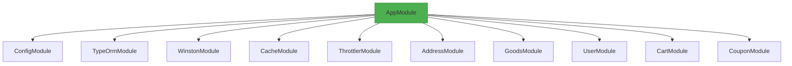
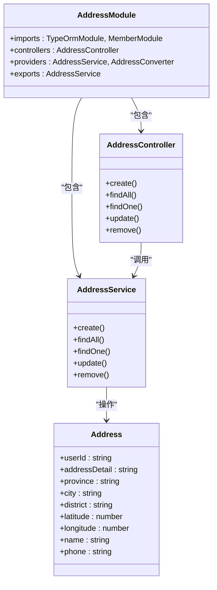
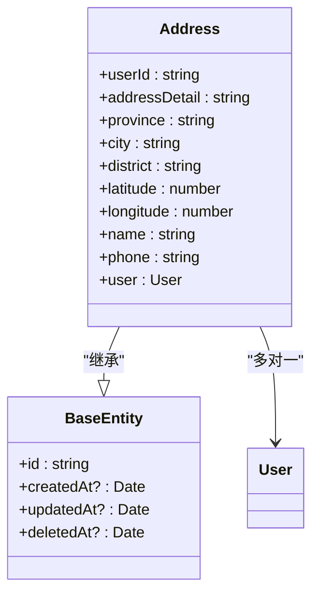
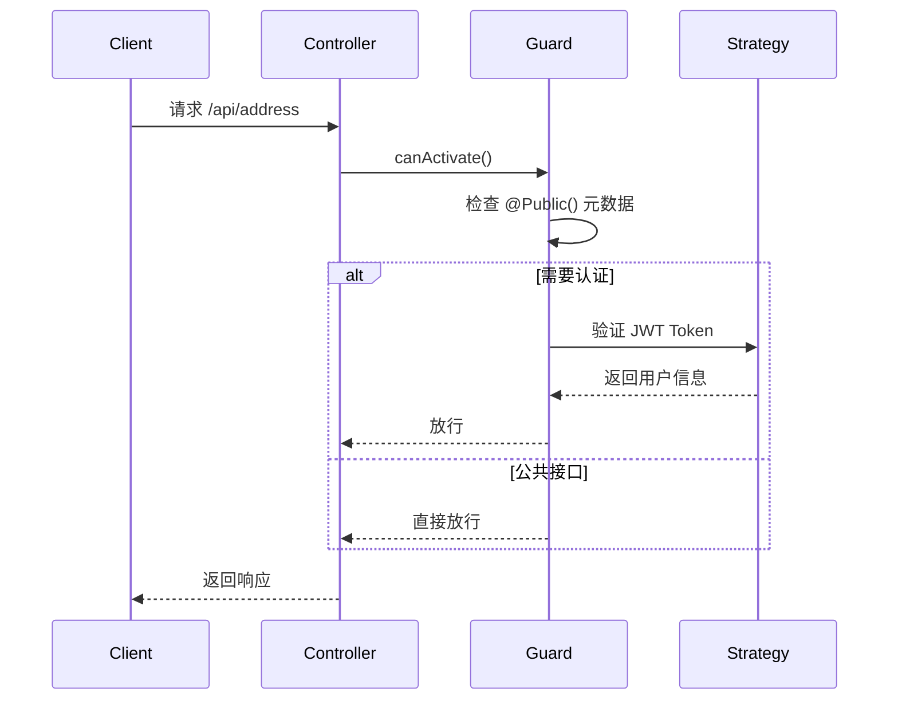

# 后端架构

<cite>
**本文档引用文件**  
- [main.ts](file://apps/server-api/src/main.ts)
- [app.module.ts](file://apps/server-api/src/app.module.ts)
- [typeorm.datasource.ts](file://apps/server-api/src/config/typeorm.datasource.ts)
- [jwt-auth.guard.ts](file://apps/server-api/src/common/guards/jwt-auth.guard.ts)
- [transform.interceptor.ts](file://apps/server-api/src/common/interceptors/transform.interceptor.ts)
- [common-res.dto.ts](file://apps/server-api/src/common/dto/common-res.dto.ts)
- [base.entity.ts](file://apps/server-api/src/common/entities/base.entity.ts)
- [address.entity.ts](file://apps/server-api/src/modules/address/entities/address.entity.ts)
- [address.module.ts](file://apps/server-api/src/modules/address/address.module.ts)
- [goods.module.ts](file://apps/server-api/src/modules/goods/goods.module.ts)
- [user.module.ts](file://apps/server-api/src/modules/user/user.module.ts)
- [public.decorator.ts](file://apps/server-api/src/common/decorators/public.decorator.ts)
</cite>

## 目录
1. [应用启动流程](#应用启动流程)
2. [全局配置与中间件](#全局配置与中间件)
3. [模块化架构设计](#模块化架构设计)
4. [核心模块结构分析](#核心模块结构分析)
5. [通用组件实现](#通用组件实现)
6. [数据库配置与实体管理](#数据库配置与实体管理)
7. [认证与安全机制](#认证与安全机制)
8. [RESTful API 设计规范](#restful-api-设计规范)
9. [开发标准化指南](#开发标准化指南)

## 应用启动流程

NestJS 应用从 `main.ts` 文件启动，通过 `NestFactory.create()` 创建应用实例并加载根模块 `AppModule`。启动过程中配置了全局前缀 `v2-app-mall`，并排除特定路径（如测试接口）。

应用初始化时启用了跨域（CORS），并注册了全局日志记录器（使用 Winston 模块）。Swagger 文档在非生产环境下自动启用，便于接口调试和文档生成。

**Section sources**
- [main.ts](file://apps/server-api/src/main.ts#L10-L73)

## 全局配置与中间件

### 全局拦截器
应用注册了多个全局拦截器：
- `TransformInterceptor`：统一响应结构，包装成功返回数据
- `LoggingInterceptor`：记录请求日志，支持链路追踪
- `HttpCacheInterceptor`：实现接口缓存功能

### 全局异常过滤器
`AllExceptionsFilter` 统一处理所有未捕获的异常，返回标准化错误响应，避免敏感信息泄露。

### 全局验证管道
通过 `ValidationPipe` 实现 DTO 自动验证，具备以下特性：
- `whitelist: true`：自动剔除未定义字段，防止恶意参数注入
- `transform: true`：自动将请求参数转换为 DTO 实例

### 全局前缀与跨域
设置全局路由前缀 `v2-app-mall`，并启用 CORS 支持前端跨域访问。

**Section sources**
- [main.ts](file://apps/server-api/src/main.ts#L24-L40)
- [app.module.ts](file://apps/server-api/src/app.module.ts#L140-L157)

## 模块化架构设计

### 根模块整合
`AppModule` 作为根模块，通过 `imports` 集成所有业务模块，体现领域驱动设计（DDD）的分层思想。各模块职责清晰，包括地址、商品、订单、用户等核心领域。

### 依赖注入配置
通过 `providers` 配置全局服务：
- `APP_INTERCEPTOR` 注册日志和缓存拦截器
- `APP_GUARD` 注册 JWT 认证守卫和限流守卫
- `ClsModule` 提供链路追踪上下文支持

### 配置管理
使用 `ConfigModule.forRoot()` 加载环境变量，`TypeOrmModule.forRootAsync()` 异步连接数据库，确保配置安全性和灵活性。



**Diagram sources**
- [app.module.ts](file://apps/server-api/src/app.module.ts#L47-L161)

**Section sources**
- [app.module.ts](file://apps/server-api/src/app.module.ts#L47-L161)

## 核心模块结构分析

### 模块内部结构
以 `AddressModule` 为例，遵循标准 DDD 分层：
- **Controller**：处理 HTTP 请求，定义路由
- **Service**：封装业务逻辑
- **Entity**：定义数据模型
- **DTO**：传输对象，用于输入验证
- **VO**：值对象，用于输出数据封装
- **Converter**：实体与 VO 之间的转换工具

### 模块依赖管理
模块通过 `imports` 声明依赖，如 `AddressModule` 依赖 `MemberModule` 和 TypeORM 实体。`exports` 暴露服务供其他模块使用。



**Diagram sources**
- [address.module.ts](file://apps/server-api/src/modules/address/address.module.ts#L1-L17)
- [address.controller.ts](file://apps/server-api/src/modules/address/address.controller.ts)
- [address.service.ts](file://apps/server-api/src/modules/address/address.service.ts)
- [address.entity.ts](file://apps/server-api/src/modules/address/entities/address.entity.ts)

**Section sources**
- [address.module.ts](file://apps/server-api/src/modules/address/address.module.ts#L1-L17)
- [goods.module.ts](file://apps/server-api/src/modules/goods/goods.module.ts#L1-L18)
- [user.module.ts](file://apps/server-api/src/modules/user/user.module.ts#L1-L22)

## 通用组件实现

### 响应包装器
`TransformInterceptor` 实现统一响应格式，符合公司规范：
```json
{
  "status": 200,
  "message": "success",
  "prompt": "操作成功",
  "data": {},
  "error": null,
  "trace": null,
  "system": null
}
```

### 日志系统
集成 Winston 日志框架，输出 JSON 格式日志，便于 ELK 等系统采集分析。

### 缓存机制
通过 `CacheModule` 配置 Redis 缓存，`HttpCacheInterceptor` 实现接口级缓存。

### 限流保护
使用 `ThrottlerModule` 实现 IP 限流策略，防止接口被恶意刷取。

**Section sources**
- [transform.interceptor.ts](file://apps/server-api/src/common/interceptors/transform.interceptor.ts#L1-L43)
- [logging.interceptor.ts](file://apps/server-api/src/common/interceptors/logging.interceptor.ts)
- [cache.interceptor.ts](file://apps/server-api/src/common/interceptors/cache.interceptor.ts)

## 数据库配置与实体管理

### 数据源配置
`typeorm.datasource.ts` 配置 MySQL 连接，关键特性：
- 使用环境变量管理数据库连接信息
- 实体自动扫描：`../modules/**/entities/*.entity.{ts,js}`
- 迁移文件路径：`../migrations/*.{ts,js}`
- 生产环境禁用 `synchronize`，使用迁移脚本管理 schema 变更

### 实体设计规范
所有实体继承 `BaseEntity` 基类，包含：
- `id`：UUID 主键
- `createdAt`：创建时间
- `updatedAt`：更新时间
- `deletedAt`：软删除时间戳



**Diagram sources**
- [typeorm.datasource.ts](file://apps/server-api/src/config/typeorm.datasource.ts#L8-L23)
- [base.entity.ts](file://apps/server-api/src/common/entities/base.entity.ts#L3-L15)
- [address.entity.ts](file://apps/server-api/src/modules/address/entities/address.entity.ts#L8-L80)

**Section sources**
- [typeorm.datasource.ts](file://apps/server-api/src/config/typeorm.datasource.ts#L8-L23)
- [base.entity.ts](file://apps/server-api/src/common/entities/base.entity.ts#L1-L16)

## 认证与安全机制

### JWT 认证守卫
`JwtAuthGuard` 基于 Passport 实现 JWT 认证，特性：
- 继承 `AuthGuard('jwt')` 基础功能
- 支持 `@Public()` 装饰器跳过认证
- 自定义错误处理，返回友好提示

### 公共接口装饰器
`@Public()` 装饰器通过 `SetMetadata` 标记无需认证的接口。



**Diagram sources**
- [jwt-auth.guard.ts](file://apps/server-api/src/common/guards/jwt-auth.guard.ts#L6-L32)
- [public.decorator.ts](file://apps/server-api/src/common/decorators/public.decorator.ts#L4-L5)

**Section sources**
- [jwt-auth.guard.ts](file://apps/server-api/src/common/guards/jwt-auth.guard.ts#L1-L32)
- [public.decorator.ts](file://apps/server-api/src/common/decorators/public.decorator.ts#L1-L5)

## RESTful API 设计规范

### 路由结构
遵循 RESTful 原则，路径格式：
```
/v2-app-mall/address
/v2-app-mall/goods
/v2-app-mall/user
```

### 请求响应规范
- **成功响应**：HTTP 200，`status=200`
- **参数错误**：HTTP 400，`status=400`
- **认证失败**：HTTP 401，`status=401`
- **系统错误**：HTTP 500，`status=500`

### 错误处理
通过 `CommonRes` DTO 统一错误格式，包含 `error`、`trace`、`system` 等字段，便于问题追踪。

**Section sources**
- [common-res.dto.ts](file://apps/server-api/src/common/dto/common-res.dto.ts#L6-L48)
- [response.interface.ts](file://apps/server-api/src/common/interfaces/response.interface.ts#L7-L13)

## 开发标准化指南

### 模块开发规范
1. 创建新模块时，遵循标准目录结构
2. 实体继承 `BaseEntity`
3. 使用 DTO 进行输入验证
4. 服务层封装业务逻辑
5. 控制器仅处理 HTTP 相关逻辑

### 服务编写建议
- 保持单一职责原则
- 避免在服务中直接操作 `Request` 对象
- 使用依赖注入获取其他服务
- 异常处理返回标准化错误

### API 设计原则
- 使用 `@ApiResWrapper` 装饰器统一响应
- 敏感接口添加 `@Public()` 或认证守卫
- 列表接口支持分页参数
- 写操作返回完整资源信息

**Section sources**
- [app.module.ts](file://apps/server-api/src/app.module.ts)
- [main.ts](file://apps/server-api/src/main.ts)
- [common/](file://apps/server-api/src/common/)