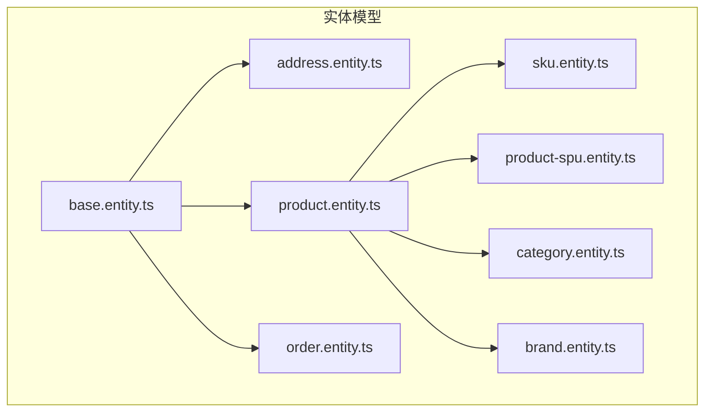
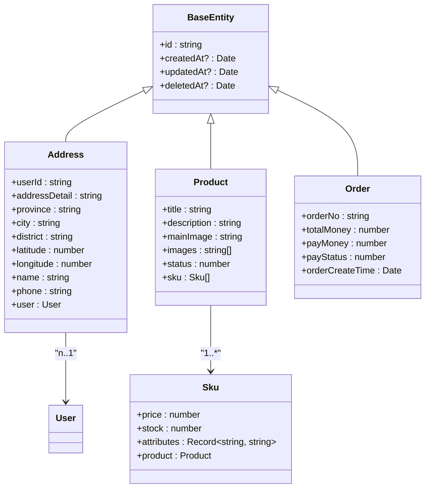
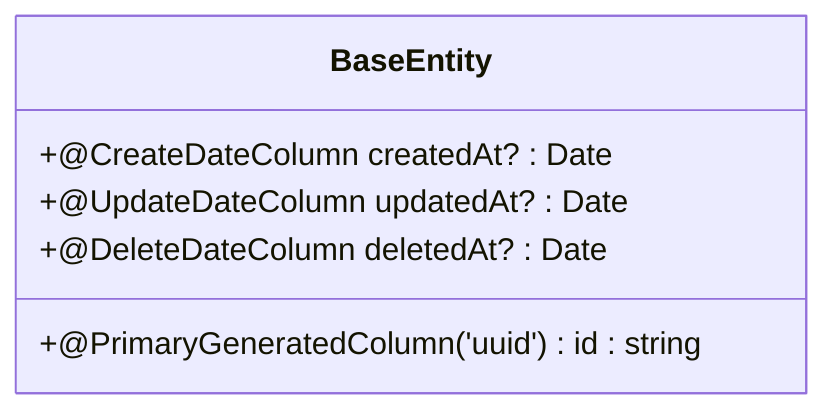
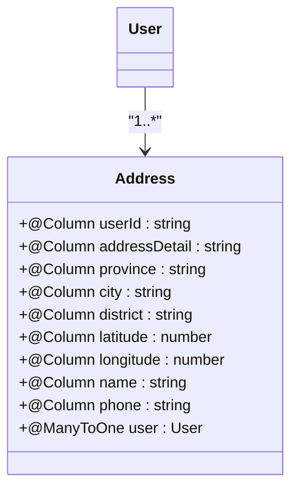
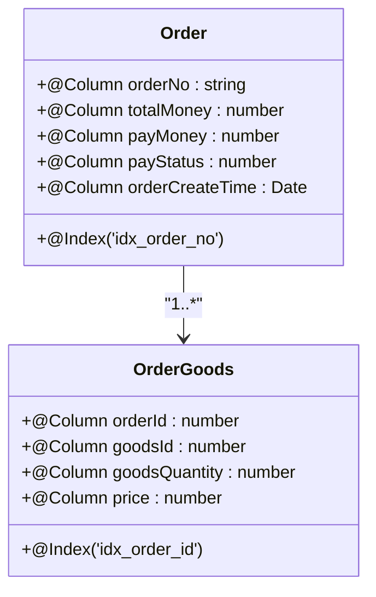
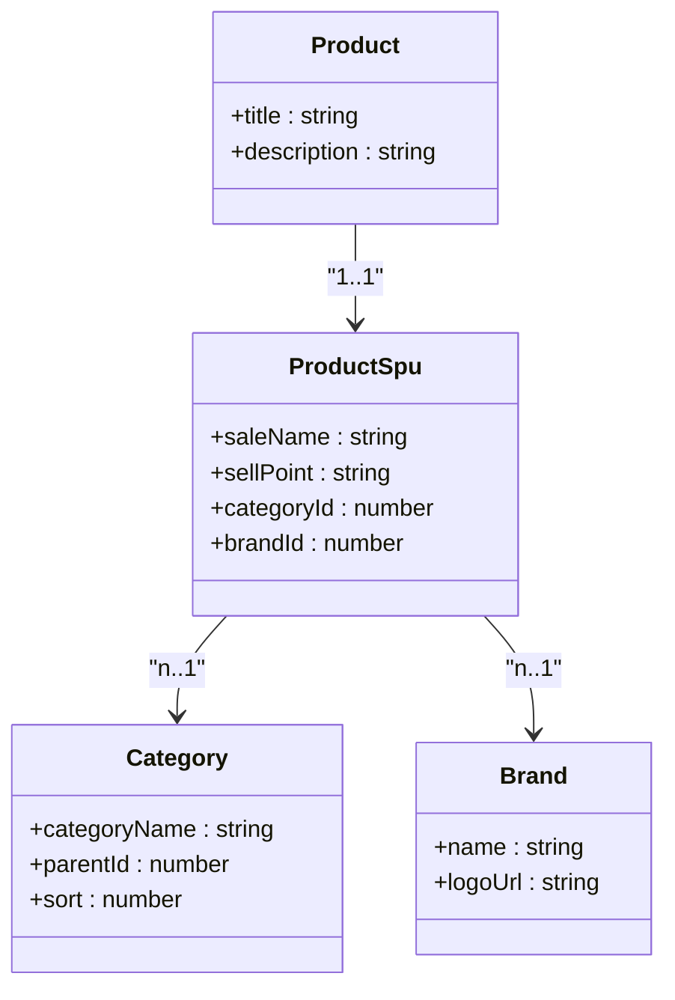
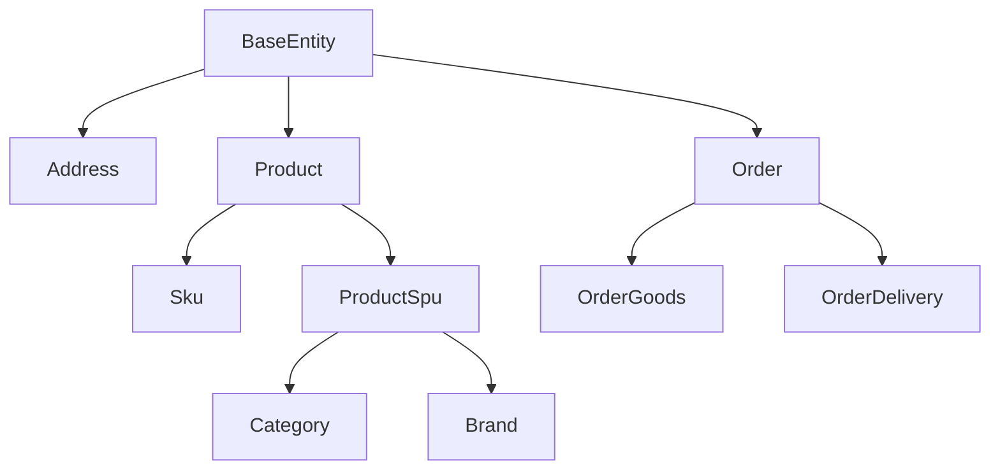

# 实体模型设计

<cite>
**本文档引用的文件**
- [base.entity.ts](file://apps/server-api/src/common/entities/base.entity.ts)
- [address.entity.ts](file://apps/server-api/src/modules/address/entities/address.entity.ts)
- [product.entity.ts](file://apps/server-api/src/modules/product/entities/product.entity.ts)
- [order.entity.ts](file://apps/server-api/src/modules/order/entities/order.entity.ts)
- [sku.entity.ts](file://apps/server-api/src/modules/product/entities/sku.entity.ts)
- [product-spu.entity.ts](file://apps/server-api/src/modules/product/entities/product-spu.entity.ts)
- [category.entity.ts](file://apps/server-api/src/modules/product/entities/category.entity.ts)
- [brand.entity.ts](file://apps/server-api/src/modules/product/entities/brand.entity.ts)
- [good.entity.ts](file://apps/server-api/src/modules/product/entities/good.entity.ts)
- [order-goods.entity.ts](file://apps/server-api/src/modules/order/entities/order-goods.entity.ts)
- [order-delivery.entity.ts](file://apps/server-api/src/modules/order/entities/order-delivery.entity.ts)
</cite>

## 目录
1. [引言](#引言)
2. [项目结构](#项目结构)
3. [核心组件](#核心组件)
4. [架构概述](#架构概述)
5. [详细组件分析](#详细组件分析)
6. [依赖分析](#依赖分析)
7. [性能考虑](#性能考虑)
8. [故障排除指南](#故障排除指南)
9. [结论](#结论)

## 引言
本文档深入解析TypeORM实体模型的设计规范与实现细节，以`address.entity.ts`、`product.entity.ts`和`order.entity.ts`为核心案例，详细说明实体装饰器、列定义、主外键配置及级联操作的实现策略。重点分析基础实体的抽象设计模式及其在子类中的继承复用机制，并结合复杂商品模型阐述嵌套实体结构的映射逻辑与性能影响。

## 项目结构
项目采用模块化架构，实体模型集中存放在`apps/server-api/src/modules`目录下，按业务领域划分。每个模块包含独立的实体、DTO和服务层。公共基础实体定义在`common/entities/base.entity.ts`中，被所有业务实体继承复用。



**图示来源**
- [base.entity.ts](file://apps/server-api/src/common/entities/base.entity.ts)
- [address.entity.ts](file://apps/server-api/src/modules/address/entities/address.entity.ts)
- [product.entity.ts](file://apps/server-api/src/modules/product/entities/product.entity.ts)
- [order.entity.ts](file://apps/server-api/src/modules/order/entities/order.entity.ts)

**本节来源**
- [base.entity.ts](file://apps/server-api/src/common/entities/base.entity.ts)
- [apps/server-api/src/modules](file://apps/server-api/src/modules)

## 核心组件
核心实体组件包括地址、商品、订单三大业务模型，均继承自`BaseEntity`抽象类。通过`@Entity`装饰器声明数据库表名，使用`@Column`定义字段属性，通过`@ManyToOne`、`@OneToMany`等关系装饰器建立实体间关联。

**本节来源**
- [base.entity.ts](file://apps/server-api/src/common/entities/base.entity.ts#L1-L16)
- [address.entity.ts](file://apps/server-api/src/modules/address/entities/address.entity.ts#L1-L80)
- [product.entity.ts](file://apps/server-api/src/modules/product/entities/product.entity.ts#L1-L30)

## 架构概述
系统采用分层架构，实体层位于数据访问层，负责数据库表结构的映射与持久化操作。基础实体提供通用字段，业务实体通过继承实现代码复用。实体间通过外键建立关系，支持级联操作。



**图示来源**
- [base.entity.ts](file://apps/server-api/src/common/entities/base.entity.ts#L3-L15)
- [address.entity.ts](file://apps/server-api/src/modules/address/entities/address.entity.ts#L8-L80)
- [product.entity.ts](file://apps/server-api/src/modules/product/entities/product.entity.ts#L6-L29)
- [order.entity.ts](file://apps/server-api/src/modules/order/entities/order.entity.ts#L6-L180)
- [sku.entity.ts](file://apps/server-api/src/modules/product/entities/sku.entity.ts#L11-L32)

## 详细组件分析
对核心实体模型进行深入分析，包括字段定义、关系配置、约束设置等实现细节。

### 基础实体分析
`BaseEntity`作为所有实体的抽象基类，定义了通用的数据库字段，实现代码复用和标准化。



**图示来源**
- [base.entity.ts](file://apps/server-api/src/common/entities/base.entity.ts#L3-L15)

**本节来源**
- [base.entity.ts](file://apps/server-api/src/common/entities/base.entity.ts#L1-L16)

### 地址实体分析
`Address`实体表示用户收货地址信息，与`User`实体建立多对一关系，包含详细的地理位置和联系人信息。



**图示来源**
- [address.entity.ts](file://apps/server-api/src/modules/address/entities/address.entity.ts#L8-L80)

**本节来源**
- [address.entity.ts](file://apps/server-api/src/modules/address/entities/address.entity.ts#L1-L80)

### 商品实体分析
`Product`实体表示商品基本信息，与`Sku`实体建立一对多关系，支持级联保存操作。

```mermaid
classDiagram
class Product {
+@Column title : string
+@Column description : string
+@Column mainImage : string
+@Column images : string[]
+@Column status : number
+@OneToMany sku : Sku[]
}
class Sku {
+@Column price : number
+@Column stock : number
+@Column attributes : Record~string, string~
+@ManyToOne product : Product
}
Product --> Sku : "cascade : true"
```

**图示来源**
- [product.entity.ts](file://apps/server-api/src/modules/product/entities/product.entity.ts#L6-L29)
- [sku.entity.ts](file://apps/server-api/src/modules/product/entities/sku.entity.ts#L11-L32)

**本节来源**
- [product.entity.ts](file://apps/server-api/src/modules/product/entities/product.entity.ts#L1-L30)
- [sku.entity.ts](file://apps/server-api/src/modules/product/entities/sku.entity.ts#L1-L32)

### 订单实体分析
`Order`实体表示订单主信息，通过复合索引优化查询性能，包含丰富的订单状态和支付信息。



**图示来源**
- [order.entity.ts](file://apps/server-api/src/modules/order/entities/order.entity.ts#L4-L180)
- [order-goods.entity.ts](file://apps/server-api/src/modules/order/entities/order-goods.entity.ts#L4-L85)

**本节来源**
- [order.entity.ts](file://apps/server-api/src/modules/order/entities/order.entity.ts#L1-L180)
- [order-goods.entity.ts](file://apps/server-api/src/modules/order/entities/order-goods.entity.ts#L1-L85)

### 复杂关联关系分析
商品领域包含SPU、SKU、分类、品牌等复杂关联关系，形成完整的商品信息体系。



**图示来源**
- [product.entity.ts](file://apps/server-api/src/modules/product/entities/product.entity.ts#L6-L29)
- [product-spu.entity.ts](file://apps/server-api/src/modules/product/entities/product-spu.entity.ts#L5-L116)
- [category.entity.ts](file://apps/server-api/src/modules/product/entities/category.entity.ts#L5-L29)
- [brand.entity.ts](file://apps/server-api/src/modules/product/entities/brand.entity.ts#L5-L11)

**本节来源**
- [product-spu.entity.ts](file://apps/server-api/src/modules/product/entities/product-spu.entity.ts#L1-L116)
- [category.entity.ts](file://apps/server-api/src/modules/product/entities/category.entity.ts#L1-L29)
- [brand.entity.ts](file://apps/server-api/src/modules/product/entities/brand.entity.ts#L1-L11)

## 依赖分析
实体模型间存在明确的依赖关系，基础实体被所有业务实体依赖，形成统一的数据标准。



**图示来源**
- [base.entity.ts](file://apps/server-api/src/common/entities/base.entity.ts)
- [address.entity.ts](file://apps/server-api/src/modules/address/entities/address.entity.ts)
- [product.entity.ts](file://apps/server-api/src/modules/product/entities/product.entity.ts)
- [order.entity.ts](file://apps/server-api/src/modules/order/entities/order.entity.ts)

**本节来源**
- [base.entity.ts](file://apps/server-api/src/common/entities/base.entity.ts#L1-L16)
- [go.mod](file://apps/server-api/package.json)

## 性能考虑
实体设计中考虑了性能优化因素，包括索引创建、字段类型选择、关系加载策略等。建议对频繁查询的字段创建索引，合理使用懒加载避免N+1查询问题。

## 故障排除指南
常见实体模型问题包括关系配置错误、级联操作异常、字段映射失败等。应检查装饰器配置是否正确，确保外键字段类型匹配，验证数据库迁移脚本的完整性。

**本节来源**
- [errors.go](file://apps/server-api/src/common/exceptions/business.exception.ts)
- [debug.go](file://apps/server-api/src/common/interceptors/logging.interceptor.ts)

## 结论
TypeORM实体模型设计遵循标准化、模块化原则，通过基础实体抽象实现代码复用，利用装饰器系统实现数据库映射。复杂业务场景下，合理设计实体关系和级联策略对系统性能和可维护性至关重要。建议遵循统一的设计规范，建立完善的索引策略，确保数据一致性和查询效率。