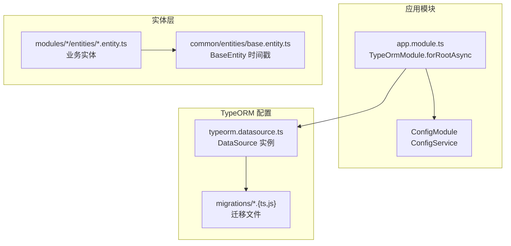
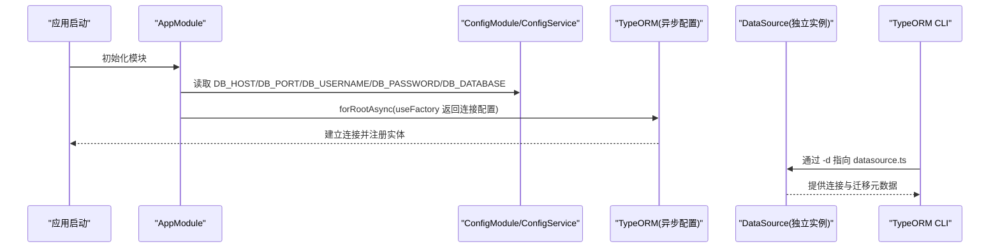
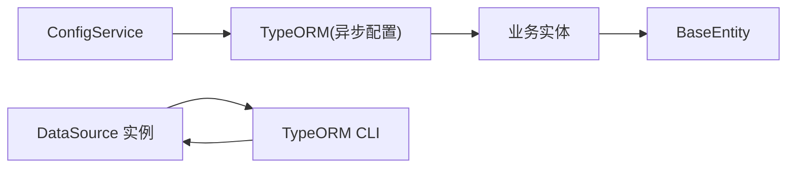

# 数据库配置

<cite>
**本文引用的文件**
- [apps/server-api/src/config/typeorm.datasource.ts](file://apps/server-api/src/config/typeorm.datasource.ts)
- [apps/server-api/src/app.module.ts](file://apps/server-api/src/app.module.ts)
- [apps/server-api/package.json](file://apps/server-api/package.json)
- [apps/server-api/src/common/entities/base.entity.ts](file://apps/server-api/src/common/entities/base.entity.ts)
- [apps/server-api/src/modules/user/entities/user.entity.ts](file://apps/server-api/src/modules/user/entities/user.entity.ts)
- [apps/server-api/src/migrations/1764829236196-$npm_config_name.ts](file://apps/server-api/src/migrations/1764829236196-$npm_config_name.ts)
</cite>

## 目录
1. [简介](#简介)
2. [项目结构](#项目结构)
3. [核心组件](#核心组件)
4. [架构总览](#架构总览)
5. [详细组件分析](#详细组件分析)
6. [依赖关系分析](#依赖关系分析)
7. [性能考虑](#性能考虑)
8. [故障排查指南](#故障排查指南)
9. [结论](#结论)

## 简介
本文件围绕 TypeORM 在本仓库中的数据库连接与运行时配置策略进行系统化解析，重点覆盖：
- DataSource 配置对象的关键参数：MySQL 连接信息（host、port、username、password、database）、实体扫描路径（entities）的 glob 模式、迁移文件管理（migrations）与迁移历史表（migrationsTableName）。
- 生产环境安全策略：对比 synchronize: false 的安全性考量与最佳实践。
- 异步配置：结合 app.module.ts 中 TypeOrmModule.forRootAsync 的异步配置方式，解释如何通过 ConfigService 注入环境变量实现多环境（开发、测试、生产）适配。
- 高级选项：连接池配置、日志级别（logging）设置、时区处理及 SSL 连接等建议配置方法。
- 故障排查：数据库连接问题的定位与处理思路。

## 项目结构
TypeORM 相关配置主要分布在以下位置：
- 应用启动模块：通过 TypeOrmModule.forRootAsync 注入 ConfigService，从环境变量读取数据库连接参数。
- 独立 DataSource：提供显式 DataSource 实例，用于命令行迁移工具与独立脚本场景。
- 实体与基类：统一的 BaseEntity 定义时间戳列，体现数据库时间字段的约定。
- 迁移文件：位于 migrations 目录，配合 DataSource 使用。

图表来源
- [apps/server-api/src/app.module.ts](file://apps/server-api/src/app.module.ts#L83-L99)
- [apps/server-api/src/config/typeorm.datasource.ts](file://apps/server-api/src/config/typeorm.datasource.ts#L1-L24)
- [apps/server-api/src/common/entities/base.entity.ts](file://apps/server-api/src/common/entities/base.entity.ts#L1-L16)
- [apps/server-api/src/migrations/1764829236196-$npm_config_name.ts](file://apps/server-api/src/migrations/1764829236196-$npm_config_name.ts#L1-L6)

章节来源
- [apps/server-api/src/app.module.ts](file://apps/server-api/src/app.module.ts#L83-L99)
- [apps/server-api/src/config/typeorm.datasource.ts](file://apps/server-api/src/config/typeorm.datasource.ts#L1-L24)

## 核心组件
- DataSource 配置对象
  - 类型与连接参数：type、host、port、username、password、database。
  - 安全策略：synchronize: false。
  - 日志：logging: true。
  - 实体扫描：entities 使用 glob 模式匹配所有模块下的 entities。
  - 迁移：migrations 指向 migrations 目录；migrationsTableName 设为 migrations_history。
- 异步配置模块
  - TypeOrmModule.forRootAsync 通过 ConfigService 获取 DB_* 环境变量。
  - autoLoadEntities: true，简化实体注册。
  - synchronize: false，确保生产环境不自动变更表结构。

章节来源
- [apps/server-api/src/config/typeorm.datasource.ts](file://apps/server-api/src/config/typeorm.datasource.ts#L1-L24)
- [apps/server-api/src/app.module.ts](file://apps/server-api/src/app.module.ts#L83-L99)

## 架构总览
TypeORM 在本项目中的两种使用方式：
- 应用启动时通过 ConfigService 注入连接参数，自动加载实体，synchronize 关闭，适合 NestJS 应用生命周期管理。
- 独立 DataSource 用于迁移工具链，通过命令行脚本调用 TypeORM CLI，实现迁移生成、执行与回滚。

图表来源
- [apps/server-api/src/app.module.ts](file://apps/server-api/src/app.module.ts#L83-L99)
- [apps/server-api/src/config/typeorm.datasource.ts](file://apps/server-api/src/config/typeorm.datasource.ts#L1-L24)
- [apps/server-api/package.json](file://apps/server-api/package.json#L21-L26)

## 详细组件分析

### DataSource 配置对象详解
- 连接参数
  - type: mysql
  - host/port/username/password/database: 从环境变量读取
- 安全策略
  - synchronize: false，禁止自动同步实体到数据库表结构，避免生产环境误改。
- 日志
  - logging: true，便于开发调试期观察 SQL 与性能瓶颈。
- 实体扫描
  - entities: 使用 glob 模式扫描 modules 下所有 entities 目录，自动发现实体。
- 迁移
  - migrations: 指向 migrations 目录，统一管理版本化变更。
  - migrationsTableName: migrations_history，记录迁移执行历史。

章节来源
- [apps/server-api/src/config/typeorm.datasource.ts](file://apps/server-api/src/config/typeorm.datasource.ts#L1-L24)

### 异步配置与多环境适配
- ConfigModule.forRoot({ isGlobal: true }) 全局启用配置模块。
- TypeOrmModule.forRootAsync 通过 useFactory 注入 ConfigService，从环境变量读取 DB_* 参数。
- autoLoadEntities: true，无需手动逐一注册实体，提升开发效率。
- synchronize: false，生产环境禁用自动同步，确保结构稳定。

章节来源
- [apps/server-api/src/app.module.ts](file://apps/server-api/src/app.module.ts#L78-L99)

### 实体与基类设计
- BaseEntity 统一提供 createdAt、updatedAt、deletedAt 字段，便于审计与维护。
- 业务实体继承 BaseEntity，遵循统一的时间戳约定。

章节来源
- [apps/server-api/src/common/entities/base.entity.ts](file://apps/server-api/src/common/entities/base.entity.ts#L1-L16)
- [apps/server-api/src/modules/user/entities/user.entity.ts](file://apps/server-api/src/modules/user/entities/user.entity.ts#L1-L112)

### 迁移文件与历史表
- 迁移文件命名采用时间戳前缀，便于排序与版本控制。
- DataSource 中 migrationsTableName 指定迁移历史表名为 migrations_history，TypeORM 会在数据库中创建该表记录已执行的迁移。

章节来源
- [apps/server-api/src/migrations/1764829236196-$npm_config_name.ts](file://apps/server-api/src/migrations/1764829236196-$npm_config_name.ts#L1-L6)
- [apps/server-api/src/config/typeorm.datasource.ts](file://apps/server-api/src/config/typeorm.datasource.ts#L1-L24)

### 命令行迁移工具链
- package.json 中提供脚本：
  - migration:generate、migration:create、migration:run、migration:revert
- 通过 -d 指向 DataSource 文件，实现迁移的生成、执行与回滚。

章节来源
- [apps/server-api/package.json](file://apps/server-api/package.json#L21-L26)
- [apps/server-api/src/config/typeorm.datasource.ts](file://apps/server-api/src/config/typeorm.datasource.ts#L1-L24)

## 依赖关系分析
- 应用模块依赖 ConfigModule/ConfigService 提供环境变量。
- TypeOrmModule 依赖 DataSource（独立实例）或 ConfigService 的 useFactory 返回值。
- 实体依赖 BaseEntity，形成统一的时间戳与主键约定。
- 迁移工具链依赖 TypeORM CLI 与 DataSource。

图表来源
- [apps/server-api/src/app.module.ts](file://apps/server-api/src/app.module.ts#L83-L99)
- [apps/server-api/src/config/typeorm.datasource.ts](file://apps/server-api/src/config/typeorm.datasource.ts#L1-L24)
- [apps/server-api/src/common/entities/base.entity.ts](file://apps/server-api/src/common/entities/base.entity.ts#L1-L16)

章节来源
- [apps/server-api/src/app.module.ts](file://apps/server-api/src/app.module.ts#L83-L99)
- [apps/server-api/src/config/typeorm.datasource.ts](file://apps/server-api/src/config/typeorm.datasource.ts#L1-L24)

## 性能考虑
- 连接池配置
  - 建议在生产环境通过 useFactory 返回连接池相关配置项（如 maxConnections、minConnections、acquireTimeout、idleTimeout 等），以满足高并发与资源占用平衡。
- 日志级别
  - logging: true 适用于开发调试；生产环境建议关闭或降级为较低级别，避免大量 SQL 输出影响性能。
- 时区处理
  - 建议在连接字符串或数据库驱动层设置时区（例如通过连接参数 timezone 或系统时区），确保应用与数据库时间一致。
- SSL 连接
  - 如需启用 SSL，可在 useFactory 中添加 ssl 相关配置（如 rejectUnauthorized、ca、cert、key 等），并确保数据库端已正确配置证书。
- 实体扫描与迁移
  - entities 使用 glob 模式扫描，建议在生产构建中尽量减少扫描范围，或改为精确路径，降低启动时的文件系统开销。

[本节为通用指导，不直接分析具体文件]

## 故障排查指南
- 连接失败
  - 检查环境变量是否正确加载（DB_HOST/DB_PORT/DB_USERNAME/DB_PASSWORD/DB_DATABASE）。
  - 确认数据库服务可达且账号密码正确。
  - 若使用独立 DataSource，确认 CLI 命令 -d 指向正确的 datasource.ts 路径。
- 实体未被加载
  - 确认 useFactory 中 autoLoadEntities: true 已启用。
  - 确认 entities glob 模式匹配到目标实体文件。
- 迁移执行异常
  - 检查 migrationsTableName 是否与数据库中历史表一致。
  - 使用 migration:run/migration:revert 验证迁移脚本是否可重复执行。
- 日志过多导致性能问题
  - 生产环境建议关闭 logging 或降低日志级别。
- 时区不一致
  - 在连接参数中显式指定时区，或调整系统时区，确保应用与数据库时间一致。
- SSL 连接失败
  - 校验证书链、域名与 CA 有效性；确保数据库端已启用 SSL 并允许客户端连接。

章节来源
- [apps/server-api/src/app.module.ts](file://apps/server-api/src/app.module.ts#L83-L99)
- [apps/server-api/src/config/typeorm.datasource.ts](file://apps/server-api/src/config/typeorm.datasource.ts#L1-L24)
- [apps/server-api/package.json](file://apps/server-api/package.json#L21-L26)

## 结论
本项目在数据库连接与运行时配置方面采取了“显式 DataSource + 异步配置”的双轨策略：
- 通过 ConfigService 注入环境变量，实现多环境适配与安全的生产配置（synchronize: false）。
- 通过 DataSource 为迁移工具链提供统一入口，保证结构演进的可控与可追溯。
- 实体层采用 BaseEntity 统一时间戳约定，提升一致性与可观测性。
- 建议在生产环境中进一步完善连接池、日志级别与时区/SSL 等高级配置，以获得更稳健的运行表现。