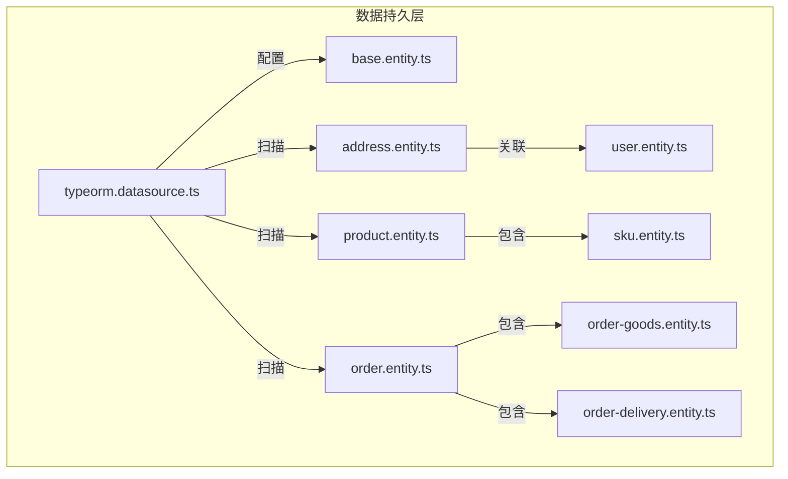
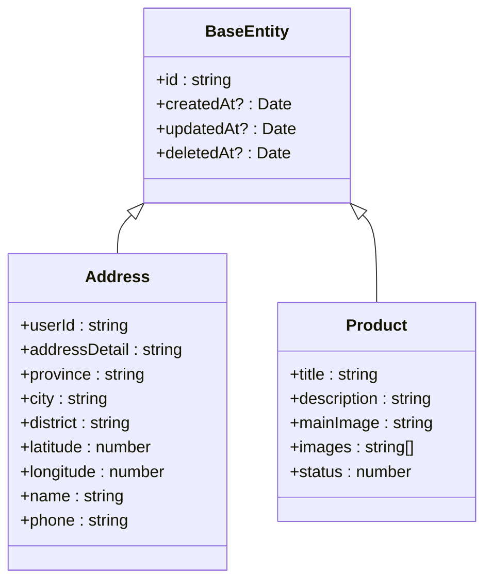
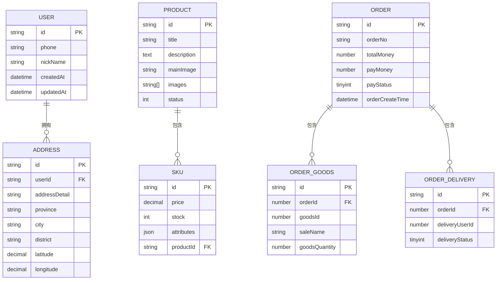

# 数据持久层

<cite>
**本文档中引用的文件**  
- [typeorm.datasource.ts](file://apps/server-api/src/config/typeorm.datasource.ts)
- [base.entity.ts](file://apps/server-api/src/common/entities/base.entity.ts)
- [address.entity.ts](file://apps/server-api/src/modules/address/entities/address.entity.ts)
- [product.entity.ts](file://apps/server-api/src/modules/product/entities/product.entity.ts)
- [sku.entity.ts](file://apps/server-api/src/modules/product/entities/sku.entity.ts)
- [order.entity.ts](file://apps/server-api/src/modules/order/entities/order.entity.ts)
- [order-goods.entity.ts](file://apps/server-api/src/modules/order/entities/order-goods.entity.ts)
- [order-delivery.entity.ts](file://apps/server-api/src/modules/order/entities/order-delivery.entity.ts)
- [user.entity.ts](file://apps/server-api/src/modules/user/entities/user.entity.ts)
- [address.service.ts](file://apps/server-api/src/modules/address/address.service.ts)
- [product.service.ts](file://apps/server-api/src/modules/product/product.service.ts)
- [1764829236196-$npm_config_name.ts](file://apps/server-api/src/migrations/1764829236196-$npm_config_name.ts)
</cite>

## 目录
1. [项目结构](#项目结构)
2. [数据库连接与配置](#数据库连接与配置)
3. [基础实体抽象](#基础实体抽象)
4. [核心实体设计](#核心实体设计)
5. [实体关系映射](#实体关系映射)
6. [服务层数据访问](#服务层数据访问)
7. [迁移策略与版本控制](#迁移策略与版本控制)
8. [性能优化建议](#性能优化建议)

## 项目结构

本项目采用模块化架构，数据持久层主要位于 `apps/server-api/src/modules` 目录下，每个业务模块（如 address、product、order）都包含独立的实体、服务和控制器。实体类统一存放在各模块的 `entities` 子目录中，基础实体类定义在 `common/entities/base.entity.ts`。



**Diagram sources**
- [typeorm.datasource.ts](file://apps/server-api/src/config/typeorm.datasource.ts#L1-L24)
- [base.entity.ts](file://apps/server-api/src/common/entities/base.entity.ts#L1-L16)

**Section sources**
- [typeorm.datasource.ts](file://apps/server-api/src/config/typeorm.datasource.ts#L1-L24)
- [base.entity.ts](file://apps/server-api/src/common/entities/base.entity.ts#L1-L16)

## 数据库连接与配置

数据库连接通过 `typeorm.datasource.ts` 文件进行配置，采用环境变量注入方式实现配置分离。连接池配置支持 MySQL 数据库，关键配置包括：

- **连接信息**：主机、端口、用户名、密码、数据库名均从环境变量读取
- **实体扫描**：使用 glob 模式自动扫描所有模块下的实体文件
- **迁移管理**：迁移文件集中存放，启用迁移历史表记录版本
- **同步策略**：禁用自动同步（`synchronize: false`），强制使用迁移脚本管理 schema 变更

```typescript
entities: [join(__dirname, '../modules/**/entities/*.entity.{ts,js}')]
migrations: [join(__dirname, '../migrations/*.{ts,js}')]
migrationsTableName: 'migrations_history'
```

**Section sources**
- [typeorm.datasource.ts](file://apps/server-api/src/config/typeorm.datasource.ts#L8-L23)

## 基础实体抽象

`base.entity.ts` 定义了所有实体的基类 `BaseEntity`，通过抽象类实现字段复用：

- **主键**：使用 `@PrimaryGeneratedColumn('uuid')` 生成 UUID 主键
- **创建时间**：`@CreateDateColumn` 自动记录创建时间
- **更新时间**：`@UpdateDateColumn` 在更新时自动更新时间戳
- **软删除**：`@DeleteDateColumn` 支持逻辑删除功能

这些基础字段被所有业务实体继承，确保了数据一致性。



**Diagram sources**
- [base.entity.ts](file://apps/server-api/src/common/entities/base.entity.ts#L3-L15)
- [address.entity.ts](file://apps/server-api/src/modules/address/entities/address.entity.ts#L8-L80)
- [product.entity.ts](file://apps/server-api/src/modules/product/entities/product.entity.ts#L6-L29)

**Section sources**
- [base.entity.ts](file://apps/server-api/src/common/entities/base.entity.ts#L1-L16)

## 核心实体设计

### 地址实体（Address）

`address.entity.ts` 定义了用户地址信息，包含详细的地理位置数据和联系信息：

- 字段类型精确控制（decimal 精度、varchar 长度）
- 数据库字段名映射（`name: 'user_id'`）
- 可空字段明确声明（`nullable: true`）
- 默认值设置（`default: 0`）

### 商品实体（Product）

`product.entity.ts` 定义了商品基本信息：

- 使用 `@Column({ type: 'text' })` 存储长文本描述
- 使用 `@Column({ type: 'simple-array' })` 存储图片 URL 数组
- 状态字段使用数字枚举（0: 下架, 1: 上架）

### 订单实体（Order）

`order.entity.ts` 包含完整的订单信息：

- 多个索引优化查询性能（`@Index('idx_order_no', ['orderNo'])`）
- 丰富的订单状态和业务属性
- 时间字段精确到微秒（`precision: 6`）

**Section sources**
- [address.entity.ts](file://apps/server-api/src/modules/address/entities/address.entity.ts#L1-L80)
- [product.entity.ts](file://apps/server-api/src/modules/product/entities/product.entity.ts#L1-L30)
- [order.entity.ts](file://apps/server-api/src/modules/order/entities/order.entity.ts#L1-L180)

## 实体关系映射

### 多对一关系（@ManyToOne）

`Address` 实体与 `User` 实体建立多对一关系：

```typescript
@ManyToOne(() => User)
@JoinColumn({ name: 'user_id' })
user: User;
```

### 一对多关系（@OneToMany）

`Product` 实体与 `Sku` 实体建立一对多关系，并启用级联保存：

```typescript
@OneToMany(() => Sku, (sku) => sku.product, { cascade: true })
sku: Sku[];
```

### 复合索引

在订单商品表中定义了多个索引以优化查询：

```typescript
@Index('idx_goods_id', ['goodsId'])
@Index('idx_order_id', ['orderId'])
```



**Diagram sources**
- [address.entity.ts](file://apps/server-api/src/modules/address/entities/address.entity.ts#L77-L79)
- [product.entity.ts](file://apps/server-api/src/modules/product/entities/product.entity.ts#L26-L27)
- [sku.entity.ts](file://apps/server-api/src/modules/product/entities/sku.entity.ts#L28-L29)
- [order-goods.entity.ts](file://apps/server-api/src/modules/order/entities/order-goods.entity.ts#L5-L6)
- [order-delivery.entity.ts](file://apps/server-api/src/modules/order/entities/order-delivery.entity.ts#L5-L5)

**Section sources**
- [address.entity.ts](file://apps/server-api/src/modules/address/entities/address.entity.ts#L1-L80)
- [product.entity.ts](file://apps/server-api/src/modules/product/entities/product.entity.ts#L1-L30)
- [sku.entity.ts](file://apps/server-api/src/modules/product/entities/sku.entity.ts#L1-L32)
- [order.entity.ts](file://apps/server-api/src/modules/order/entities/order.entity.ts#L1-L180)
- [order-goods.entity.ts](file://apps/server-api/src/modules/order/entities/order-goods.entity.ts#L1-L85)
- [order-delivery.entity.ts](file://apps/server-api/src/modules/order/entities/order-delivery.entity.ts#L1-L43)

## 服务层数据访问

### Repository 模式

通过 `@InjectRepository` 装饰器注入实体仓库，实现数据访问：

```typescript
constructor(
  @InjectRepository(Address)
  private addressRepo: Repository<Address>,
)
```

### 查询构建器

在 `AddressService` 中展示了标准的查询模式：

- 使用 `find()` 方法配合 `where`、`order` 条件
- 支持分页、排序和复杂查询条件
- 通过 `relations` 选项加载关联实体

### 级联操作

在 `ProductService` 中，由于配置了 `cascade: true`，保存商品时会自动保存关联的 SKU：

```typescript
return await this.productRepository.find({
  relations: ['sku'],
});
```

**Section sources**
- [address.service.ts](file://apps/server-api/src/modules/address/address.service.ts#L35-L93)
- [product.service.ts](file://apps/server-api/src/modules/product/product.service.ts#L10-L35)

## 迁移策略与版本控制

### 迁移文件结构

迁移文件存放在 `src/migrations` 目录，命名包含时间戳：

- `1764829236196-$npm_config_name.ts`
- `1764899330600-$npm_config_name.ts`

### 迁移历史管理

通过配置 `migrationsTableName: 'migrations_history'`，TypeORM 会在数据库中创建专门的表来记录已执行的迁移版本，确保环境间的一致性。

### 开发流程

1. 修改实体类
2. 生成迁移脚本
3. 审查 SQL 语句
4. 执行迁移
5. 部署到生产环境

**Section sources**
- [typeorm.datasource.ts](file://apps/server-api/src/config/typeorm.datasource.ts#L20-L22)
- [1764829236196-$npm_config_name.ts](file://apps/server-api/src/migrations/1764829236196-$npm_config_name.ts)

## 性能优化建议

### 索引优化

- 为常用查询字段创建索引（如 `orderNo`）
- 考虑复合索引以优化多条件查询
- 定期分析查询执行计划

### 查询优化

- 避免 N+1 查询问题，合理使用 `relations` 选项
- 对大数据量查询实现分页
- 考虑使用原生 SQL 或 QueryBuilder 进行复杂查询

### 事务管理

- 在服务层方法上使用 `@Transaction()` 装饰器
- 确保数据一致性操作在同一个事务中完成
- 合理设置事务隔离级别

### 读写分离

- 考虑配置主从复制，将读操作分发到从库
- 使用 TypeORM 的连接池配置支持多数据库连接
- 在高并发场景下实现缓存层