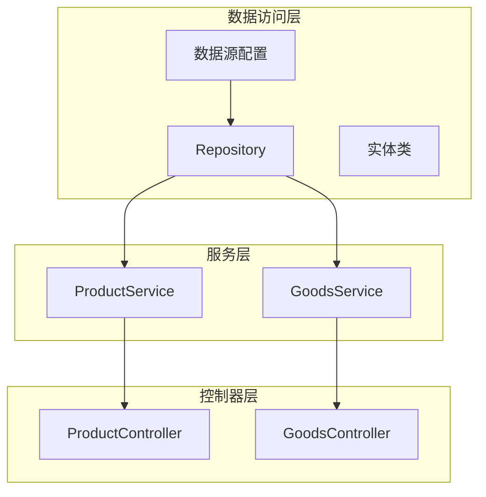
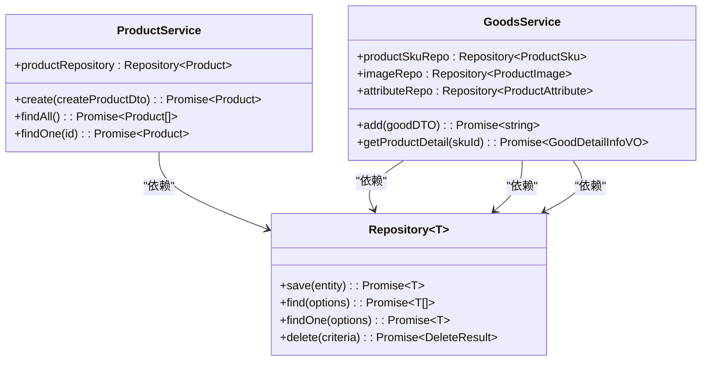
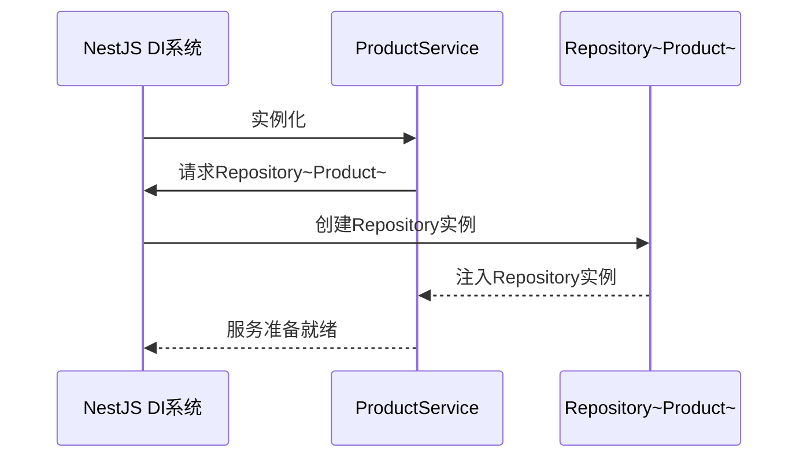
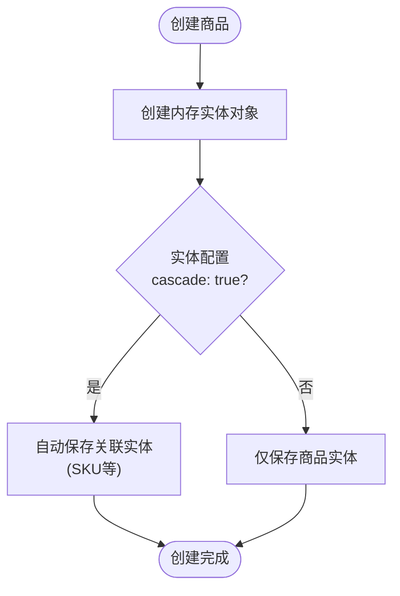
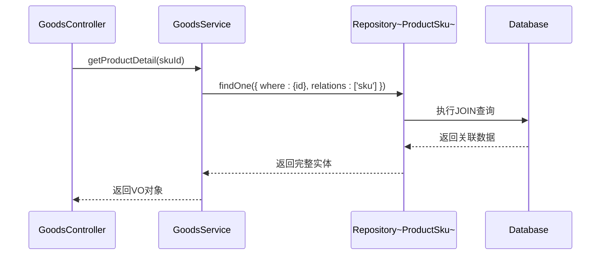
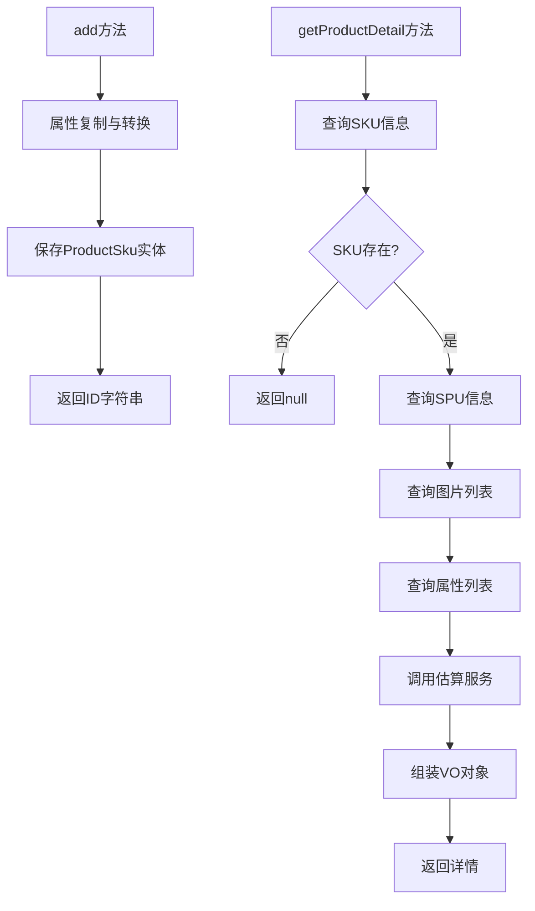
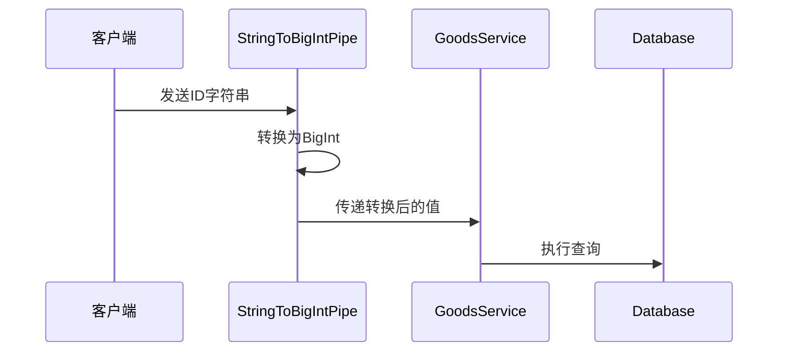
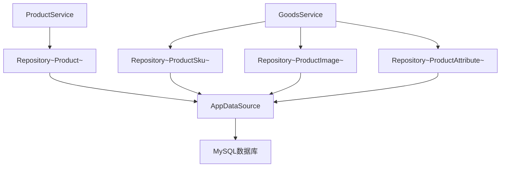

# 数据访问服务

<cite>
**本文档引用的文件**  
- [product.service.ts](file://apps/server-api/src/modules/product/product.service.ts)
- [goods.service.ts](file://apps/server-api/src/modules/goods/goods.service.ts)
- [product.entity.ts](file://apps/server-api/src/modules/product/entities/product.entity.ts)
- [good.entity.ts](file://apps/server-api/src/modules/product/entities/good.entity.ts)
- [product-sku.entity.ts](file://apps/server-api/src/modules/product/entities/product-sku.entity.ts)
- [product-image.entity.ts](file://apps/server-api/src/modules/product/entities/product-image.entity.ts)
- [product-attribute.entity.ts](file://apps/server-api/src/modules/product/entities/product-attribute.entity.ts)
- [typeorm.datasource.ts](file://apps/server-api/src/config/typeorm.datasource.ts)
- [goods.controller.ts](file://apps/server-api/src/modules/goods/goods.controller.ts)
- [goods.converter.ts](file://apps/server-api/src/modules/goods/goods.converter.ts)
- [estimate.service.ts](file://apps/server-api/src/modules/estimate/estimate.service.ts)
- [string-to-bigint.pipe.ts](file://apps/server-api/src/common/pipes/string-to-bigint.pipe.ts)
</cite>

## 目录
1. [引言](#引言)
2. [项目结构](#项目结构)
3. [核心组件](#核心组件)
4. [架构概述](#架构概述)
5. [详细组件分析](#详细组件分析)
6. [依赖分析](#依赖分析)
7. [性能考虑](#性能考虑)
8. [故障排除指南](#故障排除指南)
9. [结论](#结论)

## 引言
本文档系统阐述了基于Repository模式的数据访问服务层实现，重点分析`product.service.ts`和`goods.service.ts`两个服务模块。通过实例说明NestJS框架中`@Injectable`装饰器的应用、`@InjectRepository`依赖注入机制，以及TypeORM的`Repository<T>`泛型类在增删改查操作中的具体用法。深入解析了级联保存、关联查询、事务管理、类型转换等关键数据访问技术。

## 项目结构
本项目采用NestJS构建的单体应用架构，数据访问层遵循Repository模式，通过TypeORM实现与MySQL数据库的交互。服务层位于`apps/server-api/src/modules`目录下，每个业务模块（如product、goods）包含独立的实体、DTO、VO和服务类。



**图示来源**  
- [product.service.ts](file://apps/server-api/src/modules/product/product.service.ts)
- [goods.service.ts](file://apps/server-api/src/modules/goods/goods.service.ts)
- [typeorm.datasource.ts](file://apps/server-api/src/config/typeorm.datasource.ts)

**本节来源**  
- [product.service.ts](file://apps/server-api/src/modules/product/product.service.ts)
- [goods.service.ts](file://apps/server-api/src/modules/goods/goods.service.ts)

## 核心组件
核心数据访问组件包括`ProductService`和`GoodsService`，它们通过TypeORM的Repository模式实现对商品数据的CRUD操作。服务类使用`@Injectable`装饰器标记为可注入的提供者，并通过构造函数注入相应的Repository实例。

**本节来源**  
- [product.service.ts](file://apps/server-api/src/modules/product/product.service.ts#L7-L37)
- [goods.service.ts](file://apps/server-api/src/modules/goods/goods.service.ts#L18-L294)

## 架构概述
系统采用分层架构，数据访问服务层位于业务逻辑与数据库之间，通过Repository模式封装数据访问细节。TypeORM作为ORM框架，提供了`Repository<T>`泛型类来操作对应实体的数据。



**图示来源**  
- [product.service.ts](file://apps/server-api/src/modules/product/product.service.ts)
- [goods.service.ts](file://apps/server-api/src/modules/goods/goods.service.ts)

## 详细组件分析

### ProductService分析
`ProductService`展示了Repository模式在商品管理中的典型应用，包括级联保存和关联查询。

#### @Injectable与依赖注入
`@Injectable()`装饰器标记`ProductService`为NestJS的提供者，使其可以被依赖注入系统管理。通过构造函数注入`Repository<Product>`实例：



**图示来源**  
- [product.service.ts](file://apps/server-api/src/modules/product/product.service.ts#L7-L12)

#### Repository<T>泛型类应用
`Repository<Product>`提供了类型安全的数据访问方法，包括`save()`、`find()`、`findOne()`等标准CRUD操作。

**本节来源**  
- [product.service.ts](file://apps/server-api/src/modules/product/product.service.ts#L10-L11)

### GoodsService分析
`GoodsService`展示了复杂业务场景下的数据访问实践，包括多表关联、数据组装和类型转换。

#### 级联保存行为分析
在`product.service.ts`中，`save()`方法结合实体配置的`cascade: true`实现了商品与SKU的一体化创建：



**图示来源**  
- [product.service.ts](file://apps/server-api/src/modules/product/product.service.ts#L14-L21)

#### 关联查询实现原理
`find()`和`findOne()`方法通过`relations`选项实现关联查询，有效避免N+1查询问题：



**图示来源**  
- [product.service.ts](file://apps/server-api/src/modules/product/product.service.ts#L26-L28)
- [goods.service.ts](file://apps/server-api/src/modules/goods/goods.service.ts#L71-L73)

#### 复杂业务逻辑实现
`goods.service.ts`中的`add()`和`getProductDetail()`方法展示了复杂业务逻辑下的数据处理：



**图示来源**  
- [goods.service.ts](file://apps/server-api/src/modules/goods/goods.service.ts#L36-L55)
- [goods.service.ts](file://apps/server-api/src/modules/goods/goods.service.ts#L61-L194)

#### 类型转换实践
系统通过`StringToBigIntPipe`管道处理BigInt与String的转换：



**图示来源**  
- [string-to-bigint.pipe.ts](file://apps/server-api/src/common/pipes/string-to-bigint.pipe.ts)
- [goods.controller.ts](file://apps/server-api/src/modules/goods/goods.controller.ts#L67)

#### 事务管理实践
虽然当前代码未显式展示事务管理，但可通过`DataSource.transaction()`方法实现：

```typescript
// 伪代码示例
async createWithTransaction(data) {
  return await this.dataSource.transaction(async manager => {
    const product = manager.create(Product, data.product);
    const savedProduct = await manager.save(product);
    
    const sku = manager.create(ProductSku, {...data.sku, productId: savedProduct.id});
    await manager.save(sku);
    
    return savedProduct;
  });
}
```

**本节来源**  
- [goods.service.ts](file://apps/server-api/src/modules/goods/goods.service.ts)
- [goods.converter.ts](file://apps/server-api/src/modules/goods/goods.converter.ts)
- [estimate.service.ts](file://apps/server-api/src/modules/estimate/estimate.service.ts)

## 依赖分析
系统依赖关系清晰，服务层依赖于TypeORM的Repository，而Repository又依赖于数据源配置。



**图示来源**  
- [product.service.ts](file://apps/server-api/src/modules/product/product.service.ts)
- [goods.service.ts](file://apps/server-api/src/modules/goods/goods.service.ts)
- [typeorm.datasource.ts](file://apps/server-api/src/config/typeorm.datasource.ts)

**本节来源**  
- [typeorm.datasource.ts](file://apps/server-api/src/config/typeorm.datasource.ts#L8-L23)

## 性能考虑
在数据访问层实现中，应注意以下性能优化点：
- 使用`relations`选项进行关联查询，避免N+1问题
- 合理使用缓存装饰器`@Cacheable`减少数据库访问
- 为常用查询字段创建数据库索引
- 在复杂查询场景下考虑使用QueryBuilder进行性能优化

## 故障排除指南
常见数据访问问题及解决方案：
- **级联保存失败**：检查实体关系配置中的`cascade`选项
- **关联查询数据缺失**：确保`relations`选项正确配置
- **类型转换错误**：验证管道和转换逻辑的正确性
- **性能瓶颈**：分析查询执行计划，考虑添加索引或优化查询

**本节来源**  
- [product.service.ts](file://apps/server-api/src/modules/product/product.service.ts)
- [goods.service.ts](file://apps/server-api/src/modules/goods/goods.service.ts)

## 结论
本文档详细阐述了基于Repository模式的数据访问服务层实现。通过`product.service.ts`和`goods.service.ts`的实例分析，展示了`@Injectable`装饰器的应用、`@InjectRepository`依赖注入机制，以及`Repository<T>`泛型类在增删改查操作中的具体用法。系统通过合理的架构设计和最佳实践，实现了高效、可靠的数据访问服务。