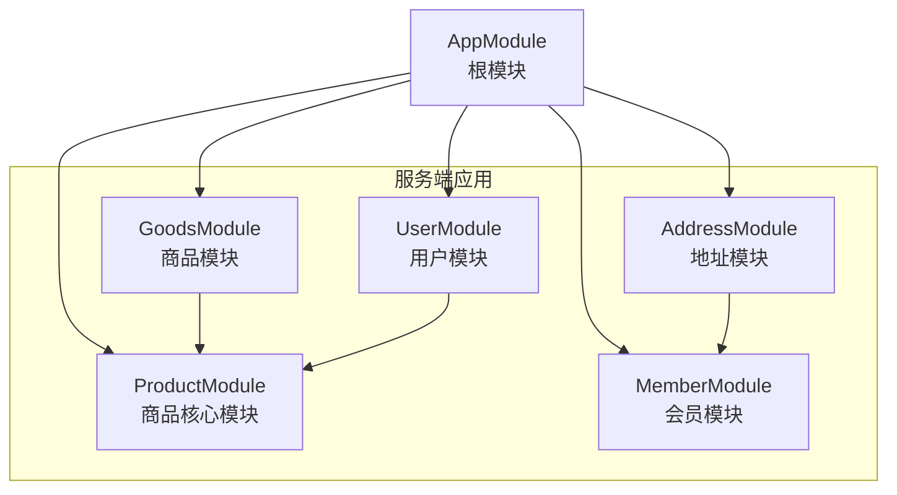
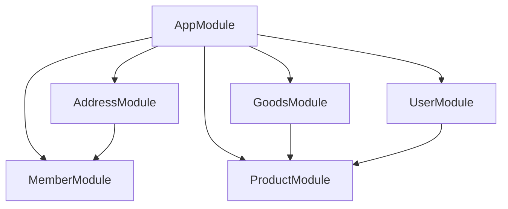
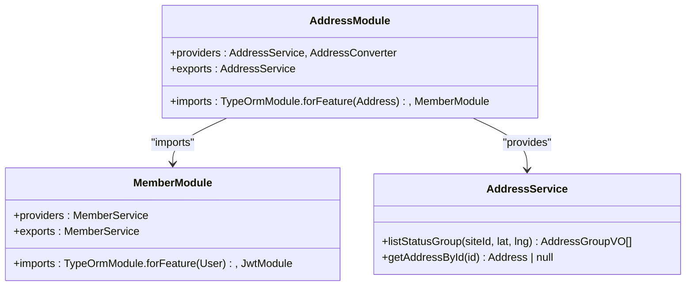
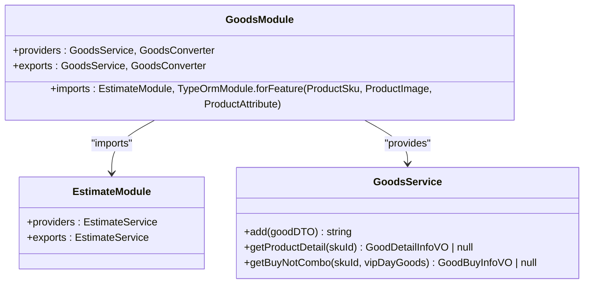
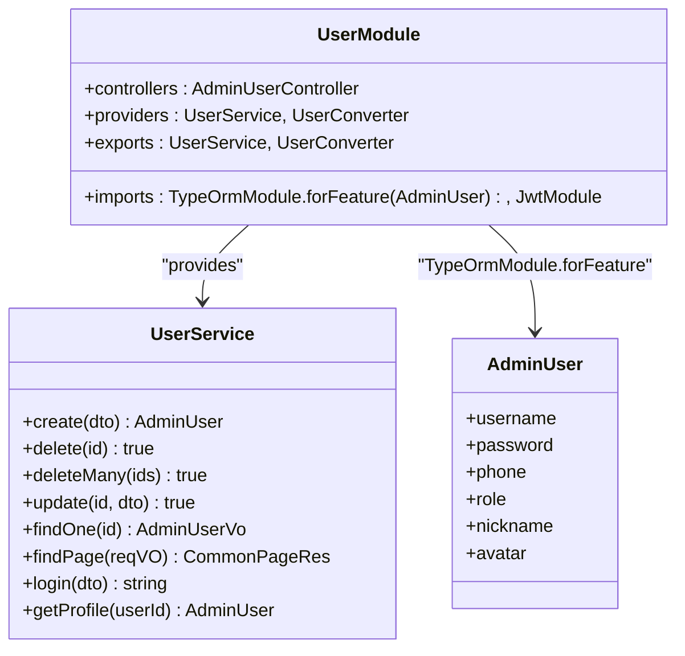
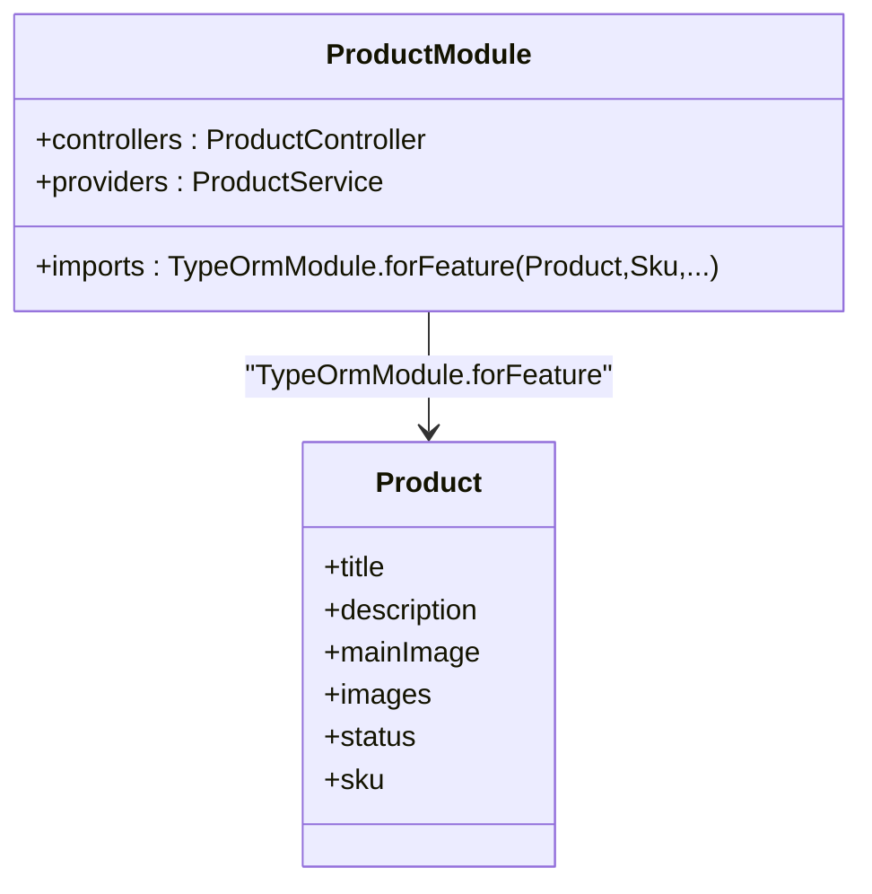
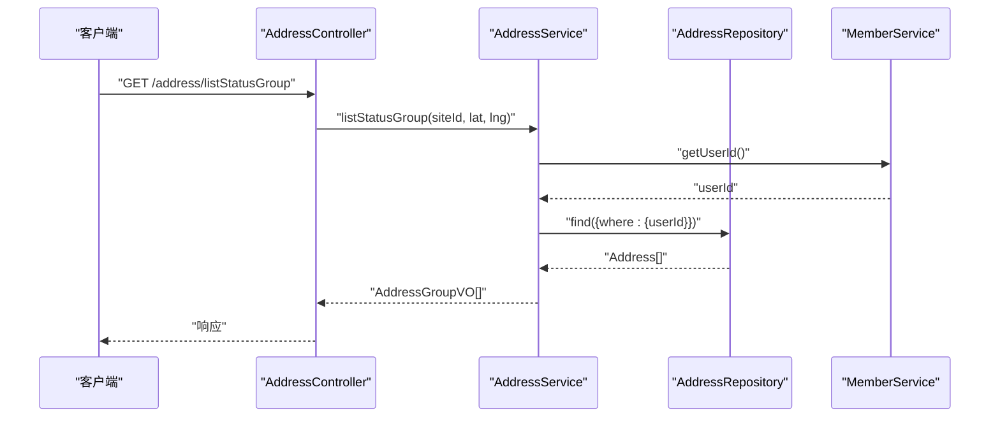
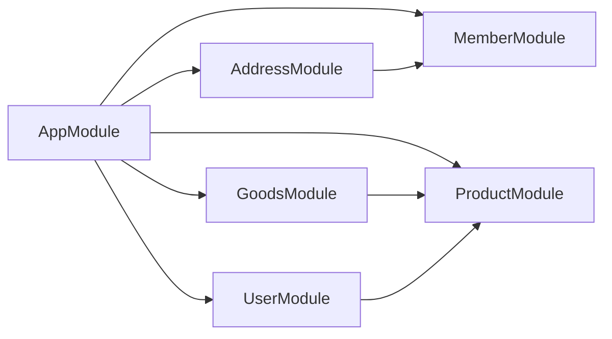

# 核心模块概览

<cite>
**本文引用的文件**
- [apps/server-api/src/app.module.ts](file://apps/server-api/src/app.module.ts)
- [apps/server-api/src/modules/address/address.module.ts](file://apps/server-api/src/modules/address/address.module.ts)
- [apps/server-api/src/modules/address/address.service.ts](file://apps/server-api/src/modules/address/address.service.ts)
- [apps/server-api/src/modules/address/address.controller.ts](file://apps/server-api/src/modules/address/address.controller.ts)
- [apps/server-api/src/modules/address/entities/address.entity.ts](file://apps/server-api/src/modules/address/entities/address.entity.ts)
- [apps/server-api/src/modules/goods/goods.module.ts](file://apps/server-api/src/modules/goods/goods.module.ts)
- [apps/server-api/src/modules/goods/goods.service.ts](file://apps/server-api/src/modules/goods/goods.service.ts)
- [apps/server-api/src/modules/goods/goods.controller.ts](file://apps/server-api/src/modules/goods/goods.controller.ts)
- [apps/server-api/src/modules/user/user.module.ts](file://apps/server-api/src/modules/user/user.module.ts)
- [apps/server-api/src/modules/user/user.service.ts](file://apps/server-api/src/modules/user/user.service.ts)
- [apps/server-api/src/modules/user/entities/admin-user.entity.ts](file://apps/server-api/src/modules/user/entities/admin-user.entity.ts)
- [apps/server-api/src/modules/product/product.module.ts](file://apps/server-api/src/modules/product/product.module.ts)
- [apps/server-api/src/modules/product/entities/product.entity.ts](file://apps/server-api/src/modules/product/entities/product.entity.ts)
- [apps/server-api/src/modules/member/member.module.ts](file://apps/server-api/src/modules/member/member.module.ts)
</cite>

## 目录
1. [引言](#引言)
2. [项目结构](#项目结构)
3. [核心组件](#核心组件)
4. [架构总览](#架构总览)
5. [详细组件分析](#详细组件分析)
6. [依赖分析](#依赖分析)
7. [性能考虑](#性能考虑)
8. [故障排查指南](#故障排查指南)
9. [结论](#结论)

## 引言
本文件围绕 NestJS 根模块 app.module.ts 如何通过 imports 机制集成业务模块展开，重点覆盖 AddressModule（用户地址管理）、GoodsModule（商品信息展示）、UserModule（后台用户权限）、ProductModule（商品核心数据）四大模块。我们将结合代码路径说明各模块在 AppModule 中的注册方式、职责边界、TypeOrmModule.forFeature 在各模块中注册实体的方式，以及模块间通过 exports 和 imports 实现服务共享的机制（例如 MemberModule 被 AddressModule 引用的场景）。最后提供模块依赖图谱，帮助开发者快速理解系统整体架构。

## 项目结构
- 服务端采用多包工作区（monorepo），根模块位于 apps/server-api/src/app.module.ts。
- 各业务模块均以 feature 模块形式组织，包含 controller、service、converter、dto、vo、entities 等子目录。
- 根模块集中导入所有业务模块，同时配置全局拦截器、守卫、缓存、日志、限流、数据库连接等基础设施。

图表来源
- [apps/server-api/src/app.module.ts](file://apps/server-api/src/app.module.ts#L109-L138)
- [apps/server-api/src/modules/address/address.module.ts](file://apps/server-api/src/modules/address/address.module.ts#L1-L17)
- [apps/server-api/src/modules/goods/goods.module.ts](file://apps/server-api/src/modules/goods/goods.module.ts#L1-L18)
- [apps/server-api/src/modules/user/user.module.ts](file://apps/server-api/src/modules/user/user.module.ts#L1-L22)
- [apps/server-api/src/modules/product/product.module.ts](file://apps/server-api/src/modules/product/product.module.ts#L1-L48)
- [apps/server-api/src/modules/member/member.module.ts](file://apps/server-api/src/modules/member/member.module.ts#L1-L15)

章节来源
- [apps/server-api/src/app.module.ts](file://apps/server-api/src/app.module.ts#L1-L162)

## 核心组件
- 根模块 AppModule：集中导入所有业务模块，配置全局拦截器、守卫、缓存、日志、限流、数据库连接等。
- AddressModule：负责地址 CRUD、分组统计、与会员服务交互；通过 TypeOrmModule.forFeature 注册 Address 实体，并导出 AddressService。
- GoodsModule：负责商品详情、购买信息、规格列表等聚合查询；依赖 EstimateModule 并注册 ProductSku、ProductImage、ProductAttribute 等实体。
- UserModule：负责后台管理员用户增删改查、登录鉴权；注册 AdminUser 实体并通过 JwtModule 提供令牌能力；导出 UserService。
- ProductModule：注册商品核心实体集合（Product、Sku、Category、Brand 等），为 GoodsModule 等模块提供底层数据支撑。
- MemberModule：注册 User 实体并提供会员相关服务，AddressModule 通过 imports 引用该模块以获取用户上下文。

章节来源
- [apps/server-api/src/app.module.ts](file://apps/server-api/src/app.module.ts#L109-L138)
- [apps/server-api/src/modules/address/address.module.ts](file://apps/server-api/src/modules/address/address.module.ts#L1-L17)
- [apps/server-api/src/modules/goods/goods.module.ts](file://apps/server-api/src/modules/goods/goods.module.ts#L1-L18)
- [apps/server-api/src/modules/user/user.module.ts](file://apps/server-api/src/modules/user/user.module.ts#L1-L22)
- [apps/server-api/src/modules/product/product.module.ts](file://apps/server-api/src/modules/product/product.module.ts#L1-L48)
- [apps/server-api/src/modules/member/member.module.ts](file://apps/server-api/src/modules/member/member.module.ts#L1-L15)

## 架构总览
下图展示了根模块与四大业务模块之间的导入关系，以及 AddressModule 对 MemberModule 的依赖。

图表来源
- [apps/server-api/src/app.module.ts](file://apps/server-api/src/app.module.ts#L109-L138)
- [apps/server-api/src/modules/address/address.module.ts](file://apps/server-api/src/modules/address/address.module.ts#L1-L17)
- [apps/server-api/src/modules/goods/goods.module.ts](file://apps/server-api/src/modules/goods/goods.module.ts#L1-L18)
- [apps/server-api/src/modules/user/user.module.ts](file://apps/server-api/src/modules/user/user.module.ts#L1-L22)
- [apps/server-api/src/modules/product/product.module.ts](file://apps/server-api/src/modules/product/product.module.ts#L1-L48)
- [apps/server-api/src/modules/member/member.module.ts](file://apps/server-api/src/modules/member/member.module.ts#L1-L15)

## 详细组件分析

### AddressModule：用户地址管理
- 注册方式：在 imports 中通过 TypeOrmModule.forFeature 注册 Address 实体；同时 imports MemberModule 以获取会员上下文；导出 AddressService 供其他模块使用。
- 职责边界：
  - 地址列表按状态分组、地址详情查询、与会员服务协作获取当前用户标识。
- 依赖关系：
  - 依赖 MemberModule（通过 imports 引入 MemberModule）。
  - 依赖 Address 实体（TypeOrmModule.forFeature）。
  - 依赖 AddressService（导出）。
- 控制器职责：提供地址分组接口，调用 AddressService 完成业务处理。

图表来源
- [apps/server-api/src/modules/address/address.module.ts](file://apps/server-api/src/modules/address/address.module.ts#L1-L17)
- [apps/server-api/src/modules/address/address.service.ts](file://apps/server-api/src/modules/address/address.service.ts#L1-L146)
- [apps/server-api/src/modules/member/member.module.ts](file://apps/server-api/src/modules/member/member.module.ts#L1-L15)

章节来源
- [apps/server-api/src/modules/address/address.module.ts](file://apps/server-api/src/modules/address/address.module.ts#L1-L17)
- [apps/server-api/src/modules/address/address.service.ts](file://apps/server-api/src/modules/address/address.service.ts#L1-L146)
- [apps/server-api/src/modules/address/address.controller.ts](file://apps/server-api/src/modules/address/address.controller.ts#L1-L41)
- [apps/server-api/src/modules/address/entities/address.entity.ts](file://apps/server-api/src/modules/address/entities/address.entity.ts#L1-L80)

### GoodsModule：商品信息展示
- 注册方式：imports 中引入 EstimateModule，并通过 TypeOrmModule.forFeature 注册 ProductSku、ProductImage、ProductAttribute 等实体；导出 GoodsService 和 GoodsConverter。
- 职责边界：
  - 商品新增、详情聚合、购买信息、规格列表等。
  - 通过 EstimateService 获取预估价格等运营数据。
- 依赖关系：
  - 依赖 ProductModule（间接通过实体 ProductSku、ProductImage、ProductAttribute 的使用体现）。
  - 依赖 EstimateModule（通过 imports 引入）。
  - 依赖 GoodsService（导出）。
- 控制器职责：提供商品新增、详情、购买信息等接口，调用 GoodsService 完成业务处理。

图表来源
- [apps/server-api/src/modules/goods/goods.module.ts](file://apps/server-api/src/modules/goods/goods.module.ts#L1-L18)
- [apps/server-api/src/modules/goods/goods.service.ts](file://apps/server-api/src/modules/goods/goods.service.ts#L1-L294)
- [apps/server-api/src/modules/estimate/estimate.module.ts](file://apps/server-api/src/modules/estimate/estimate.module.ts#L1-L10)

章节来源
- [apps/server-api/src/modules/goods/goods.module.ts](file://apps/server-api/src/modules/goods/goods.module.ts#L1-L18)
- [apps/server-api/src/modules/goods/goods.service.ts](file://apps/server-api/src/modules/goods/goods.service.ts#L1-L294)
- [apps/server-api/src/modules/goods/goods.controller.ts](file://apps/server-api/src/modules/goods/goods.controller.ts#L1-L120)

### UserModule：后台用户权限
- 注册方式：通过 TypeOrmModule.forFeature 注册 AdminUser 实体；imports JwtModule；导出 UserService 和 UserConverter。
- 职责边界：
  - 后台管理员用户增删改查、登录鉴权、分页查询、当前登录用户信息查询。
- 依赖关系：
  - 依赖 JwtModule（通过 imports 引入）。
  - 依赖 AdminUser 实体（TypeOrmModule.forFeature）。
  - 依赖 UserService（导出）。
- 控制器职责：提供后台用户管理接口，调用 UserService 完成业务处理。

图表来源
- [apps/server-api/src/modules/user/user.module.ts](file://apps/server-api/src/modules/user/user.module.ts#L1-L22)
- [apps/server-api/src/modules/user/user.service.ts](file://apps/server-api/src/modules/user/user.service.ts#L1-L144)
- [apps/server-api/src/modules/user/entities/admin-user.entity.ts](file://apps/server-api/src/modules/user/entities/admin-user.entity.ts#L1-L23)

章节来源
- [apps/server-api/src/modules/user/user.module.ts](file://apps/server-api/src/modules/user/user.module.ts#L1-L22)
- [apps/server-api/src/modules/user/user.service.ts](file://apps/server-api/src/modules/user/user.service.ts#L1-L144)
- [apps/server-api/src/modules/user/entities/admin-user.entity.ts](file://apps/server-api/src/modules/user/entities/admin-user.entity.ts#L1-L23)

### ProductModule：商品核心数据
- 注册方式：通过 TypeOrmModule.forFeature 注册大量商品核心实体（Product、Sku、Category、Brand、ProductSku、ProductImage、ProductAttribute 等）。
- 职责边界：
  - 商品核心数据的持久化与查询支持，为 GoodsModule 等模块提供底层数据能力。
- 依赖关系：
  - 无 imports，仅通过 forFeature 注册实体。
  - 为 GoodsModule 等模块提供实体依赖。

图表来源
- [apps/server-api/src/modules/product/product.module.ts](file://apps/server-api/src/modules/product/product.module.ts#L1-L48)
- [apps/server-api/src/modules/product/entities/product.entity.ts](file://apps/server-api/src/modules/product/entities/product.entity.ts#L1-L30)

章节来源
- [apps/server-api/src/modules/product/product.module.ts](file://apps/server-api/src/modules/product/product.module.ts#L1-L48)
- [apps/server-api/src/modules/product/entities/product.entity.ts](file://apps/server-api/src/modules/product/entities/product.entity.ts#L1-L30)

### 模块导入顺序与依赖关系
- AppModule 中的 imports 顺序体现了模块装配的层次性：先基础设施（Cls、Winston、Cache、Config、TypeOrmModule.forRootAsync），再业务模块（AddressModule、GoodsModule、UserModule、ProductModule 等）。
- AddressModule 通过 imports MemberModule 获取会员上下文；GoodsModule 通过 imports EstimateModule 获取预估价等运营数据；UserModule 通过 imports JwtModule 提供鉴权能力。
- 以上依赖关系在各模块的 imports 中明确声明，形成清晰的模块边界与服务共享机制。

章节来源
- [apps/server-api/src/app.module.ts](file://apps/server-api/src/app.module.ts#L47-L138)
- [apps/server-api/src/modules/address/address.module.ts](file://apps/server-api/src/modules/address/address.module.ts#L1-L17)
- [apps/server-api/src/modules/goods/goods.module.ts](file://apps/server-api/src/modules/goods/goods.module.ts#L1-L18)
- [apps/server-api/src/modules/user/user.module.ts](file://apps/server-api/src/modules/user/user.module.ts#L1-L22)
- [apps/server-api/src/modules/member/member.module.ts](file://apps/server-api/src/modules/member/member.module.ts#L1-L15)

### TypeOrmModule.forFeature 在各模块中注册实体的方式
- AddressModule：在 imports 中使用 TypeOrmModule.forFeature 注册 Address 实体，使 AddressService 能通过 @InjectRepository(Address) 获取仓储实例。
- GoodsModule：在 imports 中使用 TypeOrmModule.forFeature 注册 ProductSku、ProductImage、ProductAttribute 等实体，使 GoodsService 能通过 @InjectRepository(...) 获取对应仓储实例。
- ProductModule：在 imports 中使用 TypeOrmModule.forFeature 注册大量商品核心实体，为上层模块提供实体依赖。
- UserModule：在 imports 中使用 TypeOrmModule.forFeature 注册 AdminUser 实体，使 UserService 能通过 @InjectRepository(AdminUser) 获取仓储实例。
- MemberModule：在 imports 中使用 TypeOrmModule.forFeature 注册 User 实体，使 MemberService 能通过 @InjectRepository(User) 获取仓储实例。

章节来源
- [apps/server-api/src/modules/address/address.module.ts](file://apps/server-api/src/modules/address/address.module.ts#L1-L17)
- [apps/server-api/src/modules/goods/goods.module.ts](file://apps/server-api/src/modules/goods/goods.module.ts#L1-L18)
- [apps/server-api/src/modules/product/product.module.ts](file://apps/server-api/src/modules/product/product.module.ts#L1-L48)
- [apps/server-api/src/modules/user/user.module.ts](file://apps/server-api/src/modules/user/user.module.ts#L1-L22)
- [apps/server-api/src/modules/member/member.module.ts](file://apps/server-api/src/modules/member/member.module.ts#L1-L15)

### 模块间通过 exports 和 imports 实现服务共享
- AddressModule 导出 AddressService，供其他模块（如控制器或其他业务模块）使用。
- GoodsModule 导出 GoodsService 和 GoodsConverter，供 GoodsController 使用。
- UserModule 导出 UserService 和 UserConverter，供 AdminUserController 使用。
- MemberModule 导出 MemberService，供 AddressModule 使用（AddressModule imports MemberModule）。
- 通过 exports 暴露服务，通过 imports 引入模块，形成松耦合的服务共享机制。

章节来源
- [apps/server-api/src/modules/address/address.module.ts](file://apps/server-api/src/modules/address/address.module.ts#L1-L17)
- [apps/server-api/src/modules/goods/goods.module.ts](file://apps/server-api/src/modules/goods/goods.module.ts#L1-L18)
- [apps/server-api/src/modules/user/user.module.ts](file://apps/server-api/src/modules/user/user.module.ts#L1-L22)
- [apps/server-api/src/modules/member/member.module.ts](file://apps/server-api/src/modules/member/member.module.ts#L1-L15)

### AddressModule 调用 AddressService 的典型流程

图表来源
- [apps/server-api/src/modules/address/address.controller.ts](file://apps/server-api/src/modules/address/address.controller.ts#L1-L41)
- [apps/server-api/src/modules/address/address.service.ts](file://apps/server-api/src/modules/address/address.service.ts#L1-L146)
- [apps/server-api/src/modules/address/address.module.ts](file://apps/server-api/src/modules/address/address.module.ts#L1-L17)
- [apps/server-api/src/modules/member/member.module.ts](file://apps/server-api/src/modules/member/member.module.ts#L1-L15)

## 依赖分析
- 模块耦合与内聚：
  - AddressModule 与 MemberModule 之间存在直接依赖（imports），属于低耦合高内聚的边界模块设计。
  - GoodsModule 与 ProductModule 之间通过实体依赖产生间接耦合，符合“实体共享”的设计原则。
  - UserModule 与 JwtModule 之间存在直接依赖，用于鉴权能力扩展。
- 直接与间接依赖：
  - AppModule 直接依赖所有业务模块；各业务模块通过 imports 声明其直接依赖。
- 潜在循环依赖：
  - 当前模块导入关系未见循环依赖迹象，AddressModule 与 MemberModule 的双向使用通过服务注入而非循环 imports 实现。
- 外部依赖与集成点：
  - TypeOrmModule.forRootAsync 提供数据库连接配置；ConfigModule 提供环境变量读取；CacheModule 提供缓存能力；Winston 提供日志能力；Throttler 提供限流能力；ClsModule 提供链路追踪上下文。

图表来源
- [apps/server-api/src/app.module.ts](file://apps/server-api/src/app.module.ts#L109-L138)
- [apps/server-api/src/modules/address/address.module.ts](file://apps/server-api/src/modules/address/address.module.ts#L1-L17)
- [apps/server-api/src/modules/goods/goods.module.ts](file://apps/server-api/src/modules/goods/goods.module.ts#L1-L18)
- [apps/server-api/src/modules/user/user.module.ts](file://apps/server-api/src/modules/user/user.module.ts#L1-L22)
- [apps/server-api/src/modules/product/product.module.ts](file://apps/server-api/src/modules/product/product.module.ts#L1-L48)
- [apps/server-api/src/modules/member/member.module.ts](file://apps/server-api/src/modules/member/member.module.ts#L1-L15)

章节来源
- [apps/server-api/src/app.module.ts](file://apps/server-api/src/app.module.ts#L47-L138)

## 性能考虑
- 数据库连接与实体加载：
  - 根模块通过 TypeOrmModule.forRootAsync 配置数据库连接，autoLoadEntities 开启可减少实体注册成本，但需谨慎于生产环境同步策略。
- 仓储注入与查询优化：
  - 各模块通过 @InjectRepository 注入仓储，建议在高频查询中合理使用 relations、where 条件与索引，避免 N+1 查询。
- 缓存与拦截器：
  - 全局缓存拦截器与日志拦截器可提升可观测性与性能，建议结合业务场景设置合理的 TTL 与命中策略。
- 限流与守卫：
  - 全局限流与 JWT 守卫有助于保护接口，建议根据业务流量特征调整阈值与策略。

## 故障排查指南
- 实体未注册导致的仓储注入失败：
  - 确认目标模块 imports 中已使用 TypeOrmModule.forFeature 注册相应实体。
- 服务无法注入：
  - 确认模块 exports 了所需服务，并在使用方 imports 该模块。
- 数据库连接异常：
  - 检查根模块 TypeOrmModule.forRootAsync 的配置项与环境变量是否正确。
- 依赖循环问题：
  - 避免在 imports 中形成循环依赖，必要时通过服务注入替代模块导入。

## 结论
AppModule 通过 imports 机制将 AddressModule、GoodsModule、UserModule、ProductModule 等业务模块有机整合，配合 TypeOrmModule.forFeature 在各模块中注册实体，实现了清晰的模块边界与服务共享。AddressModule 对 MemberModule 的依赖体现了模块间协作的最佳实践；GoodsModule 与 ProductModule 的实体共享为商品信息展示提供了稳定的数据基础；UserModule 与 JwtModule 的组合满足后台用户权限管理需求。整体架构具备良好的可维护性与扩展性，适合在大型电商系统中持续演进。