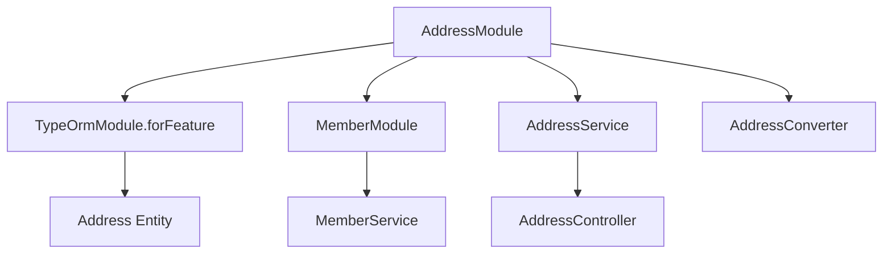
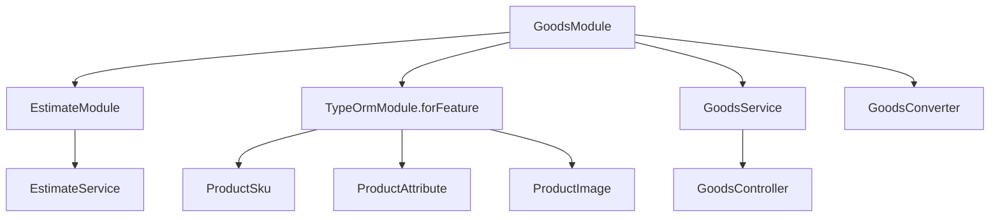
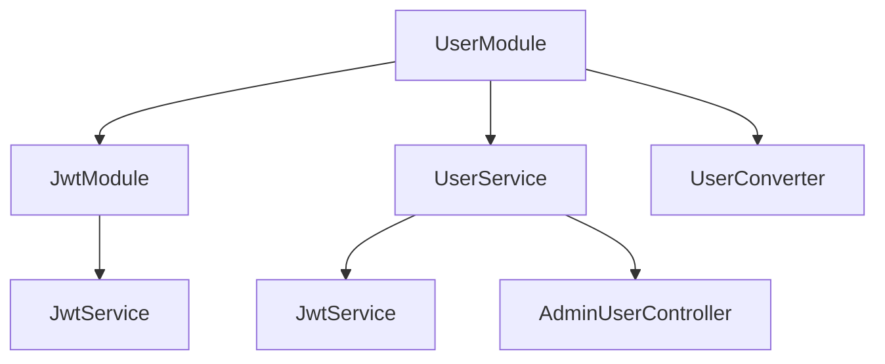
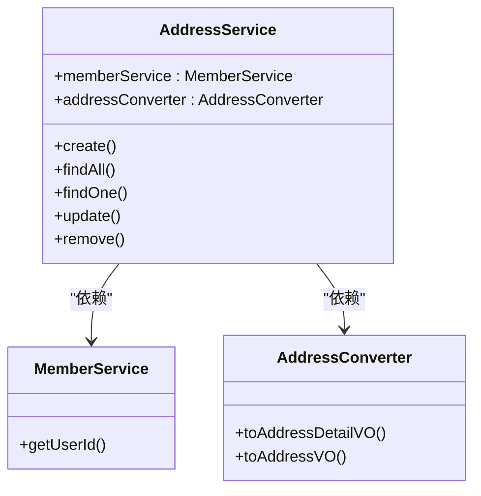
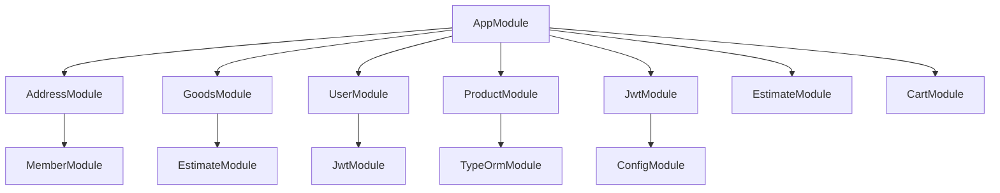
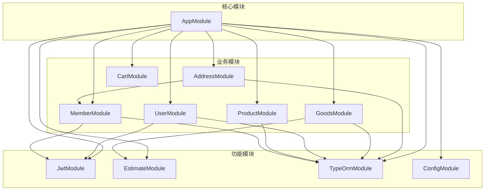

# 模块依赖管理

<cite>
**本文档引用的文件**
- [address.module.ts](file://apps/server-api/src/modules/address/address.module.ts)
- [goods.module.ts](file://apps/server-api/src/modules/goods/goods.module.ts)
- [user.module.ts](file://apps/server-api/src/modules/user/user.module.ts)
- [member.module.ts](file://apps/server-api/src/modules/member/member.module.ts)
- [estimate.module.ts](file://apps/server-api/src/modules/estimate/estimate.module.ts)
- [product.module.ts](file://apps/server-api/src/modules/product/product.module.ts)
- [jwt.module.ts](file://apps/server-api/src/modules/jwt/jwt.module.ts)
- [address.service.ts](file://apps/server-api/src/modules/address/address.service.ts)
- [goods.service.ts](file://apps/server-api/src/modules/goods/goods.service.ts)
- [user.service.ts](file://apps/server-api/src/modules/user/user.service.ts)
- [address.converter.ts](file://apps/server-api/src/modules/address/address.converter.ts)
- [goods.converter.ts](file://apps/server-api/src/modules/goods/goods.converter.ts)
- [user.converter.ts](file://apps/server-api/src/modules/user/user.converter.ts)
- [app.module.ts](file://apps/server-api/src/app.module.ts)
- [cart.module.ts](file://apps/server-api/src/modules/cart/cart.module.ts)
</cite>

## 目录
1. [模块配置规范概述](#模块配置规范概述)
2. [AddressModule依赖分析](#addressmodule依赖分析)
3. [GoodsModule依赖分析](#goodsmodule依赖分析)
4. [UserModule认证集成](#usermodule认证集成)
5. [服务与转换器注入机制](#服务与转换器注入机制)
6. [模块导出与共享](#模块导出与共享)
7. [循环依赖避免策略](#循环依赖避免策略)
8. [依赖管理最佳实践](#依赖管理最佳实践)
9. [模块依赖关系图](#模块依赖关系图)

## 模块配置规范概述

在NestJS架构中，各业务模块通过@Module装饰器定义其配置规范，主要包括imports、providers、controllers和exports四个核心配置项。imports用于引入其他模块或功能模块，providers用于注册服务和转换器，controllers定义HTTP路由控制器，exports用于暴露模块内的服务供其他模块使用。这种模块化设计实现了高内聚低耦合的架构原则，确保了代码的可维护性和可测试性。

**Section sources**
- [app.module.ts](file://apps/server-api/src/app.module.ts#L47-L161)

## AddressModule依赖分析

AddressModule通过imports配置项引入了TypeOrmModule.forFeature([Address])和MemberModule，实现了数据访问和跨模块服务调用。TypeOrmModule.forFeature([Address])提供了Address实体的数据访问能力，而MemberModule的引入则允许AddressService访问会员相关服务。该模块的providers配置中注册了AddressService和AddressConverter，分别处理业务逻辑和数据转换。通过exports配置项，AddressService被暴露给其他模块使用，实现了服务共享。

**Diagram sources**
- [address.module.ts](file://apps/server-api/src/modules/address/address.module.ts#L10-L15)
- [address.service.ts](file://apps/server-api/src/modules/address/address.service.ts#L32-L145)

**Section sources**
- [address.module.ts](file://apps/server-api/src/modules/address/address.module.ts#L1-L16)
- [address.service.ts](file://apps/server-api/src/modules/address/address.service.ts#L1-L146)

## GoodsModule依赖分析

GoodsModule展示了复杂的模块依赖关系，通过imports配置项依赖EstimateModule和多个Product相关实体。该模块引入了ProductSku、ProductAttribute和ProductImage等实体，通过TypeOrmModule.forFeature进行注册，实现了商品数据的持久化操作。同时，GoodsModule依赖EstimateModule获取商品预估价格信息，体现了模块间的协作关系。在providers配置中，GoodsService和GoodsConverter被注册为可注入的服务，分别处理商品业务逻辑和数据转换。

**Diagram sources**
- [goods.module.ts](file://apps/server-api/src/modules/goods/goods.module.ts#L11-L15)
- [goods.service.ts](file://apps/server-api/src/modules/goods/goods.service.ts#L19-L293)

**Section sources**
- [goods.module.ts](file://apps/server-api/src/modules/goods/goods.module.ts#L1-L18)
- [goods.service.ts](file://apps/server-api/src/modules/goods/goods.service.ts#L1-L294)

## UserModule认证集成

UserModule通过集成JwtModule实现了完整的认证功能。该模块在imports配置中引入JwtModule，获得了JWT令牌生成和验证能力。UserModule的providers配置中注册了UserService和UserConverter，其中UserService通过依赖注入方式使用JwtService进行令牌操作。在exports配置中，UserService和UserConverter被暴露，允许其他模块进行用户认证相关操作。这种设计实现了认证功能的集中管理和复用。

**Diagram sources**
- [user.module.ts](file://apps/server-api/src/modules/user/user.module.ts#L13-L20)
- [user.service.ts](file://apps/server-api/src/modules/user/user.service.ts#L17-L143)

**Section sources**
- [user.module.ts](file://apps/server-api/src/modules/user/user.module.ts#L1-L22)
- [user.service.ts](file://apps/server-api/src/modules/user/user.service.ts#L1-L144)

## 服务与转换器注入机制

在NestJS中，服务与转换器通过依赖注入机制进行管理。所有服务和转换器都使用@Injectable()装饰器标记，使其成为可注入的提供者。在模块的providers配置中声明这些服务后，它们可以在其他服务中通过构造函数注入使用。例如，AddressService通过构造函数注入了MemberService和AddressConverter，实现了服务间的协作。转换器通常用于实体与视图对象之间的数据转换，保持了业务逻辑层的纯净性。

**Diagram sources**
- [address.service.ts](file://apps/server-api/src/modules/address/address.service.ts#L32-L39)
- [address.converter.ts](file://apps/server-api/src/modules/address/address.converter.ts#L6-L16)

**Section sources**
- [address.service.ts](file://apps/server-api/src/modules/address/address.service.ts#L1-L146)
- [goods.service.ts](file://apps/server-api/src/modules/goods/goods.service.ts#L1-L294)
- [user.service.ts](file://apps/server-api/src/modules/user/user.service.ts#L1-L144)
- [address.converter.ts](file://apps/server-api/src/modules/address/address.converter.ts#L1-L17)
- [goods.converter.ts](file://apps/server-api/src/modules/goods/goods.converter.ts#L1-L26)
- [user.converter.ts](file://apps/server-api/src/modules/user/user.converter.ts#L1-L22)

## 模块导出与共享

模块通过exports配置项暴露其内部服务，实现服务共享。例如，AddressModule将AddressService添加到exports数组中，使得其他模块在导入AddressModule后可以使用AddressService。这种机制实现了服务的封装和复用，避免了服务的重复定义。exports不仅可以导出服务，还可以导出其他模块，形成模块的组合。这种设计模式支持了功能的模块化和组件化，提高了代码的可维护性。

**Section sources**
- [address.module.ts](file://apps/server-api/src/modules/address/address.module.ts#L14)
- [goods.module.ts](file://apps/server-api/src/modules/goods/goods.module.ts#L15)
- [user.module.ts](file://apps/server-api/src/modules/user/user.module.ts#L19)
- [member.module.ts](file://apps/server-api/src/modules/member/member.module.ts#L12)
- [estimate.module.ts](file://apps/server-api/src/modules/estimate/estimate.module.ts#L8)

## 循环依赖避免策略

为避免模块间的循环依赖，系统采用了多种策略。首先，通过合理的模块划分和依赖管理，尽量减少模块间的双向依赖。其次，在必要时使用forwardRef()函数解决循环依赖问题。此外，通过将共享服务提取到独立的模块中，如JwtModule，减少了核心业务模块间的直接依赖。这种设计确保了模块依赖关系的清晰性和单向性，提高了系统的稳定性和可维护性。

**Section sources**
- [app.module.ts](file://apps/server-api/src/app.module.ts#L47-L161)
- [address.module.ts](file://apps/server-api/src/modules/address/address.module.ts#L11)
- [user.module.ts](file://apps/server-api/src/modules/user/user.module.ts#L14)

## 依赖管理最佳实践

模块依赖管理遵循以下最佳实践：依赖注入顺序遵循从基础服务到业务服务的原则；服务共享范围通过模块的exports配置进行精确控制；模块粒度划分遵循单一职责原则，每个模块专注于特定业务领域。通过app.module.ts作为应用的根模块，集中管理所有功能模块的导入，确保了依赖关系的全局可见性和可控性。这种架构设计支持了系统的可扩展性和可维护性。

**Diagram sources**
- [app.module.ts](file://apps/server-api/src/app.module.ts#L47-L138)
- [cart.module.ts](file://apps/server-api/src/modules/cart/cart.module.ts#L8-L13)

**Section sources**
- [app.module.ts](file://apps/server-api/src/app.module.ts#L1-L162)
- [product.module.ts](file://apps/server-api/src/modules/product/product.module.ts#L1-L48)
- [jwt.module.ts](file://apps/server-api/src/modules/jwt/jwt.module.ts#L1-L16)

## 模块依赖关系图

**Diagram sources**
- [app.module.ts](file://apps/server-api/src/app.module.ts#L47-L138)
- [address.module.ts](file://apps/server-api/src/modules/address/address.module.ts#L10-L15)
- [goods.module.ts](file://apps/server-api/src/modules/goods/goods.module.ts#L11-L15)
- [user.module.ts](file://apps/server-api/src/modules/user/user.module.ts#L13-L20)
- [product.module.ts](file://apps/server-api/src/modules/product/product.module.ts#L24-L43)
- [cart.module.ts](file://apps/server-api/src/modules/cart/cart.module.ts#L9-L13)