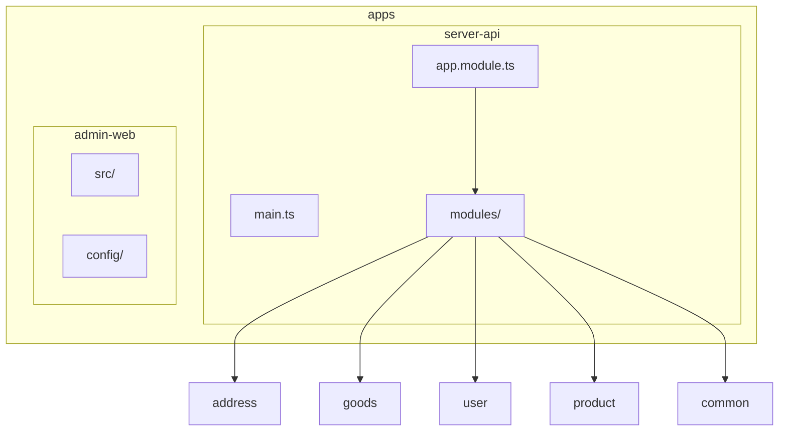
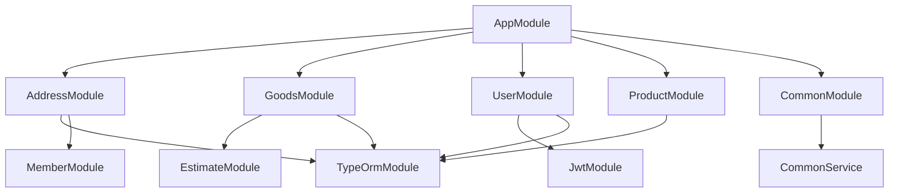
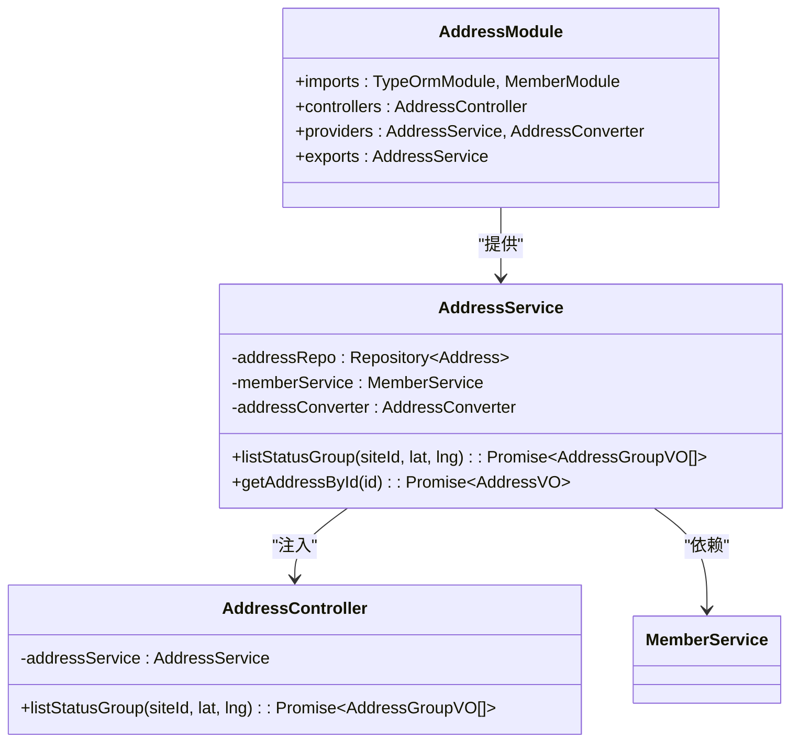
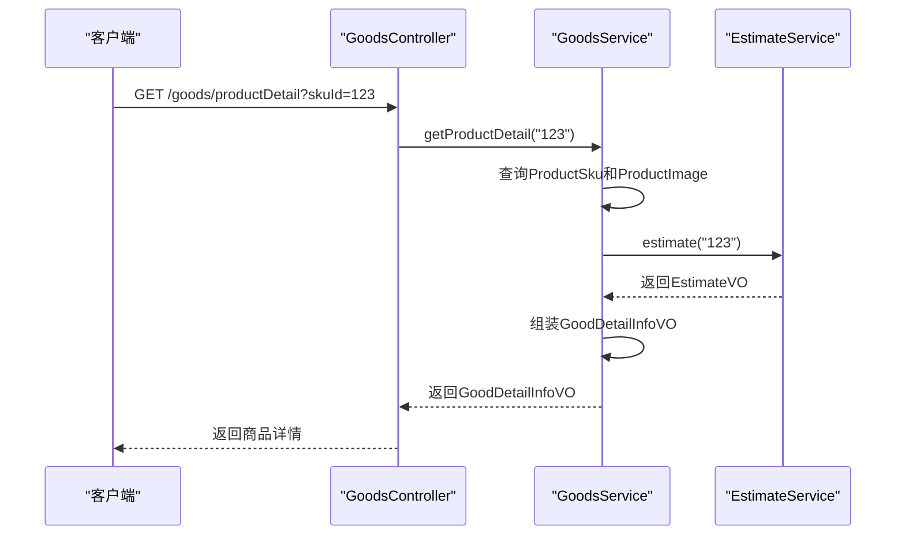
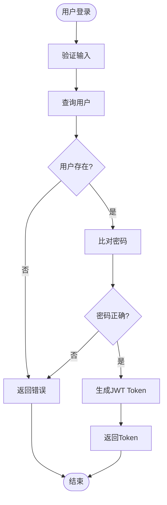
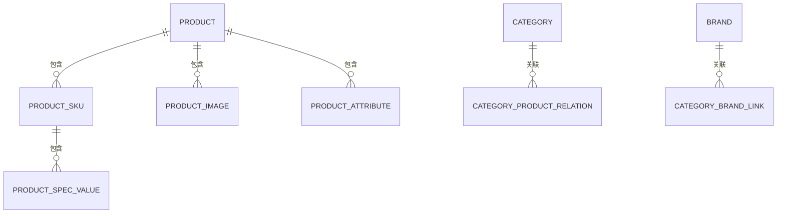
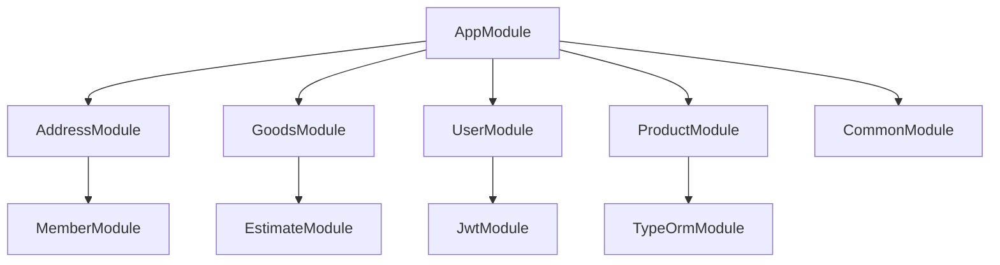

# 模块化设计

<cite>
**本文档引用的文件**
- [app.module.ts](file://apps/server-api/src/app.module.ts)
- [main.ts](file://apps/server-api/src/main.ts)
- [address.module.ts](file://apps/server-api/src/modules/address/address.module.ts)
- [goods.module.ts](file://apps/server-api/src/modules/goods/goods.module.ts)
- [user.module.ts](file://apps/server-api/src/modules/user/user.module.ts)
- [product.module.ts](file://apps/server-api/src/modules/product/product.module.ts)
- [common.module.ts](file://apps/server-api/src/modules/common/common.module.ts)
- [address.service.ts](file://apps/server-api/src/modules/address/address.service.ts)
- [goods.service.ts](file://apps/server-api/src/modules/goods/goods.service.ts)
- [user.service.ts](file://apps/server-api/src/modules/user/user.service.ts)
- [product.service.ts](file://apps/server-api/src/modules/product/product.service.ts)
- [address.controller.ts](file://apps/server-api/src/modules/address/address.controller.ts)
- [nest-cli.json](file://apps/server-api/nest-cli.json)
</cite>

## 目录
1. [项目结构](#项目结构)
2. [核心模块分析](#核心模块分析)
3. [模块化架构概述](#模块化架构概述)
4. [详细组件分析](#详细组件分析)
5. [依赖分析](#依赖分析)
6. [性能考虑](#性能考虑)
7. [故障排除指南](#故障排除指南)
8. [结论](#结论)

## 项目结构

该项目采用NestJS框架构建的单体仓库（monorepo）架构，主要包含两个应用：`admin-web`（前端管理界面）和`server-api`（后端API服务）。后端服务`server-api`遵循NestJS的标准模块化结构，所有业务逻辑模块均位于`apps/server-api/src/modules`目录下，每个模块包含独立的控制器、服务、实体、DTO和VO等组件。

**Diagram sources**
- [app.module.ts](file://apps/server-api/src/app.module.ts)
- [main.ts](file://apps/server-api/src/main.ts)

**Section sources**
- [app.module.ts](file://apps/server-api/src/app.module.ts)
- [main.ts](file://apps/server-api/src/main.ts)

## 核心模块分析

本项目通过NestJS的模块化系统实现了清晰的业务边界划分。`app.module.ts`作为应用的根模块，通过`imports`数组整合了所有功能模块，如`AddressModule`、`GoodsModule`、`UserModule`和`ProductModule`等。每个功能模块的`Module`类都遵循标准的配置规范，明确声明了其提供的服务（providers）、暴露的控制器（controllers）以及对外共享的服务（exports）。

**Section sources**
- [app.module.ts](file://apps/server-api/src/app.module.ts)
- [address.module.ts](file://apps/server-api/src/modules/address/address.module.ts)
- [goods.module.ts](file://apps/server-api/src/modules/goods/goods.module.ts)
- [user.module.ts](file://apps/server-api/src/modules/user/user.module.ts)
- [product.module.ts](file://apps/server-api/src/modules/product/product.module.ts)

## 模块化架构概述

NestJS的模块化架构是本项目的核心设计原则。根模块`AppModule`通过`imports`机制将各个独立的业务模块（如地址、商品、用户、产品）无缝集成，形成一个完整的应用。这种设计不仅提高了代码的可维护性和可测试性，还为领域驱动设计（DDD）提供了坚实的基础。

**Diagram sources**
- [app.module.ts](file://apps/server-api/src/app.module.ts)
- [address.module.ts](file://apps/server-api/src/modules/address/address.module.ts)

## 详细组件分析

### 地址模块分析

`AddressModule`是处理用户地址相关业务的核心模块。它通过`TypeOrmModule.forFeature([Address])`将`Address`实体注入到模块的依赖注入容器中，使得`AddressService`可以访问数据库。该模块还导入了`MemberModule`以获取当前用户信息，并将`AddressService`通过`exports`导出，供其他模块使用。

#### 对于对象导向组件：

**Diagram sources**
- [address.module.ts](file://apps/server-api/src/modules/address/address.module.ts)
- [address.service.ts](file://apps/server-api/src/modules/address/address.service.ts)
- [address.controller.ts](file://apps/server-api/src/modules/address/address.controller.ts)

**Section sources**
- [address.module.ts](file://apps/server-api/src/modules/address/address.module.ts)
- [address.service.ts](file://apps/server-api/src/modules/address/address.service.ts)
- [address.controller.ts](file://apps/server-api/src/modules/address/address.controller.ts)

### 商品模块分析

`GoodsModule`负责商品详情、规格和购买信息的获取。它展示了模块间的依赖注入与服务共享机制，通过导入`EstimateModule`来获取预估价格信息。该模块还通过`TypeOrmModule.forFeature`注册了多个来自`product`模块的实体，体现了跨模块的数据访问。

#### 对于API/服务组件：

**Diagram sources**
- [goods.module.ts](file://apps/server-api/src/modules/goods/goods.module.ts)
- [goods.service.ts](file://apps/server-api/src/modules/goods/goods.service.ts)

**Section sources**
- [goods.module.ts](file://apps/server-api/src/modules/goods/goods.module.ts)
- [goods.service.ts](file://apps/server-api/src/modules/goods/goods.service.ts)

### 用户模块分析

`UserModule`管理用户和管理员账户。它通过导入`JwtModule`来实现身份验证和Token生成。该模块的`UserService`直接依赖于`JwtService`，展示了模块间服务的直接注入。

#### 对于复杂逻辑组件：

**Diagram sources**
- [user.module.ts](file://apps/server-api/src/modules/user/user.module.ts)
- [user.service.ts](file://apps/server-api/src/modules/user/user.service.ts)

**Section sources**
- [user.module.ts](file://apps/server-api/src/modules/user/user.module.ts)
- [user.service.ts](file://apps/server-api/src/modules/user/user.service.ts)

### 产品模块分析

`ProductModule`是商品数据的核心，管理产品、SKU、分类等实体。它通过`TypeOrmModule.forFeature`注册了大量实体，展示了如何在一个模块内管理复杂的领域模型。

**Diagram sources**
- [product.module.ts](file://apps/server-api/src/modules/product/product.module.ts)

**Section sources**
- [product.module.ts](file://apps/server-api/src/modules/product/product.module.ts)

## 依赖分析

本项目的模块间依赖关系清晰，遵循了高内聚、低耦合的原则。`app.module.ts`作为中心枢纽，协调所有模块。模块间的依赖主要通过`imports`实现，例如`GoodsModule`依赖`EstimateModule`，`AddressModule`依赖`MemberModule`。这种设计支持了领域驱动设计（DDD），每个模块代表一个明确的业务领域。

**Diagram sources**
- [app.module.ts](file://apps/server-api/src/app.module.ts)
- [goods.module.ts](file://apps/server-api/src/modules/goods/goods.module.ts)
- [address.module.ts](file://apps/server-api/src/modules/address/address.module.ts)

**Section sources**
- [app.module.ts](file://apps/server-api/src/app.module.ts)
- [goods.module.ts](file://apps/server-api/src/modules/goods/goods.module.ts)
- [address.module.ts](file://apps/server-api/src/modules/address/address.module.ts)

## 性能考虑

项目在性能优化方面采取了多项策略。通过`CacheModule.register`全局配置了Redis缓存，`ThrottlerModule`实现了请求节流，`WinstonModule`提供了高性能的日志记录。此外，`TypeOrmModule.forRootAsync`的`autoLoadEntities: true`配置简化了实体管理，但需注意在生产环境中关闭`synchronize`以避免潜在风险。

**Section sources**
- [app.module.ts](file://apps/server-api/src/app.module.ts)

## 故障排除指南

当遇到模块导入错误时，请检查`app.module.ts`中的`imports`数组是否包含了目标模块。若服务注入失败，请确认提供该服务的模块是否已正确导入，并且该服务是否在`providers`和`exports`中正确声明。对于数据库连接问题，请检查`.env`文件中的配置是否正确。

**Section sources**
- [app.module.ts](file://apps/server-api/src/app.module.ts)
- [main.ts](file://apps/server-api/src/main.ts)

## 结论

本项目通过NestJS的模块化架构，成功实现了业务功能的清晰划分和高效整合。`app.module.ts`作为核心，通过`imports`机制将`address`、`goods`、`user`、`product`等模块有机地结合在一起。每个模块都遵循了`providers`、`controllers`、`exports`的配置规范，确保了服务的可重用性和边界清晰。这种设计不仅支持了领域驱动设计，也为新业务模块的创建提供了标准化流程，是构建大型可维护应用的典范。