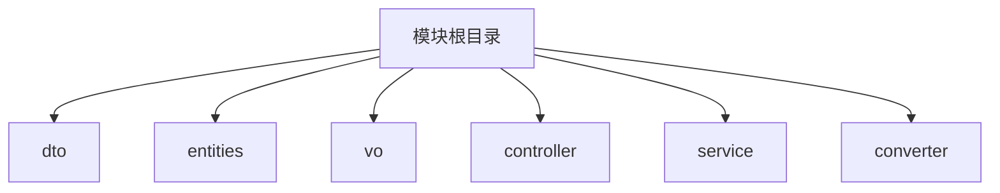
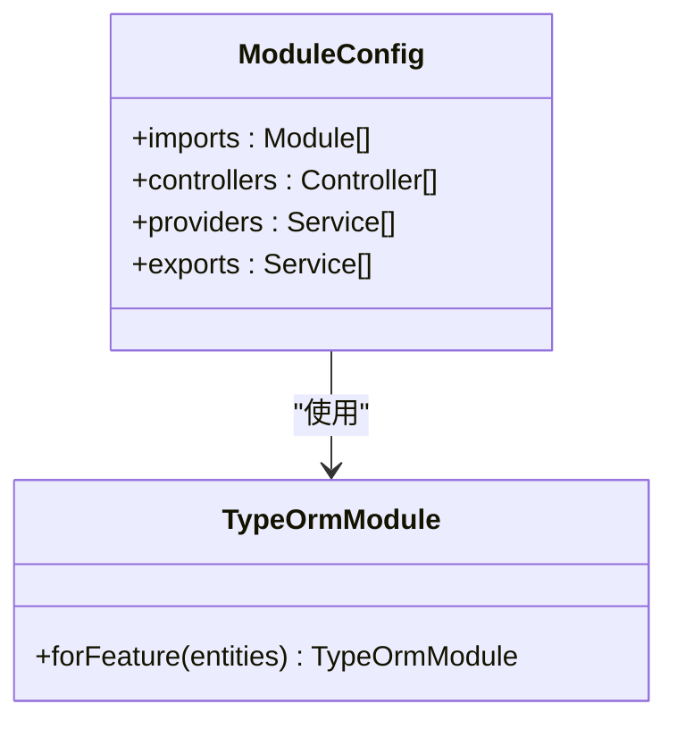
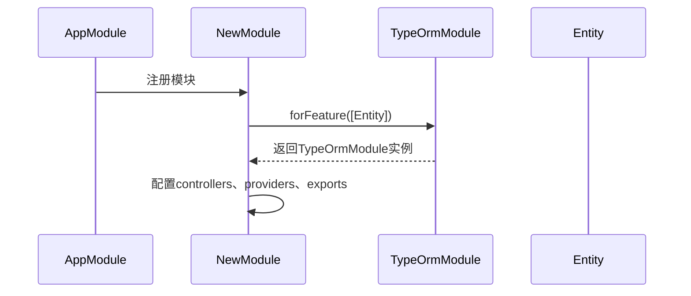
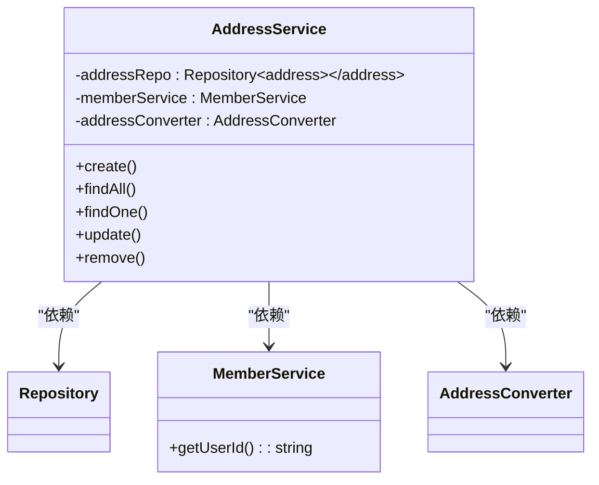

# 模块开发规范

<cite>
**本文档引用的文件**
- [address.module.ts](file://apps/server-api/src/modules/address/address.module.ts)
- [goods.module.ts](file://apps/server-api/src/modules/goods/goods.module.ts)
- [user.module.ts](file://apps/server-api/src/modules/user/user.module.ts)
- [product.module.ts](file://apps/server-api/src/modules/product/product.module.ts)
- [app.module.ts](file://apps/server-api/src/app.module.ts)
- [address.service.ts](file://apps/server-api/src/modules/address/address.service.ts)
- [goods.service.ts](file://apps/server-api/src/modules/goods/goods.service.ts)
- [user.service.ts](file://apps/server-api/src/modules/user/user.service.ts)
- [product.service.ts](file://apps/server-api/src/modules/product/product.service.ts)
- [address.controller.ts](file://apps/server-api/src/modules/address/address.controller.ts)
- [create-address.dto.ts](file://apps/server-api/src/modules/address/dto/create-address.dto.ts)
- [address.vo.ts](file://apps/server-api/src/modules/address/vo/address.vo.ts)
- [address.converter.ts](file://apps/server-api/src/modules/address/address.converter.ts)
- [create-good.dto.ts](file://apps/server-api/src/modules/goods/dto/create-good.dto.ts)
</cite>

## 目录

1. [新业务模块创建流程](#新业务模块创建流程)
2. [目录结构规范](#目录结构规范)
3. [Module类编写规范](#module类编写规范)
4. [代码模板示例](#代码模板示例)
5. [懒加载配置与性能优化](#懒加载配置与性能优化)
6. [模块命名约定与服务注册](#模块命名约定与服务注册)
7. [常见错误排查指南](#常见错误排查指南)

## 新业务模块创建流程

在本项目中，创建新业务模块需要遵循标准化的流程。首先，根据业务功能确定模块名称，然后在`apps/server-api/src/modules/`目录下创建对应的模块文件夹。每个新模块都应包含dto、entities、vo、controller、service、converter等子目录，以确保代码结构的一致性和可维护性。

模块创建后，需要在根模块`app.module.ts`中进行注册，以便NestJS能够识别和加载该模块。通过这种集中式管理方式，可以有效控制模块间的依赖关系，避免循环依赖问题。同时，新模块的实体类需要在TypeORM的配置中正确注册，以确保数据库操作的正常进行。

**Section sources**
- [app.module.ts](file://apps/server-api/src/app.module.ts)

## 目录结构规范

新业务模块必须遵循统一的目录结构规范，以确保项目的一致性和可维护性。每个模块应包含以下子目录：

- **dto**: 存放数据传输对象，用于接口请求和响应的数据验证
- **entities**: 存放数据库实体类，定义数据表结构和关系
- **vo**: 存放值对象，用于封装业务逻辑中的数据
- **controller**: 存放控制器类，处理HTTP请求和路由
- **service**: 存放服务类，实现核心业务逻辑
- **converter**: 存放转换器类，用于不同对象之间的数据转换

这种分层结构有助于实现关注点分离，使代码更加清晰和易于维护。例如，`address`模块的结构就很好地体现了这一规范，其`dto`目录包含`create-address.dto.ts`和`update-address.dto.ts`，`vo`目录包含`Address.vo.ts`等文件。

**Diagram sources**
- [address.module.ts](file://apps/server-api/src/modules/address/address.module.ts)
- [goods.module.ts](file://apps/server-api/src/modules/goods/goods.module.ts)

**Section sources**
- [address.module.ts](file://apps/server-api/src/modules/address/address.module.ts)
- [goods.module.ts](file://apps/server-api/src/modules/goods/goods.module.ts)

## Module类编写规范

Module类是NestJS应用的核心组织单元，其编写需要遵循严格的规范。使用`@Module`装饰器配置模块时，需要正确设置`imports`、`controllers`、`providers`和`exports`四个关键属性。

实体注册通过`TypeOrmModule.forFeature()`方法完成，将模块所需的实体类数组作为参数传入。控制器注册在`controllers`数组中声明，服务提供者在`providers`数组中定义。需要被其他模块使用的服务应添加到`exports`数组中，以便实现模块间的依赖共享。

例如，`address.module.ts`中的配置展示了标准的模块定义方式，其中`AddressService`和`AddressConverter`作为服务提供者被注入，而`AddressController`作为控制器被注册。

**Diagram sources**
- [address.module.ts](file://apps/server-api/src/modules/address/address.module.ts)
- [goods.module.ts](file://apps/server-api/src/modules/goods/goods.module.ts)

**Section sources**
- [address.module.ts](file://apps/server-api/src/modules/address/address.module.ts)
- [goods.module.ts](file://apps/server-api/src/modules/goods/goods.module.ts)

## 代码模板示例

以下是新业务模块的标准代码模板示例。在`imports`中，通过`TypeOrmModule.forFeature()`注册实体类，确保数据库操作的正常进行。同时，通过`imports`引入依赖模块，实现模块间的协作。

**Diagram sources**
- [product.module.ts](file://apps/server-api/src/modules/product/product.module.ts)
- [app.module.ts](file://apps/server-api/src/app.module.ts)

**Section sources**
- [product.module.ts](file://apps/server-api/src/modules/product/product.module.ts)
- [app.module.ts](file://apps/server-api/src/app.module.ts)

## 懒加载配置与性能优化

本项目通过合理的模块设计实现了性能优化。在`app.module.ts`中，所有业务模块都被注册为全局模块的依赖，这种集中式管理方式有助于实现懒加载和按需加载。

通过`ConfigModule.forRoot({ isGlobal: true })`配置，使配置模块全局可用，减少了重复导入。同时，`CacheModule.register({ isGlobal: true })`配置实现了全局缓存，提高了数据访问性能。数据库连接通过`TypeOrmModule.forRootAsync()`异步配置，确保了连接的可靠性和灵活性。

这些配置不仅提高了应用的启动性能，还为后续的水平扩展提供了基础。通过将模块配置为全局可用，减少了模块间的耦合度，使系统更加健壮和可维护。

**Section sources**
- [app.module.ts](file://apps/server-api/src/app.module.ts)

## 模块命名约定与服务注册

模块命名遵循驼峰式命名法，并以`Module`作为后缀。例如，`AddressModule`、`GoodsModule`等。这种命名约定既符合TypeScript的命名规范，又清晰地表明了类的用途。

服务注册规范要求将业务逻辑封装在服务类中，并通过`@Injectable()`装饰器标记。服务类应通过构造函数注入依赖，实现依赖注入模式。需要被其他模块使用的服务必须在模块的`exports`数组中声明，以确保正确的依赖共享。

例如，`address.service.ts`中的`AddressService`类通过构造函数注入了`Repository<Address>`和`MemberService`，体现了良好的依赖管理实践。

**Diagram sources**
- [address.service.ts](file://apps/server-api/src/modules/address/address.service.ts)
- [user.service.ts](file://apps/server-api/src/modules/user/user.service.ts)

**Section sources**
- [address.service.ts](file://apps/server-api/src/modules/address/address.service.ts)
- [user.service.ts](file://apps/server-api/src/modules/user/user.service.ts)

## 常见错误排查指南

### 模块未注册

当遇到模块未注册的错误时，首先检查`app.module.ts`中的模块导入列表，确保新模块已正确添加。其次，验证模块文件路径是否正确，文件名是否符合约定。

### 服务注入失败

服务注入失败通常由以下原因引起：服务未在模块的`providers`数组中声明，或依赖的服务未正确导入。检查服务类是否使用`@Injectable()`装饰器标记，并确保所有依赖服务都在模块配置中正确注册。

### 实体类无法访问

实体类无法访问的问题通常与`TypeOrmModule.forFeature()`配置有关。确保实体类已正确导入，并在`forFeature()`方法中正确注册。同时，检查实体类的装饰器配置是否正确，如`@Entity()`、`@Column()`等。

**Section sources**
- [app.module.ts](file://apps/server-api/src/app.module.ts)
- [address.module.ts](file://apps/server-api/src/modules/address/address.module.ts)
- [goods.service.ts](file://apps/server-api/src/modules/goods/goods.service.ts)