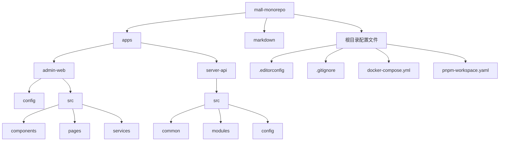

# 项目结构

<cite>
**本文档引用的文件**
- [pnpm-workspace.yaml](file://pnpm-workspace.yaml)
- [.editorconfig](file://.editorconfig)
- [.gitignore](file://.gitignore)
- [docker-compose.yml](file://docker-compose.yml)
- [apps/admin-web/config/config.ts](file://apps/admin-web/config/config.ts)
- [apps/admin-web/config/defaultSettings.ts](file://apps/admin-web/config/defaultSettings.ts)
- [apps/admin-web/config/routes.ts](file://apps/admin-web/config/routes.ts)
- [apps/admin-web/src/app.tsx](file://apps/admin-web/src/app.tsx)
- [apps/admin-web/src/components/index.ts](file://apps/admin-web/src/components/index.ts)
- [apps/admin-web/package.json](file://apps/admin-web/package.json)
- [apps/server-api/src/main.ts](file://apps/server-api/src/main.ts)
- [apps/server-api/src/app.module.ts](file://apps/server-api/src/app.module.ts)
- [apps/server-api/src/config/typeorm.datasource.ts](file://apps/server-api/src/config/typeorm.datasource.ts)
- [apps/server-api/package.json](file://apps/server-api/package.json)
- [apps/server-api/src/common/decorators/api-res-wrapper.decorator.ts](file://apps/server-api/src/common/decorators/api-res-wrapper.decorator.ts)
- [apps/server-api/src/common/interceptors/transform.interceptor.ts](file://apps/server-api/src/common/interceptors/transform.interceptor.ts)
- [apps/server-api/src/common/filters/http-exception.filter.ts](file://apps/server-api/src/common/filters/http-exception.filter.ts)
</cite>

## 目录结构

mall-monorepo 是一个采用单体仓库（monorepo）模式管理的全栈项目，其目录结构清晰地分离了前端管理界面、后端API服务以及共享的配置和文档。项目根目录下包含 `apps/`、`markdown/` 等主要目录，其中 `apps/` 目录存放了具体的应用程序，如 `admin-web`（前端管理后台）和 `server-api`（后端API服务）。这种结构使得多个相关项目可以共享代码、配置和开发工具，同时保持各自独立的业务逻辑和部署流程。

**Diagram sources**
- [apps/admin-web](file://apps/admin-web)
- [apps/server-api](file://apps/server-api)

## 核心应用结构

### admin-web 应用结构

`admin-web` 是基于 UmiJS 框架构建的前端管理后台应用，其内部结构遵循了清晰的模块化设计。

#### config 目录
`config/` 目录是应用的配置中心，包含了多个关键配置文件：
- `config.ts`：UmiJS 的主配置文件，定义了路由、代理、主题、插件等全局设置。
- `defaultSettings.ts`：定义了应用的默认布局和主题配置，如导航主题、主色调、布局模式等。
- `proxy.ts`：配置了开发环境下的代理规则，用于解决跨域问题，将前端请求代理到后端API服务器。
- `routes.ts`：定义了应用的路由表，明确指出了每个路径对应的页面组件，是应用导航结构的蓝图。

**Section sources**
- [apps/admin-web/config/config.ts](file://apps/admin-web/config/config.ts)
- [apps/admin-web/config/defaultSettings.ts](file://apps/admin-web/config/defaultSettings.ts)
- [apps/admin-web/config/proxy.ts](file://apps/admin-web/config/proxy.ts)
- [apps/admin-web/config/routes.ts](file://apps/admin-web/config/routes.ts)

#### src/components 目录
`src/components/` 目录存放了应用的可复用UI组件。这些组件是构建页面的基础单元，不包含业务逻辑，只负责UI的展示。例如，`Footer`、`HeaderDropdown`、`RightContent` 等组件被多个页面共享。`index.ts` 文件作为组件的统一导出入口，方便其他模块通过单一路径导入所需组件。

**Section sources**
- [apps/admin-web/src/components](file://apps/admin-web/src/components)
- [apps/admin-web/src/components/index.ts](file://apps/admin-web/src/components/index.ts)

#### src/pages 目录
`src/pages/` 目录是应用页面的存放地，每个子目录通常代表一个功能模块或一个独立的页面。目录结构与 `routes.ts` 中的路由配置相对应。例如，`dashboard/` 目录下包含了 `analysis`、`monitor`、`workplace` 等子页面。每个页面组件文件（如 `index.tsx`）负责该页面的UI渲染和交互逻辑。

**Section sources**
- [apps/admin-web/src/pages](file://apps/admin-web/src/pages)

#### src/services 目录
`src/services/` 目录封装了与后端API进行通信的业务逻辑。每个文件（如 `adminUser.ts`、`product.ts`）通常对应一个后端服务模块，导出一系列用于发起HTTP请求的函数。这些函数被页面组件调用，以获取或提交数据。该目录下的 `index.ts` 文件会将所有服务接口进行整合和导出。

**Section sources**
- [apps/admin-web/src/services](file://apps/admin-web/src/services)

### server-api 应用结构

`server-api` 是基于 NestJS 框架构建的后端API服务，采用了模块化和分层架构。

#### src/common 目录
`src/common/` 目录存放了跨模块共享的通用代码，是后端架构的核心基础。
- `decorators/`：自定义装饰器，如 `api-res-wrapper.decorator.ts` 用于统一API响应格式。
- `dto/`：数据传输对象（DTO），用于定义API请求和响应的数据结构。
- `entities/`：实体类，映射数据库表结构。
- `exceptions/`：自定义业务异常。
- `filters/`：异常过滤器，如 `http-exception.filter.ts` 全局捕获并处理异常，返回统一错误格式。
- `guards/`：守卫，如 `jwt-auth.guard.ts` 用于实现JWT身份验证。
- `interceptors/`：拦截器，如 `transform.interceptor.ts` 在请求处理完成后，对响应数据进行统一包装。
- `utils/`：通用工具函数。

**Section sources**
- [apps/server-api/src/common](file://apps/server-api/src/common)
- [apps/server-api/src/common/decorators/api-res-wrapper.decorator.ts](file://apps/server-api/src/common/decorators/api-res-wrapper.decorator.ts)
- [apps/server-api/src/common/interceptors/transform.interceptor.ts](file://apps/server-api/src/common/interceptors/transform.interceptor.ts)
- [apps/server-api/src/common/filters/http-exception.filter.ts](file://apps/server-api/src/common/filters/http-exception.filter.ts)

#### src/modules 目录
`src/modules/` 目录是业务逻辑的主体，每个子目录代表一个独立的业务模块（如 `address`、`product`、`user`）。每个模块遵循NestJS的标准结构：
- `dto/`：该模块特有的DTO。
- `entities/`：该模块特有的实体。
- `vo/`：视图对象（VO），用于定义返回给前端的数据结构。
- `[module].controller.ts`：控制器，定义了HTTP路由和处理函数。
- `[module].service.ts`：服务，包含具体的业务逻辑。
- `[module].module.ts`：模块，通过NestJS的依赖注入系统组织控制器、服务和其他组件。

**Section sources**
- [apps/server-api/src/modules](file://apps/server-api/src/modules)

#### src/config 目录
`src/config/` 目录存放了应用的配置文件。
- `typeorm.datasource.ts`：配置了TypeORM数据源，定义了数据库连接信息（通过环境变量注入）和实体、迁移文件的扫描路径。

**Section sources**
- [apps/server-api/src/config/typeorm.datasource.ts](file://apps/server-api/src/config/typeorm.datasource.ts)

## 根目录配置文件

根目录下的配置文件为整个项目提供了统一的开发规范和工具支持。

#### .editorconfig
`.editorconfig` 文件定义了代码的编辑器配置，如缩进风格（空格或Tab）、缩进大小、换行符类型等，确保团队成员使用不同的编辑器时，代码格式保持一致。

#### .gitignore
`.gitignore` 文件指定了Git版本控制系统应该忽略的文件和目录，如 `node_modules/`、`dist/`、`.env` 等，防止将临时文件、依赖包和敏感信息提交到代码仓库。

#### docker-compose.yml
`docker-compose.yml` 文件定义了项目依赖的容器化服务（如数据库、Redis），通过Docker Compose可以一键启动整个开发环境，简化了环境搭建的复杂性。

**Section sources**
- [.editorconfig](file://.editorconfig)
- [.gitignore](file://.gitignore)
- [docker-compose.yml](file://docker-compose.yml)

## pnpm-workspace.yaml

`pnpm-workspace.yaml` 是pnpm包管理器的工作区配置文件，它定义了哪些目录下的包属于当前工作区。文件内容 `packages: - 'apps/*' - 'packages/*'` 表明 `apps/` 和 `packages/` 目录下的所有项目都被视为工作区的一部分。这使得pnpm可以在这些项目之间进行符号链接（symlink），实现包的共享和快速安装，是monorepo模式能够高效运行的关键。

**Section sources**
- [pnpm-workspace.yaml](file://pnpm-workspace.yaml)